# Kodi — Auditable Agentic Memory for High-Stakes Tax Work

> **A governed AI tax and compliance platform where the agent remembers users, conversations, documents, evidence, decisions, and workflow state — then uses that memory to produce explainable, deterministic outcomes.**

**Hackathon:** [CockroachDB × AWS — Build with Agentic Memory](https://cockroachdb-ai.devpost.com/)  
**Primary database:** CockroachDB (`kodi_dev`)  
**Backend:** Python · FastAPI · Pydantic  
**Frontend:** React · TypeScript · Vite  
**AI:** OpenAI, behind governed service boundaries  
**Object storage:** Amazon S3 or private Cloudflare R2  
**Architecture authority:** [`docs/Technical-Specification.md`](docs/Technical-Specification.md)

---

## Table of Contents

1. [60-Second Judge Overview](#1-60-second-judge-overview)
2. [The Problem Kodi Solves](#2-the-problem-kodi-solves)
3. [Why This Is an Agentic Memory System](#3-why-this-is-an-agentic-memory-system)
4. [Hackathon Requirement Mapping](#4-hackathon-requirement-mapping)
5. [System at a Glance](#5-system-at-a-glance)
6. [End-to-End User Journeys](#6-end-to-end-user-journeys)
7. [Service Architecture](#7-service-architecture)
8. [CockroachDB: The Durable Memory Plane](#8-cockroachdb-the-durable-memory-plane)
9. [Document Intelligence and Vector Memory](#9-document-intelligence-and-vector-memory)
10. [Conversational Orchestration](#10-conversational-orchestration)
11. [Governed Knowledge and Evidence](#11-governed-knowledge-and-evidence)
12. [Deterministic Tax Execution](#12-deterministic-tax-execution)
13. [Forms, Reports, and Filing-Ready Artifacts](#13-forms-reports-and-filing-ready-artifacts)
14. [Authentication and Trust](#14-authentication-and-trust)
15. [Storage and Audit Architecture](#15-storage-and-audit-architecture)
16. [Security, Reliability, and Production Readiness](#16-security-reliability-and-production-readiness)
17. [Data Lineage and Explainability](#17-data-lineage-and-explainability)
18. [Repository Structure](#18-repository-structure)
19. [Contracts and Sources of Truth](#19-contracts-and-sources-of-truth)
20. [Setup — Hackathon / CockroachDB Cloud](#20-setup--hackathon--cockroachdb-cloud)
21. [Setup — Local Development](#21-setup--local-development)
22. [Environment Variables](#22-environment-variables)
23. [Running the Services](#23-running-the-services)
24. [Running the Frontend](#24-running-the-frontend)
25. [CockroachDB Managed MCP Setup](#25-cockroachdb-managed-mcp-setup)
26. [Verification, Tests, and Evaluations](#26-verification-tests-and-evaluations)
27. [Demo Script for Judges](#27-demo-script-for-judges)
28. [Judging-Criteria Mapping](#28-judging-criteria-mapping)
29. [Current Scope and Honest Boundaries](#29-current-scope-and-honest-boundaries)
30. [Troubleshooting](#30-troubleshooting)
31. [Hackathon Submission Checklist](#31-hackathon-submission-checklist)
32. [Where to Read Next](#32-where-to-read-next)

---

# 1. 60-Second Judge Overview

Kodi is not a chatbot with a database attached.

It is a **stateful, evidence-aware agentic workflow system** for tax and compliance work. The platform uses CockroachDB as the durable memory and coordination layer for the state that an AI agent must safely remember over time:

- who the user is and what they are allowed to do;
- what has already happened in a conversation;
- which documents belong to the case;
- which document version is authoritative;
- what evidence was extracted and where it came from;
- what legal source version was effective at the relevant time;
- which deterministic tax computation was executed;
- which workflow step has completed;
- which generated artifact came from which finalized result;
- which retries, leases, idempotency decisions, and lifecycle transitions occurred.
- 


### The one-line differentiator

> **Kodi combines conversational memory, document/vector memory, governed legal evidence, and deterministic execution so an AI assistant can move a real tax case forward without turning the language model into the source of truth.**

---

# 2. The Problem Kodi Solves

Tax and compliance work has properties that generic chat applications handle poorly:

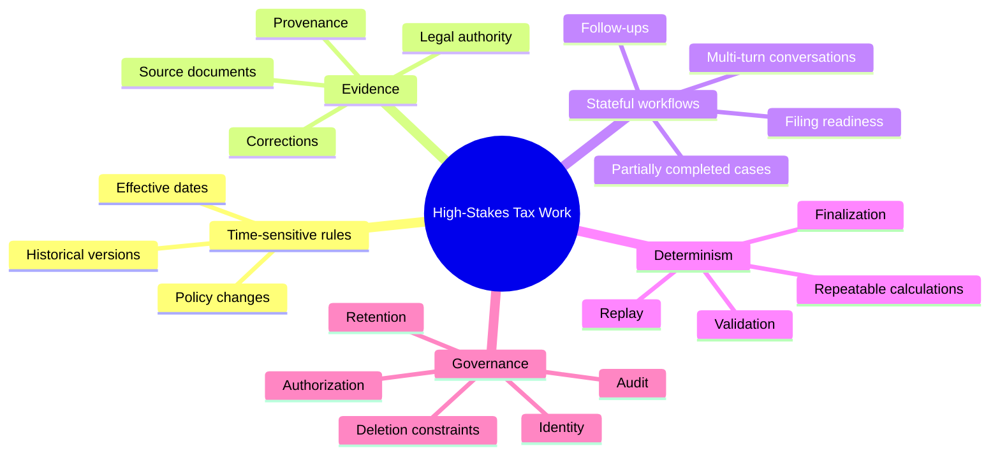

A fluent answer is not enough.

A useful system must be able to answer questions such as:

- **Which evidence supported this answer?**
- **Which version of the source was used?**
- **What did the user already provide in an earlier turn?**
- **Did a tax computation actually execute, or did the model merely describe one?**
- **Can the result be replayed?**
- **Is the generated form bound to the same finalized computation?**
- **Can a retry duplicate a side effect?**
- **Can a stale worker overwrite newer work?**
- **Can a deleted or superseded document still leak into retrieval?**

Kodi is designed around those questions.

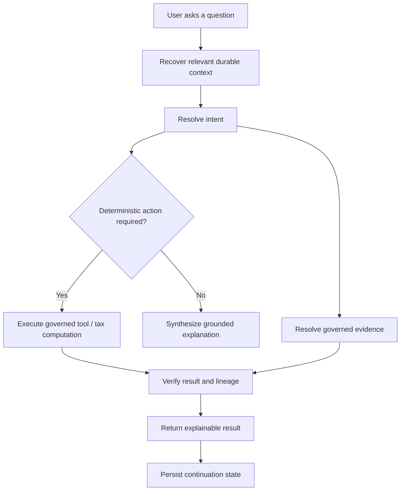

---

# 3. Why This Is an Agentic Memory System

The CockroachDB challenge is about agents that **remember, adapt, and act**. Kodi's memory is deliberately broader than a message transcript.

## 3.1 Memory taxonomy

```mermaid
flowchart TB
    MEMORY[(Kodi Agent Memory)]

    MEMORY --> ID[Identity Memory]
    MEMORY --> CONV[Conversation Memory]
    MEMORY --> DOC[Document Memory]
    MEMORY --> KNOW[Knowledge Memory]
    MEMORY --> EXEC[Execution Memory]
    MEMORY --> GOV[Governance Memory]

    ID --> ID1[Users]
    ID --> ID2[Sessions]
    ID --> ID3[OTP / step-up]
    ID --> ID4[Delegation / roles]

    CONV --> C1[Conversations]
    CONV --> C2[Turns]
    CONV --> C3[Clarifications]
    CONV --> C4[Resolved intent]
    CONV --> C5[Plan / action history]

    DOC --> D1[Logical documents]
    DOC --> D2[Versions]
    DOC --> D3[Canonical representation]
    DOC --> D4[Chunks]
    DOC --> D5[Embeddings]
    DOC --> D6[Bindings]
    DOC --> D7[Corrections]

    KNOW --> K1[Governed source records]
    KNOW --> K2[Effective windows]
    KNOW --> K3[Publication state]
    KNOW --> K4[Hybrid retrieval state]

    EXEC --> E1[Computations]
    EXEC --> E2[Input hashes]
    EXEC --> E3[Rule bindings]
    EXEC --> E4[Finalization lineage]
    EXEC --> E5[Generated artifacts]

    GOV --> G1[Idempotency]
    GOV --> G2[Retention]
    GOV --> G3[Lifecycle]
    GOV --> G4[Worker leases]
    GOV --> G5[Outbox / reconciliation]
```

## 3.2 Memory changes behavior

A memory system is useful only when the agent changes its next action because of what it remembers.

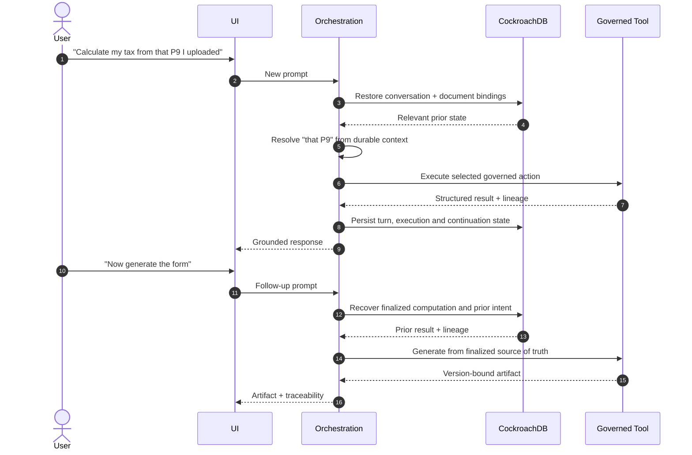

The second turn is not solved by re-prompting the model with a large chat history. It is solved by restoring **structured, governed state** and using it to decide what action is now valid.

---

# 4. Hackathon Requirement Mapping

The competition requires an agentic application with persistent memory in CockroachDB, at least two CockroachDB AI tools, and AWS usage/deployment.

## 4.1 CockroachDB and AWS proof matrix

| Hackathon proof point | Kodi implementation | Repository evidence / path | What to show in the demo |
|---|---|---|---|
| **Persistent agent memory** | Conversation state, document state, identity state, knowledge state, execution lineage and workflow state persist durably | `database/migrations/`, `services/*/migrations/`, orchestration/document/auth persistence modules | Ask a follow-up that depends on an earlier turn or uploaded document |
| **Distributed Vector Indexing** | Document canonical chunks are embedded and searched semantically within authorized active generations; hybrid retrieval fuses exact + semantic candidates | `services/document_ai/migrations/cockroachdb/0007_document_ai_chunk_embeddings_vector_index.sql`, document retrieval modules | Upload a document, then ask a semantic question whose answer is retrieved from it |
| **Managed MCP Server** | Repository includes sanitized managed-MCP inspection views intended for safe inspection; CockroachDB Cloud MCP connection is deployment configuration | `services/document_ai/migrations/cockroachdb/0015_document_ai_managed_mcp_views.sql` | Connect the Cloud MCP endpoint to the hackathon cluster and inspect safe memory/state views |
| **AWS service** | Document AI supports Amazon S3 as an object-storage provider | `services/document_ai/app/storage_adapter.py`, Document AI configuration | Upload an artifact and show bytes in S3 while durable metadata/lineage remains in CockroachDB |
| **Optional ccloud CLI** | Can be used operationally for CockroachDB Cloud authentication/cluster management | deployment/operator workflow | Show cluster/database setup or inspection with `ccloud` if used in the submitted demo |

> **Important:** the repository has the managed-MCP inspection-view foundation, but a live CockroachDB Cloud Managed MCP connection is external deployment configuration. Do not describe it as live in the Devpost submission until it has actually been configured and demonstrated.

## 4.2 Why CockroachDB is not incidental

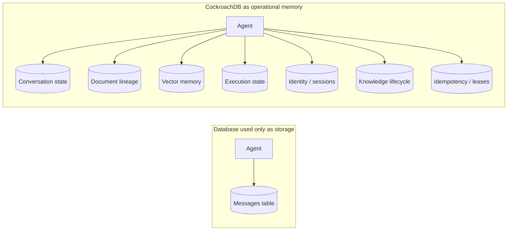

Kodi depends on persistent relational state to decide **what the agent may remember, what it may retrieve, what it may execute, and what it may claim**.

---

# 5. System at a Glance

## 5.1 Layered architecture


## 5.2 Public vs internal boundaries

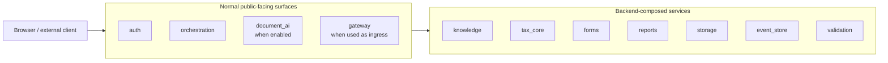

**Rule of thumb:** the frontend should not become a policy engine. It should establish trust and submit user intent; backend services compose the governed workflow.

---

# 6. End-to-End User Journeys

## 6.1 Journey A — Natural-language tax question

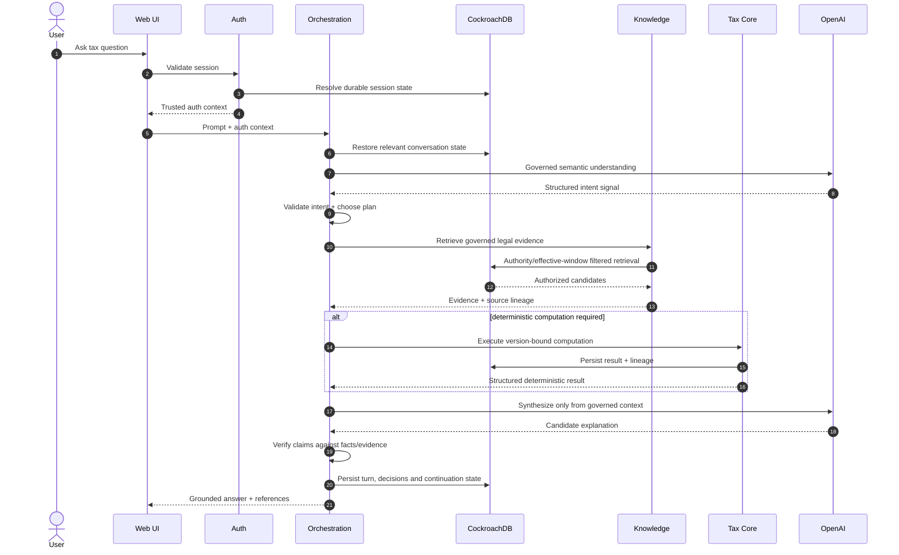

## 6.2 Journey B — Upload a tax document and ask about it

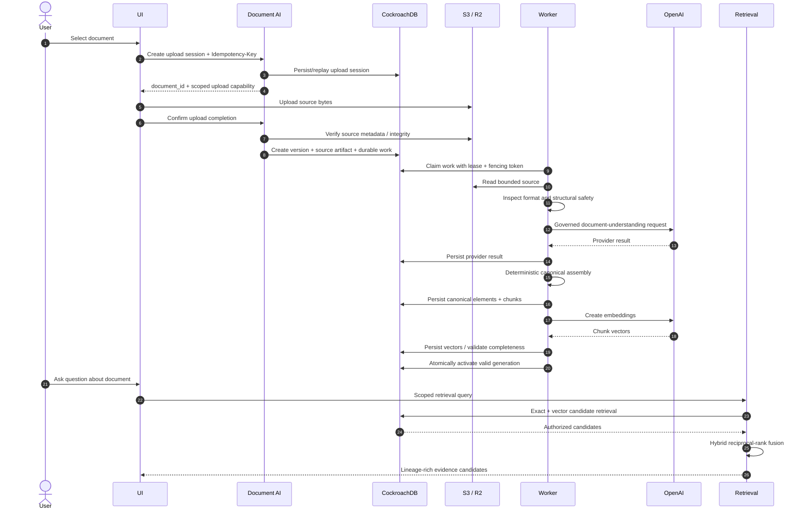

## 6.3 Journey C — Compute, finalize, and generate a filing artifact

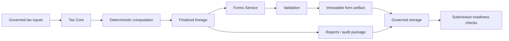

---

# 7. Service Architecture

| Service | Owns | Why it exists | Typical exposure |
|---|---|---|---|
| `gateway` | ingress, selected routing, trusted context forwarding | keeps edge routing and trust concerns out of domain services | Public when deployed as ingress |
| `auth` | identity, registration, OTP, OAuth/OIDC, sessions, recovery, delegation, lifecycle | establishes who the caller is and whether the session is trusted | Public |
| `orchestration` | prompt lifecycle, memory continuity, intent, clarification, plans, adapter execution, synthesis, verification | acts as the governed agent runtime | Public |
| `document_ai` | document identity/versioning, upload confirmation, source inspection, canonicalization, chunks, embeddings, retrieval, correction, purge | turns untrusted files into governed, retrievable evidence | Public when document workflows are enabled |
| `knowledge` | legal-source catalog, effective windows, intake/review/publication, governed hybrid retrieval | ensures legal retrieval is authority-first | Internal/support |
| `tax_core` | deterministic tax computation, replay, validation, finalization | prevents the LLM from becoming a calculator or tax rule engine | Internal |
| `validation` | narrow deterministic validation | fail-closed validation boundary for governed payloads | Internal |
| `forms` | mapping finalized results into governed forms | creates version-bound filing artifacts | Internal |
| `reports` | exports, reports, audit packages | materializes finalized lineage into human/machine-readable artifacts | Internal |
| `storage` | capability issuance, object metadata, retention | keeps raw object-store access behind governed capabilities | Internal |
| `event_store` | append-only audit event persistence and integrity | preserves what happened and in what order | Internal |

## 7.1 Responsibility graph


---

# 8. CockroachDB: The Durable Memory Plane

CockroachDB is the central durable store for core platform state.

## 8.1 What is persisted

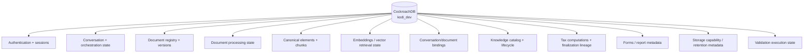

## 8.2 Why relational memory matters

Agent memory is not a single text blob.

Kodi needs relations between:

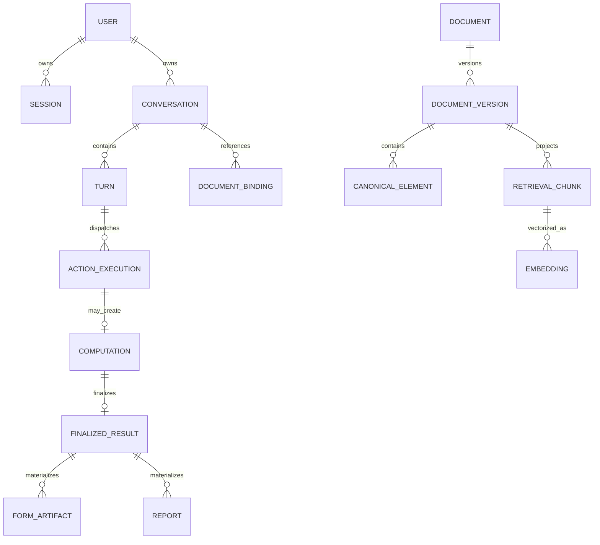

Those relationships let the system ask precise questions such as:

- Is this document still current?
- Was this chunk generated from the active canonical representation?
- Does this conversation have authority to retrieve this document?
- Has this idempotency key already produced an outcome?
- Is this computation finalized?
- Does this form point to the same finalized computation?
- Is this session still valid?
- Is the source version effective for the requested date?

## 8.3 Transactional safety patterns

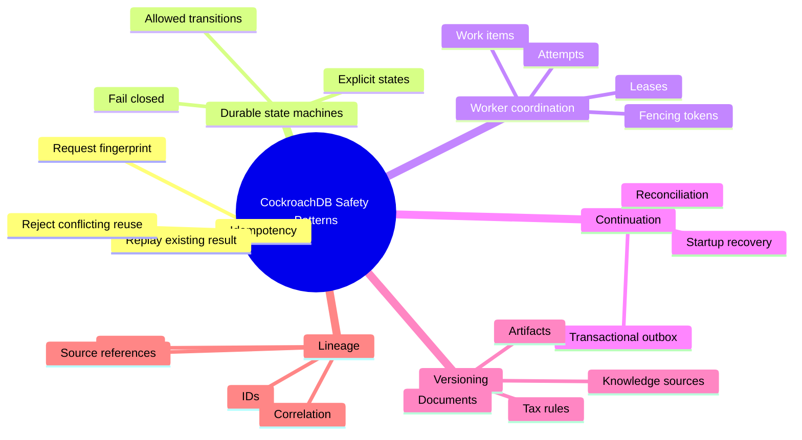

## 8.4 Hackathon / production persistence posture

The authentication service has an explicit distinction between development/test behavior and externally reachable hackathon/production behavior:

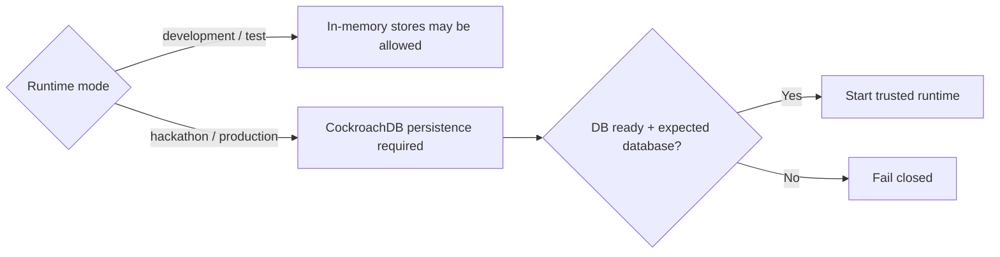

For the hackathon deployment, point `DATABASE_URL` at the CockroachDB Cloud database **`kodi_dev`** and run persistent modes.

---

# 9. Document Intelligence and Vector Memory

Document AI is one of the strongest examples of agentic memory in Kodi because it converts an uploaded file into a durable, versioned, searchable memory object.

## 9.1 Trust pipeline

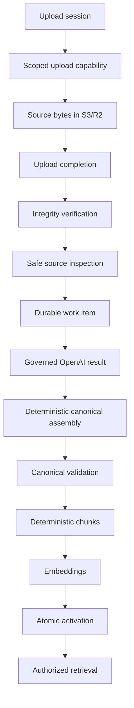

### Critical invariant

**Provider output is not canonical truth.**

The model can help understand a document, but the platform owns the canonical representation, validation, chunk identities, activation state, lifecycle, and evidence lineage.

## 9.2 Exact + semantic + hybrid retrieval

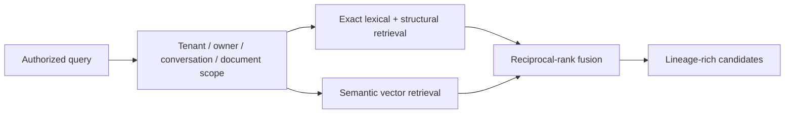

The semantic path embeds the query, searches active chunk embeddings within the authorized/current document scope, and returns candidates with provenance.

The hybrid path preserves the retrieval method and uses deterministic reciprocal-rank fusion rather than asking an LLM to reorder arbitrary ungoverned data.

## 9.3 Vector-index migration

The repository includes a dedicated CockroachDB document-chunk vector-index migration:

```text
services/document_ai/migrations/cockroachdb/
└── 0007_document_ai_chunk_embeddings_vector_index.sql
```

This makes Distributed Vector Indexing a natural hackathon proof point: the agent's semantic document memory is stored alongside the relational state that determines **ownership, version, lifecycle, and authorization**.

## 9.4 Activation gate

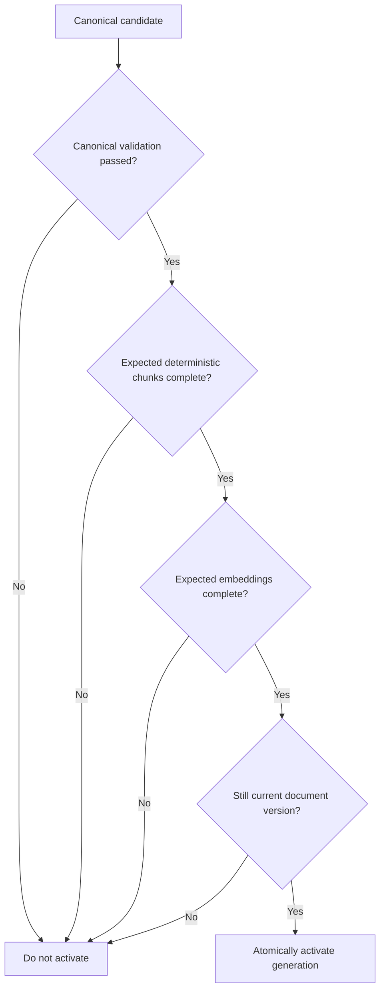

A half-indexed generation should never become retrieval authority.

## 9.5 Durable processing semantics

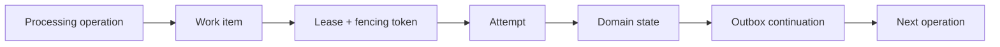

This design protects against duplicated provider work, stale workers, crashes between state updates, and unsafe blind retries.

---

# 10. Conversational Orchestration

The orchestration service is the main agent runtime.

It is deliberately **bounded** rather than being an unconstrained autonomous agent framework.

## 10.1 Runtime pipeline

```mermaid
flowchart LR
    PROMPT[Prompt]
    MEMORY[Restore relevant memory]
    SEM[Semantic turn resolution]
    INTENT[Intent envelope]
    ADJ[Adjudication / clarification]
    PLAN[Governed plan]
    EXEC[Adapter execution]
    EVID[Evidence assembly]
    SYNTH[Response synthesis]
    VERIFY[Answer verification]
    FINAL[Final outcome]
    SAVE[Persist continuation]

    PROMPT --> MEMORY --> SEM --> INTENT --> ADJ --> PLAN --> EXEC
    EXEC --> EVID --> SYNTH --> VERIFY --> FINAL --> SAVE
```

## 10.2 What orchestration owns

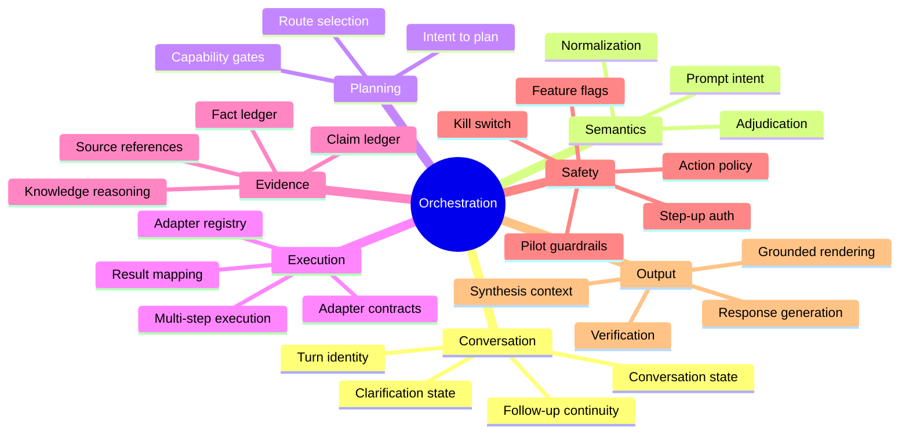

## 10.3 Prompt lineage

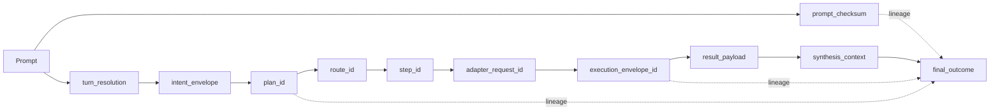

This means the final answer can be traced back to the prompt, the selected plan, the executed action, and the evidence used.

---

# 11. Governed Knowledge and Evidence

The Knowledge Service is not a generic vector store.

It is a governed catalog of authoritative tax/legal sources with lifecycle and effective-date controls.

## 11.1 Authority-first retrieval

```mermaid
flowchart TD
    QUERY[Knowledge query]
    AUTHZ[Authorization / scope]
    META[Metadata + source filters]
    PUB[Publication-state filter]
    TIME[Effective-window filter]
    CAND[Governed candidate set]
    LEX[Lexical score]
    VEC[Optional embedding similarity]
    RANK[Deterministic hybrid ranking]
    OUT[Source + anchor + version evidence]

    QUERY --> AUTHZ --> META --> PUB --> TIME --> CAND
    CAND --> LEX --> RANK
    CAND --> VEC --> RANK
    RANK --> OUT
```

Vector similarity may refine ranking **inside** the governed candidate pool. It does not make unpublished, unauthorized, or temporally invalid material authoritative.

## 11.2 Knowledge lifecycle

```mermaid
stateDiagram-v2
    [*] --> Ingested
    Ingested --> UnderReview
    UnderReview --> Approved
    UnderReview --> Rejected
    Approved --> Published
    Published --> Superseded
    Published --> Archived
    Superseded --> Archived
```

## 11.3 Evidence lineage

```mermaid
flowchart LR
    SOURCE[source_id]
    VER[source_version_id]
    ANCHOR[anchor_id]
    CLAIM[canonical claim]
    EXPL[explanation item]
    CIT[citation index]
    ANSWER[user-facing claim]

    SOURCE --> VER --> ANCHOR --> CLAIM --> EXPL --> CIT --> ANSWER
```

---

# 12. Deterministic Tax Execution

The LLM does **not** calculate final tax liability.

`tax_core` owns deterministic execution.

## 12.1 Execution contract

```mermaid
sequenceDiagram
    autonumber
    participant O as Orchestration
    participant T as Tax Core
    participant DB as CockroachDB
    participant E as Audit

    O->>T: Version-bound execution request
    T->>T: Canonicalize inputs
    T->>T: Select governed rule binding
    T->>T: Execute deterministic rules
    T->>DB: Persist computation + input hash + rule lineage
    T-->>O: Structured result

    O->>T: Finalize when workflow permits
    T->>DB: Persist immutable/finalized lineage
    T->>E: Emit computation event
    T-->>O: Finalized result
```

## 12.2 Why this separation matters

```mermaid
flowchart LR
    BAD[LLM directly calculates tax]
    BAD --> B1[Non-deterministic]
    BAD --> B2[Hard to replay]
    BAD --> B3[Rule version unclear]
    BAD --> B4[Audit weak]

    GOOD[LLM identifies intent]
    GOOD --> ENGINE[Deterministic tax engine]
    ENGINE --> G1[Replayable]
    ENGINE --> G2[Version-bound]
    ENGINE --> G3[Testable]
    ENGINE --> G4[Auditable]
```

## 12.3 Current tax vertical slice

The repository currently has a strong **income-tax** execution vertical slice with governed rule bindings and golden evaluations. Additional tax domains are represented in the wider architecture at different maturity levels.

The README intentionally distinguishes **implemented execution** from **recognized future scope** rather than presenting every tax label as feature-complete.

---

# 13. Forms, Reports, and Filing-Ready Artifacts

## 13.1 Forms trust transformation

```mermaid
flowchart LR
    FINAL[Finalized tax result]
    MAP[Form mapping]
    BIND[Form/version binding]
    VAL[Governed validation]
    GEN[Artifact generation]
    LIN[Lineage + audit]
    STORE[Storage]
    HIST[History / retention]
    READY[Submission readiness]

    FINAL --> MAP --> BIND --> VAL --> GEN --> LIN --> STORE --> HIST --> READY
```

The Forms Service turns a finalized result into a **version-bound, validated, immutable, traceable, retention-governed artifact**.

## 13.2 Submission-readiness gate

```mermaid
flowchart TD
    A[Artifact history resolved] --> DEC{Any blocking failure?}
    B[Lineage complete + version matches] --> DEC
    C[Storage reference available] --> DEC
    D[Retention active] --> DEC
    E[Download window issued] --> DEC
    F[Pre-generation validation passed] --> DEC
    G[Prior-year pre-population snapshot<br/>non-blocking] --> DEC

    DEC -->|Yes| NR[not_ready]
    DEC -->|No| R[ready]
```

## 13.3 Reports

```mermaid
flowchart LR
    FINAL[Finalized lineage]
    REPORTS[Reports Service]
    PDF[PDF]
    CSV[CSV]
    XLSX[Excel]
    AUDIT[Audit package]
    STORAGE[Governed storage]
    CAP[Download capability]

    FINAL --> REPORTS
    REPORTS --> PDF
    REPORTS --> CSV
    REPORTS --> XLSX
    REPORTS --> AUDIT

    PDF --> STORAGE
    CSV --> STORAGE
    XLSX --> STORAGE
    AUDIT --> STORAGE
    STORAGE --> CAP
```

---

# 14. Authentication and Trust

Auth is a complete trust boundary rather than a login helper.

## 14.1 Trust model

```mermaid
flowchart TD
    CLAIM[Identity claim]
    TRUST{Can identity be trusted?}
    REJECT[Reject deterministically]
    PROOF[OTP / step-up proof]
    VERIFIED[Verified identity]
    SESSION[Session issuance/evaluation]
    CONTEXT[User + tenant + role + session context]
    APP[Protected application activity]

    CLAIM --> TRUST
    TRUST -->|No| REJECT
    TRUST -->|Needs proof| PROOF
    PROOF --> VERIFIED
    TRUST -->|Yes| VERIFIED
    VERIFIED --> SESSION --> CONTEXT --> APP
```

## 14.2 Auth memory in CockroachDB

```mermaid
erDiagram
    USERS ||--o{ SESSIONS : owns
    USERS ||--o{ AUTH_OTP_CHALLENGES : receives
    USERS ||--o{ AUTH_LOGIN_LOCKOUTS : may_have
    USERS ||--o{ AUTH_PASSWORD_RESET_CHALLENGES : may_request
    USERS ||--o{ AUTH_PHONE_CHANGE_REQUESTS : may_request
    USERS ||--o{ AUTH_ACCOUNT_DELETION_REQUESTS : may_request
    USERS ||--o{ DELEGATIONS : participates_in
    SESSIONS ||--o{ AUTH_SESSION_REFRESH_TOKENS : rotates
```

## 14.3 Hackathon-safe runtime posture

Recommended externally reachable configuration:

```dotenv
AUTH_SECRET_RUNTIME_MODE=hackathon
AUTH_OTP_RUNTIME_MODE=production
```

This keeps core auth persistence mandatory and avoids exposing development OTP inspection behavior.

---

# 15. Storage and Audit Architecture

## 15.1 Bytes vs metadata

```mermaid
flowchart LR
    APP[Domain service]
    STORAGE[Storage governance]
    DB[(CockroachDB metadata)]
    OBJECT[(S3 / R2 bytes)]

    APP --> STORAGE
    STORAGE --> DB
    STORAGE --> OBJECT
```

Raw document and artifact bytes are stored in object storage. Durable application state, identity, lineage, capabilities, lifecycle and retrieval metadata remain in the database.

Supported Document AI object-storage providers include:

- **Amazon S3**
- **private Cloudflare R2**

For this hackathon, Amazon S3 is the natural AWS proof point.

## 15.2 Capability model

```mermaid
flowchart LR
    CALLER[Authorized caller]
    SERVICE[Domain service]
    STORAGE[Storage service]
    CAP[Short-lived scoped capability]
    OBJECT[Object store]

    CALLER --> SERVICE --> STORAGE --> CAP --> OBJECT
```

Other services should not expose raw storage credentials or construct unrestricted object-store URLs in the browser.

## 15.3 Audit boundary


**Current implementation boundary:** the event store uses its own PostgreSQL-backed append-only lane rather than CockroachDB. This is documented intentionally rather than hidden.

---

# 16. Security, Reliability, and Production Readiness

## 16.1 Defense-in-depth

```mermaid
mindmap
  root((Security + Reliability))
    Identity
      Sessions
      OTP
      Step-up
      OAuth/OIDC
      Delegation
    Authorization
      Server-side source of truth
      Tenant scope
      Owner scope
      Role gates
    Replay safety
      Idempotency keys
      Request fingerprints
      Durable outcomes
    Background safety
      Leases
      Fencing tokens
      Retry budgets
      Dead-letter states
    Data safety
      Integrity checks
      Source inspection
      Canonical validation
      Retention
      Purge manifests
    Observability
      Correlation IDs
      Trace IDs
      Structured errors
      Redaction
      Metrics
    Secrets
      Server-side only
      No frontend API secrets
      No committed .env
```

## 16.2 Fail-closed philosophy

```mermaid
flowchart TD
    REQ[Request / workflow transition]
    VALID{Required contract valid?}
    AUTH{Authorized?}
    STATE{State transition allowed?}
    EVID{Required evidence complete?}
    READY{Dependencies ready?}
    EXEC[Execute]
    DENY[Reject with canonical reason]

    REQ --> VALID
    VALID -->|No| DENY
    VALID -->|Yes| AUTH
    AUTH -->|No| DENY
    AUTH -->|Yes| STATE
    STATE -->|No| DENY
    STATE -->|Yes| EVID
    EVID -->|No| DENY
    EVID -->|Yes| READY
    READY -->|No| DENY
    READY -->|Yes| EXEC
```

## 16.3 Retry philosophy

```mermaid
flowchart LR
    FAIL[Transient failure]
    CHECK[Read durable state]
    OWN{Do we still own the work?}
    DONE{Did an equivalent outcome already commit?}
    RETRY{Retry budget available?}
    REPLAY[Return/reconcile existing outcome]
    RUN[Retry safely]
    STOP[Stop / dead-letter]

    FAIL --> CHECK --> OWN
    OWN -->|No| STOP
    OWN -->|Yes| DONE
    DONE -->|Yes| REPLAY
    DONE -->|No| RETRY
    RETRY -->|Yes| RUN
    RETRY -->|No| STOP
```

Retries reconcile durable state instead of blindly repeating side effects.

---

# 17. Data Lineage and Explainability

Kodi treats lineage as a first-class product feature.

## 17.1 Cross-system lineage

```mermaid
flowchart LR
    USER[User]
    PROMPT[Prompt]
    TURN[Conversation turn]
    INTENT[Intent]
    PLAN[Plan]
    ACTION[Action execution]
    DOC[Document version]
    SOURCE[Legal source version]
    COMP[Computation]
    FINAL[Finalized result]
    FORM[Form artifact]
    REPORT[Report]
    AUDIT[Audit evidence]

    USER --> PROMPT --> TURN --> INTENT --> PLAN --> ACTION
    ACTION --> DOC
    ACTION --> SOURCE
    ACTION --> COMP --> FINAL
    FINAL --> FORM
    FINAL --> REPORT

    TURN -. trace .-> AUDIT
    ACTION -. trace .-> AUDIT
    COMP -. trace .-> AUDIT
    FORM -. trace .-> AUDIT
    REPORT -. trace .-> AUDIT
```

## 17.2 Evidence answerability

A good Kodi answer should be able to retain enough structure to answer:

```mermaid
mindmap
  root((Why does this answer exist?))
    Conversation
      Which turn?
      Which prior context?
    Intent
      Which resolved intent?
      Which plan?
    Evidence
      Which document?
      Which version?
      Which chunk/anchor?
      Which legal source?
    Execution
      Which rule binding?
      Which input hash?
      Which result?
    Output
      Which finalized lineage?
      Which artifact version?
    Audit
      Which correlation ID?
      Which event trail?
```

---

# 18. Repository Structure

The monorepo contains the product frontend, contracts, shared infrastructure, service implementations, migrations, evaluations and tests.

```text
Kodi-Backend/
├── README.md
├── Makefile
├── artifacts/
├── contracts/
│   ├── capabilities/
│   ├── events/
│   ├── openapi/
│   ├── service_communication_map.json
│   └── tools/
├── database/
│   └── migrations/
├── docs/
│   ├── Technical-Specification.md
│   └── ai/
├── eval/
│   ├── golden/
│   │   ├── e2e/
│   │   ├── forms/
│   │   └── tax_core/
│   ├── runner.py
│   └── thresholds.yaml
├── frontend/
│   ├── src/
│   │   ├── api/
│   │   ├── components/
│   │   ├── hooks/
│   │   ├── lib/
│   │   ├── pages/
│   │   ├── stores/
│   │   └── types/
│   └── package.json
├── scripts/
├── services/
│   ├── auth/
│   ├── document_ai/
│   ├── event_store/
│   ├── forms/
│   ├── gateway/
│   ├── knowledge/
│   ├── orchestration/
│   ├── reports/
│   ├── storage/
│   ├── tax_core/
│   └── validation/
├── shared/
├── tests/
├── pyproject.toml
└── requirements-dev.txt
```

## 18.1 Important migration story

The root migration history shows the platform evolving from core enforcement into persistent AI memory:

```mermaid
flowchart LR
    CORE[Core schema + invariants]
    AUDIT[Audit + retention]
    KNOW[Knowledge persistence + hybrid retrieval]
    ORCH[Orchestration persistence + conversation state]
    AUTH[Auth runtime + challenges + step-up]
    VAL[Validation execution]
    DOC[Document AI runtime]
    WORK[Workers + outbox + retries]
    OPENAI[Governed OpenAI boundary]
    CANON[Canonical representation]
    VECTOR[Chunks + embeddings]
    RET[Exact / semantic / hybrid retrieval]
    PURGE[Lifecycle + purge]
    PART[Provider partitions]

    CORE --> AUDIT --> KNOW --> ORCH --> AUTH --> VAL --> DOC
    DOC --> WORK --> OPENAI --> CANON --> VECTOR --> RET --> PURGE --> PART
```

This is useful hackathon evidence because the system's memory model is not a demo-only table added at the end; it is reflected across the schema evolution.

---

# 19. Contracts and Sources of Truth

Architecture and integration behavior are documented in checked-in contracts rather than only in prose.

| Source | Purpose |
|---|---|
| [`docs/Technical-Specification.md`](docs/Technical-Specification.md) | system architecture authority |
| [`contracts/openapi/`](contracts/openapi/) | service HTTP contracts |
| [`contracts/tools/`](contracts/tools/) | agent/tool schemas, catalog and risk levels |
| [`contracts/events/`](contracts/events/) | event schemas |
| [`contracts/capabilities/`](contracts/capabilities/) | feature/capability manifests |
| [`database/migrations/`](database/migrations/) | durable root schema evolution |
| [`services/*/migrations/`](services/) | service-specific persistence migrations |
| [`eval/golden/`](eval/golden/) | deterministic golden cases |
| [`services/*/README.md`](services/) | service-level implementation detail |

```mermaid
flowchart TB
    SPEC[Technical Specification]
    API[OpenAPI contracts]
    TOOL[Tool schemas]
    EVENTS[Event schemas]
    CAPS[Capability manifests]
    MIG[Migrations]
    TEST[Tests + golden evals]
    CODE[Service implementations]

    SPEC --> CODE
    API --> CODE
    TOOL --> CODE
    EVENTS --> CODE
    CAPS --> CODE
    MIG --> CODE
    TEST --> CODE
```

---

# 20. Setup — Hackathon / CockroachDB Cloud

This is the recommended path for the submitted demo because it exercises the real durable memory architecture.

## 20.1 Prerequisites

Install:

- Python **3.11+**
- Git
- Node.js **18+**
- npm **9+**
- access to a CockroachDB Cloud cluster
- an OpenAI API key for enabled AI paths
- AWS credentials / an S3 bucket if using S3 in the submitted demo
- optional: CockroachDB `ccloud` CLI
- optional: Docker for local supporting services

## 20.2 Clone and install

```bash
git clone <YOUR_REPOSITORY_URL>
cd Kodi-Backend

python -m venv venv
source venv/bin/activate

python -m pip install --upgrade pip
pip install -r requirements-dev.txt
```

If your local environment convention is `.venv` instead of `venv`, either name works as long as you activate the same environment when running migrations and services.

## 20.3 Create/use the CockroachDB database

Kodi's persistent runtime expects the application database to be:

```text
kodi_dev
```

Create it in the CockroachDB Cloud cluster if it does not already exist.

The exact cluster/bootstrap workflow may be performed from CockroachDB Cloud Console or with `ccloud`.

### Optional ccloud path

```bash
ccloud auth login
```

Then use the CockroachDB Cloud tooling to inspect/create the cluster and obtain the SQL connection details.

## 20.4 Configure the CockroachDB connection

Copy the secure CockroachDB Cloud SQL connection string from the cluster's **Connect** workflow and ensure the path selects `kodi_dev`.

Example shape:

```dotenv
DATABASE_URL=postgresql://<user>:<password>@<cockroach-host>:26257/kodi_dev?sslmode=verify-full
DB_NAME=kodi_dev
```

Do **not** commit credentials.

## 20.5 Apply the root migration stack

From the repository root with the virtual environment active:

```bash
export DATABASE_URL="postgresql://<user>:<password>@<cockroach-host>:26257/kodi_dev?sslmode=verify-full"

python shared/validation/db_migrate.py
```

The root migration runner records applied migrations in a `schema_migrations` ledger and fails closed on checksum drift.

> Service-specific CockroachDB migration directories also exist, especially for `auth` and `document_ai`. Follow the relevant service README when exercising a service-specific migration lane; do not invent or bypass a service's migration runner.

## 20.6 Configure hackathon-safe auth mode

```dotenv
AUTH_SECRET_RUNTIME_MODE=hackathon
AUTH_OTP_RUNTIME_MODE=production
```

In hackathon mode, core auth persistence is expected to be durable and startup should fail closed if the required CockroachDB state is unavailable.

## 20.7 Configure OpenAI

At minimum, configure the server-side key required by the enabled path:

```dotenv
OPENAI_API_KEY=<secret>
ORCHESTRATION_OPENAI_API_KEY=<secret>
```

Never place OpenAI keys in `frontend/.env`.

## 20.8 Configure Amazon S3 for the hackathon demo

Document AI supports S3 as a storage provider.

Example variable set:

```dotenv
DOCUMENT_AI_STORAGE_PROVIDER=s3
DOCUMENT_AI_S3_BUCKET=<bucket-name>
DOCUMENT_AI_AWS_REGION=<aws-region>
DOCUMENT_AI_S3_SERVER_SIDE_ENCRYPTION=AES256
DOCUMENT_AI_SIGNED_DOWNLOAD_SECRET=<strong-secret>
```

If your deployment uses KMS-backed encryption, configure the repository-supported KMS setting as appropriate:

```dotenv
DOCUMENT_AI_S3_KMS_KEY_ID=<kms-key-id>
```

## 20.9 Start the required services

For the strongest end-to-end demo, start at least:

1. `auth`
2. `orchestration`
3. `document_ai`
4. `knowledge`
5. `tax_core`
6. `forms`
7. `reports`
8. `storage`
9. `event_store`
10. `validation`
11. `gateway`
12. frontend

The next sections provide the documented local commands and port conventions.

---

# 21. Setup — Local Development

The existing local-development workflow is preserved here rather than removed.

## 21.1 Prerequisites

- Python 3.11+
- Docker
- Node.js 18+
- npm 9+

## 21.2 Create a virtual environment

```bash
python -m venv .venv
source .venv/bin/activate

pip install -U pip
pip install -r requirements-dev.txt
```

If the repository already uses `venv`:

```bash
source venv/bin/activate
```

Use one convention consistently.

## 21.3 Start the documented local PostgreSQL compatibility instance

The existing root workflow uses a local PostgreSQL container named `kodi-postgres` on host port `54329`.

```bash
docker run -d \
  --name kodi-postgres \
  -e POSTGRES_USER=<db-user> \
  -e POSTGRES_PASSWORD=<db-password> \
  -e POSTGRES_DB=kodi_dev \
  -p 54329:5432 \
  postgres:15-alpine
```

If the container already exists:

```bash
docker start kodi-postgres
```

Confirm it is running:

```bash
docker ps --filter name=kodi-postgres
```

Stop it with:

```bash
docker stop kodi-postgres
```

> For judging and CockroachDB-specific behavior, use the CockroachDB Cloud setup above. The PostgreSQL path remains useful for existing local compatibility/development workflows and for the current PostgreSQL-backed event-store lane.

## 21.4 Apply root migrations locally

```bash
export DATABASE_URL="postgresql://<db-user>:<db-password>@localhost:54329/kodi_dev"

python shared/validation/db_migrate.py
```

---

# 22. Environment Variables

This section documents the important root configuration groups. Service READMEs remain authoritative for complete inventories, defaults, and mode-specific validation.

## 22.1 Shared backend

| Variable | Purpose |
|---|---|
| `DATABASE_URL` | primary persistence connection string |
| `DB_USER` | fallback DB username |
| `DB_PASSWORD` | fallback DB password |
| `DB_NAME` | fallback/validated DB name |

## 22.2 Authentication

Important categories include:

- runtime mode;
- OTP runtime/provider mode;
- session lifetime and inactivity policy;
- lockout policy;
- password policy;
- token/signing/encryption secrets;
- OAuth/OIDC provider registry;
- Zoho Mail;
- Africa's Talking SMS.

Representative variables:

```dotenv
AUTH_SECRET_RUNTIME_MODE=hackathon
AUTH_OTP_RUNTIME_MODE=production

AUTH_SESSION_TTL_SECONDS=<seconds>
AUTH_SESSION_INACTIVITY_TIMEOUT_SECONDS=<seconds>
AUTH_SESSION_ABSOLUTE_LIFETIME_SECONDS=<seconds>
AUTH_SESSION_MAX_CONCURRENT_SESSIONS=<count>

AUTH_PASSWORD_BCRYPT_COST=<cost>
AUTH_PASSWORD_HISTORY_DEPTH=<count>

AUTH_OAUTH_PROVIDER_REGISTRY_JSON=<json>
AUTH_OAUTH_ALLOWED_ISSUERS=<issuers>
AUTH_OAUTH_ALLOWED_REDIRECT_URIS=<uris>
AUTH_OAUTH_REQUIRED_SCOPES=<scopes>
```

Provider-specific examples include:

```dotenv
AUTH_ZOHO_CLIENT_ID=<secret>
AUTH_ZOHO_CLIENT_SECRET=<secret>
AUTH_ZOHO_REFRESH_TOKEN=<secret>
AUTH_ZOHO_ACCOUNT_ID=<id>
AUTH_ZOHO_FROM_ADDRESS=<email>

AUTH_AFRICAS_TALKING_USERNAME=<username>
AT_API_KEY=<secret>
AUTH_AFRICAS_TALKING_SENDER_ID=<sender-id>
```

## 22.3 Orchestration

```dotenv
ORCHESTRATION_OPENAI_API_KEY=<secret>
OPENAI_API_KEY=<secret>
ORCHESTRATION_OPENAI_MODEL=<model>
ORCHESTRATION_OPENAI_BASE_URL=<url>
ORCHESTRATION_OPENAI_TIMEOUT_SECONDS=<seconds>
ORCHESTRATION_OPENAI_MAX_RETRIES=<count>
ORCHESTRATION_RESPONSE_SYNTHESIS_ENABLED=true
ORCHESTRATION_CONVERSATION_CONTINUITY_ENABLED=true
```

## 22.4 Document AI

```dotenv
DOCUMENT_AI_RUNTIME_MODE=<mode>
DOCUMENT_AI_PERSISTENCE_MODE=<mode>

DOCUMENT_AI_STORAGE_PROVIDER=s3
DOCUMENT_AI_S3_BUCKET=<bucket>
DOCUMENT_AI_AWS_REGION=<region>
DOCUMENT_AI_S3_SERVER_SIDE_ENCRYPTION=<policy>
DOCUMENT_AI_S3_KMS_KEY_ID=<optional-key>

DOCUMENT_AI_R2_ENDPOINT=<r2-endpoint>
DOCUMENT_AI_R2_BUCKET=<bucket>
DOCUMENT_AI_R2_ACCESS_KEY_ID=<secret>
DOCUMENT_AI_R2_SECRET_ACCESS_KEY=<secret>

DOCUMENT_AI_STORAGE_ENDPOINT_URL=<optional-override>
DOCUMENT_AI_STORAGE_ENCRYPTION_REQUIRED=true
DOCUMENT_AI_SIGNED_DOWNLOAD_SECRET=<secret>
```

Important worker controls include:

```dotenv
DOCUMENT_AI_WORKER_LEASE_SECONDS=60
DOCUMENT_AI_PROCESSING_MAX_ATTEMPTS=3
DOCUMENT_AI_PROCESSING_MAX_RETRY_ELAPSED_SECONDS=900
DOCUMENT_AI_WORK_DISCOVERY_MAX_BATCH_SIZE=25
DOCUMENT_AI_WORKER_POLL_INTERVAL_SECONDS=5
DOCUMENT_AI_WORKER_EMPTY_QUEUE_BACKOFF_SECONDS=5
DOCUMENT_AI_WORKER_DISCOVERY_FAILURE_BACKOFF_SECONDS=15
```

## 22.5 Knowledge

```dotenv
OPENAI_API_KEY=<secret>
OPENAI_BASE_URL=<optional-base-url>

KNOWLEDGE_OPENAI_EMBEDDING_MODEL=<embedding-model>
KNOWLEDGE_OPENAI_EMBEDDING_TIMEOUT_SECONDS=<seconds>
KNOWLEDGE_OPENAI_EMBEDDING_DIMENSIONS=<dimensions>

KNOWLEDGE_HYBRID_VECTOR_WEIGHT=<weight>
KNOWLEDGE_HYBRID_LEXICAL_WEIGHT=<weight>
KNOWLEDGE_HYBRID_MIN_VECTOR_SIMILARITY=<threshold>
```

## 22.6 Tax Core

```dotenv
DATABASE_URL=<database-url>
TAX_CORE_RETENTION_DAYS=365
TAX_CORE_COMPLIANCE_LOCK_DAYS=30
```

## 22.7 Frontend

```dotenv
VITE_API_BASE_URL=http://127.0.0.1:8000/
VITE_AUTH_SERVICE_URL=http://127.0.0.1:8001/
VITE_ORCHESTRATION_URL=http://127.0.0.1:8002/
VITE_DOCUMENTS_URL=http://127.0.0.1:8003/
```

Do not put backend-only secrets into `VITE_*` variables.

---

# 23. Running the Services

## 23.1 Documented root port map

| Service | Command | Example port |
|---|---|---:|
| `gateway` | `uvicorn services.gateway.app.main:app --reload --port 8000` | 8000 |
| `auth` | `uvicorn services.auth.app.main:app --reload --port 8001` | 8001 |
| `orchestration` | `uvicorn services.orchestration.app.main:app --reload --port 8002` | 8002 |
| `document_ai` | `uvicorn services.document_ai.app.main:app --reload --port 8003` | 8003 |
| `tax_core` | `uvicorn services.tax_core.app.main:app --reload --port 8004` | 8004 |
| `forms` | `uvicorn services.forms.app.main:app --reload --port 8005` | 8005 |
| `reports` | `uvicorn services.reports.app.main:app --reload --port 8006` | 8006 |
| `knowledge` | `uvicorn services.knowledge.app.main:app --reload --port 8007` | 8007 |

The repository also contains `storage`, `event_store`, and `validation`. Start them according to their service README/deployment configuration and ensure their configured URLs match the callers. Do not invent a health path or port when the service contract defines a different one.

## 23.2 Recommended startup order

```mermaid
flowchart LR
    DB[1. Database] --> MIG[2. Migrations]
    MIG --> BASE[3. Auth + Orchestration]
    BASE --> DOC[4. Document AI]
    DOC --> INTERNAL[5. Knowledge + Tax + Forms + Reports + Storage + Event Store + Validation]
    INTERNAL --> GW[6. Gateway]
    GW --> UI[7. Frontend]
```

In practice:

1. start the database;
2. apply migrations;
3. start `auth` and `orchestration`;
4. start `document_ai` if the demo includes document memory;
5. start the internal services required by the selected flow;
6. start `gateway` if using single ingress;
7. start the frontend last.

## 23.3 Readiness checks

Documented root checks:

```bash
curl http://127.0.0.1:8000/healthz
curl http://127.0.0.1:8002/healthz
```

If a service documents `readyz`, prefer it for dependency/persistence readiness.

Do not assume every service uses the same health path.

## 23.4 Ingress rule

When using a single ingress:

```mermaid
flowchart LR
    CLIENT[Client]
    GW[Gateway]
    PUBLIC[Approved public service surface]
    ORCH[Orchestration]
    INTERNAL[Internal services]

    CLIENT --> GW --> PUBLIC
    GW --> ORCH --> INTERNAL
```

---

# 24. Running the Frontend

Install dependencies:

```bash
npm --prefix frontend install
```

Build:

```bash
npm --prefix frontend run build
```

Run the Vite development server:

```bash
npm --prefix frontend run dev
```

Frontend configuration:

```dotenv
VITE_API_BASE_URL=http://127.0.0.1:8000/
VITE_AUTH_SERVICE_URL=http://127.0.0.1:8001/
VITE_ORCHESTRATION_URL=http://127.0.0.1:8002/
VITE_DOCUMENTS_URL=http://127.0.0.1:8003/
```

The browser should normally depend on `auth`, `orchestration`, the gateway/ingress, and optionally `document_ai` — not directly on `tax_core`, `forms`, `reports`, `storage`, or `knowledge`.

---

# 25. CockroachDB Managed MCP Setup

The repository prepares sanitized managed-MCP inspection views in the Document AI CockroachDB migration lane. The actual CockroachDB Cloud Managed MCP server is configured outside the FastAPI process.

## 25.1 Conceptual path

```mermaid
flowchart LR
    DEV[Judge / developer AI client]
    MCP[CockroachDB Cloud<br/>Managed MCP Server]
    SAFE[Sanitized inspection views]
    CRDB[(CockroachDB)]
    APP[Kodi]

    DEV --> MCP
    MCP --> SAFE
    SAFE --> CRDB
    APP --> CRDB
```

This is valuable because an AI developer tool can inspect selected memory/state without requiring a custom database tool server inside Kodi.

## 25.2 CockroachDB Cloud MCP endpoint

CockroachDB documents the managed endpoint as:

```text
https://cockroachlabs.cloud/mcp
```

The connection is scoped to a CockroachDB Cloud cluster, typically using the cluster identifier in the MCP configuration/header and CockroachDB Cloud authentication.

Use OAuth where supported by the MCP client. Service-account API-key authentication can be used where appropriate for non-interactive automation.

## 25.3 What to expose

Prefer the prepared **sanitized/read-safe views** rather than unrestricted raw operational tables when demonstrating agent inspection.

The demo should prove:

1. Kodi writes durable memory to CockroachDB.
2. The Managed MCP client can inspect the intentionally exposed safe surface.
3. The application remains the owner of domain transitions — MCP is not used to bypass application policy.

## 25.4 Hackathon evidence to capture

Capture a short clip or screenshot showing:

- MCP client connected to the correct CockroachDB Cloud cluster;
- inspection of a conversation/document memory view;
- a matching UI state in Kodi;
- no secrets or raw credentials visible.

---

# 26. Verification, Tests, and Evaluations

## 26.1 Root verification

Run the narrowest relevant checks first:

```bash
ruff check .
ruff format --check .
pyright
pytest tests
```

Windows helper:

```powershell
scripts/run_tests.ps1
```

## 26.2 Auth-focused persistent tests

The auth architecture includes deterministic unit/API tests plus CockroachDB persistence behavior, provider boundaries, retries and idempotency.

Typical repository-level execution:

```bash
source venv/bin/activate
pytest -q
```

## 26.3 Frontend verification

When frontend APIs or types change:

```bash
npm --prefix frontend run build
```

## 26.4 Golden evaluations

The repository includes deterministic golden cases under:

```text
eval/golden/
├── e2e/
├── forms/
└── tax_core/
```

The evaluation harness also includes:

```text
eval/runner.py
eval/thresholds.yaml
scripts/run_evals.sh
```

Run the repository evaluation workflow when deterministic behavior, prompt routing, rule bindings, form generation, or cross-service expectations change.

## 26.5 Verification philosophy

```mermaid
flowchart LR
    CODE[Change]
    STATIC[Lint / format / types]
    UNIT[Unit + service tests]
    CONTRACT[Contract tests]
    DB[Persistence tests]
    GOLDEN[Golden evaluations]
    FRONT[Frontend build]
    READY[Ready]

    CODE --> STATIC --> UNIT --> CONTRACT --> DB --> GOLDEN --> FRONT --> READY
```

If deterministic behavior intentionally changes, update the affected golden fixture and its contract/test rationale — do not hide the change with a permissive assertion.

---

# 27. Demo Script for Judges

A hackathon demo should prove the memory architecture, not merely show UI screens.

## 27.1 Recommended sub-3-minute flow

```mermaid
flowchart LR
    D1[1. Authenticate]
    D2[2. Upload P9/tax document]
    D3[3. Show durable document memory]
    D4[4. Ask question about document]
    D5[5. Show vector/evidence retrieval]
    D6[6. Ask follow-up using prior context]
    D7[7. Execute deterministic tax action]
    D8[8. Generate governed artifact]
    D9[9. Show CockroachDB/MCP evidence]

    D1 --> D2 --> D3 --> D4 --> D5 --> D6 --> D7 --> D8 --> D9
```

### 0:00–0:20 — State the problem

“Tax work is not safe as stateless chat. Kodi remembers the user, case, documents, evidence and workflow state in CockroachDB, then uses that memory to decide what the agent should do next.”

### 0:20–0:45 — Upload real evidence

Upload a P9 or supported tax artifact.

Show:

- upload created;
- durable document identity;
- source bytes stored in S3;
- processing state persisted in CockroachDB.

### 0:45–1:10 — Prove vector memory

Ask a semantic question whose wording is not simply copied from the document.

Show:

- authorized semantic/hybrid retrieval;
- source/document lineage in the result;
- active version/canonical generation.

### 1:10–1:35 — Prove conversational memory

Ask a follow-up such as:

> “Use that income and calculate the tax.”

Do not repeat the document name/value manually.

The agent should resolve the reference from durable prior context.

### 1:35–2:00 — Prove action, not just chat

Show orchestration selecting the deterministic tax route.

Show:

- computation ID;
- deterministic result;
- stored lineage/input identity;
- finalization when applicable.

### 2:00–2:25 — Prove the workflow continues

Ask:

> “Generate the form/report from that result.”

Show that the downstream artifact consumes the **finalized source of truth** rather than recomputing ad hoc.

### 2:25–2:50 — Prove CockroachDB

Show one of:

- CockroachDB Cloud table/view state;
- Distributed Vector Indexing-backed retrieval evidence;
- Managed MCP inspection of the safe memory views.

Tie the rows shown to the conversation/document visible in the UI.

### 2:50–3:00 — Close with the differentiator

“Kodi does not use a model as tax authority. The model understands and explains; CockroachDB remembers and coordinates; governed evidence grounds; deterministic services execute.”

---

# 28. Judging-Criteria Mapping

## 28.1 Agentic Memory Design

```mermaid
flowchart LR
    C[Conversation memory]
    D[Document/vector memory]
    I[Identity/session memory]
    K[Knowledge state]
    T[Transactional execution memory]
    A[Agent behavior]

    C --> A
    D --> A
    I --> A
    K --> A
    T --> A
```

**What to emphasize:**

- memory changes subsequent actions;
- memory is structured, durable and queryable;
- vector and relational memory share authorization/version context;
- conversation continuity is persisted rather than faked in the browser;
- documents stay bound to conversations/workflows.

## 28.2 Technical Implementation

Strong proof points:

- CockroachDB-backed service state;
- migration-led schema evolution;
- distributed vector retrieval path;
- idempotency;
- leases and fencing tokens;
- outbox/reconciliation;
- deterministic canonicalization;
- capability boundaries;
- explicit service contracts;
- OpenAI behind governed adapters.

## 28.3 Real-World Impact

Kodi targets a real, high-friction problem: tax/compliance work where errors can be expensive and where users need continuity across documents, questions, calculations and filings.

The design reduces:

- repeated data entry;
- unsupported answers;
- lost context;
- untraceable calculations;
- inconsistent artifact generation;
- policy bypasses caused by frontend orchestration.

## 28.4 Production Readiness

Proof points include:

```mermaid
mindmap
  root((Production Readiness))
    Security
      OTP
      Session lifecycle
      OAuth/OIDC
      RBAC / delegation
      Step-up
    Data
      Integrity
      Retention
      Versioning
      Purge
    Reliability
      Idempotency
      Retries
      Fencing
      Reconciliation
    Governance
      Publication lifecycle
      Capability manifests
      Fail-closed behavior
    Operations
      Health/readiness
      Structured errors
      Metrics
      Correlation IDs
      Golden evaluations
```

## 28.5 Creativity and Originality

Kodi's distinctive pattern is the combination of:

> **Agentic UX + durable relational memory + vector document memory + governed evidence + deterministic domain execution + filing artifacts.**

That moves beyond “RAG chatbot” into an operational system that can carry a regulated case forward.

---

# 29. Current Scope and Honest Boundaries

A strong hackathon submission should be ambitious **and precise**.

## 29.1 Implemented/currently represented

- governed conversational orchestration;
- durable conversation-state architecture;
- authentication and session lifecycle;
- CockroachDB-backed core persistence;
- document identity/versioning;
- upload sessions and durable processing;
- source inspection;
- governed OpenAI document understanding;
- canonical document representation;
- deterministic chunking;
- embedding persistence;
- exact, semantic and hybrid retrieval;
- evidence lineage;
- document lifecycle, correction and purge architecture;
- governed tax/legal knowledge lifecycle and retrieval;
- deterministic income-tax execution vertical slice;
- form generation vertical slice;
- report generation;
- storage governance;
- validation boundary;
- audit/event architecture;
- React frontend.

## 29.2 Important boundaries

### Event Store

The current `event_store` uses a PostgreSQL-backed append-only lane. Do not claim that every persistent row in the monorepo is in CockroachDB.

### Managed MCP

The repository contains sanitized managed-MCP inspection-view migrations, but the live CockroachDB Cloud Managed MCP endpoint is deployment configuration and must be connected separately.

### Tax domains

Income Tax is the primary complete forms/execution vertical slice. Health Contribution has a narrower mapping path. Other tax domains may be recognized by routing/capability surfaces without being fully wired end-to-end.

### OpenAI

OpenAI is used for bounded semantic work such as:

- prompt understanding;
- response synthesis;
- document understanding;
- embeddings.

It is **not** the authority for final tax computation, source publication state, document lifecycle, authorization, or finalization.

### Object storage

Source/artifact bytes belong in object storage; the database holds the durable memory, lineage, lifecycle and governance state around them.

---

# 30. Troubleshooting

## 30.1 System diagnostic tree

```mermaid
flowchart TD
    START[Something failed]
    HEALTH{Service healthy/ready?}
    CONFIG[Check env + secrets + dependency URLs]
    DB{Database reachable and schema current?}
    AUTH{Auth context valid?}
    STATE{Expected durable state present?}
    TRACE[Use correlation / trace ID]
    SERVICE[Inspect service-specific README]
    FIX[Fix root cause]

    START --> HEALTH
    HEALTH -->|No| CONFIG --> DB
    HEALTH -->|Yes| AUTH
    DB -->|No| FIX
    DB -->|Yes| AUTH
    AUTH -->|No| FIX
    AUTH -->|Yes| STATE
    STATE -->|No| TRACE --> SERVICE --> FIX
    STATE -->|Yes| TRACE --> SERVICE --> FIX
```

## 30.2 Database not ready

Check:

- `DATABASE_URL`;
- active database is `kodi_dev` where the service expects it;
- SSL parameters for CockroachDB Cloud;
- migrations applied successfully;
- schema checksum ledger has no drift;
- service runtime mode actually permits/requires persistence.

## 30.3 Upload succeeds but document never becomes searchable

```mermaid
flowchart TD
    A[Document not searchable]
    B{Version registered?}
    C{Source inspection accepted?}
    D{Work item progressing?}
    E{Provider result persisted?}
    F{Canonical validation passed?}
    G{Chunks complete?}
    H{Embeddings complete?}
    I{Generation active?}
    J{Retrieval scope authorized?}
    OK[Retrievable]

    A --> B
    B -->|No| X1[Inspect upload completion + idempotency]
    B -->|Yes| C
    C -->|No| X2[Inspect quarantine reason]
    C -->|Yes| D
    D -->|No| X3[Inspect lease / work / outbox]
    D -->|Yes| E
    E -->|No| X4[Inspect provider reservation/failure]
    E -->|Yes| F
    F -->|No| X5[Inspect canonical validation]
    F -->|Yes| G
    G -->|No| X6[Inspect chunk generation]
    G -->|Yes| H
    H -->|No| X7[Inspect embedding identity/provider]
    H -->|Yes| I
    I -->|No| X8[Inspect activation gate]
    I -->|Yes| J
    J -->|No| X9[Inspect tenant/owner/binding/lifecycle]
    J -->|Yes| OK
```

## 30.4 Reused idempotency key

A replay-sensitive operation may reject an `Idempotency-Key` if the same key is reused with a different request fingerprint.

Do not “fix” this by disabling idempotency. Use a new key for a genuinely new operation.

## 30.5 Service starts but reports not-ready

Check the service README for:

- required database tables;
- storage configuration;
- required secrets;
- provider configuration;
- base URLs for downstream services.

## 30.6 Frontend cannot reach backend

Verify the four main frontend URLs:

```dotenv
VITE_API_BASE_URL=http://127.0.0.1:8000/
VITE_AUTH_SERVICE_URL=http://127.0.0.1:8001/
VITE_ORCHESTRATION_URL=http://127.0.0.1:8002/
VITE_DOCUMENTS_URL=http://127.0.0.1:8003/
```

Then verify backend CORS configuration for the Vite origin.

---

# 31. Hackathon Submission Checklist

Use this before the final Devpost submission.

## 31.1 Required product proof

- [ ] Publicly accessible working demo
- [ ] Application is deployed using at least one AWS service
- [ ] CockroachDB is visibly used as persistent agent memory
- [ ] Demo proves memory survives beyond one transient request
- [ ] Demo shows memory affecting a later agent decision/action
- [ ] At least two CockroachDB hackathon tools are genuinely used
- [ ] Distributed Vector Indexing is demonstrated if claimed
- [ ] Managed MCP Server is actually connected if claimed
- [ ] Exact AWS service(s) are named in the submission
- [ ] Exact CockroachDB tool(s) are named in the submission

## 31.2 Repository readiness

- [ ] Root `README.md` is current
- [ ] `docs/Technical-Specification.md` matches the submitted architecture
- [ ] Example configuration is included without secrets
- [ ] Setup instructions work from a clean clone
- [ ] Migration instructions work
- [ ] Frontend build succeeds
- [ ] Relevant backend tests pass
- [ ] Golden evaluations pass where applicable
- [ ] No `.env`, database password, API key, OTP, token or signing secret is committed
- [ ] Root open-source `LICENSE` file exists
- [ ] Repository visibility satisfies hackathon requirements

## 31.3 Demo/video readiness

- [ ] Video is under the competition time limit
- [ ] First 20 seconds state the problem and differentiator
- [ ] CockroachDB appears in the actual demo, not only a slide
- [ ] Agentic memory is demonstrated with a follow-up action
- [ ] Vector memory is demonstrated with a semantic document question
- [ ] AWS usage is demonstrated or clearly shown
- [ ] Final result includes evidence/lineage
- [ ] No secrets are visible in terminal, browser, Cloud console or MCP client

## 31.4 Hackathon links

Add these before submission:

```text
Live demo: <PUBLIC_DEMO_URL>
Demo video: <VIDEO_URL>
Devpost submission: <DEVPOST_SUBMISSION_URL>
Source repository: <PUBLIC_REPOSITORY_URL>
```

---

# 32. Where to Read Next

For system-level reasoning:

- [`docs/Technical-Specification.md`](docs/Technical-Specification.md)

For the governed agent runtime:

- [`services/orchestration/README.md`](services/orchestration/README.md)

For durable identity and session trust:

- [`services/auth/README.md`](services/auth/README.md)

For the strongest CockroachDB/vector-memory path:

- [`services/document_ai/README.md`](services/document_ai/README.md)

For governed legal retrieval:

- [`services/knowledge/README.md`](services/knowledge/README.md)

For deterministic execution:

- [`services/tax_core/README.md`](services/tax_core/README.md)

For artifact materialization:

- [`services/forms/README.md`](services/forms/README.md)
- [`services/reports/README.md`](services/reports/README.md)

For storage and audit:

- [`services/storage/README.md`](services/storage/README.md)
- [`services/event_store/README.md`](services/event_store/README.md)

For API contracts:

- [`contracts/openapi/`](contracts/openapi/)

For evaluation evidence:

- [`eval/golden/`](eval/golden/)

---

## Final Architecture Summary


> **Kodi's core idea is simple:**  
> **CockroachDB remembers the state that matters. Governed AI understands and explains. Deterministic services execute. Evidence and lineage make the result defensible.**
# koditax-agentic-memory
