# KODI Authentication Service

> **Identity, verification, session, recovery, and access-governance boundary for KODI.**
>
> This README is intentionally **diagram-first**. The service is security-sensitive and spans multiple lifecycle workflows, so the fastest way to understand it is to see the trust boundaries, state transitions, persistence model, and request paths before reading implementation details.

---

## Table of contents

1. [Why this service exists](#1-why-this-service-exists)
2. [60-second architecture](#2-60-second-architecture)
3. [Position in the wider system](#3-position-in-the-wider-system)
4. [Service responsibilities and boundaries](#4-service-responsibilities-and-boundaries)
5. [Internal architecture](#5-internal-architecture)
6. [Module map](#6-module-map)
7. [Universal request lifecycle](#7-universal-request-lifecycle)
8. [Account lifecycle](#8-account-lifecycle)
9. [Registration and verification](#9-registration-and-verification)
10. [Login and step-up authentication](#10-login-and-step-up-authentication)
11. [Session lifecycle](#11-session-lifecycle)
12. [Authorization, roles, and delegation](#12-authorization-roles-and-delegation)
13. [OAuth/OIDC](#13-oauthoidc)
14. [Password recovery](#14-password-recovery)
15. [Phone-number change](#15-phone-number-change)
16. [Account deletion](#16-account-deletion)
17. [Persistence model](#17-persistence-model)
18. [CockroachDB transaction safety](#18-cockroachdb-transaction-safety)
19. [OTP delivery architecture](#19-otp-delivery-architecture)
20. [Security model](#20-security-model)
21. [Observability and audit](#21-observability-and-audit)
22. [API surface](#22-api-surface)
23. [Configuration](#23-configuration)
24. [Runtime modes](#24-runtime-modes)
25. [Running locally](#25-running-locally)
26. [Testing](#26-testing)
27. [Failure semantics](#27-failure-semantics)
28. [Hackathon judge walkthrough](#28-hackathon-judge-walkthrough)
29. [Repository map](#29-repository-map)
30. [Operational checklist](#30-operational-checklist)
31. [Implementation notes](#31-implementation-notes)

---

# 1. Why this service exists

The Authentication Service establishes **who a user is, whether the identity is sufficiently verified, what role the user currently has, and whether the current session is still trusted**.

It owns the account-security lifecycle from registration through verification, login, OTP step-up, session issuance, recovery, governed role changes, phone changes, and account deletion.

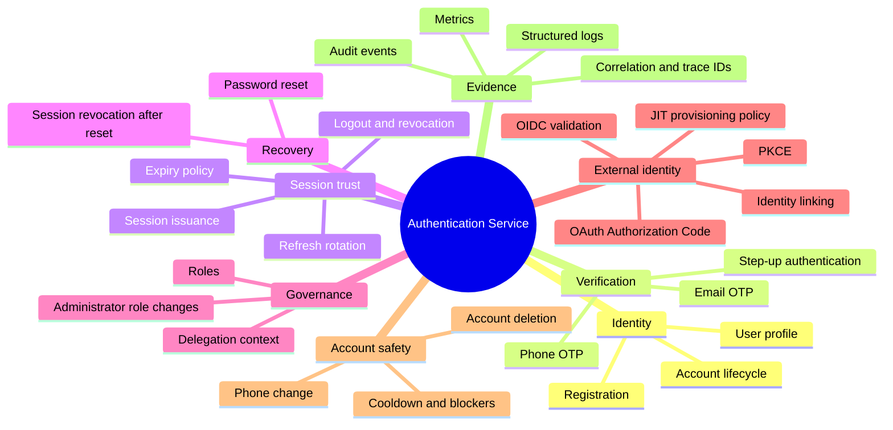

The service therefore sits on a critical path: **protected KODI functionality should only trust identity and session context established through this boundary**.

---

# 2. 60-second architecture


### The mental model

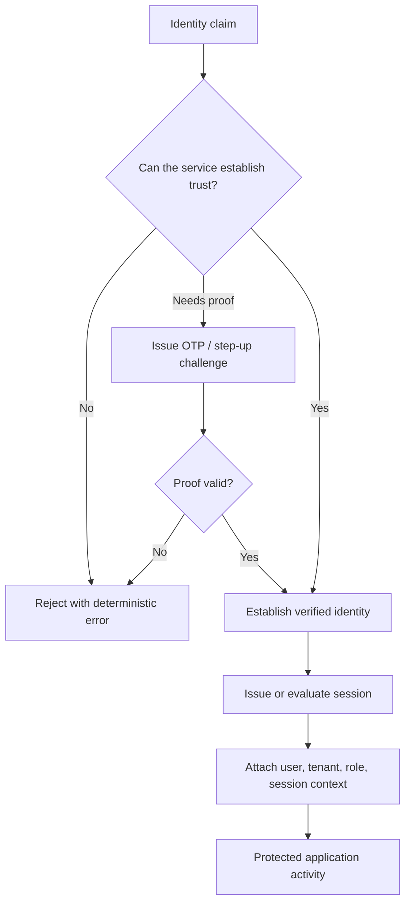

---

# 3. Position in the wider system

The supplied source bundle contains the Authentication Service rather than the full KODI deployment topology. The wider-system diagram below therefore shows the **contractual role** of this service without inventing downstream service names that are not present in this source snapshot.

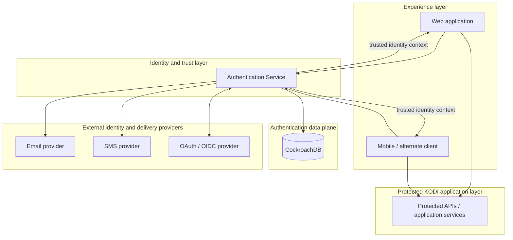

### Why it is a separate service

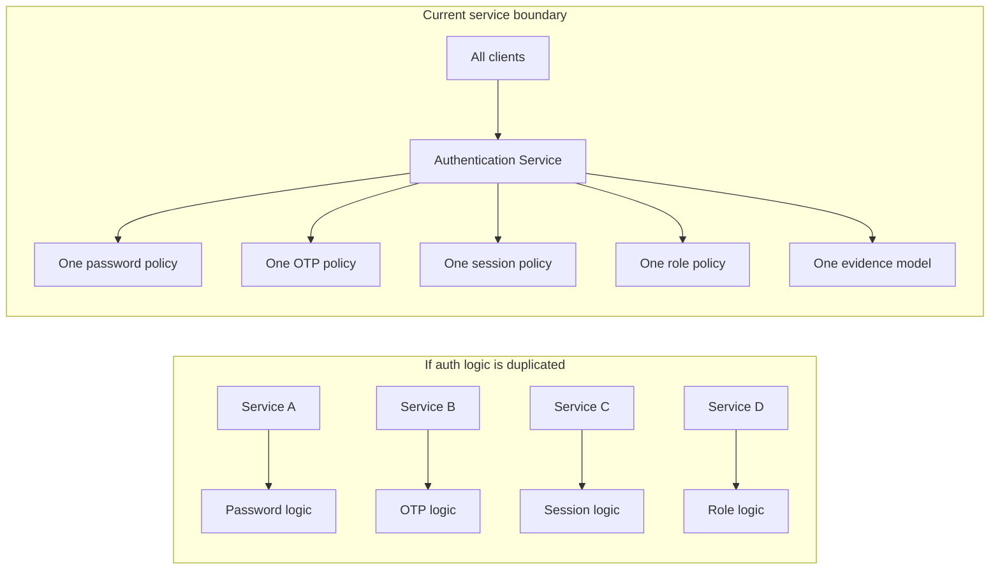

---

# 4. Service responsibilities and boundaries

## 4.1 What the service owns

```mermaid
flowchart TD
    AUTH[Authentication Service owns] --> A[Identity registration]
    AUTH --> B[Account verification state]
    AUTH --> C[Credential authentication]
    AUTH --> D[Passwordless email OTP login]
    AUTH --> E[OTP challenge lifecycle]
    AUTH --> F[Login lockout and step-up state]
    AUTH --> G[Session issuance / refresh / revocation]
    AUTH --> H[Role-change governance]
    AUTH --> I[Delegation records and session context]
    AUTH --> J[Password reset]
    AUTH --> K[Phone-number change]
    AUTH --> L[Account-deletion lifecycle]
    AUTH --> M[OAuth/OIDC protocol validation]
    AUTH --> N[Auth audit / logs / metrics]
```

## 4.2 What remains outside this boundary

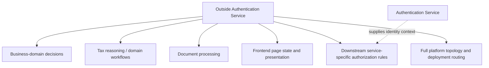

## 4.3 Trust boundaries

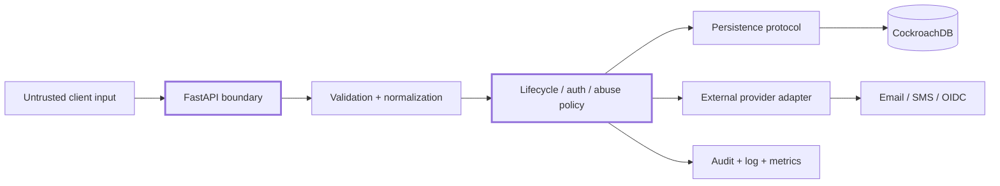

---

# 5. Internal architecture

The code is organized around **protocol-defined stores**, deterministic domain functions, FastAPI adapters, and runtime-selected persistence implementations.

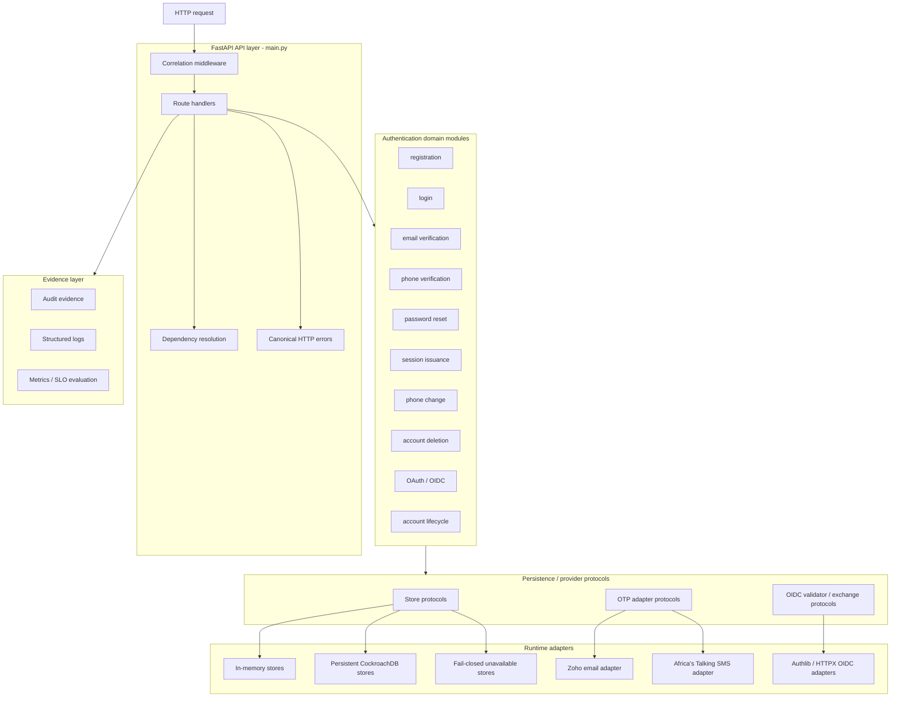

### Store-selection pattern

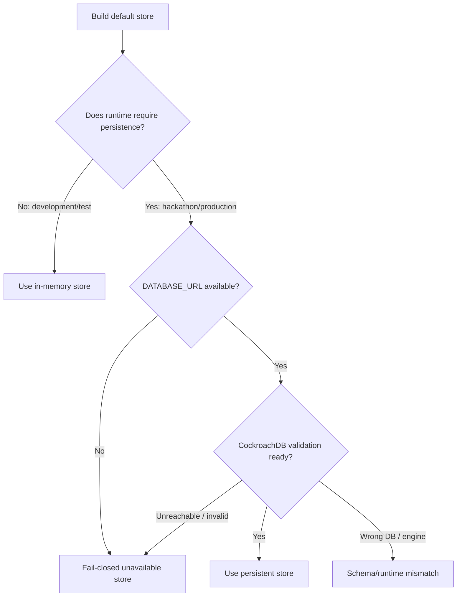

---

# 6. Module map

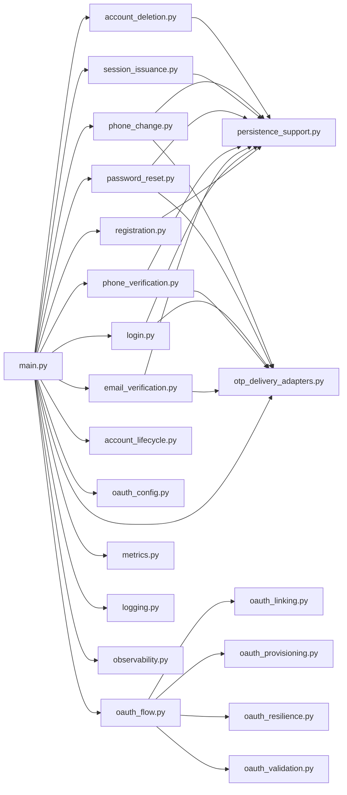

### Module responsibility matrix

```mermaid
classDiagram
    class RegistrationStoreProtocol {
      +register_user()
      +get_user_by_id()
      +get_user_by_email()
      +get_user_by_phone()
      +update_role()
      +tombstone_user_and_invalidate_credentials()
    }

    class SessionIssuanceStoreProtocol {
      +issue_session()
      +refresh_session()
      +evaluate_session()
      +revoke_session()
      +revoke_all_sessions_for_user()
    }

    class EmailVerificationStoreProtocol {
      +create_or_replay_challenge()
      +get_challenge()
      +verify_challenge()
    }

    class PhoneVerificationStoreProtocol {
      +create_or_replay_challenge()
      +get_challenge()
      +verify_challenge()
    }

    class PasswordResetStoreProtocol {
      +create_or_replay_challenge()
      +get_challenge()
    }

    class PhoneChangeStoreProtocol {
      +create_or_replay_request()
      +create_or_replay_confirmation()
    }

    class AccountDeletionRequestStoreProtocol {
      +create_or_replay_request()
      +create_or_replay_confirmation()
      +create_or_replay_cancel()
      +create_or_replay_execution()
    }
```

---

# 7. Universal request lifecycle

Most endpoints follow the same deterministic shape.

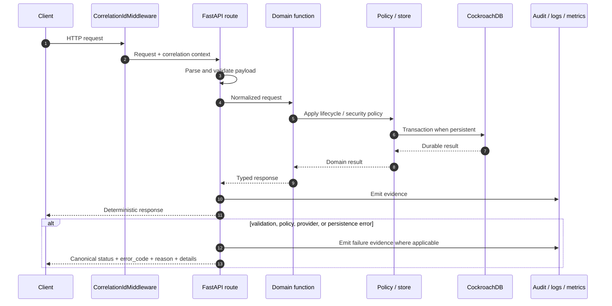

### Determinism principle

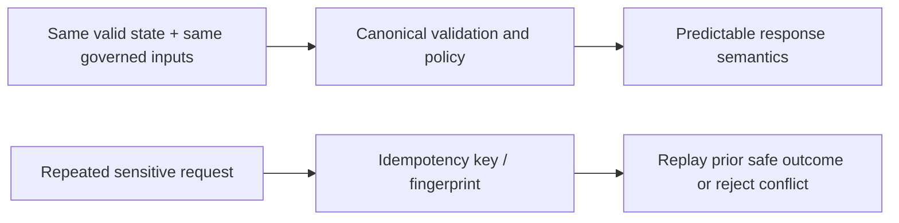

---

# 8. Account lifecycle

The canonical account states are:

- `pending_verification`
- `active`
- `locked`
- `disabled`

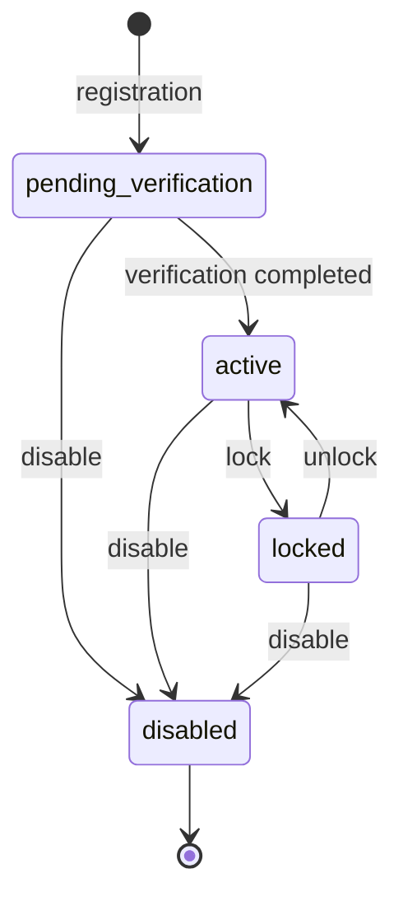

### Action guardrails

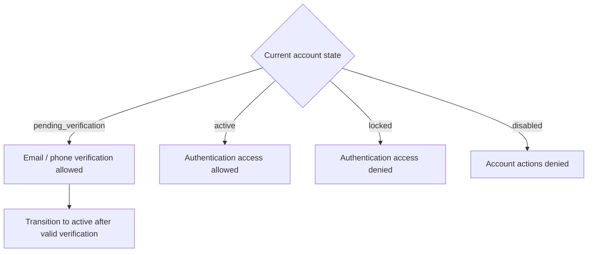

---

# 9. Registration and verification

Registration accepts normalized identity data and one of four governed roles:

`IndividualTaxpayer`, `TaxAgent`, `Accountant`, or `Administrator`.

The password baseline requires at least **12 characters** and uses bcrypt hashing with configurable cost and password-history controls.

## 9.1 Registration flow

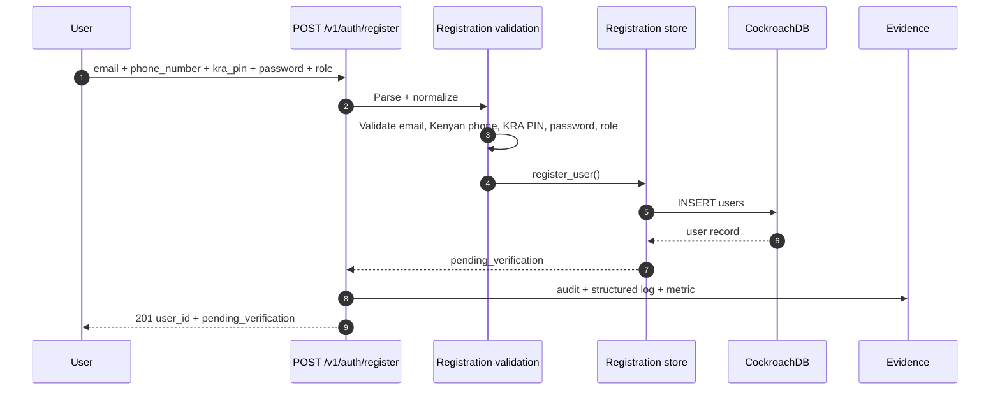

## 9.2 Verification lifecycle

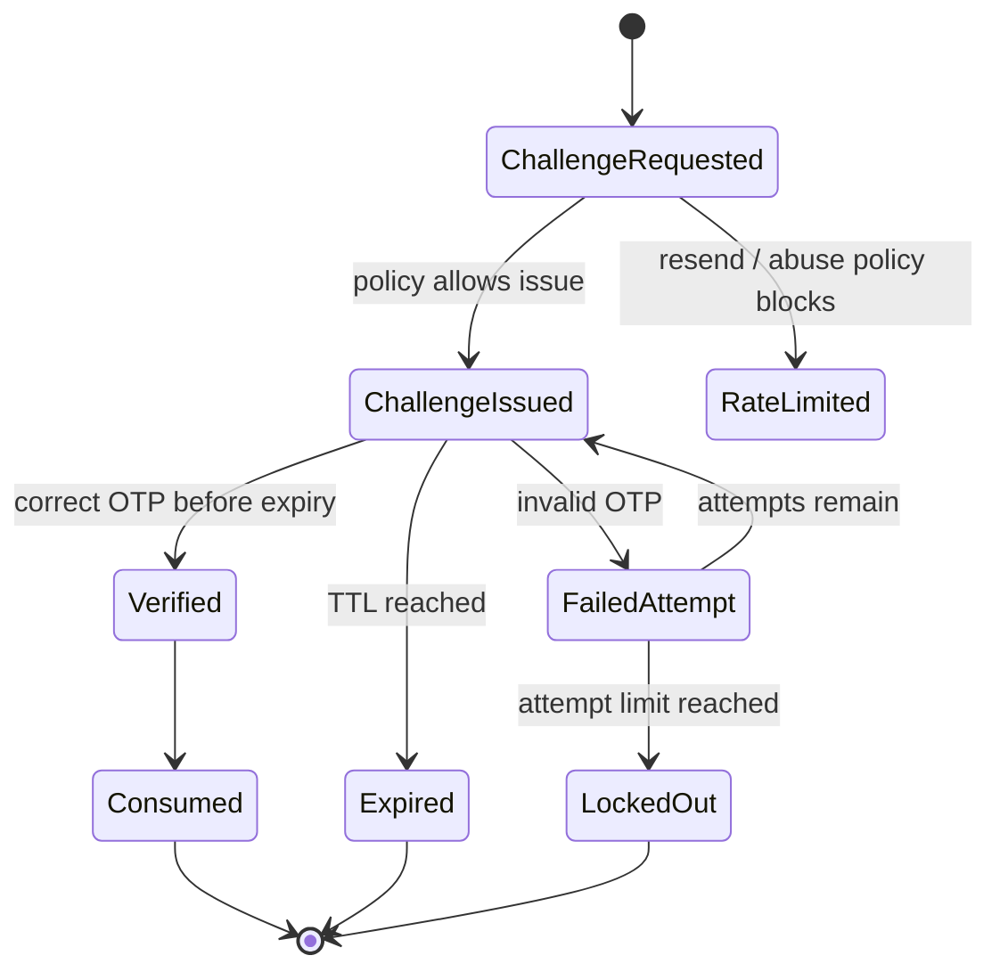

## 9.3 Email / phone verification interaction

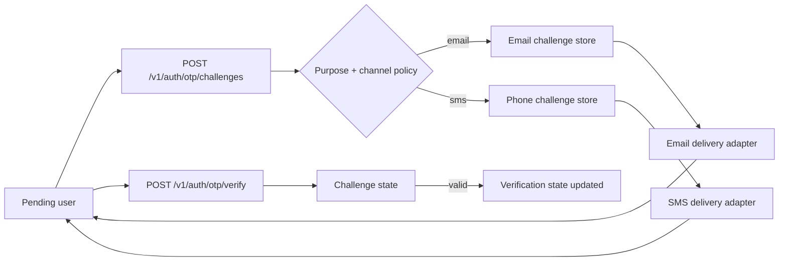

---

# 10. Login and step-up authentication

Two login entry points are implemented:

1. **Credential login** — identifier + password, with governed OTP step-up when required.
2. **Passwordless email OTP login** — email challenge followed by OTP verification.

## 10.1 Credential login

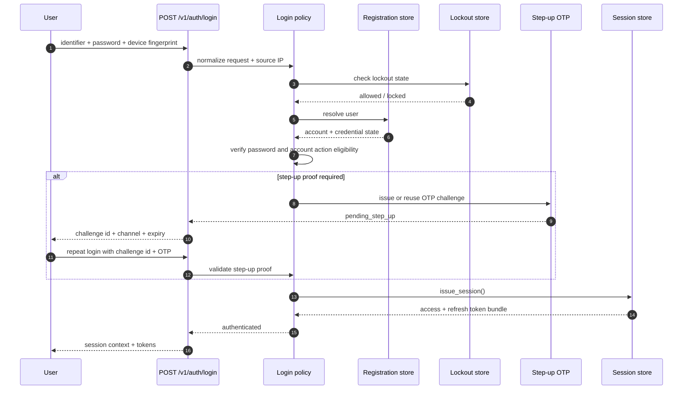

## 10.2 Passwordless email OTP login

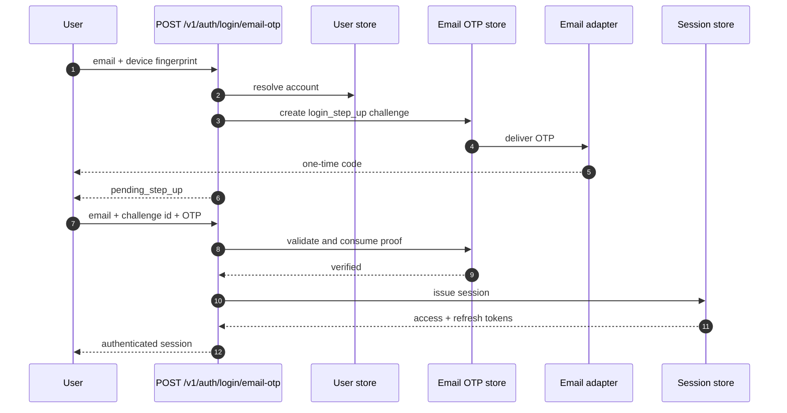

## 10.3 Abuse and lockout path

```mermaid
flowchart TD
    ATTEMPT[Login attempt] --> LOCK{Existing lockout?}
    LOCK -->|Yes| REJECT[Reject until lockout expiry]
    LOCK -->|No| CRED{Credential valid?}
    CRED -->|Yes| CLEAR[Clear failure state]
    CRED -->|No| COUNT[Record failed attempt]
    COUNT --> LIMIT{Failure threshold reached?}
    LIMIT -->|No| FAIL[Reject login]
    LIMIT -->|Yes| APPLY[Apply lockout]
    APPLY --> METRIC[Emit lockout audit + metric]
    METRIC --> REJECT
```

---

# 11. Session lifecycle

Sessions are persisted with bounded inactivity and absolute lifetimes. Refresh tokens are rotated and tracked separately, and the number of concurrent sessions is governed by policy.

```mermaid
stateDiagram-v2
    [*] --> Active: issue_session
    Active --> Warning: warning window reached
    Active --> Expired: inactivity or absolute expiry
    Warning --> Active: permitted activity / extension
    Warning --> Expired: expiry reached
    Active --> Invalidated: logout / concurrency enforcement
    Warning --> Invalidated: logout / concurrency enforcement
    Invalidated --> [*]
    Expired --> [*]
```

## 11.1 Session issuance and concurrency

```mermaid
flowchart TD
    LOGIN[Successful authentication] --> ISSUE[Create new session]
    ISSUE --> COUNT[Count user's active sessions]
    COUNT --> LIMIT{Over max concurrent sessions?}
    LIMIT -->|No| KEEP[Keep all allowed sessions]
    LIMIT -->|Yes| EVICT[Invalidate sessions per policy]
    KEEP --> TOKENS[Return opaque access + refresh tokens]
    EVICT --> TOKENS
```

## 11.2 Refresh-token rotation

```mermaid
sequenceDiagram
    autonumber
    participant C as Client
    participant API as POST /v1/auth/refresh
    participant S as Session store
    participant DB as CockroachDB

    C->>API: refresh_token
    API->>S: refresh_session(refresh_token)
    S->>DB: lock / validate active refresh-token record
    DB-->>S: token state
    S->>DB: mark old refresh token consumed
    S->>DB: insert replacement refresh token
    S->>DB: update session token hashes / activity
    DB-->>S: committed state
    S-->>API: new access + refresh token pair
    API-->>C: refreshed session
```

## 11.3 Logout / revocation

```mermaid
flowchart LR
    LOGOUT[POST /v1/auth/logout] --> SCOPE{revoke_scope}
    SCOPE -->|single_session| ONE[Revoke owned target session]
    SCOPE -->|all_sessions| ALL[Revoke all user sessions]
    ONE --> TRACE[Return revoked count + traceability]
    ALL --> TRACE
```

---

# 12. Authorization, roles, and delegation

## 12.1 Role model

```mermaid
flowchart TB
    ROLES[Supported authentication roles]
    ROLES --> IND[IndividualTaxpayer]
    ROLES --> AGENT[TaxAgent]
    ROLES --> ACC[Accountant]
    ROLES --> ADMIN[Administrator]

    ADMIN --> CHANGE[May invoke governed role-change endpoint]
    CHANGE --> NOS[Self-escalation forbidden]
    CHANGE --> NODEL[Delegated administrator context forbidden]
```

The `POST /v1/auth/roles/change` route is guarded so that only `Administrator` principals may use it; delegation is not accepted for that action.

## 12.2 Delegation data relationship

```mermaid
erDiagram
    USERS ||--o{ DELEGATIONS : principal
    USERS ||--o{ DELEGATIONS : delegate

    USERS {
        uuid id PK
        string role
        string account_state
    }

    DELEGATIONS {
        uuid id PK
        uuid principal_user_id FK
        uuid delegate_user_id FK
        datetime granted_at
        datetime revoked_at
        boolean is_active
    }
```

## 12.3 Session context

```mermaid
flowchart LR
    LOGIN[Authenticated login] --> CTX[SessionContextEnvelope]
    CTX --> UID[user_id]
    CTX --> TENANT[tenant_id]
    CTX --> ROLE[role]
    CTX --> SID[session_id]
    CTX --> DEL[delegation_context]
```

---

# 13. OAuth/OIDC

The service contains an OAuth Authorization Code + PKCE flow, provider trust-policy configuration, OIDC ID-token validation, identity linking, JIT provisioning policy, retry/backoff, and circuit-breaker logic.

```mermaid
sequenceDiagram
    autonumber
    participant U as User / Browser
    participant A as Auth Service
    participant P as OAuth Provider
    participant J as JWKS / OIDC validator
    participant L as Identity linking / JIT policy

    U->>A: POST /v1/auth/oauth/{provider}/start
    A->>A: validate registered provider + redirect URI + trust policy
    A->>A: create state + nonce + PKCE verifier/challenge
    A-->>U: authorization_url + state + nonce
    U->>P: authorization request
    P-->>U: redirect with code + state
    U->>A: GET callback?code=...&state=...
    A->>A: validate + consume state
    A->>P: exchange authorization code
    P-->>A: tokens
    A->>J: validate ID token issuer / audience / nonce / signature / claims
    J-->>A: validated claims
    A->>L: resolve existing identity or evaluate JIT provisioning
    L-->>A: linked internal user context
    A-->>U: protocol validated response
```

## 13.1 Provider resilience

```mermaid
flowchart TD
    EX[Token exchange] --> CIRCUIT{Circuit open?}
    CIRCUIT -->|Yes| DEGRADED[Reject / degraded mode]
    CIRCUIT -->|No| CALL[Call provider]
    CALL --> OK{Success?}
    OK -->|Yes| RESET[Reset provider failure state]
    OK -->|No| CLASSIFY[Classify provider failure]
    CLASSIFY --> RETRY{Retryable and retries remain?}
    RETRY -->|Yes| BACKOFF[Bounded backoff]
    BACKOFF --> CALL
    RETRY -->|No| FAILCOUNT[Increment failure count]
    FAILCOUNT --> THRESHOLD{Circuit threshold reached?}
    THRESHOLD -->|Yes| OPEN[Open circuit]
    THRESHOLD -->|No| ERROR[Return governed failure]
```

> **Runtime note:** the default OAuth state store and identity-linking store are in-memory only when persistent auth storage is *not* required. In `hackathon` and `production` auth modes, their default implementations intentionally become unavailable/fail-closed. OAuth should therefore be treated as **gated until persistent OAuth state/linking adapters are supplied** for those modes.

---

# 14. Password recovery

Password reset is non-enumerating, challenge-based, idempotent, and revokes existing sessions after a successful password change.

```mermaid
sequenceDiagram
    autonumber
    participant U as User
    participant API as Password reset API
    participant R as Registration store
    participant P as Password reset store
    participant E as Email adapter
    participant S as Session store

    U->>API: Initiate reset
    API->>R: Resolve account without exposing enumeration result
    API->>P: Create or replay challenge
    P->>E: Deliver reset code
    API-->>U: Accepted challenge response

    U->>API: Challenge ID, code, and new password
    API->>P: Validate challenge state, attempts, and expiry
    API->>R: Validate password policy and history
    API->>R: Replace password hash and update history
    API->>P: Consume challenge
    API->>S: Revoke all sessions for user
    API-->>U: Reset completed
```

### Recovery security closure

```mermaid
flowchart LR
    RESET[Successful password reset] --> HASH[Persist new bcrypt password hash]
    HASH --> HISTORY[Update password history]
    HISTORY --> CONSUME[Consume reset challenge]
    CONSUME --> REVOKE[Revoke all existing sessions]
    REVOKE --> CLEAN[User must authenticate again]
```

---

# 15. Phone-number change

```mermaid
sequenceDiagram
    autonumber
    participant U as Authenticated user
    participant API as Phone-change API
    participant PCS as Phone-change store
    participant OTP as Phone verification store
    participant SMS as SMS adapter
    participant R as Registration store

    U->>API: POST /v1/auth/phone-change/requests
    API->>API: parse authenticated principal
    API->>PCS: create/replay requested change
    API->>OTP: bind step-up challenge to request
    OTP->>SMS: deliver OTP
    SMS-->>U: OTP
    API-->>U: request + challenge metadata
    U->>API: POST /v1/auth/phone-change/confirm
    API->>OTP: verify bound OTP proof
    API->>R: update user phone number
    API->>PCS: mark request confirmed + append audit evidence
    API-->>U: phone change confirmed
```

### Safety properties

```mermaid
flowchart TD
    REQ[Phone change request] --> AUTH{Authenticated principal present?}
    AUTH -->|No| DENY[401]
    AUTH -->|Yes| IDEMP[Idempotent request fingerprint]
    IDEMP --> OTP[Bound OTP step-up]
    OTP --> VALID{Valid, unexpired, matching context?}
    VALID -->|No| DENY2[Reject]
    VALID -->|Yes| UPDATE[Update identity record]
    UPDATE --> AUDIT[Persist phone-change audit evidence]
```

---

# 16. Account deletion

Account deletion is intentionally a **multi-stage workflow**, not a single destructive request.

```mermaid
stateDiagram-v2
    [*] --> requested: create request
    [*] --> blocked: create request with blockers
    blocked --> [*]
    requested --> confirmed: re-auth proof + OTP proof
    confirmed --> cancelled: user cancels during cooldown
    confirmed --> executed: cooldown expired and execution allowed
    cancelled --> [*]
    executed --> [*]
```

## 16.1 Deletion decision path

```mermaid
flowchart TD
    START[Deletion request] --> PRINCIPAL[Validate authenticated principal]
    PRINCIPAL --> STATE{Account active or locked?}
    STATE -->|No| REJECT[Reject ineligible state]
    STATE -->|Yes| PRECHECK[Evaluate deletion blockers]
    PRECHECK --> BLOCK{Any blocker?}
    BLOCK -->|Yes| BLOCKED[Persist blocked request + evidence]
    BLOCK -->|No| REQUESTED[Persist requested state]
    REQUESTED --> CONFIRM[Require re-auth proof + OTP proof]
    CONFIRM --> COOL[Enter cooldown]
    COOL --> CHOICE{User action / time}
    CHOICE -->|Cancel before expiry| CANCELLED[Cancelled]
    CHOICE -->|Execute before expiry| TOOEARLY[Reject]
    CHOICE -->|Execute after expiry| EXEC[Execute deletion]
    EXEC --> TOMB[Tombstone identity / invalidate credentials]
    TOMB --> REVOKE[Revoke active sessions]
    REVOKE --> EVIDENCE[Persist lifecycle evidence]
```

## 16.2 Precheck blockers

```mermaid
flowchart LR
    PRE[Deletion precheck] --> C[Compliance lock]
    PRE --> L[Legal hold]
    PRE --> O[Active obligation]
    PRE --> R[Retention constraint]
    C --> BLOCK[Blocked deletion]
    L --> BLOCK
    O --> BLOCK
    R --> BLOCK
```

---

# 17. Persistence model

Core auth persistence targets **CockroachDB** and validates that the active database is `kodi_dev`.

## 17.1 Persistent tables used by the service

```mermaid
erDiagram
    USERS ||--o{ SESSIONS : owns
    USERS ||--o{ DELEGATIONS : participates_in
    USERS ||--o{ AUTH_OTP_CHALLENGES : receives
    USERS ||--o{ AUTH_LOGIN_LOCKOUTS : may_have
    USERS ||--o{ AUTH_LOGIN_STEP_UP_STATES : may_have
    USERS ||--o{ AUTH_PASSWORD_RESET_CHALLENGES : may_request
    USERS ||--o{ AUTH_PHONE_CHANGE_REQUESTS : may_request
    USERS ||--o{ AUTH_ACCOUNT_DELETION_REQUESTS : may_request

    SESSIONS ||--o{ AUTH_SESSION_REFRESH_TOKENS : rotates

    AUTH_PHONE_CHANGE_REQUESTS ||--o{ AUTH_PHONE_CHANGE_AUDIT_EVENTS : emits

    AUTH_ACCOUNT_DELETION_REQUESTS ||--o{ AUTH_ACCOUNT_DELETION_AUDIT_EVENTS : emits
    AUTH_ACCOUNT_DELETION_REQUESTS ||--o{ AUTH_ACCOUNT_DELETION_NOTIFICATIONS : emits
    AUTH_ACCOUNT_DELETION_REQUESTS ||--o{ AUTH_ACCOUNT_DELETION_INCIDENTS : may_emit
    AUTH_ACCOUNT_DELETION_REQUESTS ||--o{ AUTH_ACCOUNT_DELETION_REAUTH_PROOFS : binds
    AUTH_ACCOUNT_DELETION_REQUESTS ||--o{ AUTH_ACCOUNT_DELETION_OTP_PROOFS : binds

    USERS {
        uuid id PK
        string role
        string account_state
        string verification_state
        string password_hash
        json password_history_hashes
    }

    SESSIONS {
        uuid id PK
        uuid user_id FK
        string tenant_id
        string role
        datetime issued_at
        datetime expires_at
        boolean is_invalidated
        string access_token_hash
        string refresh_token_hash
    }

    AUTH_SESSION_REFRESH_TOKENS {
        string refresh_token_hash PK
        uuid session_id FK
        datetime issued_at
        boolean is_consumed
    }

    DELEGATIONS {
        uuid id PK
        uuid principal_user_id FK
        uuid delegate_user_id FK
        boolean is_active
    }

    AUTH_OTP_CHALLENGES {
        uuid challenge_id PK
        string purpose
        string channel
        datetime expires_at
        datetime consumed_at
    }

    AUTH_LOGIN_LOCKOUTS {
        string subject_key PK
        datetime lockout_expires_at
    }

    AUTH_LOGIN_STEP_UP_STATES {
        string subject_key PK
        uuid challenge_id
        string channel
    }

    AUTH_PASSWORD_RESET_CHALLENGES {
        uuid challenge_id PK
        uuid user_id FK
        datetime expires_at
        datetime consumed_at
    }

    AUTH_PHONE_CHANGE_REQUESTS {
        uuid request_id PK
        uuid user_id FK
        string state
    }

    AUTH_PHONE_CHANGE_AUDIT_EVENTS {
        string event_id PK
        uuid request_id FK
    }

    AUTH_ACCOUNT_DELETION_REQUESTS {
        uuid request_id PK
        uuid user_id FK
        string deletion_state
        datetime cooldown_expires_at
    }

    AUTH_ACCOUNT_DELETION_AUDIT_EVENTS {
        string event_id PK
        uuid request_id FK
    }

    AUTH_ACCOUNT_DELETION_NOTIFICATIONS {
        string notification_id PK
        uuid request_id FK
    }

    AUTH_ACCOUNT_DELETION_INCIDENTS {
        string audit_reference_id PK
        uuid request_id FK
    }

    AUTH_ACCOUNT_DELETION_REAUTH_PROOFS {
        string proof_id PK
        uuid request_id FK
    }

    AUTH_ACCOUNT_DELETION_OTP_PROOFS {
        uuid otp_verification_id PK
        uuid request_id FK
    }
```

`auth_idempotency_preclaims` is additionally used by phone-verification persistence to coordinate idempotent challenge creation safely.

## 17.2 Persistence mode decision

```mermaid
flowchart LR
    MODE{AUTH_SECRET_RUNTIME_MODE}
    MODE -->|development| MEMORY[In-memory allowed]
    MODE -->|test| MEMORY
    MODE -->|hackathon| REQUIRED[Persistent auth required]
    MODE -->|production| REQUIRED
    REQUIRED --> CRDB[(CockroachDB kodi_dev)]
    CRDB --> READY{DB engine + database validation}
    READY -->|ready| RUN[Persistent stores operational]
    READY -->|not ready| CLOSED[Fail closed]
```

---

# 18. CockroachDB transaction safety

CockroachDB can return serialization conflicts and, in failure scenarios, uncertain commit outcomes. The service contains bounded retry and reconciliation primitives specifically for those cases.

```mermaid
flowchart TD
    BEGIN[Begin auth transaction] --> OPEN[Open CockroachDB connection]
    OPEN --> EXEC[Run deterministic SQL callback]
    EXEC --> COMMIT[Commit]
    COMMIT --> SUCCESS[Return result]

    EXEC -->|SQLSTATE 40001| SERIAL[Serialization conflict]
    SERIAL --> MORE{Attempts remain?}
    MORE -->|Yes| BACKOFF[Bounded backoff + jitter]
    BACKOFF --> OPEN
    MORE -->|No| EXHAUST[Retry-exhausted error]

    COMMIT -->|ambiguous outcome| AMB[Ambiguous commit]
    AMB --> RECON{Reconciliation callback available?}
    RECON -->|Yes| READBACK[Read durable state on fresh connection]
    READBACK --> FOUND{Expected state found?}
    FOUND -->|Yes| RECONCILED[Return reconciled result]
    FOUND -->|No| AMBERR[Ambiguous-result error]
    RECON -->|No| AMBERR

    OPEN -->|unavailable| UNAVAILABLE[503 persistence unavailable]
    EXEC -->|non-retryable SQL| SQLERR[Persistence SQL error]
```

### Transaction design constraint

```mermaid
flowchart LR
    TX[Inside transaction callback] --> OK1[SQL]
    TX --> OK2[Deterministic calculation]
    TX --> OK3[Serialization / comparison]
    TX --> OK4[Database-result construction]

    TX -. must not .-> NO1[Call external providers]
    TX -. must not .-> NO2[Commit manually]
    TX -. must not .-> NO3[Close connection]
```

---

# 19. OTP delivery architecture

```mermaid
flowchart TD
    PURPOSE[OTP purpose] --> POLICY[Purpose-scoped abuse + channel policy]
    POLICY --> CH{Selected channel}

    CH -->|email| EMAILMODE{Email provider mode}
    EMAILMODE -->|zoho| ZOHO[Zoho Mail adapter]
    EMAILMODE -->|stub/dev| EMAILSTUB[Stub adapter]
    EMAILMODE -->|invalid config| EMAILFAIL[Misconfigured adapter]

    CH -->|sms| SMSMODE{SMS provider mode}
    SMSMODE -->|africas_talking| AT[Africa's Talking adapter]
    SMSMODE -->|stub/dev| SMSSTUB[Stub adapter]
    SMSMODE -->|invalid config| SMSFAIL[Misconfigured adapter]

    ZOHO --> NORMALIZE[Normalized delivery outcome]
    EMAILSTUB --> NORMALIZE
    EMAILFAIL --> NORMALIZE
    AT --> NORMALIZE
    SMSSTUB --> NORMALIZE
    SMSFAIL --> NORMALIZE

    NORMALIZE --> STATUS{Outcome}
    STATUS --> SENT[sent]
    STATUS --> RETRY[failed_retryable]
    STATUS --> HARD[failed_non_retryable]
```

### SMS-to-email fallback policy

```mermaid
flowchart LR
    SMS[Primary SMS challenge] --> FAIL{SMS delivery failed?}
    FAIL -->|No| DONE[Challenge delivered]
    FAIL -->|Yes| CFG{Fallback enabled + purpose allowed?}
    CFG -->|No| ERROR[Return normalized delivery failure]
    CFG -->|Yes| EMAIL[Attempt email fallback]
    EMAIL --> DONE2[Record primary and fallback channel context]
```

Default configuration disables registration/login **phone OTP activation** while retaining the feature and provider architecture. Email delivery defaults to Zoho mode; SMS defaults to stub mode unless configured otherwise.

---

# 20. Security model

## 20.1 Defense layers

```mermaid
flowchart TB
    L1[Input validation & normalization]
    L2[Account-state guardrails]
    L3[Password hashing + history]
    L4[OTP TTL / attempts / resend / cooldown]
    L5[Login lockout]
    L6[Step-up authentication]
    L7[Session inactivity + absolute expiry]
    L8[Concurrent-session enforcement]
    L9[Refresh-token rotation and consumption]
    L10[Idempotency on sensitive writes]
    L11[Role governance]
    L12[Deletion blockers + proof + cooldown]
    L13[Redacted structured evidence]
    L14[Fail-closed persistence and secret policy]

    L1 --> L2 --> L3 --> L4 --> L5 --> L6 --> L7 --> L8 --> L9 --> L10 --> L11 --> L12 --> L13 --> L14
```

## 20.2 Password controls

```mermaid
flowchart LR
    P[Password input] --> LEN{Minimum 12 chars?}
    LEN -->|No| REJECT[Reject]
    LEN -->|Yes| POLICY[Strength policy]
    POLICY --> HISTORY{Reused within configured history depth?}
    HISTORY -->|Yes| REJECT
    HISTORY -->|No| BCRYPT[bcrypt hash with configurable cost]
    BCRYPT --> STORE[(Persist hash + history)]
```

## 20.3 Secret fail-closed startup

```mermaid
flowchart TD
    START[create_app()] --> LOAD[load_auth_secret_config_baseline]
    LOAD --> MODE{runtime mode}
    MODE -->|development/test| OPTIONAL[Missing governed secrets may remain unset]
    MODE -->|hackathon/production| REQUIRED[Required secrets must exist and pass format validation]
    REQUIRED --> VALID{Valid secret set?}
    VALID -->|No| STOP[Application construction fails closed]
    VALID -->|Yes| ROT{Rotation config coherent?}
    ROT -->|No| STOP
    ROT -->|Yes| APP[Create FastAPI application]
    OPTIONAL --> APP
```

### Secret groups

```mermaid
flowchart LR
    SECRETS[Governed secrets] --> SIGN[Session signing key]
    SECRETS --> REFRESH[Refresh-token secret]
    SECRETS --> ENC[Encryption key]
    SECRETS --> IDEMP[Idempotency signing secret]
    SECRETS --> SMS[SMS provider secret]
    SECRETS --> EMAIL[Email provider secret / Zoho credentials]
    SIGN --> ROT[Optional next signing key + bounded rotation window]
```

---

# 21. Observability and audit

Every important auth workflow is designed to leave operational evidence through some combination of canonical audit events, structured logs, metrics, correlation IDs, and trace IDs.

```mermaid
flowchart LR
    REQ[Auth request] --> CORR[CorrelationIdMiddleware]
    CORR --> HANDLER[Route handler]
    HANDLER --> AUDIT[Canonical audit envelope]
    HANDLER --> LOG[Structured auth log]
    HANDLER --> METRIC[Governed metric event]

    AUDIT --> REDACT[Sanitize sensitive detail keys]
    LOG --> LOGREDACT[Deterministic redaction]
    METRIC --> DIM[Only allowed non-sensitive dimensions]

    REDACT --> STORE[Audit store]
    LOGREDACT --> LOGGER[Structured logger and diagnostic store]
    DIM --> SLO[SLO snapshot and threshold evaluation]
```

## 21.1 Canonical audit evidence

```mermaid
flowchart TD
    EVENT[Auth event] --> FIELDS[event_type + event_time + user + tenant + session]
    FIELDS --> TRACE[correlation_id + trace_id]
    TRACE --> STATUS[action_status + reason_code]
    STATUS --> SANITIZE[sanitize details]
    SANITIZE --> CANON[canonical JSON]
    CANON --> HASH[SHA-256 evidence_hash]
    HASH --> ENVELOPE[AuthAuditEventEnvelope v1.0.0]
```

In `production`, `create_app()` uses the shared Event Store repository for canonical auth audit persistence. In other modes, the default canonical audit store is in-memory. Several sensitive domain workflows, such as account deletion and phone change, also persist their own lifecycle evidence in CockroachDB.

## 21.2 Metrics and SLO evaluation

```mermaid
flowchart LR
    EVENTS[Metric events] --> LOGIN[Login success / failure]
    EVENTS --> REG[Registration success / failure]
    EVENTS --> OTP[OTP issue / verify]
    EVENTS --> LOCK[Lockouts]
    EVENTS --> RESET[Password reset]
    EVENTS --> SESSION[Session issue / refresh]
    EVENTS --> OAUTH[OAuth failures]
    EVENTS --> DB[Persistence success / retry / failure / ambiguous]

    LOGIN --> SNAP[AuthSloMetricSnapshot]
    OTP --> SNAP
    RESET --> SNAP
    LOCK --> SNAP
    SESSION --> SNAP
    DB --> SNAP
    SNAP --> THRESH[Configured SLO thresholds]
    THRESH --> ALERTS[AuthSloAlert set]
```

---

# 22. API surface

The current `main.py` exposes the following public auth routes.

| Method | Path | Purpose |
|---|---|---|
| `POST` | `/v1/auth/register` | Create a pending-verification user account |
| `PATCH` | `/v1/auth/phone-verification/update-phone` | Correct pending registration phone and re-issue verification challenge |
| `POST` | `/v1/auth/login` | Credential login with step-up support |
| `POST` | `/v1/auth/login/email-otp` | Passwordless email OTP login |
| `POST` | `/v1/auth/refresh` | Rotate refresh token and refresh session |
| `POST` | `/v1/auth/logout` | Revoke one or all sessions |
| `GET` | `/v1/auth/sessions/{session_id}` | Inspect an owned session |
| `POST` | `/v1/auth/roles/change` | Administrator-governed role change |
| `POST` | `/v1/auth/oauth/{provider}/start` | Start OAuth Authorization Code + PKCE flow |
| `GET` | `/v1/auth/oauth/{provider}/callback` | Validate OAuth callback and link/provision identity |
| `POST` | `/v1/auth/password-reset/initiate` | Begin password recovery |
| `POST` | `/v1/auth/password-reset/confirm` | Verify recovery proof and replace password |
| `POST` | `/v1/auth/account-deletion/requests` | Create deletion request |
| `POST` | `/v1/auth/account-deletion/confirm` | Confirm deletion with bound proofs |
| `POST` | `/v1/auth/account-deletion/cancel` | Cancel during cooldown |
| `POST` | `/v1/auth/account-deletion/execute` | Execute deletion after cooldown |
| `POST` | `/v1/auth/phone-change/requests` | Start authenticated phone change |
| `POST` | `/v1/auth/phone-change/confirm` | Confirm phone change with step-up OTP |
| `POST` | `/v1/auth/otp/challenges` | Create governed verification challenge |
| `POST` | `/v1/auth/otp/verify` | Verify governed OTP challenge |
| `GET` | `/v1/auth/profile` | Return authenticated user profile summary |

### API grouping

```mermaid
flowchart TB
    API["/v1/auth"]

    API --> ID[Identity]
    ID --> REG["/register"]
    ID --> PROFILE["/profile"]

    API --> LOGIN[Authentication]
    LOGIN --> PASSLOGIN["/login"]
    LOGIN --> EMAILLOGIN["/login/email-otp"]
    LOGIN --> OAUTH["/oauth/{provider}/..."]

    API --> SESSION[Sessions]
    SESSION --> REFRESH["/refresh"]
    SESSION --> LOGOUT["/logout"]
    SESSION --> INSPECT["/sessions/{session_id}"]

    API --> VERIFY[Verification]
    VERIFY --> CHAL["/otp/challenges"]
    VERIFY --> VER["/otp/verify"]
    VERIFY --> PHONEFIX["/phone-verification/update-phone"]

    API --> RECOVERY["Recovery / sensitive changes"]
    RECOVERY --> RESET["/password-reset/..."]
    RECOVERY --> PHONECHANGE["/phone-change/..."]
    RECOVERY --> DELETE["/account-deletion/..."]

    API --> GOV[Governance]
    GOV --> ROLE["/roles/change"]
```

### Development-only OTP inspection

When `AUTH_OTP_RUNTIME_MODE != production`, the app also mounts:

```text
GET /dev/otp/{challenge_id}
```

```mermaid
flowchart LR
    MODE["AUTH_OTP_RUNTIME_MODE"]
    MODE -->|"development/test"| DEV["Mount /dev/otp/{challenge_id}"]
    MODE -->|"production"| NODEV["Do not mount dev OTP route"]
```

> **Do not expose the development OTP route in a public deployment.** Set `AUTH_OTP_RUNTIME_MODE=production` for externally reachable hackathon/production environments.

---

# 23. Configuration

Configuration is environment-driven. The list below focuses on the variables operators need to understand first; the source contains additional purpose-specific OTP limits, provider templates, retry values, and SLO thresholds.

## 23.1 Configuration map

```mermaid
flowchart TD
    ENV[Environment / .env] --> RUNTIME[Runtime mode]
    ENV --> DB[DATABASE_URL]
    ENV --> SECRETS[Signing / refresh / encryption / idempotency secrets]
    ENV --> OTP[OTP policy]
    ENV --> PROVIDERS[Zoho / Africa's Talking]
    ENV --> SESSION[Session policy]
    ENV --> OAUTH[OAuth provider registry + trust policy]
    ENV --> SLO[SLO thresholds]

    RUNTIME --> APP[Auth application]
    DB --> APP
    SECRETS --> APP
    OTP --> APP
    PROVIDERS --> APP
    SESSION --> APP
    OAUTH --> APP
    SLO --> APP
```

## 23.2 Essential environment variables

| Variable | Role |
|---|---|
| `DATABASE_URL` | CockroachDB connection string; persistent runtime expects database `kodi_dev` |
| `AUTH_SECRET_RUNTIME_MODE` | `development`, `test`, `hackathon`, or `production` |
| `AUTH_OTP_RUNTIME_MODE` | `development`, `test`, or `production`; controls provider/runtime behavior and dev OTP route |
| `AUTH_SESSION_SIGNING_KEY_ACTIVE` | Active session-signing secret baseline |
| `AUTH_SESSION_SIGNING_KEY_NEXT` | Optional next signing key during configured rotation window |
| `AUTH_REFRESH_TOKEN_SECRET_ACTIVE` | Refresh-token secret baseline |
| `AUTH_ENCRYPTION_KEY_ACTIVE` | Governed encryption-key configuration |
| `AUTH_IDEMPOTENCY_SIGNING_SECRET` | Idempotency-signing secret baseline |
| `AUTH_DEFAULT_TENANT_ID` | Tenant placed into newly authenticated session context |
| `AUTH_REGISTRATION_PHONE_OTP_ENABLED` | Enable/disable registration phone-OTP activation |
| `AUTH_LOGIN_PHONE_OTP_ENABLED` | Enable/disable login phone-OTP activation |
| `AUTH_OTP_SMS_EMAIL_FALLBACK_ENABLED` | Permit configured SMS-to-email fallback |
| `AUTH_OTP_SMS_PROVIDER_MODE` | SMS adapter mode; Africa's Talking is supported |
| `AUTH_OTP_EMAIL_PROVIDER_MODE` | Email adapter mode; Zoho is supported |
| `AUTH_SESSION_TTL_SECONDS` | Session/token TTL baseline |
| `AUTH_SESSION_INACTIVITY_TIMEOUT_SECONDS` | Inactivity expiry |
| `AUTH_SESSION_ABSOLUTE_LIFETIME_SECONDS` | Absolute maximum session lifetime |
| `AUTH_SESSION_MAX_CONCURRENT_SESSIONS` | Concurrent-session policy |
| `AUTH_PASSWORD_BCRYPT_COST` | bcrypt cost |
| `AUTH_PASSWORD_HISTORY_DEPTH` | Password-reuse history depth |
| `AUTH_OAUTH_PROVIDER_REGISTRY_JSON` | Governed OAuth provider registry |
| `AUTH_OAUTH_ALLOWED_ISSUERS` | Trusted OAuth/OIDC issuers |
| `AUTH_OAUTH_ALLOWED_REDIRECT_URIS` | Trusted redirect URIs |
| `AUTH_OAUTH_REQUIRED_SCOPES` | Required provider scopes |

### Provider-specific configuration

```mermaid
flowchart LR
    EMAIL[Zoho email] --> Z1[AUTH_ZOHO_CLIENT_ID]
    EMAIL --> Z2[AUTH_ZOHO_CLIENT_SECRET]
    EMAIL --> Z3[AUTH_ZOHO_REFRESH_TOKEN]
    EMAIL --> Z4[AUTH_ZOHO_ACCOUNT_ID]
    EMAIL --> Z5[AUTH_ZOHO_FROM_ADDRESS]

    SMS[Africa's Talking SMS] --> A1[AUTH_AFRICAS_TALKING_USERNAME / AT_USERNAME]
    SMS --> A2[AT_API_KEY or AUTH_OTP_SMS_PROVIDER_SECRET]
    SMS --> A3[AUTH_AFRICAS_TALKING_SENDER_ID / SENDER_ID]
```

> Never commit `.env`, database credentials, provider secrets, OTPs, refresh tokens, or signing keys.

---

# 24. Runtime modes

Two separate runtime switches matter:

- `AUTH_SECRET_RUNTIME_MODE` controls **secret validation and whether core auth persistence is mandatory**.
- `AUTH_OTP_RUNTIME_MODE` controls **OTP runtime behavior and whether the dev OTP inspection route is mounted**.

```mermaid
flowchart TB
    SECRET{AUTH_SECRET_RUNTIME_MODE}
    SECRET -->|development| SD[Core stores may be in-memory]
    SECRET -->|test| ST[Core stores may be in-memory]
    SECRET -->|hackathon| SH[CockroachDB + required secrets; fail closed]
    SECRET -->|production| SP[CockroachDB + required secrets; fail closed]

    OTP{AUTH_OTP_RUNTIME_MODE}
    OTP -->|development| OD[Non-production OTP runtime + dev route]
    OTP -->|test| OT[Non-production OTP runtime + dev route]
    OTP -->|production| OP[Production OTP runtime; no dev route]
```

### Recommended externally reachable hackathon mode

```mermaid
flowchart LR
    H[Hackathon deployment] --> S[AUTH_SECRET_RUNTIME_MODE=hackathon]
    H --> O[AUTH_OTP_RUNTIME_MODE=production]
    S --> DB[(CockroachDB kodi_dev)]
    S --> SEC[Required secrets present]
    O --> NODEV[No /dev/otp route]
    O --> REAL[Configured real provider adapters]
```

---

# 25. Running locally

The module exports `app = create_app()` from `services.auth.app.main`, so it can be served directly by Uvicorn.

```bash
# from the repository root
source venv/bin/activate
uvicorn services.auth.app.main:app --reload
```

For local development, make sure the repository `.env` contains the configuration appropriate to the mode you are running. Do not print secrets to the terminal or commit them.

### Startup flow

```mermaid
sequenceDiagram
    autonumber
    participant U as Uvicorn
    participant M as services.auth.app.main
    participant C as Config
    participant S as Store builders
    participant DB as CockroachDB

    U->>M: import app
    M->>M: create_app()
    M->>C: load secret baseline
    C-->>M: validated config or fail closed
    M->>S: build default stores
    S->>DB: validate when persistence required
    DB-->>S: ready / unavailable / mismatch
    S-->>M: persistent, in-memory, or unavailable stores
    M->>M: add CORS + correlation middleware + routers
    M-->>U: FastAPI app
```

### Development CORS origins currently configured

```text
http://127.0.0.1:5174
http://localhost:5174
http://127.0.0.1:5173
http://localhost:5173
```

---

# 26. Testing

The service architecture deliberately exposes protocol boundaries and resettable in-memory implementations to support deterministic isolated tests, while persistent stores exercise CockroachDB behavior.

```mermaid
flowchart LR
    TESTS[Test suite] --> FAST[Domain / API deterministic tests]
    TESTS --> STORE[Store contract tests]
    TESTS --> DB[CockroachDB persistence tests]
    TESTS --> PROVIDER[Provider integration tests]
    TESTS --> FAILURE[Failure / retry / idempotency tests]

    FAST --> MEMORY[In-memory stores]
    STORE --> MEMORY
    DB --> CRDB[(CockroachDB)]
    PROVIDER --> EXT[Configured provider adapters]
    FAILURE --> CRDB
```

Typical repository-level execution:

```bash
source venv/bin/activate
pytest -q
```

For focused auth tests, use the repository's auth test path if present in your checkout rather than weakening persistence or provider behavior simply to make tests faster.

### What should be tested most aggressively

```mermaid
mindmap
  root((Auth test priorities))
    Identity
      duplicate email
      duplicate phone
      role validation
      account state transitions
    Login
      wrong credentials
      lockout threshold
      OTP step-up
      passwordless email OTP
    Sessions
      refresh rotation
      replayed refresh token
      inactivity expiry
      absolute expiry
      concurrency eviction
      logout scopes
    OTP
      expiry
      attempts
      resend limits
      idempotent replay
      provider failure mapping
    Persistence
      serialization retry
      ambiguous commit reconciliation
      unavailable database
      wrong database / engine
    Sensitive changes
      phone change proof binding
      password history
      reset revokes sessions
      deletion blockers
      deletion cooldown
      deletion ownership
    Evidence
      redaction
      correlation IDs
      audit event hashes
      safe metric dimensions
```

---

# 27. Failure semantics

The service uses explicit typed domain errors and converts them into deterministic HTTP error envelopes.

```mermaid
flowchart TD
    ERROR[Failure] --> TYPE{Class}
    TYPE -->|Invalid input| E400[400 validation / request error]
    TYPE -->|Unauthenticated| E401[401]
    TYPE -->|Policy forbidden| E403[403]
    TYPE -->|Not found / not owned| E404[404]
    TYPE -->|Conflict / invalid state| E409[409]
    TYPE -->|Rate limit / cooldown| E429[429]
    TYPE -->|Persistence unavailable| E503[503]
    TYPE -->|Runtime / schema mismatch| E500[500-class fail-closed response]

    E400 --> ENV[Canonical error_code + message + reason + details]
    E401 --> ENV
    E403 --> ENV
    E404 --> ENV
    E409 --> ENV
    E429 --> ENV
    E503 --> ENV
    E500 --> ENV
```

### Fail-closed principle

```mermaid
flowchart LR
    DEP[Security-critical dependency] --> READY{Known-good state?}
    READY -->|Yes| CONTINUE[Continue auth workflow]
    READY -->|No| DENY[Do not silently downgrade]
    DENY --> ERROR[Return deterministic unavailable / mismatch error]
```

This is especially important for CockroachDB persistence, secret configuration, OAuth state/linking in persistent modes, and sensitive lifecycle transitions.

---

# 28. Hackathon judge walkthrough

For a live demonstration, the service is easiest to understand as one continuous trust story rather than a list of endpoints.

```mermaid
flowchart LR
    A[1. Register user] --> B[2. Verify identity]
    B --> C[3. Login / OTP step-up]
    C --> D[4. Show issued session]
    D --> E[5. Refresh token rotation]
    E --> F[6. Show role / tenant context]
    F --> G[7. Trigger protected account change]
    G --> H[8. Show CockroachDB-backed state]
    H --> I[9. Show audit / metric / correlation evidence]
    I --> J[10. Logout / revoke session]
```

## Judge-level system story

```mermaid
sequenceDiagram
    participant J as Judge
    participant UI as KODI UI
    participant A as Auth Service
    participant DB as CockroachDB
    participant OTP as Email / SMS provider

    J->>UI: Register
    UI->>A: Create account
    A->>DB: Persist pending identity
    DB-->>A: Durable user
    A-->>UI: pending_verification

    J->>UI: Verify / authenticate
    UI->>A: Request OTP / login
    A->>OTP: Deliver one-time proof
    OTP-->>J: OTP
    J->>UI: Submit proof
    UI->>A: Verify proof
    A->>DB: Persist verification + session state
    DB-->>A: committed
    A-->>UI: authenticated session context

    J->>UI: Refresh or security-sensitive action
    UI->>A: Auth operation
    A->>DB: governed transaction
    DB-->>A: durable result
    A-->>UI: deterministic result + traceability
```

### What the demo proves

```mermaid
mindmap
  root((Hackathon proof points))
    Real service boundary
      FastAPI API
      typed domain modules
      explicit trust boundary
    CockroachDB
      durable identity state
      sessions
      OTP challenges
      lockouts
      recovery
      sensitive lifecycle records
      transaction retry and reconciliation
    Security
      bcrypt
      OTP abuse policy
      lockout
      session expiry
      refresh rotation
      idempotency
      fail closed behavior
    External integrations
      Zoho email adapter
      Africa's Talking SMS adapter
      governed OAuth/OIDC framework
    Operability
      structured logs
      audit evidence
      metrics
      SLO thresholds
      correlation IDs
```

---

# 29. Repository map

```text
services/auth/app/
├── account_deletion.py
├── account_lifecycle.py
├── config.py
├── email_verification.py
├── logging.py
├── login.py
├── main.py
├── metrics.py
├── oauth_config.py
├── oauth_flow.py
├── oauth_linking.py
├── oauth_provisioning.py
├── oauth_resilience.py
├── oauth_validation.py
├── observability.py
├── otp_delivery_adapters.py
├── password_reset.py
├── persistence_support.py
├── phone_change.py
├── phone_verification.py
├── registration.py
└── session_issuance.py
```

### Read the code in this order

```mermaid
flowchart LR
    ONE[1. main.py<br/>HTTP surface + composition] --> TWO[2. registration.py<br/>identity model]
    TWO --> THREE[3. account_lifecycle.py<br/>state rules]
    THREE --> FOUR[4. login.py<br/>authentication]
    FOUR --> FIVE[5. session_issuance.py<br/>session trust]
    FIVE --> SIX[6. email/phone verification<br/>OTP lifecycle]
    SIX --> SEVEN[7. password_reset.py<br/>recovery]
    SEVEN --> EIGHT[8. phone_change.py<br/>sensitive identity change]
    EIGHT --> NINE[9. account_deletion.py<br/>destructive lifecycle]
    NINE --> TEN[10. persistence_support.py<br/>CockroachDB safety]
    TEN --> ELEVEN[11. OAuth modules<br/>external identity]
    ELEVEN --> TWELVE[12. logging / metrics / observability]
```

---

# 30. Operational checklist

- [ ] `AUTH_SECRET_RUNTIME_MODE` matches the deployment environment.
- [ ] Public hackathon/production deployments use `AUTH_OTP_RUNTIME_MODE=production`.
- [ ] `DATABASE_URL` points to CockroachDB database `kodi_dev`.
- [ ] Required tables are present before traffic is accepted.
- [ ] Required signing, refresh, encryption, and idempotency secrets are present and not committed.
- [ ] Zoho credentials are configured when email provider mode is `zoho`.
- [ ] Africa's Talking credentials are configured before selecting `africas_talking` SMS mode.
- [ ] CORS origins are reviewed for the deployed frontend hosts.
- [ ] Session TTL, inactivity timeout, absolute lifetime, and concurrency limits are intentional.
- [ ] OTP TTL, attempt, resend, fallback, and cooldown policies are intentional.
- [ ] Password bcrypt cost and history depth are intentional.
- [ ] OAuth is not presented as production-ready until persistent OAuth state/linking stores are supplied for persistence-required modes.
- [ ] Audit, logs, metrics, and correlation IDs are observable in the target environment.
- [ ] Error responses never leak passwords, OTPs, tokens, secrets, proofs, or hashes.
- [ ] Account-deletion cooldown and blocker policies are verified before demo/production traffic.
- [ ] Refresh-token replay and session-revocation paths are tested.
- [ ] CockroachDB serialization-retry and unavailable-database behavior are tested.

---

# 31. Implementation notes

## Current defaults that matter

```mermaid
flowchart TB
    DEFAULTS[Important source defaults]
    DEFAULTS --> PWD[Password min length: 12]
    DEFAULTS --> BCRYPT[bcrypt cost: 12]
    DEFAULTS --> HIST[Password history depth: 5]
    DEFAULTS --> SESSION[Session TTL: 3600 s]
    DEFAULTS --> INACTIVE[Inactivity timeout: 1800 s]
    DEFAULTS --> CONCURRENT[Max concurrent sessions: 3]
    DEFAULTS --> LOGINLOCK[Login failures before lockout: 5]
    DEFAULTS --> REGPHONE[Registration phone OTP enabled: false]
    DEFAULTS --> LOGINPHONE[Login phone OTP enabled: false]
    DEFAULTS --> MAIL[Email provider mode: zoho]
    DEFAULTS --> SMS[SMS provider mode: stub]
    DEFAULTS --> OTPMODE[OTP runtime mode: development]
```

These are defaults, not deployment recommendations. Environment variables can override them.

## Token and principal-context note

Session issuance currently creates **opaque access and refresh token strings** and persists their hashes. Separately, several authenticated self-service handlers in this source snapshot parse a bearer principal context containing fields such as `user_id`, `tenant_id`, and `role`. That means the repository currently exposes **two adjacent authentication-context mechanisms**: opaque session-token issuance and direct principal-context parsing in selected handlers. Deployments should ensure the gateway/middleware contract that bridges these mechanisms is explicit and tested rather than assuming a JWT-style token format that the session module does not produce.

```mermaid
flowchart LR
    LOGIN[Session issuance] --> OPAQUE[Opaque access token + refresh token]
    OPAQUE --> HASHED[Token hashes persisted in sessions tables]

    PROTECTED[Sensitive self-service handler] --> BEARER[Authorization: Bearer principal context]
    BEARER --> PARSE[Parse user_id + tenant_id + role]

    OPAQUE -. integration contract must be explicit .-> PARSE
```

## OAuth persistence note

```mermaid
flowchart LR
    DEV[development/test] --> OIM[In-memory OAuth state / linking]
    HACK[hackathon] --> OFAIL[Default OAuth state / linking stores unavailable]
    PROD[production] --> OFAIL
    OFAIL --> NEED[Provide persistent OAuth state/linking adapters before enabling flow]
```

## Audit persistence note

```mermaid
flowchart LR
    PROD[AUTH_SECRET_RUNTIME_MODE=production] --> EVENT[EventStoreBackedAuthAuditStore]
    OTHER[development/test/hackathon] --> MEM[InMemoryAuthAuditStore]
    DOMAIN[Sensitive workflow-specific evidence] --> CRDB[(CockroachDB tables where implemented)]
```

---

## Final architecture summary

```mermaid
flowchart TB
    CLIENT[Client] --> AUTH[KODI Authentication Service]

    AUTH --> ID[Identity lifecycle]
    AUTH --> PROOF[Verification / OTP / step-up]
    AUTH --> SESSION[Session trust]
    AUTH --> GOV[Role governance]
    AUTH --> REC[Recovery / sensitive changes]
    AUTH --> EXTID[OAuth / OIDC]
    AUTH --> EVIDENCE[Audit / logs / metrics]

    ID --> CRDB[(CockroachDB kodi_dev)]
    PROOF --> CRDB
    SESSION --> CRDB
    GOV --> CRDB
    REC --> CRDB

    PROOF --> EMAIL[Zoho Mail]
    PROOF --> SMS[Africa's Talking / configured SMS]
    EXTID <--> PROVIDER[Configured OIDC provider]

    AUTH --> CONTEXT[Trusted user + tenant + role + session context]
    CONTEXT --> APP[Protected KODI application surface]
```

**In one sentence:** this service is the KODI system's identity and session trust boundary, combining deterministic security policy, durable CockroachDB-backed auth state, OTP/provider integrations, governed lifecycle transitions, and traceable operational evidence behind a single FastAPI interface.
