# Document AI Service

> **The governed document-intelligence and evidence layer of the platform.**
>
> This service accepts user-owned documents, verifies and inspects their source bytes, creates durable document versions, runs bounded OpenAI document understanding, converts provider output into a deterministic platform-owned canonical representation, prepares retrieval projections and embeddings, activates only complete validated generations, and exposes authorized exact, semantic, and hybrid evidence retrieval to downstream conversation and workflow consumers.

---

## Why this README is diagram-first

This README is intentionally visual. In a hackathon, architecture should be understandable before a reviewer reads implementation details. The diagrams therefore carry most of the explanation; prose is used to define contracts, invariants, operational rules, and implementation references.

**Source of truth:** this document is derived from the supplied `services.document_ai.app` source bundle. Where repository-level packaging, CI, deployment manifests, or migration commands were not present in that bundle, this README does **not** invent them.

---

## Table of contents

1. [The 30-second mental model](#1-the-30-second-mental-model)
2. [Role in the wider system](#2-role-in-the-wider-system)
3. [Responsibilities and boundaries](#3-responsibilities-and-boundaries)
4. [End-to-end document journey](#4-end-to-end-document-journey)
5. [Internal architecture](#5-internal-architecture)
6. [Upload and source trust](#6-upload-and-source-trust)
7. [Durable processing engine](#7-durable-processing-engine)
8. [Governed OpenAI understanding](#8-governed-openai-understanding)
9. [Canonicalization, validation, chunking, embeddings and activation](#9-canonicalization-validation-chunking-embeddings-and-activation)
10. [Retrieval and evidence delivery](#10-retrieval-and-evidence-delivery)
11. [Persistence model](#11-persistence-model)
12. [State machines](#12-state-machines)
13. [Security and trust boundaries](#13-security-and-trust-boundaries)
14. [Document lifecycle, compliance and purge](#14-document-lifecycle-compliance-and-purge)
15. [Reliability, replay and recovery](#15-reliability-replay-and-recovery)
16. [Observability](#16-observability)
17. [API surface](#17-api-surface)
18. [Configuration](#18-configuration)
19. [Supported source formats and hard limits](#19-supported-source-formats-and-hard-limits)
20. [Running the service](#20-running-the-service)
21. [Contributor guide](#21-contributor-guide)
22. [Failure-oriented troubleshooting](#22-failure-oriented-troubleshooting)
23. [Design invariants](#23-design-invariants)
24. [Hackathon judge walkthrough](#24-hackathon-judge-walkthrough)
25. [Module map](#25-module-map)
26. [Glossary](#26-glossary)

---

# 1. The 30-second mental model

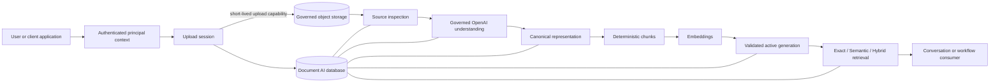

The service is best understood as a **document evidence factory**:

- raw bytes enter through a governed upload boundary;
- every durable stage is tied to tenant, owner, document and version identity;
- provider output is **not** treated as the platform truth;
- canonical content is deterministically assembled and validated;
- retrieval chunks are projections, not canonical evidence;
- only a complete validated representation with matching active vectors can become active;
- retrieval exposes grounded candidates to downstream consumers rather than pretending to be the final conversational reasoning layer.

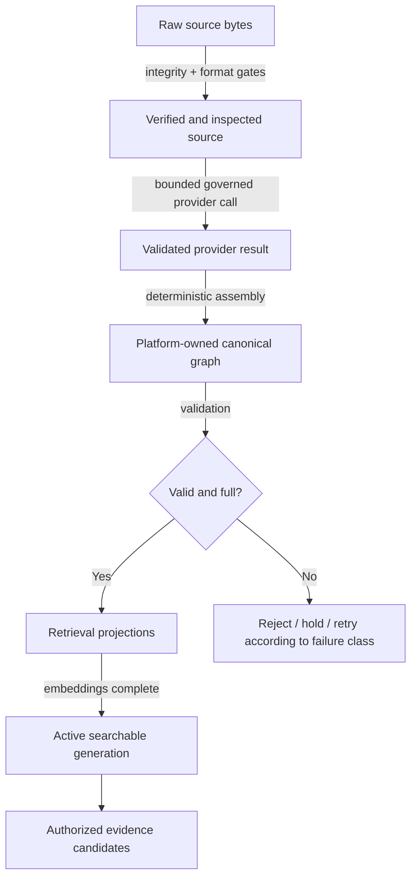

---

# 2. Role in the wider system

## 2.1 System context


### The architectural role

Document AI is the subsystem that answers the platform-level question:

> **“How do we turn an uploaded document into durable, authorized, traceable, searchable evidence without allowing storage, provider, retry, or versioning details to leak into downstream business logic?”**

It does this by owning the entire chain from upload authorization to evidence retrieval.

## 2.2 What downstream consumers should see

```mermaid
flowchart LR
    DOWN[Downstream conversation / workflow]

    subgraph PublicContract[What downstream code should depend on]
        DOC[Logical document identity]
        VER[Resolved active or bound version]
        BIND[Conversation / turn / workflow binding]
        EV[Evidence candidate]
        LIN[Source lineage + location]
        TRACE[Correlation / trace identity]
    end

    subgraph Hidden[Implementation details hidden behind Document AI]
        K[Object storage keys]
        P[Provider-shaped response]
        VEC[Raw embedding vectors]
        LEASE[Worker fencing token]
        OUT[Outbox internals]
        RETRY[Retry bookkeeping]
    end

    DOWN --> PublicContract
    PublicContract -. intentionally abstracts .-> Hidden
```

Downstream code should not need to know where an object is stored, how an OpenAI response was shaped, which attempt produced it, or which embedding vector was used. It should reason over **documents, versions, bindings, canonical lineage and evidence**.

---

# 3. Responsibilities and boundaries

## 3.1 Capability map

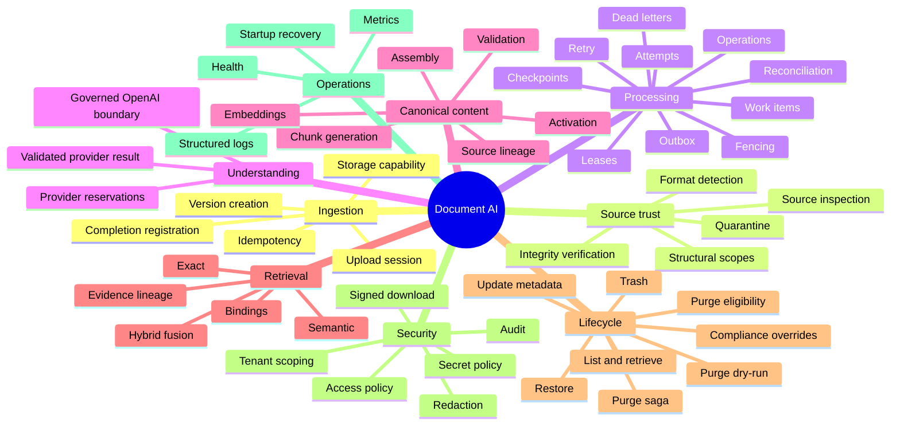

## 3.2 Owns / collaborates / does not own

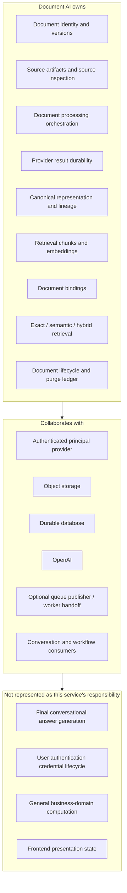

A particularly important boundary is retrieval: the hybrid endpoint returns fused candidates **without adjudicating evidence**. That keeps document evidence production separate from final application reasoning.

---

# 4. End-to-end document journey

## 4.1 Complete happy path

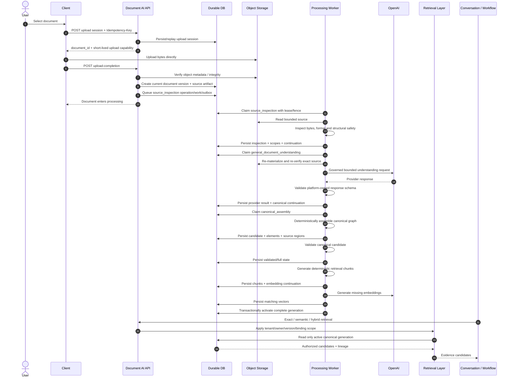

## 4.2 Pipeline with trust gates

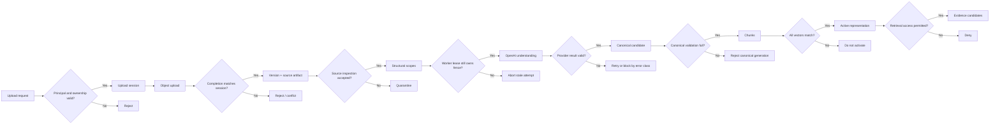

## 4.3 Data lineage through the journey

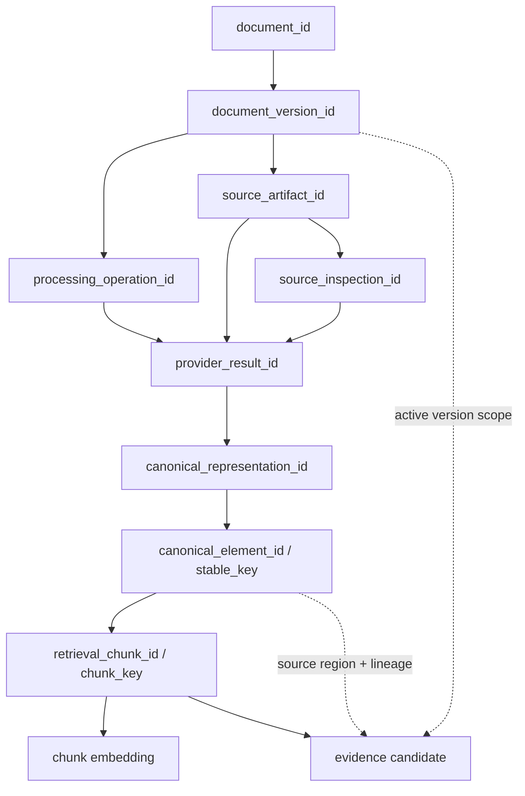

This identity chain is the basis for reproducibility and provenance. A retrieval candidate can be traced backward from chunk to canonical elements and ultimately to the exact document version and source artifact that produced it.

---

# 5. Internal architecture

## 5.1 Layered view

```mermaid
flowchart TB
    subgraph HTTP[HTTP / FastAPI boundary]
        MW[CorrelationIdMiddleware]
        AUTH[Principal resolution]
        ROUTES[Document, binding, retrieval, lifecycle routes]
        ERR[Deterministic HTTP error envelopes]
    end

    subgraph Domain[Domain and policy layer]
        ACCESS[Document access policy]
        LIFE[Lifecycle policy]
        INSPECT[Source inspection policy]
        GOV[Governed OpenAI policy]
        CVAL[Canonical validation]
        EVC[Evidence conflict / requirement policies]
        SEC[Security controls]
    end

    subgraph Durable[Durable orchestration]
        OPS[Processing operations]
        WORK[Work discovery and workers]
        LEASE[Attempts, leases, fencing, checkpoints]
        OUT[Transactional outbox]
        REC[State reconciler]
        PURGE[Purge saga]
    end

    subgraph Data[Canonical data and retrieval]
        REG[Document registry and versioning]
        CAN[Canonical representations]
        CH[Retrieval chunks]
        EMB[Embeddings]
        EXACT[Exact retrieval]
        SEM[Semantic retrieval]
        HYB[Hybrid retrieval]
        BIND[Document bindings]
    end

    subgraph Infra[Infrastructure adapters]
        PG[(Persistent database)]
        OBJ[(R2 / S3 storage)]
        OA[OpenAI clients]
        PUB[Optional outbox publisher]
        MET[Metrics / logs / audit]
    end

    HTTP --> Domain
    Domain --> Durable
    Durable --> Data
    Data --> Infra
    Durable --> Infra
    HTTP --> Infra
```

## 5.2 Data plane vs control plane

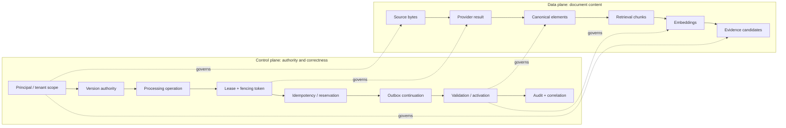

The design deliberately separates **content** from **authority**. A blob, model output, chunk or vector is not trusted merely because it exists; the control plane determines whether it is current, valid, complete and authorized.

---

# 6. Upload and source trust

## 6.1 Upload-session protocol

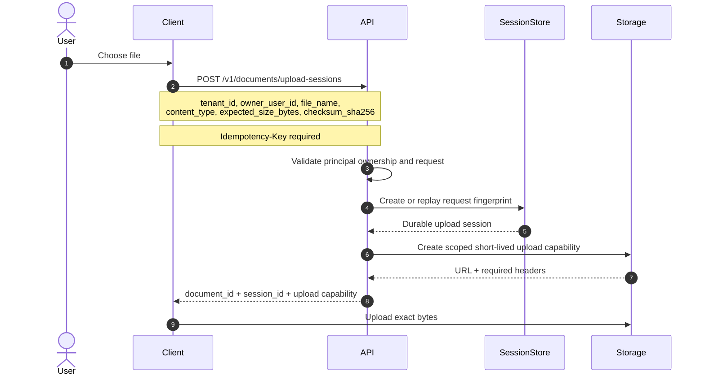

## 6.2 Upload completion and durable registration

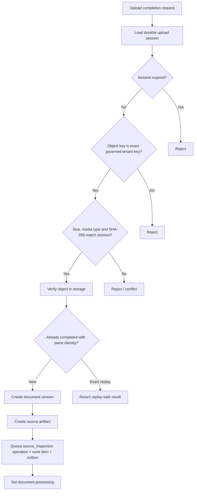

## 6.3 Source inspection decision tree

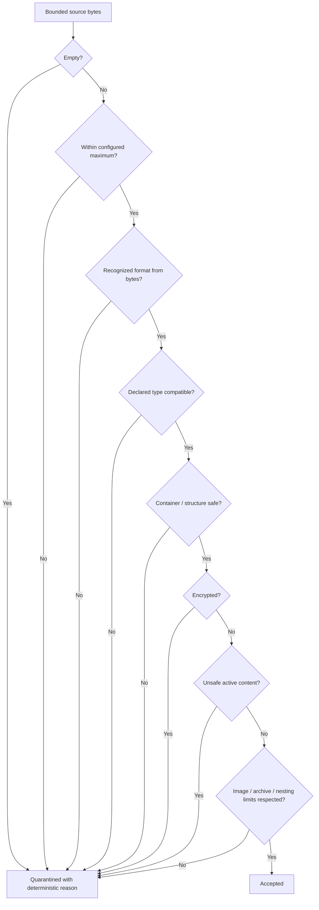

Source inspection reason codes in the supplied implementation include:

- `accepted`
- `source_empty`
- `source_too_large`
- `unsupported_format`
- `declared_media_type_mismatch`
- `malformed_document`
- `encrypted_document`
- `unsafe_active_content`
- `archive_not_permitted`
- `invalid_office_container`
- `image_dimensions_too_large`
- `structured_text_too_deep`

## 6.4 Structural scope handoff

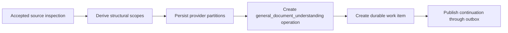

The inspection stage is therefore a **processing gate**: semantically expensive provider work is only scheduled after the exact current source has passed deterministic source checks.

---

# 7. Durable processing engine

## 7.1 Durable work model

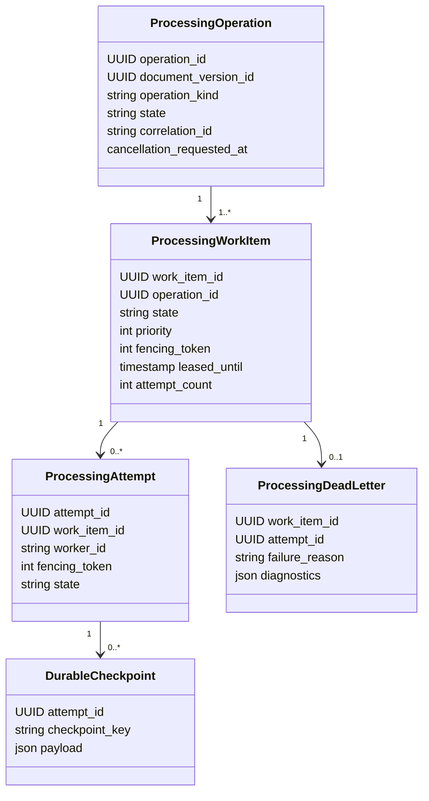

## 7.2 Claim, lease and fencing

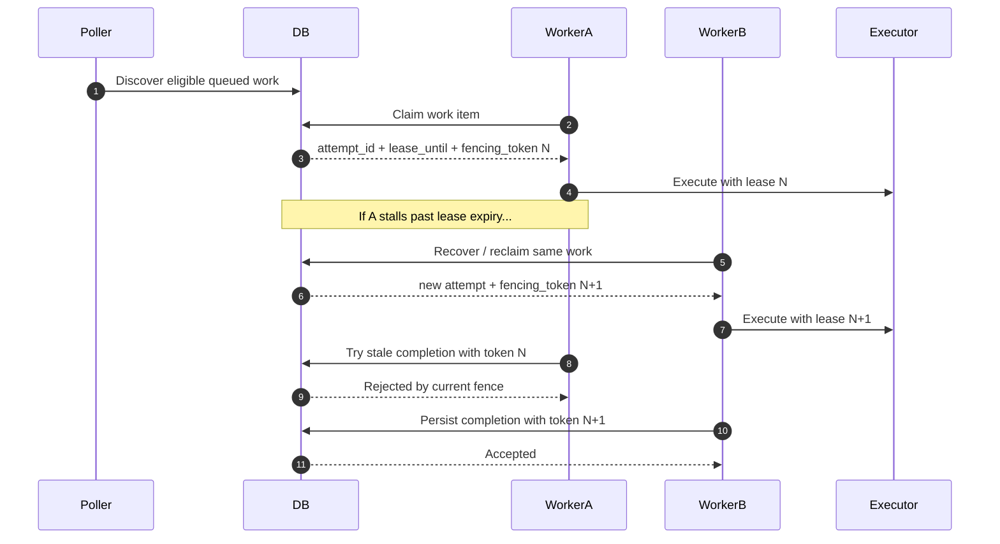

Fencing prevents a timed-out worker from becoming authoritative after a newer worker has legitimately reclaimed the work.

## 7.3 Processing continuation pattern

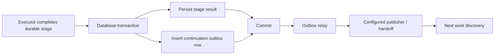

The critical property is that **stage state and continuation intent are committed together**. A process crash after commit cannot erase the fact that the next step must occur.

## 7.4 Outbox delivery model

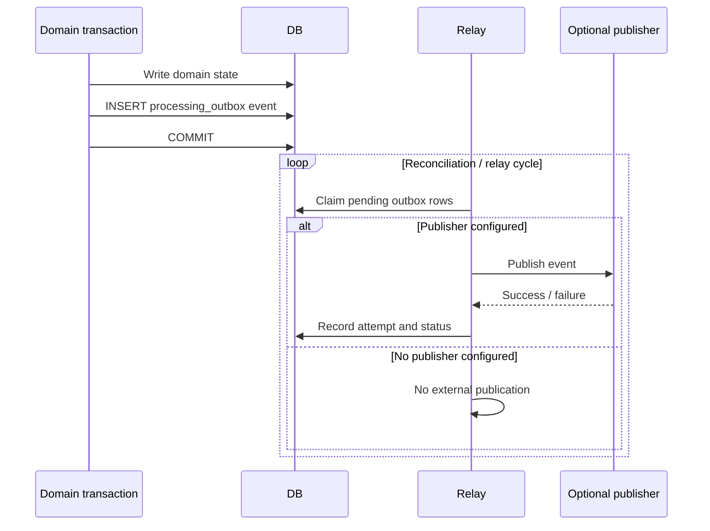

The source supports an optional processing publisher / handoff. The service therefore keeps the durable orchestration contract inside the database while allowing runtime-specific worker integration.

## 7.5 Retry and terminal handling

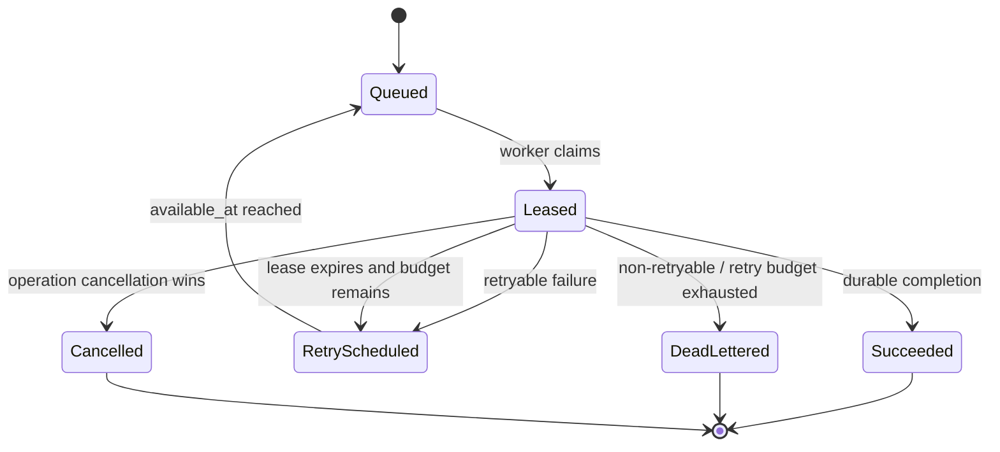

Default runtime controls found in the service source include a processing maximum of **3 attempts**, a **900-second** maximum retry elapsed window, **60-second** default worker leases, bounded work discovery and configurable polling/backoff intervals.

---

# 8. Governed OpenAI understanding

## 8.1 Provider boundary

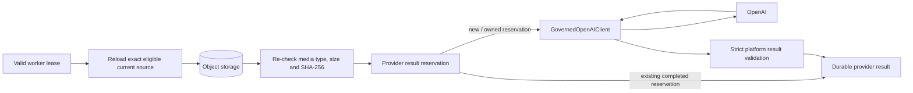

## 8.2 Why the provider boundary is intentionally narrow

```mermaid
flowchart TD
    CALLER[Processing caller]
    BOUND[Governed OpenAI boundary]

    subgraph FixedByService[Governed by service code]
        MODEL[Approved model]
        POLICY[Processing policy version]
        PROMPT[Prompt contract]
        SCHEMA[Validated result schema]
        TIME[Timeout policy]
        SIZE[Bounded source size]
    end

    subgraph ForbiddenLeakage[Not a caller-owned contract]
        OPT[Arbitrary provider options]
        RAW[Raw provider-shaped result as platform truth]
        TYPE[Document-type-specific public prompt contract]
    end

    CALLER --> BOUND --> FixedByService
    ForbiddenLeakage -. blocked by boundary .-> BOUND
```

The source describes this module as the **sole governed OpenAI boundary for Document AI processing**. The current approved defaults in the supplied code are:

| Concern | Source-defined value |
|---|---:|
| Understanding model | `gpt-4.1-mini` |
| Embedding model | `text-embedding-3-small` |
| OpenAI timeout | `60` seconds |
| Provider processing policy | versioned (`v1`) |
| Canonical schema | versioned (`v1`) |
| Max source passed to understanding stage | `8 MiB` |

These are configuration-validated choices, not free-form per-request settings.

## 8.3 Provider result replay protection

```mermaid
flowchart TD
    W[Worker starts understanding]
    EXIST{Durable result already exists?}
    RES{Reservation available?}
    OWN[Own reservation]
    CALL[External provider call]
    SAVE[Persist result]
    REPLAY[Return existing provider-result reference]
    WAIT[Retry / reconcile reservation]

    W --> EXIST
    EXIST -- Yes --> REPLAY
    EXIST -- No --> RES
    RES -- Completed elsewhere --> REPLAY
    RES -- Owned --> OWN --> CALL --> SAVE
    RES -- In progress elsewhere --> WAIT
```

This is especially important around uncertain external calls: the implementation checks for durable provider results and uses reservations so retries do not blindly multiply provider work.

---

# 9. Canonicalization, validation, chunking, embeddings and activation

This is the heart of the service: provider output becomes durable platform-owned evidence only through deterministic stages.

## 9.1 Canonicalization pipeline

```mermaid
flowchart LR
    PR[Validated provider result]
    ASM[Deterministic canonical assembly]
    CAND[Canonical candidate]
    VAL[Canonical validation v1]
    FULL{State validated and readiness full?}
    CH[Chunking policy v2]
    EMB[Embedding generation v1]
    READY{Every expected chunk has matching active vector?}
    ACT[Transactional activation]
    OLD[Previous active generation]

    PR --> ASM --> CAND --> VAL --> FULL
    FULL -- No --> REJ[Rejected / unavailable for activation]
    FULL -- Yes --> CH --> EMB --> READY
    READY -- No --> HOLD[Do not activate]
    READY -- Yes --> ACT
    OLD -. superseded atomically .-> ACT
```

## 9.2 Canonical element model

```mermaid
classDiagram
    class CanonicalGraph {
      string schema_version
      string assembly_policy_version
      string content_hash
      json source_lineage
      CanonicalElement[] elements
    }

    class CanonicalElement {
      string stable_key
      string element_type
      int page_number
      int reading_order
      json observed_value
      json normalized_value
      json uncertainty
      json source_region
      json lineage
    }

    class SourceRegion {
      int page_number
      json bounding_box
      int start_offset
      int end_offset
    }

    CanonicalGraph "1" *-- "1..*" CanonicalElement
    CanonicalElement "1" --> "1" SourceRegion
```

The canonical element design preserves both **what was observed** and **what the platform normalized**, together with uncertainty and source location. That is a stronger provenance model than flattening everything into untraceable text.

## 9.3 Canonical type normalization

```mermaid
flowchart LR
    subgraph ProviderObservationKinds[Provider observation kinds]
        FORM[form]
        HAND[handwriting]
        AMT[amount]
        H[heading]
        P[paragraph]
        T[table]
        IMG[image]
        DATE[date]
        ID[identifier]
        REL[relationship]
    end

    subgraph CanonicalTypes[Platform canonical types]
        FF[form_field]
        HN[handwritten_note]
        MONEY[money]
        CH[heading]
        CP[paragraph]
        CT[table]
        CI[image]
        CD[date]
        CID[identifier]
        CR[relationship]
    end

    FORM --> FF
    HAND --> HN
    AMT --> MONEY
    H --> CH
    P --> CP
    T --> CT
    IMG --> CI
    DATE --> CD
    ID --> CID
    REL --> CR
```

The full mapping also covers list items, sections, lists, charts, captions, headers, footers, footnotes, annotations and unknown observations.

## 9.4 Deterministic identity and hash chain

```mermaid
flowchart TD
    INPUT[source_artifact_id + provider_result_id + page + observation_id]
    KEY[SHA-256 stable_key]
    ELEM[Canonical element]
    ORDER[Canonical ordered element set]
    HASH[Canonical content hash]
    REPLAY[Deterministic replay comparison]

    INPUT --> KEY --> ELEM --> ORDER --> HASH --> REPLAY
```

Text normalization is deterministic (Unicode normalization, line-ending normalization, control-character removal and whitespace policy), which makes retries comparable rather than merely “similar.”

## 9.5 Canonical validation gate

```mermaid
flowchart TD
    C[Canonical candidate]
    SCHEMA{Expected schema / policy?}
    LINE{Required source lineage present?}
    STRUCT{Pages / elements structurally valid?}
    REL{Relationships and references valid?}
    REPORT[Validation report]
    PASS[validated + readiness full]
    FAIL[rejected / not full]

    C --> SCHEMA
    SCHEMA -- No --> FAIL
    SCHEMA -- Yes --> LINE
    LINE -- No --> FAIL
    LINE -- Yes --> STRUCT
    STRUCT -- No --> FAIL
    STRUCT -- Yes --> REL
    REL -- No --> FAIL
    REL -- Yes --> REPORT --> PASS
```

## 9.6 Deterministic chunk generation

```mermaid
flowchart LR
    E[Ordered canonical elements]
    HEAD[Track heading / structural context]
    GROUP[Group compatible content]
    BOUND{3500 chars or 32 elements reached?}
    FINAL[Finalize bounded chunk]
    HASH[Chunk content hash + deterministic key]
    META[Attach canonical element keys, source location and lineage]
    OUT[Persist retrieval chunk]

    E --> HEAD --> GROUP --> BOUND
    BOUND -- No --> GROUP
    BOUND -- Yes --> FINAL --> HASH --> META --> OUT
```

Important invariant: a `RetrievalChunk` is a **traceable retrieval unit; it is never canonical evidence itself**. Canonical elements remain the authority.

## 9.7 Embedding generation

```mermaid
sequenceDiagram
    autonumber
    participant Repo as CanonicalEmbeddingRepository
    participant DB
    participant OAI as OpenAI embeddings

    Repo->>DB: Load fenced generation plan
    DB-->>Repo: Expected active chunks + current embedding status
    alt No missing chunks
        Repo-->>Repo: Return replayed result
    else Missing chunks exist
        Repo->>OAI: Embed missing chunk texts in bounded batches
        OAI-->>Repo: Vectors
        Repo->>Repo: Validate vector count/dimensions
        Repo->>DB: Persist vectors transactionally with identity checks
        DB-->>Repo: Durable generation result
    end
```

Embedding requests are made outside the database transaction; persistence then re-checks generation identity. Provider timeout/connection errors are classified as retryable, and HTTP `429` / `5xx` responses are retryable according to the source implementation.

## 9.8 Activation safety gate

```mermaid
flowchart TD
    START[Candidate activation request]
    CURRENT{Document version is current and active version pointer matches?}
    LIFE{Document lifecycle permits activation?}
    VALID{Canonical state validated/full and validation report clean?}
    REBUILD[Rebuild expected chunks deterministically]
    SAME{Persisted chunks exactly match expected chunks?}
    VECTOR{Every chunk has active matching embedding<br/>for hash + policy + model + version + dimensions?}
    PREV{Previous active representation exists?}
    SUPER[Mark previous representation superseded]
    ACTIVE[Mark candidate active]
    REPLAY[Already active: replay-safe result]
    STOP[Reject activation]

    START --> CURRENT
    CURRENT -- No --> STOP
    CURRENT -- Yes --> LIFE
    LIFE -- No --> STOP
    LIFE -- Yes --> VALID
    VALID -- No --> STOP
    VALID -- Yes --> REBUILD --> SAME
    SAME -- No --> STOP
    SAME -- Yes --> VECTOR
    VECTOR -- No --> STOP
    VECTOR -- Yes --> PREV
    PREV -- Same candidate --> REPLAY
    PREV -- Other generation --> SUPER --> ACTIVE
    PREV -- None --> ACTIVE
```

This gate prevents “half-indexed” generations from becoming searchable authority.

---

# 10. Retrieval and evidence delivery

## 10.1 Retrieval architecture

```mermaid
flowchart TB
    REQ[Authorized retrieval request]
    SCOPE[Resolve tenant + owner + optional document/version/binding scope]

    subgraph Branches[Retrieval branches]
        EXACT[Exact lexical / structural retrieval]
        SEM[Semantic vector retrieval]
    end

    HYB[Hybrid reciprocal-rank fusion]
    ACTIVE[Only current active canonical representations and active chunks]
    EVID[Candidates with document/version/chunk IDs,<br/>source lineage, source location and method provenance]

    REQ --> SCOPE
    SCOPE --> EXACT
    SCOPE --> SEM
    EXACT --> HYB
    SEM --> HYB
    ACTIVE --> EXACT
    ACTIVE --> SEM
    HYB --> EVID
```

## 10.2 Exact retrieval

```mermaid
flowchart LR
    R[ExactRetrievalRequest]
    D[document_ids / document_version_id]
    B[conversation_id + turn_id]
    F[filename / display_name]
    C[identifier / amount / date / full_text]
    T[element types / page / sheet / table / cell]
    SQL[Authorized deterministic query]
    OUT[Ranked exact candidates]

    R --> D
    R --> B
    R --> F
    R --> C
    R --> T
    D --> SQL
    B --> SQL
    F --> SQL
    C --> SQL
    T --> SQL
    SQL --> OUT
```

An exact request must contain at least one retrieval constraint. Limits are bounded to at most 100 candidates.

## 10.3 Semantic retrieval

```mermaid
sequenceDiagram
    autonumber
    participant Consumer
    participant API
    participant Embed as Governed embedding client
    participant DB

    Consumer->>API: Semantic query + optional scope/filter controls
    API->>API: Normalize and authorize query
    API->>Embed: Embed query text
    Embed-->>API: Query vector
    API->>DB: Search matching active chunk embeddings<br/>within authorized current documents
    DB-->>API: Ranked semantic candidates
    API-->>Consumer: Candidate lineage + semantic score/distance
```

## 10.4 Hybrid fusion

```mermaid
flowchart LR
    Q[Hybrid request]
    E[Exact branch candidate pool]
    S[Semantic branch candidate pool]
    RRF[Reciprocal-rank fusion<br/>k = 60]
    PROV[Preserve exact/semantic method provenance]
    F[Deterministic fused rank + score]

    Q --> E --> RRF
    Q --> S --> RRF
    RRF --> PROV --> F
```

The source uses a branch-pool multiplier of `2`, a hybrid maximum of `100`, and reciprocal-rank-fusion constant `60.0`.

## 10.5 Conversation and workflow bindings

```mermaid
flowchart TB
    DOC[Logical document]
    VER[Optional exact document version]

    subgraph BindingRoles[Binding roles]
        CA[conversation_attachment]
        CTA[current_turn_attachment]
        LIB[existing_library_document]
        WF[workflow_reference]
    end

    CONV[conversation_id]
    TURN[turn_id + attachment_order]
    WORK[workflow_id]

    DOC --> CA --> CONV
    DOC --> CTA --> TURN
    DOC --> LIB --> TURN
    DOC --> WF --> WORK
    VER -. optional version pin .-> BindingRoles
```

Bindings deliberately do **not** expose storage-provider locators. They connect application context to logical documents or exact versions.

## 10.6 Evidence provenance model

```mermaid
flowchart RL
    ANSWER[Downstream decision / answer]
    CAND[Retrieved candidate]
    CHUNK[Retrieval chunk]
    ELEM[Canonical element]
    REGION[Source region]
    RESULT[Provider result]
    ART[Source artifact]
    VER[Document version]
    DOC[Logical document]

    ANSWER -. consumes .-> CAND
    CAND --> CHUNK --> ELEM --> REGION
    ELEM --> RESULT
    RESULT --> ART --> VER --> DOC
```

This direction matters: downstream reasoning can explain **where evidence came from** instead of treating an embedding hit as opaque truth.

---

# 11. Persistence model

The service source uses a durable relational model for authority, orchestration and retrieval, with object storage holding source bytes.

## 11.1 Core document and ingestion ER model

```mermaid
erDiagram
    DOCUMENTS ||--o{ DOCUMENT_VERSIONS : has
    DOCUMENT_VERSIONS ||--o{ SOURCE_ARTIFACTS : owns
    DOCUMENT_VERSIONS ||--o{ SOURCE_INSPECTIONS : inspected_as
    SOURCE_INSPECTIONS ||--o{ STRUCTURAL_SCOPES : produces
    SOURCE_INSPECTIONS ||--o{ PROVIDER_PARTITIONS : partitions
    DOCUMENTS ||--o{ DOCUMENT_BINDINGS : bound_to
    UPLOAD_SESSIONS }o--|| DOCUMENTS : reserves

    DOCUMENTS {
      uuid document_id PK
      string tenant_id
      uuid owner_user_id
      uuid active_document_version_id
      string state
      string display_name
    }
    DOCUMENT_VERSIONS {
      uuid document_version_id PK
      uuid document_id FK
      string version_state
    }
    SOURCE_ARTIFACTS {
      uuid source_artifact_id PK
      uuid document_version_id FK
      string storage_key
      string checksum_sha256
      string integrity_state
      string retention_state
    }
    SOURCE_INSPECTIONS {
      uuid source_inspection_id PK
      uuid document_version_id FK
      string disposition
      string policy_version
    }
    DOCUMENT_BINDINGS {
      uuid document_binding_id PK
      uuid document_id FK
      uuid document_version_id
      string binding_role
      string conversation_id
      string turn_id
      string workflow_id
    }
```

## 11.2 Processing ER model

```mermaid
erDiagram
    DOCUMENT_VERSIONS ||--o{ PROCESSING_OPERATIONS : schedules
    PROCESSING_OPERATIONS ||--o{ PROCESSING_WORK_ITEMS : materializes
    PROCESSING_WORK_ITEMS ||--o{ PROCESSING_ATTEMPTS : attempted_by
    PROCESSING_ATTEMPTS ||--o{ PROCESSING_CHECKPOINTS : checkpoints
    PROCESSING_WORK_ITEMS ||--o| PROCESSING_DEAD_LETTERS : may_end_in
    PROCESSING_OPERATIONS ||--o{ PROCESSING_OUTBOX : continues_with
    PROCESSING_OUTBOX ||--o{ PROCESSING_OUTBOX_ATTEMPTS : delivery_attempts

    PROCESSING_OPERATIONS {
      uuid processing_operation_id PK
      uuid document_version_id FK
      string operation_kind
      string state
      string correlation_id
    }
    PROCESSING_WORK_ITEMS {
      uuid processing_work_item_id PK
      uuid processing_operation_id FK
      string state
      int priority
      int fencing_token
      timestamp leased_until
    }
    PROCESSING_ATTEMPTS {
      uuid processing_attempt_id PK
      uuid processing_work_item_id FK
      string worker_id
      int fencing_token
      string state
    }
    PROCESSING_OUTBOX {
      uuid outbox_id PK
      uuid processing_operation_id FK
      string event_type
      json payload
      string routing_key
    }
```

## 11.3 Canonical and retrieval ER model

```mermaid
erDiagram
    DOCUMENT_VERSIONS ||--o{ PROVIDER_RESULTS : understood_as
    PROVIDER_RESULTS ||--o{ CANONICAL_REPRESENTATIONS : assembled_into
    CANONICAL_REPRESENTATIONS ||--o{ CANONICAL_ELEMENTS : contains
    CANONICAL_ELEMENTS ||--o{ SOURCE_REGIONS : traced_to
    CANONICAL_REPRESENTATIONS ||--o{ RETRIEVAL_CHUNKS : projected_into
    RETRIEVAL_CHUNKS ||--o| CHUNK_EMBEDDINGS : vectorized_as

    PROVIDER_RESULTS {
      uuid provider_result_id PK
      uuid document_version_id FK
      uuid source_artifact_id FK
      json validated_result
    }
    CANONICAL_REPRESENTATIONS {
      uuid canonical_representation_id PK
      uuid document_version_id FK
      string state
      string readiness_state
      bool is_active
      string content_hash_sha256
      string canonical_validation_version
    }
    CANONICAL_ELEMENTS {
      uuid canonical_element_id PK
      uuid canonical_representation_id FK
      string stable_key
      string element_type
      int page_number
      int reading_order
    }
    RETRIEVAL_CHUNKS {
      uuid retrieval_chunk_id PK
      uuid canonical_representation_id FK
      string chunk_key
      string content_hash_sha256
      string chunking_policy_version
      string lifecycle_state
    }
    CHUNK_EMBEDDINGS {
      uuid retrieval_chunk_id FK
      string embedding_model
      string embedding_version
      int embedding_dimensions
      string index_state
    }
```

## 11.4 Storage / database split

```mermaid
flowchart LR
    subgraph ObjectStorage[Object storage]
        ORIG[Original source object]
        DER[Derived / temporary artifacts where applicable]
    end

    subgraph Database[Durable database = authority ledger]
        META[Document metadata and versions]
        INT[Integrity + source inspection]
        PROC[Processing operations / work / attempts / outbox]
        RES[Provider results]
        CAN[Canonical content and lineage]
        IDX[Chunks + embedding metadata/vector state]
        LIFE[Lifecycle / compliance / purge ledger]
        AUD[Audit evidence]
    end

    ORIG --> INT
    INT --> META
    META --> PROC --> RES --> CAN --> IDX
    LIFE --> ObjectStorage
    LIFE --> Database
```

The object store is where bytes live; the database is the durable authority for **which bytes, which version, which processing generation and which lifecycle state are trusted**.

---

# 12. State machines

## 12.1 Document lifecycle

```mermaid
stateDiagram-v2
    [*] --> uploaded
    uploaded --> processing
    uploaded --> eligible_for_purge
    uploaded --> trashed
    uploaded --> purge_pending

    processing --> validated
    processing --> eligible_for_purge
    processing --> trashed
    processing --> purge_pending

    validated --> eligible_for_purge
    validated --> trashed
    validated --> purge_pending

    active --> trashed
    active --> purge_pending

    trashed --> active
    trashed --> purge_pending

    eligible_for_purge --> processing
    eligible_for_purge --> purged

    purge_pending --> [*]
    purged --> [*]
```

The source models lifecycle transitions deterministically. Compliance locks and approved overrides further constrain action-level behavior.

## 12.2 Canonical representation authority

```mermaid
stateDiagram-v2
    [*] --> candidate: deterministic assembly
    candidate --> validated: validation passes
    candidate --> rejected: validation fails
    validated --> active: chunks + vectors complete and activation passes
    active --> superseded: newer active generation wins
    active --> active: replay-safe activation
    rejected --> [*]
    superseded --> [*]
```

## 12.3 Processing operation lifecycle

```mermaid
stateDiagram-v2
    [*] --> queued
    queued --> running: work starts
    running --> succeeded: durable result committed
    running --> failed: terminal failure
    queued --> cancelled: cancellation
    running --> cancelled: cancellation
    succeeded --> [*]
    failed --> [*]
    cancelled --> [*]
```

## 12.4 Purge target lifecycle

```mermaid
stateDiagram-v2
    [*] --> pending
    pending --> running
    running --> completed: delete + independent resolution verification
    running --> failed: provider / verification failure
    failed --> running: replay / recovery
    completed --> completed: idempotent replay
    completed --> [*]
```

---

# 13. Security and trust boundaries

## 13.1 Defense-in-depth view

```mermaid
flowchart TB
    REQ[Incoming request]
    P[Principal / allowed role]
    TEN[Tenant and owner scope]
    IDEM[Idempotency / exact request identity]
    CAP[Short-lived storage capability]
    KEY[Tenant-scoped object key]
    HASH[Size + media type + SHA-256 integrity]
    INS[Source inspection / quarantine]
    FENCE[Worker lease + fencing]
    GOV[Governed OpenAI boundary]
    CVAL[Canonical validation]
    VEC[Vector completeness gate]
    ACT[Active generation authority]
    RET[Retrieval access policy]
    AUD[Structured audit / redacted telemetry]

    REQ --> P --> TEN --> IDEM --> CAP --> KEY --> HASH --> INS --> FENCE --> GOV --> CVAL --> VEC --> ACT --> RET --> AUD
```

## 13.2 Trust boundaries

```mermaid
flowchart LR
    subgraph Untrusted[Untrusted / externally controlled]
        USER[Caller inputs]
        BYTES[Uploaded bytes]
        PROVIDER[External provider response]
    end

    subgraph Controlled[Governed service boundaries]
        AUTH[Access policy]
        INSPECT[Source inspection]
        SCHEMA[Provider schema validation]
        C14N[Deterministic canonicalization]
        VALID[Canonical validation]
    end

    subgraph TrustedAuthority[Durable authority]
        DB[(Scoped database state)]
        ACTIVE[Current active canonical generation]
    end

    USER --> AUTH --> DB
    BYTES --> INSPECT --> DB
    PROVIDER --> SCHEMA --> C14N --> VALID --> DB --> ACTIVE
```

## 13.3 Signed download capability

```mermaid
sequenceDiagram
    autonumber
    actor User
    participant API
    participant Access as Document access policy
    participant DB as Signed-access store
    participant Storage

    User->>API: Request download capability for document
    API->>Access: Evaluate owner/tenant/lifecycle action
    Access-->>API: Allow
    API->>API: Create signed short-lived claims
    API-->>User: Capability token + download URL
    User->>API: Validate/use capability
    API->>DB: Check token not already consumed
    API->>API: Verify signature, identity, action and expiry
    API->>DB: Mark capability consumed
    API->>Storage: Resolve authorized object access
```

The signed download capability TTL is **15 minutes** in the supplied source and capability consumption can be persisted to prevent reuse.

## 13.4 Secret and telemetry policy

```mermaid
flowchart TD
    SECRET[Secrets / credentials]
    ENV[Environment-sourced configuration]
    POLICY[Security controls]
    LOG[Structured log payload]
    REDACT[Recursive sensitive-field redaction]
    METRIC[Metric dimensions]
    SAFE[Allowed non-sensitive telemetry]

    SECRET --> ENV --> POLICY
    LOG --> REDACT --> SAFE
    METRIC -->|allow-list dimensions only| SAFE
    SECRET -. never literal config payload .-> POLICY
```

Sensitive metric dimensions such as tokens, signatures, authorization values, secrets, passwords, API keys and object keys are explicitly denied by the metrics policy.

---

# 14. Document lifecycle, compliance and purge

## 14.1 Lifecycle action overview

```mermaid
flowchart LR
    DOC[Document]
    TRASH[Trash]
    RESTORE[Restore]
    ELIG[Purge eligibility]
    DRY[Purge dry-run]
    PURGE[Purge]
    COMP[Compliance override workflow]

    DOC --> TRASH
    TRASH --> RESTORE
    DOC --> ELIG --> DRY --> PURGE
    COMP -. may authorize blocked lifecycle action .-> TRASH
    COMP -. may authorize blocked lifecycle action .-> PURGE
```

## 14.2 Compliance override workflow

```mermaid
sequenceDiagram
    autonumber
    actor Requester
    actor Approver
    participant API
    participant Store as Compliance override store
    participant Audit

    Requester->>API: Request compliance override
    API->>Store: Persist pending override
    API->>Audit: Record request evidence
    Approver->>API: Approve or reject override
    API->>Store: Transition override deterministically
    API->>Audit: Record decision evidence
    Note over API,Store: Lifecycle action may consult granted override<br/>when compliance lock would otherwise block it
```

## 14.3 Distributed purge saga

```mermaid
flowchart TD
    REQ[Purge requested]
    MAN[Create complete durable purge manifest]

    subgraph Targets[Required target classes]
        T1[Document state]
        T2[Versions]
        T3[R2 original]
        T4[R2 derived]
        T5[Canonical content]
        T6[Chunks]
        T7[Vectors]
        T8[Evidence]
        T9[Projections]
        T10[Caches]
        T11[Provider files]
        T12[Temporary artifacts]
        T13[Migration copies]
    end

    RUN[Execute unresolved targets]
    VERIFY[Independently verify each target resolved]
    ALL{All targets completed?}
    DONE[Mark purge operation completed / document purged]
    RETRY[Keep failed target durable and replayable]

    REQ --> MAN --> Targets --> RUN --> VERIFY --> ALL
    ALL -- Yes --> DONE
    ALL -- No --> RETRY --> RUN
```

The purge design makes the **database the purge ledger**. A document is not considered fully purged merely because one provider returned success.

---

# 15. Reliability, replay and recovery

## 15.1 Replay model by stage

```mermaid
flowchart TB
    RETRY[Retry / process restart / ambiguous commit]

    subgraph ReplayGuards[Replay guards]
        U[Upload: idempotency request fingerprint]
        P[Provider: durable result + reservation]
        C[Canonical: deterministic content hash]
        CH[Chunks: deterministic generation comparison]
        E[Embeddings: detect existing current vectors]
        A[Activation: active-state replay]
        O[Outbox: durable event identity / attempts]
        G[Purge: durable manifest + verified absence]
    end

    RETRY --> ReplayGuards
```

## 15.2 Ambiguous database transaction handling

```mermaid
flowchart TD
    TX[Begin database transaction]
    WORK[Execute deterministic callback]
    COMMIT[Commit]
    OK{Commit outcome known?}
    RETRYABLE{Retryable database error?}
    RECON[Reconcile durable result from database]
    FOUND{Result already committed?}
    BACK[Bounded backoff]
    DONE[Return durable result]
    FAIL[Raise failure]

    TX --> WORK --> COMMIT --> OK
    OK -- Yes --> DONE
    OK -- No --> RECON --> FOUND
    FOUND -- Yes --> DONE
    FOUND -- No --> RETRYABLE
    RETRYABLE -- Yes --> BACK --> TX
    RETRYABLE -- No --> FAIL
```

The database transaction helper uses bounded retry controls and per-operation reconciliation callbacks so an uncertain client-side commit does not automatically become a duplicate domain action.

## 15.3 Startup recovery

```mermaid
flowchart LR
    START[FastAPI startup]
    SCHEMA{Persistent schema ready?}
    REC1[Reconcile processing state]
    REC2[Recover expired leases]
    REC3[Recover pending purge operations]
    REC4[Recover stale outbox claims]
    SCHED[Start bounded periodic reconciliation]
    READY[Serve ready]

    START --> SCHEMA
    SCHEMA -- No --> STOP[Fail startup / health not ready]
    SCHEMA -- Yes --> REC1 --> REC2 --> REC3 --> REC4 --> SCHED --> READY
```

## 15.4 Periodic self-healing

```mermaid
flowchart TD
    T[Periodic scheduler]
    O[Outbox reconciliation]
    P[Processing-state reconciliation]
    EX[Expired lease recovery]
    MISS[Repair missing continuation rows]
    RET[Retry scheduling]
    DL[Dead-letter terminal work]

    T --> O
    T --> P
    P --> EX
    P --> MISS
    P --> RET
    P --> DL
```

The source configures scheduled reconciliation on a bounded cadence rather than relying on a perfect message-delivery world.

---

# 16. Observability

## 16.1 Traceability model

```mermaid
flowchart LR
    HTTP[Incoming HTTP request]
    CORR[correlation_id]
    TRACE[trace_id]
    LOG[Structured logs]
    AUD[Lifecycle / compliance audit evidence]
    MET[Metrics]
    OP[Processing operation]
    OUT[Outbox event]

    HTTP --> CORR --> TRACE
    CORR --> LOG
    TRACE --> LOG
    CORR --> OP --> OUT
    TRACE --> AUD
    HTTP --> MET
```

## 16.2 Metrics exposed by the service code

```mermaid
flowchart TB
    M[Document AI metrics]
    M --> M1[document_ingestion_requests_total]
    M --> M2[document_ingestion_failures_total]
    M --> M3[document_outbox_publications_total]
    M --> M4[document_outbox_publication_failures_total]
    M --> M5[document_processing_retries_total]
    M --> M6[document_processing_dead_letters_total]

    D[Allowed dimensions]
    D --> D1[action]
    D --> D2[status]
    D --> D3[reason_code]
    D --> D4[lane_scope]
```

## 16.3 Operational signal flow

```mermaid
flowchart LR
    API[API action]
    PROC[Worker action]
    LIFE[Lifecycle action]
    MET[Metrics emitter]
    LOG[Structured logger]
    AUD[Persistent/in-memory audit backend]

    API --> MET
    API --> LOG
    PROC --> MET
    PROC --> LOG
    LIFE --> LOG
    LIFE --> AUD
```

The service’s observability model is intentionally correlation-oriented and redaction-aware.

---

# 17. API surface

## 17.1 Route map


## 17.2 Development-only storage routes


Production uploads use storage-provider capabilities; the direct local upload endpoint intentionally refuses production use.

## 17.3 API purpose summary

| API family | Purpose |
|---|---|
| Health | Report runtime/persistence readiness |
| Upload sessions | Create replay-safe upload authorization and logical `document_id` |
| Upload completion | Verify completed object, create durable version/artifact, start processing |
| Document registry | List, retrieve and update logical document metadata |
| Bindings | Attach documents/versions to conversation, turn or workflow context |
| Exact retrieval | Retrieve authorized lexical/structural candidates |
| Semantic retrieval | Retrieve authorized vector-similarity candidates |
| Hybrid retrieval | Fuse exact and semantic branches while retaining provenance |
| Download capabilities | Issue and validate short-lived signed download authorization |
| Lifecycle | Trash, restore, evaluate purge eligibility, dry-run and execute purge |
| Compliance overrides | Request and decide governed lifecycle override actions |

---

# 18. Configuration

## 18.1 Configuration dependency map

```mermaid
flowchart TB
    ENV[Environment]

    ENV --> RUN[Runtime mode]
    RUN --> MODE[DOCUMENT_AI_RUNTIME_MODE]
    RUN --> PMODE[DOCUMENT_AI_PERSISTENCE_MODE]

    ENV --> DB[Database]
    DB --> URL[DATABASE_URL]
    DB --> CREDS[DB_USER / DB_PASSWORD / DB_NAME]
    DB --> POOL[Pool and transaction retry controls]

    ENV --> STORE[Object storage]
    STORE --> PROVIDER[DOCUMENT_AI_STORAGE_PROVIDER]
    PROVIDER --> R2[R2 endpoint / bucket / access keys]
    PROVIDER --> S3[S3 bucket / region / SSE / KMS]

    ENV --> AI[OpenAI]
    AI --> KEY[OPENAI_API_KEY]
    AI --> MODEL[DOCUMENT_AI_OPENAI_MODEL]
    AI --> EMODEL[DOCUMENT_AI_OPENAI_EMBEDDING_MODEL]
    AI --> TIMEOUT[DOCUMENT_AI_OPENAI_TIMEOUT_SECONDS]

    ENV --> WORK[Worker / retry]
    WORK --> LEASE[Lease seconds]
    WORK --> ATT[Max attempts / retry elapsed]
    WORK --> POLL[Discovery + polling backoff]

    ENV --> SIGN[Capabilities / signing]
    SIGN --> DS[DOCUMENT_AI_SIGNED_DOWNLOAD_SECRET]
    SIGN --> SS[Storage signing-secret environment selector]
```

## 18.2 Core runtime and database variables

| Variable | Purpose | Source default / rule |
|---|---|---|
| `DOCUMENT_AI_RUNTIME_MODE` | `development`, `test`, or `production` | `development` |
| `DOCUMENT_AI_PERSISTENCE_MODE` | Persistent vs explicit non-production in-memory mode | `persistent` |
| `DATABASE_URL` | Primary durable DB URL | Required in persistent mode unless component DB credentials build it |
| `DB_USER` | DB credential component | Used when building DB URL |
| `DB_PASSWORD` | DB credential component | Used when building DB URL |
| `DB_NAME` | Database name | Source default `kodi_dev` |
| `DOCUMENT_AI_DB_POOL_MIN_SIZE` | DB pool minimum | Configurable |
| `DOCUMENT_AI_DB_POOL_MAX_SIZE` | DB pool maximum | Configurable |
| `DOCUMENT_AI_DATABASE_TRANSACTION_MAX_ATTEMPTS` | Transaction retry budget | `5` |
| `DOCUMENT_AI_DATABASE_TRANSACTION_BACKOFF_BASE_MS` | Retry base delay | `100` ms |
| `DOCUMENT_AI_DATABASE_TRANSACTION_BACKOFF_MAX_MS` | Retry max delay | `2000` ms |

Persistent mode refuses to start successfully if required schema tables are missing or mismatched.

## 18.3 OpenAI variables

| Variable | Purpose | Source default / rule |
|---|---|---|
| `OPENAI_API_KEY` | Governed provider authentication | Required when OpenAI processing/embedding is used |
| `DOCUMENT_AI_OPENAI_MODEL` | Understanding model | `gpt-4.1-mini` and validated against approved set |
| `DOCUMENT_AI_OPENAI_EMBEDDING_MODEL` | Embedding model | `text-embedding-3-small` and validated against approved set |
| `DOCUMENT_AI_OPENAI_TIMEOUT_SECONDS` | Provider timeout | `60` seconds |

## 18.4 Storage variables

| Variable | Purpose |
|---|---|
| `DOCUMENT_AI_STORAGE_PROVIDER` | Select `r2` or `s3` production storage adapter |
| `DOCUMENT_AI_R2_ENDPOINT` | R2 S3-compatible endpoint |
| `DOCUMENT_AI_R2_BUCKET` | R2 bucket |
| `DOCUMENT_AI_R2_ACCESS_KEY_ID` | R2 access key |
| `DOCUMENT_AI_R2_SECRET_ACCESS_KEY` | R2 secret key |
| `DOCUMENT_AI_S3_BUCKET` | S3 bucket |
| `DOCUMENT_AI_AWS_REGION` | AWS region override |
| `DOCUMENT_AI_S3_SERVER_SIDE_ENCRYPTION` | S3 server-side encryption policy |
| `DOCUMENT_AI_S3_KMS_KEY_ID` | Optional KMS key when configured |
| `DOCUMENT_AI_STORAGE_ENDPOINT_URL` | Capability/base storage endpoint override |
| `DOCUMENT_AI_STORAGE_ENCRYPTION_REQUIRED` | Enforce encryption-at-rest intent |
| `DOCUMENT_AI_STORAGE_SIGNING_SECRET_ENV_VAR` | Names the env variable used for storage signing secret |
| `DOCUMENT_AI_SIGNED_DOWNLOAD_SECRET` | Secret used by signed download capabilities |

## 18.5 Worker and retry variables

| Variable | Source default |
|---|---:|
| `DOCUMENT_AI_WORKER_LEASE_SECONDS` | `60` seconds |
| `DOCUMENT_AI_PROCESSING_MAX_ATTEMPTS` | `3` |
| `DOCUMENT_AI_PROCESSING_MAX_RETRY_ELAPSED_SECONDS` | `900` seconds |
| `DOCUMENT_AI_WORK_DISCOVERY_MAX_BATCH_SIZE` | `25` |
| `DOCUMENT_AI_WORKER_POLL_INTERVAL_SECONDS` | `5` seconds |
| `DOCUMENT_AI_WORKER_EMPTY_QUEUE_BACKOFF_SECONDS` | `5` seconds |
| `DOCUMENT_AI_WORKER_DISCOVERY_FAILURE_BACKOFF_SECONDS` | `15` seconds |

---

# 19. Supported source formats and hard limits

## 19.1 Format families

```mermaid
flowchart TB
    SRC[Supported source families]
    SRC --> PDF[PDF: .pdf]
    SRC --> TXT[Text / structured text]
    TXT --> T1[.txt / .md]
    TXT --> T2[.csv / .tsv]
    TXT --> T3[.json / .xml]
    SRC --> WORD[Word-processing]
    WORD --> W1[.docx / .odt / .rtf]
    SRC --> SHEET[Spreadsheets]
    SHEET --> S1[.xlsx / .ods]
    SRC --> PRES[Presentations]
    PRES --> P1[.pptx / .odp]
    SRC --> IMG[Images]
    IMG --> I1[.png / .jpg / .jpeg]
    IMG --> I2[.webp / .tif / .tiff]
```

The implementation detects source formats from bytes/container metadata rather than trusting the filename alone.

## 19.2 Important hard limits

```mermaid
flowchart LR
    L[Safety and processing limits]
    L --> U[Upload maximum: 200 MiB]
    L --> O[OpenAI understanding source: 8 MiB]
    L --> I[Image pixels: 40,000,000 max]
    L --> D[Structured depth: 64 max]
    L --> E[Container entries: 10,000 max]
    L --> Z[Container uncompressed bytes: 100 MiB max]
    L --> C[Chunk size: 3,500 chars max]
    L --> CE[Chunk elements: 32 max]
    L --> R[Retrieval results: 100 max]
```

These limits serve different purposes. The overall upload ceiling does **not** imply that every accepted source is sent wholesale to OpenAI; provider processing has a much tighter bounded-source policy.

---

# 20. Running the service

The supplied source exposes a module-level FastAPI application:

```python
app = create_app()
```

Therefore, once the repository dependencies and database migrations are installed/applied, an ASGI server can target:

```bash
uvicorn services.document_ai.app.main:app --reload
```

> The supplied source bundle did not include repository-level dependency installation commands or migration command names, so those commands are intentionally not invented here.

## 20.1 Startup contract

```mermaid
flowchart TD
    CMD[Start ASGI process]
    CFG[Validate production configuration]
    MODE[Resolve persistence mode]
    DB{Persistent mode?}
    URL{Database config available?}
    SCHEMA{Required schema ready?}
    WIRE[Wire persistent stores / repositories]
    REC[Run startup recovery]
    JOB[Start reconciliation scheduler]
    ROUTER[Include Document AI router]
    READY[Ready]

    CMD --> CFG --> MODE --> DB
    DB -- No, explicit non-production in-memory --> WIRE
    DB -- Yes --> URL
    URL -- No --> FAIL1[Startup failure]
    URL -- Yes --> SCHEMA
    SCHEMA -- No --> FAIL2[Apply migrations before startup]
    SCHEMA -- Yes --> WIRE
    WIRE --> REC --> JOB --> ROUTER --> READY
```

## 20.2 Health check

```bash
curl http://localhost:8000/health
```

Expected shape:

```json
{
  "status": "ready",
  "runtime_mode": "development",
  "persistence_mode": "persistent",
  "durable_storage": true,
  "persistence_ready": true
}
```

A persistent runtime returns HTTP `503` when required persistence is not ready.

## 20.3 Minimal development environment sketch

The exact values depend on your repository and infrastructure, but the service-level dependency relationship is:

```mermaid
flowchart LR
    APP[Document AI process]
    DB[(Database + applied Document AI schema)]
    STORE[(Development in-memory/file-backed storage<br/>or configured R2/S3 adapter)]
    OAI[OpenAI API key + approved models]

    APP --> DB
    APP --> STORE
    APP --> OAI
```

For production, do not use the development direct-upload route or implicit in-memory persistence.

---

# 21. Contributor guide

## 21.1 How to reason about a change

```mermaid
flowchart TD
    CHANGE[Proposed change]
    Q1{Does it alter document identity/versioning?}
    Q2{Does it alter source trust or provider input?}
    Q3{Does it alter canonical content?}
    Q4{Does it alter retrieval projection/indexing?}
    Q5{Does it alter lifecycle/security?}
    Q6{Does it create durable continuation?}

    Q1 --> INV1[Preserve tenant/owner/version invariants]
    Q2 --> INV2[Preserve integrity + inspection + governed provider boundary]
    Q3 --> INV3[Version policy and preserve deterministic replay]
    Q4 --> INV4[Do not confuse projection with canonical evidence]
    Q5 --> INV5[Preserve access, audit and purge semantics]
    Q6 --> INV6[Use durable state + outbox/reconciliation pattern]

    CHANGE --> Q1 --> Q2 --> Q3 --> Q4 --> Q5 --> Q6
```

## 21.2 Suggested reading order for a new engineer

```mermaid
journey
    title New contributor path through Document AI
    section Understand public role
      Read main.py routes and create_app: 5: Engineer
      Read document_access_policy.py: 4: Engineer
      Read document_registry.py and upload_sessions.py: 5: Engineer
    section Understand ingestion trust
      Read storage_adapter.py and storage_keys.py: 4: Engineer
      Read source_inspection.py and source_inspection_service.py: 5: Engineer
    section Understand orchestration
      Read processing_operations.py: 4: Engineer
      Read processing_workers.py: 5: Engineer
      Read outbox.py and processing_state_reconciler.py: 5: Engineer
    section Understand intelligence pipeline
      Read governed_openai.py and openai_document_understanding.py: 5: Engineer
      Read canonical_assembly.py and canonical_validation.py: 5: Engineer
      Read canonical_chunking.py and openai_embeddings.py: 5: Engineer
      Read canonical_activation.py: 5: Engineer
    section Understand evidence
      Read exact_retrieval.py / semantic_retrieval.py / hybrid_retrieval.py: 5: Engineer
      Read document_evidence_resolution.py and evidence policies: 4: Engineer
    section Understand deletion and operations
      Read document_lifecycle.py and distributed_purge.py: 4: Engineer
      Read metrics.py / logging_context.py / redaction.py: 4: Engineer
```

## 21.3 Change checklist

Before merging a service change, verify:

- tenant and owner scoping cannot be bypassed;
- current-version authority is explicit;
- external calls are outside long database transactions;
- retries cannot duplicate authoritative work;
- stale workers cannot write through a superseded fencing token;
- new durable work has a replay/reconciliation story;
- canonical output remains deterministic or is explicitly policy-versioned;
- retrieval only exposes permitted lifecycle/version state;
- source lineage is not dropped;
- logging and metrics cannot leak secrets or object keys;
- lifecycle changes account for compliance and purge behavior;
- production configuration still fails closed when required infrastructure is absent.

---

# 22. Failure-oriented troubleshooting

## 22.1 “Upload succeeds but document never becomes searchable”

```mermaid
flowchart TD
    START[Document not searchable]
    H{GET /health ready?}
    DOC{Document/version registered?}
    INS{Source inspection accepted?}
    OP{Processing operation/work progressing?}
    PR{Provider result durable?}
    CAN{Canonical candidate validated/full?}
    CH{Deterministic chunks present?}
    EMB{All expected embeddings active?}
    ACT{Canonical representation active?}
    RET{Retrieval authorization/scope correct?}
    DONE[Candidate should be retrievable]

    START --> H
    H -- No --> F1[Fix persistence/configuration]
    H -- Yes --> DOC
    DOC -- No --> F2[Inspect upload-completion/idempotency/integrity]
    DOC -- Yes --> INS
    INS -- No --> F3[Inspect quarantine reason]
    INS -- Yes --> OP
    OP -- No --> F4[Inspect work discovery/outbox/reconciler]
    OP -- Yes --> PR
    PR -- No --> F5[Inspect provider reservation/provider failure]
    PR -- Yes --> CAN
    CAN -- No --> F6[Inspect canonical validation report]
    CAN -- Yes --> CH
    CH -- No --> F7[Inspect chunk-generation continuation]
    CH -- Yes --> EMB
    EMB -- No --> F8[Inspect embedding provider/current vector identity]
    EMB -- Yes --> ACT
    ACT -- No --> F9[Inspect activation mismatch/current-version gate]
    ACT -- Yes --> RET
    RET -- No --> F10[Inspect tenant/owner/binding/lifecycle scope]
    RET -- Yes --> DONE
```

## 22.2 Failure class mental model

```mermaid
flowchart LR
    F[Failure]
    F --> REQUEST[Caller/request error]
    F --> SOURCE[Source quarantine]
    F --> TRANSIENT[Transient infrastructure/provider]
    F --> STALE[Stale lease/fence]
    F --> DETERMINISTIC[Deterministic content mismatch]
    F --> TERMINAL[Retry budget exhausted]

    REQUEST --> R1[4xx / conflict / deny]
    SOURCE --> R2[Persist reason; do not continue semantic work]
    TRANSIENT --> R3[Retry with bounded policy]
    STALE --> R4[Reject stale write; newer lease owns work]
    DETERMINISTIC --> R5[Fail closed; do not activate]
    TERMINAL --> R6[Dead letter / operator evidence]
```

## 22.3 Common diagnostic pivots

| Symptom | First places to inspect |
|---|---|
| `/health` is `503` | Persistence mode, DB URL/credentials, required tables/migrations |
| Upload-session conflict | Reused `Idempotency-Key` with different request fingerprint |
| Completion rejected | Session expiry, object key, size, content type, checksum, storage metadata |
| Source quarantined | `source_inspections.reason` and diagnostic payload |
| Repeated provider work | Provider-result reservation / existing result resolution |
| Work appears stuck | `processing_work_items`, current attempt, lease expiry, outbox, reconciler |
| Candidate validated but inactive | Chunk identity and complete embedding set required by activation gate |
| Retrieval returns nothing | Active version, active representation, lifecycle, tenant/owner/binding filters |
| Purge does not finish | Durable purge targets and independent `is_resolved` verification |

---

# 23. Design invariants

These are the architectural rules that make the implementation understandable and safe.

```mermaid
flowchart TB
    ROOT[Document AI invariants]
    ROOT --> I1[Logical document identity is separate from versions]
    ROOT --> I2[Source bytes must be integrity-checked and inspected]
    ROOT --> I3[Provider output is not canonical truth]
    ROOT --> I4[Canonical assembly is deterministic]
    ROOT --> I5[Retrieval chunks are projections, not evidence authority]
    ROOT --> I6[Only complete validated vectorized generations activate]
    ROOT --> I7[Only current authorized lifecycle state is retrievable]
    ROOT --> I8[All background ownership is fenced]
    ROOT --> I9[Durable continuation survives process failure]
    ROOT --> I10[Retries must reconcile instead of blindly duplicate]
    ROOT --> I11[Purge completion requires verified resolution of all targets]
    ROOT --> I12[Telemetry is redacted and dimension-bounded]
```

### In plain language

1. **A file is not trusted because it uploaded.**
2. **A provider response is not trusted because the provider returned it.**
3. **A chunk is not trusted because it has an embedding.**
4. **A representation is not authoritative because it exists.**
5. **A retry is not allowed to become a duplicate side effect.**
6. **A stale worker is not allowed to win a race.**
7. **A deleted document is not considered purged until every required target is resolved.**
8. **A retrieval result must remain attributable to a source and an authorized document version.**

---

# 24. Hackathon judge walkthrough

A reviewer should be able to understand the differentiators in a few minutes.

## 24.1 Five-minute architecture story

```mermaid
flowchart LR
    A[1. Secure upload]
    B[2. Verify and inspect source]
    C[3. Durable fenced processing]
    D[4. Governed AI understanding]
    E[5. Deterministic canonical truth]
    F[6. Validated chunks + vectors]
    G[7. Atomic activation]
    H[8. Authorized grounded retrieval]
    I[9. Auditable lifecycle + purge]

    A --> B --> C --> D --> E --> F --> G --> H --> I
```

### What is technically notable

- **Provider-independent canonical authority:** OpenAI output is consumed, validated and transformed rather than becoming the durable public schema.
- **Replay-safe processing:** upload idempotency, provider reservations, deterministic hashes, chunk replay checks, vector identity checks and activation replay all reduce duplicate/ambiguous behavior.
- **Fenced workers:** expired workers cannot overwrite newer attempts.
- **Transactional outbox + reconciliation:** continuation is durable even if a process dies between stages.
- **Version-safe retrieval:** only active canonical content for current authorized documents participates in retrieval.
- **Evidence provenance:** candidates retain document, version, chunk, canonical element and source-location lineage.
- **Deletion is a saga:** the system tracks and verifies every purge target instead of trusting a single delete response.
- **Operationally testable:** health readiness, metrics, structured logs, correlation IDs and persistent audit evidence are explicit service concepts.

## 24.2 Demo narrative

```mermaid
sequenceDiagram
    actor Judge
    participant UI as Demo UI / API client
    participant DAI as Document AI
    participant Store
    participant OpenAI
    participant DB

    Judge->>UI: Upload a document
    UI->>DAI: Create upload session
    UI->>Store: Direct governed upload
    UI->>DAI: Complete upload
    DAI->>DB: Register + schedule durable processing
    DAI->>Store: Inspect exact source
    DAI->>OpenAI: Governed understanding
    DAI->>DB: Canonicalize, validate, chunk, embed, activate
    Judge->>UI: Search / ask with document context
    UI->>DAI: Hybrid retrieval
    DAI->>DB: Authorized current-generation search
    DAI-->>UI: Fused candidates with source lineage
    UI-->>Judge: Grounded downstream experience
```

A strong demo should show **traceability**, not only a “correct-looking” answer: document ID, processing state, retrieval method, source page/location and lifecycle behavior are part of the engineering story.

---

# 25. Module map

The supplied source bundle contains the following major implementation areas.

## 25.1 Module dependency view

```mermaid
flowchart TB
    MAIN[main.py]

    MAIN --> ING[upload_sessions.py<br/>document_registry.py<br/>document_versioning.py]
    MAIN --> ACC[document_access_policy.py<br/>signed_access.py<br/>security_controls.py]
    MAIN --> BND[document_bindings.py]
    MAIN --> RET[exact_retrieval.py<br/>semantic_retrieval.py<br/>hybrid_retrieval.py]
    MAIN --> LIFE[document_lifecycle.py<br/>document_purge.py<br/>document_purge_safety.py<br/>compliance_override.py]
    MAIN --> WORK[processing_operations.py<br/>processing_workers.py<br/>processing_work_discovery.py<br/>worker_polling.py]
    WORK --> OUT[outbox.py<br/>processing_state_reconciler.py<br/>retry_policy.py]

    ING --> INS[source_inspection.py<br/>source_inspection_service.py<br/>document_formats.py<br/>structural_scopes.py<br/>provider_partitions.py]
    INS --> AI[governed_openai.py<br/>openai_document_understanding.py<br/>provider_result_repository.py]
    AI --> CAN[canonical_assembly.py<br/>canonical_validation.py<br/>canonical_activation.py]
    CAN --> IDX[canonical_chunking.py<br/>canonical_chunk_generation.py<br/>openai_embeddings.py]
    IDX --> RET

    RET --> EVID[document_evidence_resolution.py<br/>evidence_resolution.py<br/>evidence_conflicts.py<br/>evidence_conflict_policy.py<br/>evidence_requirements.py]

    MAIN --> INF[config.py<br/>persistence_support.py<br/>storage_adapter.py<br/>storage_keys.py]
    MAIN --> OBS[metrics.py<br/>logging_context.py<br/>document_audit.py<br/>redaction.py]
    MAIN --> GOV[reprocessing.py<br/>legacy_migration.py<br/>distributed_purge.py<br/>effective_corrections.py]
```

## 25.2 Modules by concern

| Concern | Modules |
|---|---|
| Canonical content | `canonical_activation.py`, `canonical_assembly.py`, `canonical_chunk_generation.py`, `canonical_chunking.py`, `canonical_validation.py` |
| Compliance / lifecycle | `compliance_override.py`, `document_lifecycle.py`, `document_purge.py`, `document_purge_safety.py`, `distributed_purge.py` |
| Access / audit / security | `document_access_policy.py`, `document_audit.py`, `redaction.py`, `security_controls.py`, `signed_access.py` |
| Document identity / binding | `document_bindings.py`, `document_foundation.py`, `document_registry.py`, `document_versioning.py` |
| Evidence | `document_evidence_resolution.py`, `effective_corrections.py`, `evidence_conflict_policy.py`, `evidence_conflicts.py`, `evidence_requirements.py`, `evidence_resolution.py` |
| Retrieval | `exact_retrieval.py`, `semantic_retrieval.py`, `hybrid_retrieval.py` |
| Provider integration | `governed_openai.py`, `openai_document_understanding.py`, `openai_embeddings.py`, `provider_partitions.py`, `provider_result_repository.py` |
| Durable processing | `outbox.py`, `processing_operations.py`, `processing_state_reconciler.py`, `processing_work_discovery.py`, `processing_workers.py`, `retry_policy.py`, `worker_polling.py` |
| Source ingestion / inspection | `document_formats.py`, `source_inspection.py`, `source_inspection_service.py`, `structural_scopes.py`, `upload_sessions.py` |
| Infrastructure | `config.py`, `persistence_support.py`, `storage_adapter.py`, `storage_keys.py` |
| Operations | `logging_context.py`, `metrics.py` |
| Evolution | `legacy_migration.py`, `reprocessing.py` |
| Application composition | `main.py` |

---

# 26. Glossary

| Term | Meaning in this service |
|---|---|
| **Logical document** | Stable document identity represented by `document_id` across versions. |
| **Document version** | Exact version of the logical document; the active version pointer determines current authority. |
| **Source artifact** | Durable metadata for the stored source object, including storage locator and integrity fields. |
| **Source inspection** | Deterministic byte-level/container-level trust gate that accepts or quarantines a source. |
| **Structural scope** | Bounded structural unit derived from an accepted source for downstream processing. |
| **Processing operation** | Durable intent to perform one processing kind for a document version. |
| **Work item** | Schedulable durable execution unit attached to a processing operation. |
| **Attempt** | One worker execution of a work item. |
| **Lease** | Time-bounded worker ownership of work. |
| **Fencing token** | Monotonically changing ownership token preventing stale workers from writing authoritative state. |
| **Outbox** | Durable continuation/event record committed with domain state. |
| **Provider result** | Validated output returned through the governed OpenAI boundary; not yet canonical truth. |
| **Canonical representation** | Platform-owned, deterministic structured representation of a document version. |
| **Canonical element** | Typed, ordered content unit preserving observed/normalized value, uncertainty, source region and lineage. |
| **Retrieval chunk** | Deterministic bounded projection of canonical elements used for discovery; not canonical evidence itself. |
| **Embedding** | Vector representation of a retrieval chunk used by semantic retrieval. |
| **Active representation** | The single canonical generation that has passed validation, chunk identity and vector completeness gates and is currently authoritative for retrieval. |
| **Exact retrieval** | Lexical/structural candidate retrieval under authorized document scope. |
| **Semantic retrieval** | Embedding-similarity candidate retrieval under authorized active-generation scope. |
| **Hybrid retrieval** | Deterministic fusion of exact and semantic candidate rankings while retaining method provenance. |
| **Binding** | Durable relationship connecting a document/version to a conversation, turn or workflow. |
| **Purge manifest** | Complete list of required deletion/invalidation targets tracked durably before purge completion. |

---

# Final architecture summary

```mermaid
flowchart TB
    subgraph Entry[1. Entry]
        P[Authenticated principal]
        U[Upload / document / retrieval API]
    end

    subgraph Trust[2. Trust establishment]
        S[Scoped storage capability]
        I[Integrity verification]
        X[Source inspection]
    end

    subgraph DurableProcessing[3. Durable processing]
        O[Operation]
        W[Work + lease + fence]
        B[Outbox + reconciliation]
    end

    subgraph Intelligence[4. Intelligence]
        G[Governed OpenAI]
        R[Validated provider result]
    end

    subgraph Canonical[5. Canonical authority]
        A[Deterministic assembly]
        V[Canonical validation]
        C[Deterministic chunks]
        E[Embeddings]
        AC[Atomic activation]
    end

    subgraph Evidence[6. Evidence delivery]
        EX[Exact]
        SE[Semantic]
        HY[Hybrid fusion]
        L[Lineage-rich candidates]
    end

    subgraph Governance[7. Governance]
        LC[Lifecycle]
        CO[Compliance]
        PU[Purge saga]
        AU[Audit / logs / metrics]
    end

    P --> U --> S --> I --> X --> O --> W --> B --> G --> R --> A --> V --> C --> E --> AC
    AC --> EX
    AC --> SE
    EX --> HY
    SE --> HY
    HY --> L

    LC -. governs .-> U
    LC -. governs .-> AC
    LC -. governs .-> L
    CO -. governs .-> LC
    PU -. final deletion authority .-> LC
    AU -. observes .-> U
    AU -. observes .-> W
    AU -. observes .-> LC
```

> **One sentence to remember:** Document AI is the platform’s durable, governed bridge between untrusted document bytes and trustworthy, versioned, provenance-rich evidence that downstream experiences can safely retrieve and reason over.
