# Kodi Forms Service

> **Governed tax-form artifact generation, version binding, traceability, retention, and submission-readiness boundary for Kodi.**

**Runtime baseline:** Phase 10.1  
**Framework:** FastAPI  
**Primary implemented vertical slice:** Income Tax  
**Additional mapped vertical slice:** Health Contribution  
**Architecture style:** Deterministic, contract-driven, audit-first, fail-closed  

---

## 1. Why this service exists

The Forms Service is the boundary that turns **already-finalized tax/computation results** into **governed, versioned, auditable form artifacts** that can safely participate in later filing/submission workflows.

It is intentionally **not** the tax-calculation engine. It does not decide a taxpayer's liability from raw financial data. Instead, it receives finalized upstream output and is responsible for the form lifecycle that follows: mapping, statutory/version binding, pre-generation validation, immutable artifact generation, governed storage metadata, history, retention, controlled download issuance, prior-year pre-population, submission readiness, audit evidence, and operational telemetry.

### 1.1 The one-diagram mental model

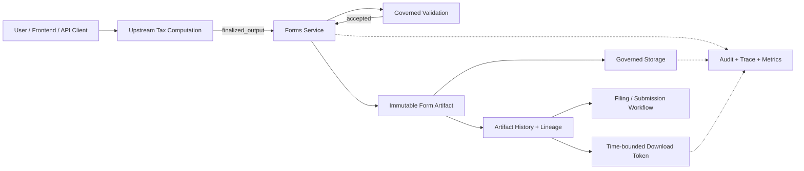

### 1.2 What the Forms Service owns

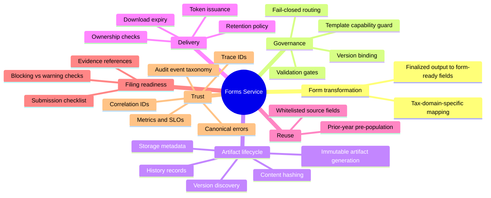

### 1.3 What it does **not** own

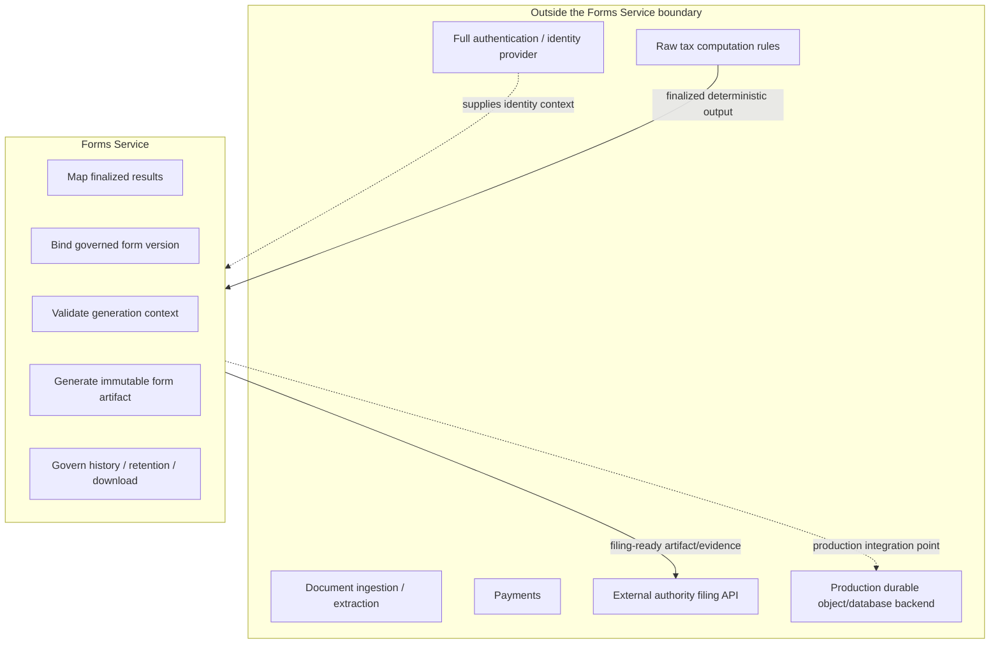

---

## 2. Where it sits in the Kodi architecture

The service is a **post-computation governance layer**. Its most important architectural job is to prevent a finalized number from immediately becoming a downloadable or submittable form without version, validation, lineage, retention, ownership, and audit controls.

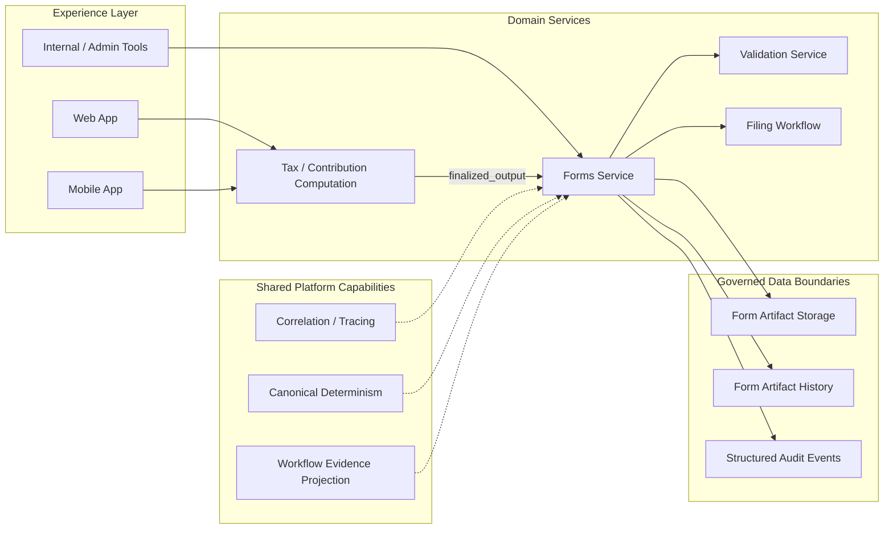

### 2.1 Upstream-to-downstream contract

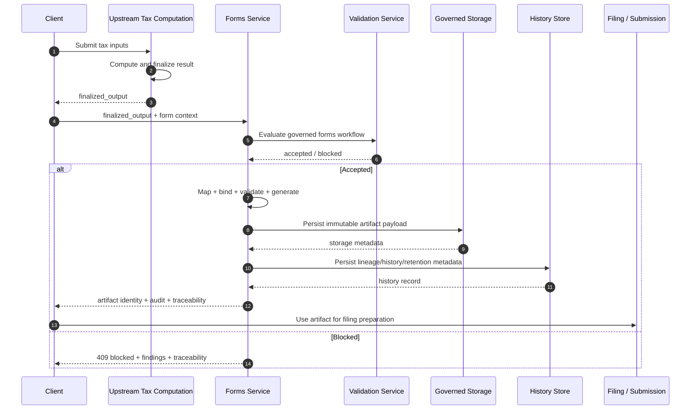

---

## 3. Architectural principles

The implementation repeatedly enforces the same design principles. These are not decorative conventions; they are the core of the service's correctness model.

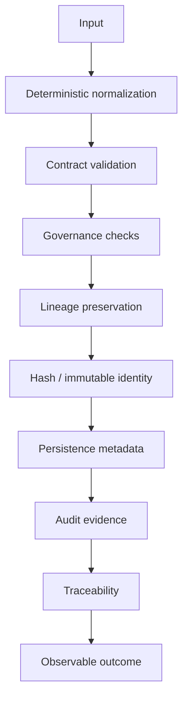

| Principle | How the service applies it |
|---|---|
| **Determinism** | Canonical JSON, SHA-256 identities, stable sorting, stable error envelopes, explicit clocks in testable paths. |
| **Fail closed** | Invalid domains, disabled templates, unsupported paths, lineage mismatches, expired retention, and unauthorized access are rejected. |
| **Immutability** | Generated artifacts carry artifact IDs/hashes and are persisted with append-safe history semantics. |
| **Lineage first** | Computation IDs, input hashes, historical versions, form versions, and audit evidence are carried forward. |
| **Governed extensibility** | Future form templates are registry-controlled and cannot be enabled until prerequisite gates are satisfied. |
| **Observability without secrets** | Metrics accept only approved dimensions and reject sensitive keys/values. |
| **Ownership enforcement** | History, metadata, pre-population, checklist, and download operations compare requested ownership with the current user context. |

---

## 4. Runtime architecture

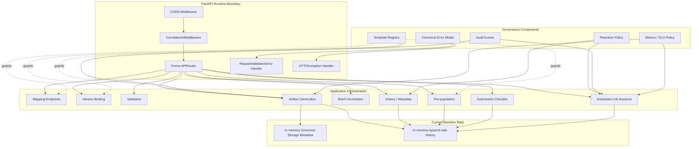

### 4.1 Application startup

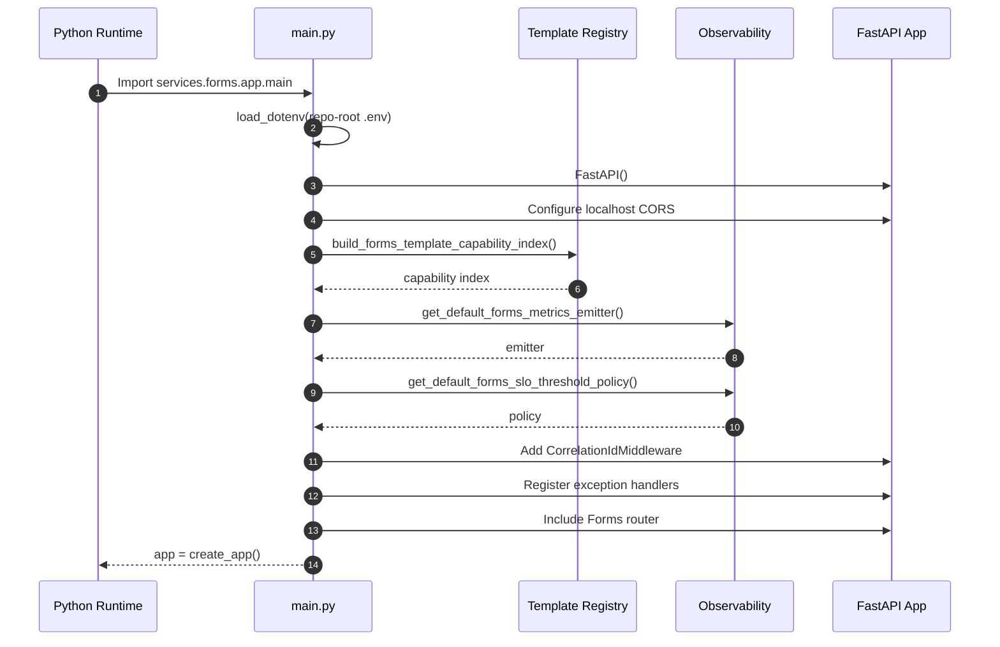

---

## 5. Source-code map

The service tree separates **cross-cutting form governance** from **tax-domain-specific implementations**.

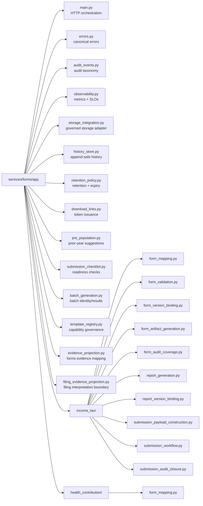

### 5.1 Runtime-wired vs. repository-present modules

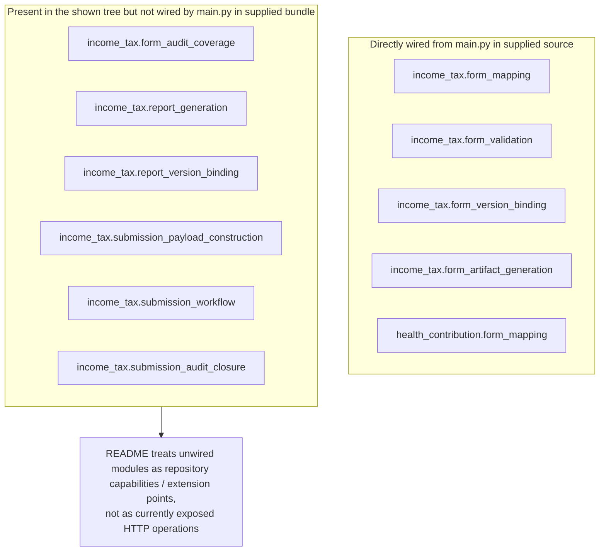

> **Source-scope note:** the uploaded concatenated source includes the top-level Forms modules and `main.py` wiring, while the nested `income_tax/` and `health_contribution/` file bodies are not present in that concatenation. Their detailed internals should therefore be documented from their own source when available; this README only states behavior proven by the route wiring, imports, filenames, and returned contracts.

---

## 6. Public HTTP surface

### 6.1 Route map

```mermaid
flowchart LR
    API[/Forms API/]
    API --> H[GET /healthz]
    API --> M1[POST /v1/forms/income-tax/mappings]
    API --> M2[POST /v1/forms/health-contribution/mappings]
    API --> VB[POST /v1/forms/income-tax/version-bindings]
    API --> V[POST /v1/forms/income-tax/validations]
    API --> G[POST /v1/forms/income-tax/artifacts]
    API --> BG[POST /v1/forms/income-tax/artifacts/batch]
    API --> LV[GET /v1/forms/income-tax/versions]
    API --> PP[POST /v1/forms/income-tax/pre-populations]
    API --> META[GET /v1/forms/income-tax/artifacts/:artifact/versions/:version/metadata]
    API --> SC[GET /v1/forms/income-tax/artifacts/:artifact/versions/:version/submission-checklist]
    API --> D[POST /v1/forms/income-tax/artifacts/:artifact/versions/:version/download-links]
    API --> FALLBACK[/v1/forms/:scope/:remaining_path\nfail-closed fallback]
```

### 6.2 Endpoint summary

| Method | Path | Purpose | Main success outcome |
|---|---|---|---|
| `GET` | `/healthz` | Service health and trace identity | `status=ok`, service name, trace/correlation IDs |
| `POST` | `/v1/forms/income-tax/mappings` | Convert finalized income-tax output to form-ready structure | Mapping output + validation + audit evidence |
| `POST` | `/v1/forms/health-contribution/mappings` | Convert finalized health-contribution output to form-ready structure | Mapping output + validation + audit evidence |
| `POST` | `/v1/forms/income-tax/version-bindings` | Bind mapped output to a governed form version | Form/template/version identities + audit evidence |
| `POST` | `/v1/forms/income-tax/validations` | Validate mapped and bound context before generation | Validation status/findings |
| `POST` | `/v1/forms/income-tax/artifacts` | Generate, store, retain, and record immutable artifact | `201` artifact response |
| `POST` | `/v1/forms/income-tax/artifacts/batch` | Generate many artifacts in stable order | Batch ID, per-item results, summary |
| `GET` | `/v1/forms/income-tax/versions` | List owned artifact versions by user/year/form | Ordered version list |
| `POST` | `/v1/forms/income-tax/pre-populations` | Reuse whitelisted prior-year values | Suggested populated fields |
| `GET` | `/v1/forms/income-tax/artifacts/{artifact_id}/versions/{form_version_id}/metadata` | Retrieve governed artifact metadata | Lineage + storage + download availability |
| `GET` | `/v1/forms/income-tax/artifacts/{artifact_id}/versions/{form_version_id}/submission-checklist` | Evaluate filing/submission readiness | Deterministic checklist |
| `POST` | `/v1/forms/income-tax/artifacts/{artifact_id}/versions/{form_version_id}/download-links` | Issue short-lived download token | Token + expiry + audit evidence |
| mixed | `/v1/forms/{scope}/{remaining_path:path}` | Reject invalid/unimplemented tax-domain routes | Canonical 400/404/501 error |

---

## 7. Primary income-tax lifecycle

The intended normal path is **map → bind → validate → generate → store/history → inspect/checklist/download**.

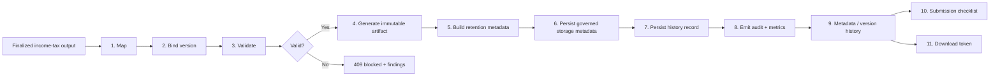

### 7.1 End-to-end sequence

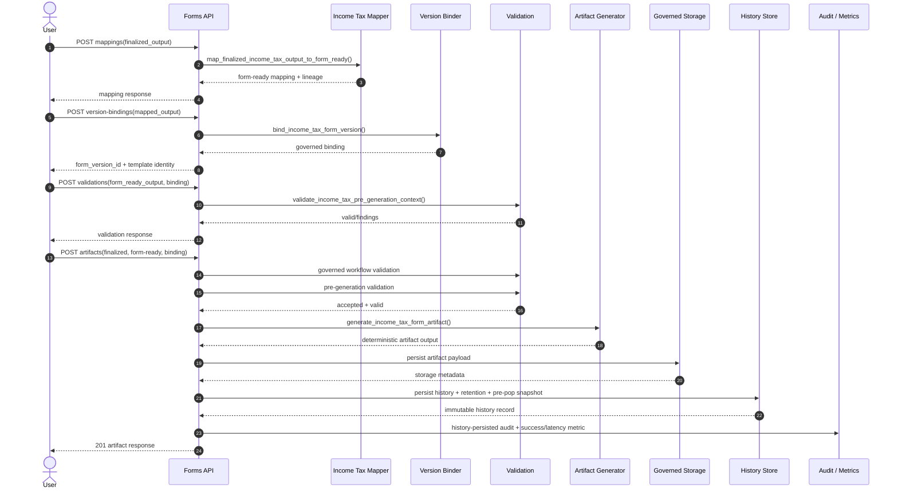

---

## 8. Mapping stage

Mapping is the translation boundary between **domain computation output** and **form-ready representation**.

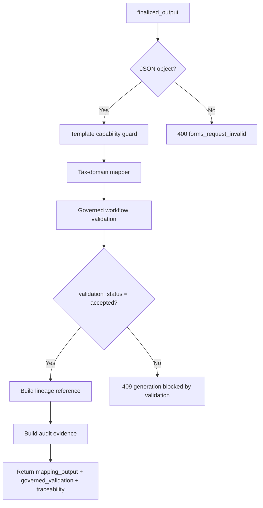

### 8.1 Income-tax mapping contract

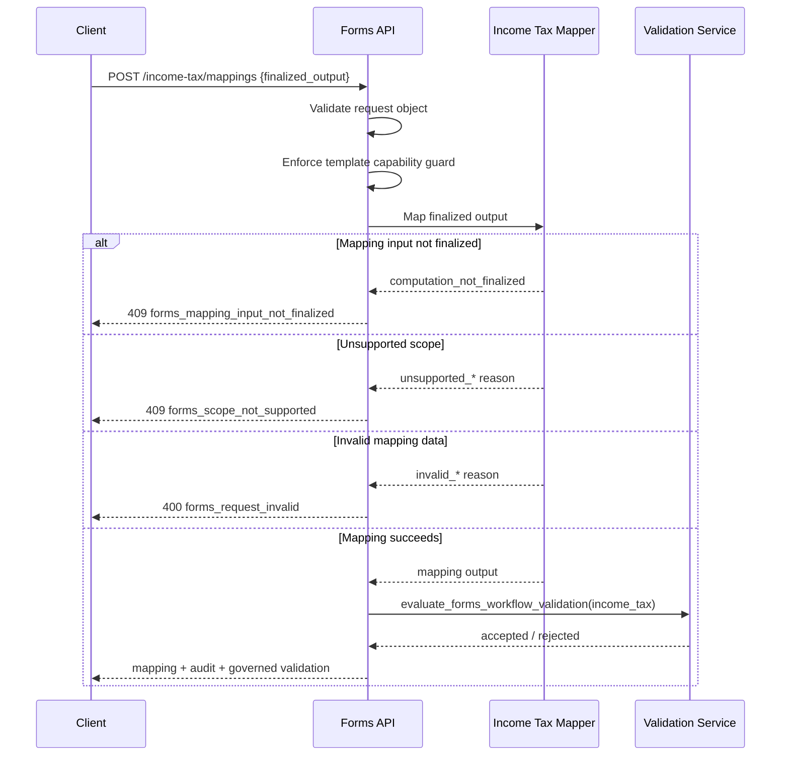

### 8.2 Health-contribution mapping

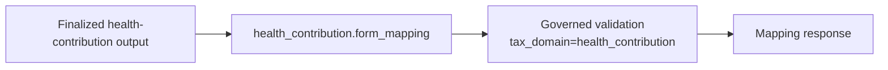

The supplied HTTP runtime exposes health-contribution **mapping**, but the full bind/validate/generate/history/download lifecycle is currently implemented for the income-tax vertical slice.

---

## 9. Form-version binding

Version binding prevents “whatever template is current today” from silently determining a historical or statutory form.

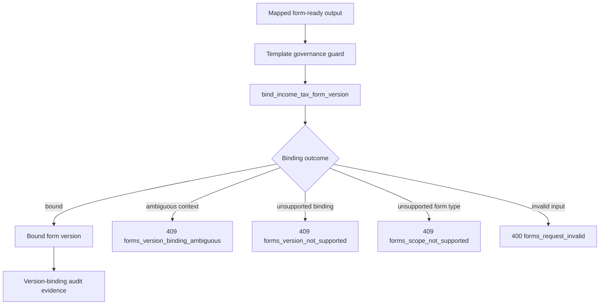

### 9.1 Version identity chain

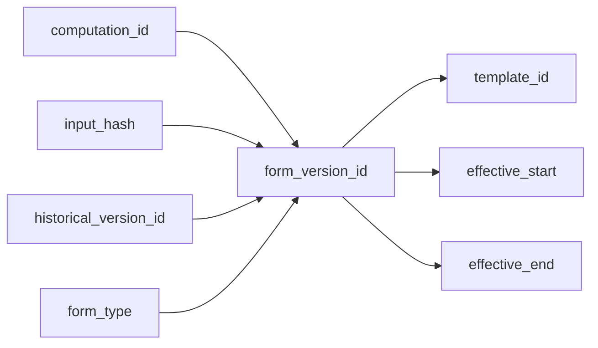

---

## 10. Validation gates

The service has **two distinct validation layers** on generation:

1. governed workflow validation from the Validation service;
2. income-tax pre-generation validation between form-ready output and version binding.

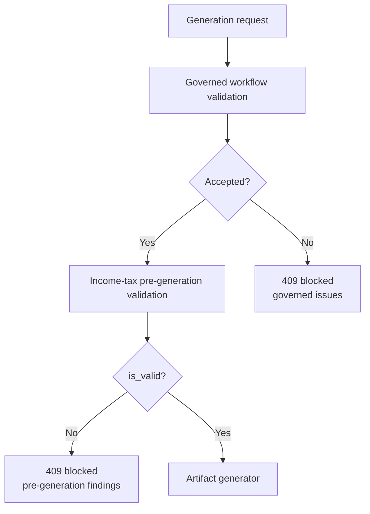

### 10.1 Why the two gates matter

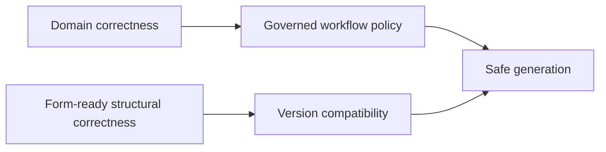

The first gate asks, “Is this finalized result acceptable for the Forms workflow?” The second asks, “Do this mapped form payload and this exact form-version binding agree strongly enough to generate an artifact?”

---

## 11. Artifact generation

Artifact generation is the most strongly governed path in the service.

```mermaid
flowchart TB
    R[POST /income-tax/artifacts]
    START[Start latency timer]
    CONTRACT[Require finalized_output + form_ready_output + form_version_binding]
    TGUARD[Reject disabled template capability]
    GV[Governed validation]
    PGV[Pre-generation validation]
    GENERATE[Generate deterministic artifact]
    LINEAGE[Build lineage reference]
    AUDIT[Build generation audit envelope]
    RET[Build retention metadata]
    PAYLOAD{generated_content_payload exists?}
    STORE[Persist governed storage metadata]
    HISTORY[Build + persist history record]
    HEVENT[Emit history-persisted audit event]
    METRIC[Emit success + latency]
    RESP[201 artifact response]

    R --> START --> CONTRACT --> TGUARD --> GV --> PGV --> GENERATE --> LINEAGE --> AUDIT --> RET --> PAYLOAD
    PAYLOAD -->|No| E500[500 storage reference missing]
    PAYLOAD -->|Yes| STORE --> HISTORY --> HEVENT --> METRIC --> RESP
```

### 11.1 Artifact identity and immutability

```mermaid
classDiagram
    class ArtifactResponse {
      +string status
      +string generation_status
      +string artifact_id
      +string artifact_hash
      +string artifact_type
      +string form_type
      +string form_version_id
      +int tax_year
      +string historical_version_id
      +string created_at
      +string generated_at
      +string immutability_status
      +bool immutable
    }

    class LineageReference {
      +string computation_id
      +string input_hash
      +string supported_lane_id
      +string historical_version_id
      +string form_version_id
      +string finalized_audit_event_id
      +string artifact_id
      +string artifact_hash
      +string form_type
      +int tax_year
    }

    class StorageMetadata {
      +string storage_object_id
      +string storage_backend
      +string content_type
      +int size_bytes
      +string artifact_hash
    }

    class RetentionMetadata {
      +string retention_policy_id
      +datetime retention_expires_at
      +datetime download_expires_at
      +string retention_status
    }

    ArtifactResponse *-- LineageReference
    ArtifactResponse *-- StorageMetadata
    ArtifactResponse *-- RetentionMetadata
```

---

## 12. Lineage model

Lineage is how Kodi can answer: **“Which computation, rules/history context, mapped form version, and generated artifact produced what the user sees?”**

```mermaid
flowchart LR
    INPUT[Original upstream inputs]
    HASH[input_hash]
    COMP[computation_id]
    FINAL[Finalized computation]
    HIST[historical_version_id]
    MAP[Mapped form-ready output]
    FVID[form_version_id]
    AID[artifact_id]
    AHASH[artifact_hash]
    AUD[audit_event_id]
    STORE[storage_object_id]

    INPUT --> HASH
    HASH --> COMP
    COMP --> FINAL
    HIST --> FINAL
    FINAL --> MAP
    MAP --> FVID
    FVID --> AID
    AID --> AHASH
    AID --> STORE
    AID --> AUD
```

### 12.1 Persisted record relationships

```mermaid
erDiagram
    USER ||--o{ FORM_ARTIFACT_HISTORY : owns
    FORM_ARTIFACT_HISTORY ||--|| STORAGE_METADATA : has
    FORM_ARTIFACT_HISTORY ||--|| RETENTION_METADATA : governed_by
    FORM_ARTIFACT_HISTORY ||--o{ AUDIT_EVIDENCE : referenced_by

    USER {
      string user_id
    }

    FORM_ARTIFACT_HISTORY {
      string artifact_id PK
      string user_id
      string form_type
      string form_version_id
      int tax_year
      string historical_version_id
      string artifact_hash
      string created_at
      string status
      object lineage_reference
      object pre_population_source_fields
    }

    STORAGE_METADATA {
      string storage_object_id
      string storage_backend
      string content_type
      int size_bytes
      string artifact_hash
    }

    RETENTION_METADATA {
      string retention_policy_id
      string retention_expires_at
      string download_expires_at
      string retention_status
    }

    AUDIT_EVIDENCE {
      string audit_event_id
      string event_type
      string trace_id
      string correlation_id
    }
```

---

## 13. Governed storage integration

The current implementation models the storage contract deterministically while keeping state in memory.

```mermaid
flowchart TB
    ART[Generated content payload]
    VALIDATE[Validate artifact ID/hash/form type]
    JSON[Canonical JSON serialization]
    SIZE[Calculate UTF-8 byte size]
    KEY[storage_object_id = forms/income_tax_return/artifacts/{artifact_id}.json]
    EXIST{Object key already exists?}
    SAME{Same artifact hash?}
    SAVE[Persist metadata]
    IDEMP[Return existing metadata\nidempotent replay]
    CONFLICT[forms_storage_write_failed\ndeterministic conflict]

    ART --> VALIDATE --> JSON --> SIZE --> KEY --> EXIST
    EXIST -->|No| SAVE
    EXIST -->|Yes| SAME
    SAME -->|Yes| IDEMP
    SAME -->|No| CONFLICT
```

### 13.1 Current storage contract

```mermaid
classDiagram
    class CurrentGovernedStorage {
      +backend = forms_governed_storage_inmemory
      +content_type = application/json
      +storage_object_id
      +size_bytes
      +artifact_hash
      +idempotent_same_hash_replay
      +deterministic_conflict_on_hash_change
      +test_failure_mode
    }

    class ProductionAdapterTarget {
      +durable object storage
      +encryption / access controls
      +retrieval implementation
      +retention enforcement
      +disaster recovery
    }

    CurrentGovernedStorage ..> ProductionAdapterTarget : replace adapter without changing domain contract
```

> The current backend label is `forms_governed_storage_inmemory`. Treat this as a test/hackathon baseline, not as evidence of durable persistence.

---

## 14. History and versioning

History persistence is append-safe by artifact identity and keeps storage/retention metadata alongside the logical artifact record.

```mermaid
flowchart TB
    NEW[History record candidate]
    NORM[Normalize contract fields]
    RET[Require valid retention metadata]
    STORE[Validate optional storage metadata]
    LOCK[Acquire store lock]
    FAIL{Failure mode enabled?}
    EXISTS{artifact_id exists?}
    FIRST[Persist new record]
    REPLAY[Return existing record\nappend-safe/idempotent]

    NEW --> NORM --> RET --> STORE --> LOCK --> FAIL
    FAIL -->|Yes| ERROR[forms_history_persistence_failed]
    FAIL -->|No| EXISTS
    EXISTS -->|No| FIRST
    EXISTS -->|Yes| REPLAY
```

### 14.1 Version-list query

```mermaid
sequenceDiagram
    participant C as Client
    participant A as Forms API
    participant H as History Store

    C->>A: GET /income-tax/versions?user_id=&tax_year=&form_type=
    A->>A: Validate user/year/form
    A->>A: Enforce template capability guard
    A->>A: Resolve X-User-ID ownership
    alt Authenticated user differs
        A-->>C: 403 forms_unauthorized_access
    else Authorized
        A->>H: list by exact user/year/form filter
        H-->>A: sorted records newest first
        alt None found
            A-->>C: 404 forms_history_not_found
        else Found
            A-->>C: versions[] + traceability
        end
    end
```

---

## 15. Retention policy

Each generated artifact receives retention metadata at creation time.

**Default policy:** `forms_retention_policy_v1`  
**Default artifact retention TTL:** `31,536,000` seconds (365 days)  
**Statuses:** `active`, `expired`, `restricted`

```mermaid
stateDiagram-v2
    [*] --> Active: artifact generated
    Active --> Restricted: governance restriction applied
    Active --> Expired: retention_expires_at reached
    Restricted --> [*]: access denied
    Expired --> [*]: access denied
    Active --> Active: metadata/download access allowed
```

### 15.1 Retention-access decision

```mermaid
flowchart TB
    R[Retention metadata]
    VALID[Normalize/validate metadata]
    STATUS{retention_status}
    TIME{now >= retention_expires_at?}
    ALLOW[Allow artifact access]
    RESTRICT[403 forms_artifact_access_restricted]
    EXPIRE[403 forms_artifact_retention_expired]

    R --> VALID --> STATUS
    STATUS -->|restricted| RESTRICT
    STATUS -->|expired| EXPIRE
    STATUS -->|active| TIME
    TIME -->|Yes| EXPIRE
    TIME -->|No| ALLOW
```

---

## 16. Download-link issuance

The service currently issues an **opaque, time-bounded token**. The default download-token TTL is **900 seconds (15 minutes)** and the maximum accepted TTL is **86,400 seconds (24 hours)**.

```mermaid
sequenceDiagram
    autonumber
    actor User
    participant A as Forms API
    participant H as History Store
    participant R as Retention Policy
    participant S as Storage Metadata
    participant D as Download Token Helper
    participant M as Metrics/Audit

    User->>A: POST artifact/version/download-links
    A->>A: Validate 64-char SHA-256 artifact_id + version ID
    A->>H: Resolve exact history record
    H-->>A: record
    A->>A: Check form scope
    A->>A: Check X-User-ID ownership
    A->>R: Enforce artifact retention
    A->>R: Enforce existing download-expiry rule
    A->>S: Resolve storage metadata
    S-->>A: storage reference
    A->>D: issue token(now, artifact, version, owner)
    D-->>A: token + issued_at + expires_at + audit_event_id
    A->>H: Persist download_expires_at
    A->>M: success + latency + audit evidence
    A-->>User: status=issued + token + expiry
```

### 16.1 Download access state machine

```mermaid
stateDiagram-v2
    [*] --> ArtifactActive
    ArtifactActive --> TokenIssued: issue download link
    TokenIssued --> TokenValid: now < download_expires_at
    TokenValid --> TokenExpired: now >= download_expires_at
    ArtifactActive --> RetentionExpired: retention deadline reached
    ArtifactActive --> Restricted: retention status restricted
    TokenIssued --> RetentionExpired: artifact retention expires
    TokenIssued --> Restricted: artifact access restricted

    TokenValid --> [*]: consumer may use token in downstream redemption layer
    TokenExpired --> [*]: denied
    RetentionExpired --> [*]: denied
    Restricted --> [*]: denied
```

> **Important:** the supplied runtime exposes token **issuance**. A route that redeems the returned token and streams/returns the stored artifact content is not present in the provided `main.py` route surface.

---

## 17. Prior-year pre-population

Pre-population is intentionally whitelist-based. It does not copy an entire prior form forward.

```mermaid
flowchart TB
    TARGET[Target income_tax_return + target_tax_year]
    SOURCEYEAR{source_tax_year supplied?}
    AUTO[target_tax_year - 1]
    EXPLICIT[Use explicit source year]
    AUTH[Require source user == authenticated user]
    HIST[Find latest matching prior-year history]
    SNAP{Whitelisted snapshot exists?}
    SUG[Build field suggestions]
    OUT[Return populated_fields]
    NONE[source_not_found]

    TARGET --> SOURCEYEAR
    SOURCEYEAR -->|No| AUTO --> AUTH
    SOURCEYEAR -->|Yes| EXPLICIT --> AUTH
    AUTH --> HIST --> SNAP
    SNAP -->|No| NONE
    SNAP -->|Yes| SUG --> OUT
```

### 17.1 Whitelisted fields

```mermaid
mindmap
  root((Prior-year whitelist))
    taxpayer
      taxpayer_kind
      resident_status
      classification_outcome
    form_fields
      employment_income_kes
      investment_income_kes
      chargeable_income_kes
      total_reliefs_kes
      net_income_tax_due_kes
```

The whitelist policy tag is `prior_year_artifact_whitelist_v1`.

### 17.2 Pre-population sequence

```mermaid
sequenceDiagram
    participant C as Client
    participant A as Forms API
    participant H as History Store
    participant P as Pre-population Helper

    C->>A: POST /pre-populations
    A->>A: Validate form_type and tax-year range
    A->>A: Resolve current user from X-User-ID
    A->>A: Reject cross-user source access
    A->>H: Find latest prior-year matching record
    alt No source record
        A-->>C: source_not_found
    else Source found
        H-->>A: pre_population_source_fields
        A->>P: Build whitelisted suggestions
        P-->>A: populated_fields[]
        A-->>C: applied or source_not_found
    end
```

---

## 18. Submission-readiness checklist

The checklist is a deterministic evidence-backed gate that says whether an artifact is ready for the next submission-oriented step.

```mermaid
flowchart LR
    A[Artifact history resolved\nBLOCKING]
    B[Lineage complete + form version matches\nBLOCKING]
    C[Storage reference available\nBLOCKING]
    D[Retention active\nBLOCKING]
    E[Download window issued\nBLOCKING]
    F[Pre-generation validation passed\nBLOCKING]
    G[Pre-population snapshot available\nNON-BLOCKING]
    DEC{Any blocking failure?}
    READY[overall_status = ready]
    NOT[overall_status = not_ready]

    A --> DEC
    B --> DEC
    C --> DEC
    D --> DEC
    E --> DEC
    F --> DEC
    G --> DEC
    DEC -->|Yes| NOT
    DEC -->|No| READY
```

### 18.1 Checklist dependency graph

```mermaid
flowchart TB
    HIST[History record]
    LIN[Lineage reference]
    STORE[Storage metadata]
    RET[Retention metadata]
    DL[download_expires_at]
    VAL[Generation existence implies validation gate passed]
    PRE[Pre-population snapshot]

    HIST --> C1[source_artifact_record_resolved]
    LIN --> C2[artifact_lineage_complete]
    STORE --> C3[storage_reference_available]
    RET --> C4[retention_policy_active]
    DL --> C5[download_window_issued]
    VAL --> C6[pre_generation_validation_passed]
    PRE --> C7[pre_population_snapshot_available]

    C1 --> RESULT[Deterministic checklist_id + overall status]
    C2 --> RESULT
    C3 --> RESULT
    C4 --> RESULT
    C5 --> RESULT
    C6 --> RESULT
    C7 --> RESULT
```

The checklist ID is SHA-256-derived from the artifact/version/form/year, overall status, and normalized item evidence state.

---

## 19. Batch generation

Batch generation preserves input order and returns success/failure per item instead of failing the whole batch at the first domain-level item error.

```mermaid
flowchart TB
    REQ[POST /artifacts/batch {items[]}] --> VALID{Non-empty array?}
    VALID -->|No| E400[400 forms_request_invalid]
    VALID -->|Yes| BID[Build deterministic batch_id]
    BID --> LOOP[For each item in stable input order]
    LOOP --> SCOPE{Recognized scope?}
    SCOPE -->|No| BADDOMAIN[Per-item invalid_tax_domain]
    SCOPE -->|Recognized but not income-tax| UNIMPL[Per-item unimplemented_tax_domain_mapping]
    SCOPE -->|income-tax| PAYLOAD{payload is object?}
    PAYLOAD -->|No| BADPAYLOAD[Per-item forms_request_invalid]
    PAYLOAD -->|Yes| GEN[Call normal artifact generation path]
    GEN -->|Success| SUCCESS[Per-item succeeded + artifact]
    GEN -->|HTTP error / validation block| FAILURE[Canonical per-item error]
    BADDOMAIN --> NEXT[Next item]
    UNIMPL --> NEXT
    BADPAYLOAD --> NEXT
    SUCCESS --> NEXT
    FAILURE --> NEXT
    NEXT --> SUMMARY[total / succeeded / failed]
    SUMMARY --> RESP[status=ok + batch_id + results + traceability]
```

### 19.1 Batch identity

```mermaid
flowchart LR
    ITEMS[Normalized ordered items]
    CJ[canonical_json_dumps]
    PREFIX["forms-batch:" prefix]
    SHA[SHA-256]
    BID[batch_id]

    ITEMS --> CJ --> PREFIX --> SHA --> BID
```

---

## 20. Audit evidence

Audit evidence is treated as part of the service contract, not an optional log statement.

### 20.1 Canonical audit envelope

```mermaid
classDiagram
    class FormsAuditEvidenceEnvelope {
      +string audit_event_id
      +string event_type
      +datetime event_timestamp
      +string trace_id
      +string correlation_id
      +object lineage_reference
      +object actor_context
    }

    class ActorContext {
      +string actor_type
      +string user_id
    }

    class LineageReference {
      +string computation_id
      +string input_hash
      +string historical_version_id
      +string form_version_id
      +string artifact_id
      +string artifact_hash
    }

    FormsAuditEvidenceEnvelope *-- ActorContext
    FormsAuditEvidenceEnvelope *-- LineageReference
```

### 20.2 Required audit taxonomy

```mermaid
mindmap
  root((Forms audit taxonomy))
    forms_validation_executed
    forms_artifact_generated
    forms_history_record_persisted
    forms_download_link_issued
    forms_access_denied
```

### 20.3 Audit-event identity

```mermaid
flowchart LR
    P[Canonical audit payload]
    N[Normalize object]
    J[canonical_json_dumps]
    H[SHA-256]
    ID[audit_event_id]

    P --> N --> J --> H --> ID
```

---

## 21. Traceability and request correlation

Every canonical error and most successful API responses include both a `trace_id` and `correlation_id`.

```mermaid
sequenceDiagram
    participant C as Client
    participant MW as CorrelationIdMiddleware
    participant F as Forms Endpoint
    participant E as Downstream/Internal Helper
    participant A as Audit/Errors

    C->>MW: HTTP request
    MW->>MW: Resolve/create trace + correlation context
    MW->>F: Request with traceability context
    F->>E: Execute operation
    E-->>F: Result / error
    F->>A: Attach trace_id + correlation_id
    A-->>F: Canonical evidence/envelope
    F-->>C: Response with same request traceability
```

### 21.1 Traceability relationship

```mermaid
flowchart LR
    REQ[One HTTP request]
    TRACE[trace_id]
    CORR[correlation_id]
    AUD[Audit event]
    ERR[Error envelope]
    METRIC[Metric event]
    ART[Artifact response]

    REQ --> TRACE
    REQ --> CORR
    TRACE --> AUD
    CORR --> AUD
    TRACE --> ERR
    CORR --> ERR
    REQ --> METRIC
    TRACE --> ART
    CORR --> ART
```

---

## 22. Error model

All service-level errors are normalized toward a predictable envelope.

```json
{
  "detail": {
    "error_code": "forms_request_invalid",
    "message": "Forms request payload is invalid.",
    "reason": "forms_request_invalid",
    "trace_id": "...",
    "correlation_id": "...",
    "details": {}
  }
}
```

### 22.1 Error decision tree

```mermaid
flowchart TB
    ERR[Error / rejection]
    RV{FastAPI request validation?}
    HTTP{HTTPException with known reason?}
    GEN{Generation endpoint?}
    DL{Download issuance endpoint?}

    ERR --> RV
    RV -->|Yes| E400[400 forms_request_invalid]
    RV -->|No| HTTP
    HTTP -->|No/unknown reason| CONTRACT[Normalize to forms_contract_violation]
    HTTP -->|Known| GEN
    GEN -->|Yes| GM[Emit generation failure + latency]
    GEN -->|No| DL
    DL -->|Yes| DM[Emit download failure + latency]
    DM --> DENIAL{Auth/expiry/retention denial?}
    DENIAL -->|Yes| DA[Emit download_access_denied metric]
    DENIAL -->|No| RESP[Canonical error envelope]
    DA --> RESP
    GM --> RESP
    CONTRACT --> RESP
```

### 22.2 Key reason-code families

```mermaid
mindmap
  root((Canonical reasons))
    Request / contract
      forms_request_invalid
      forms_contract_violation
      forms_generation_precondition_missing
    Scope / versions
      forms_scope_not_supported
      forms_version_not_supported
      forms_version_binding_ambiguous
      invalid_tax_domain
      unsupported_tax_domain_path
      unimplemented_tax_domain_mapping
    Validation / generation
      forms_mapping_input_not_finalized
      forms_generation_blocked_by_validation
      forms_artifact_generation_failed
      forms_audit_evidence_missing
    Persistence
      forms_storage_write_failed
      forms_storage_reference_missing
      forms_history_persistence_failed
      forms_history_not_found
    Access / delivery
      forms_unauthorized_access
      forms_download_not_authorized
      forms_download_artifact_not_found
      forms_download_link_issuance_failed
      forms_download_link_expired
      forms_artifact_retention_expired
      forms_artifact_access_restricted
    Reuse / submission
      forms_pre_population_source_not_found
      forms_pre_population_scope_not_supported
      forms_pre_population_not_authorized
      forms_submission_checklist_not_authorized
      forms_submission_checklist_scope_not_supported
      forms_submission_checklist_source_missing
    Governance
      forms_template_capability_disabled
```

---

## 23. Template capability governance

Form-template extensibility is controlled by a manifest rather than by blindly accepting a template code at runtime.

Required disabled extension codes in the baseline are:

- `IT2`
- `VAT3`
- `P10`
- `P9`

```mermaid
flowchart TB
    MAN[forms_template_capability_manifest.json]
    LOAD[Load JSON]
    VALID[Validate manifest shape]
    ENTRY[For each template]
    PREREQ[Validate five prerequisite booleans]
    DERIVE[Derive enablement_status]
    MATCH{Declared status matches derived?}
    REQUIRED{Required-disabled template?}
    ENABLED{status = enabled?}
    READY{All prerequisites true?}
    INDEX[Build capability index]

    MAN --> LOAD --> VALID --> ENTRY --> PREREQ --> DERIVE --> MATCH
    MATCH -->|No| ERROR[Registry validation error]
    MATCH -->|Yes| REQUIRED
    REQUIRED -->|Yes and enabled| ERROR
    REQUIRED -->|No / disabled| ENABLED
    ENABLED -->|Yes| READY
    READY -->|No| ERROR
    READY -->|Yes| INDEX
    ENABLED -->|No| INDEX
```

### 23.1 Enablement prerequisites

```mermaid
mindmap
  root((Template enablement prerequisites))
    tax_engine_rule_pack_ready
    openapi_contract_ready
    validation_rules_ready
    test_coverage_ready
    audit_event_taxonomy_ready
```

### 23.2 Runtime template guard

```mermaid
flowchart LR
    REQUEST[Request payload]
    CAND[Look for template_code / form_template_code / form_type\nincluding nested mapped/bound payloads]
    NORM[Normalize candidate]
    INDEX[Capability index lookup]
    STATUS{status}
    PASS[Continue request]
    BLOCK[409 forms_template_capability_disabled]

    REQUEST --> CAND --> NORM --> INDEX --> STATUS
    STATUS -->|disabled| BLOCK
    STATUS -->|enabled/not registered| PASS
```

---

## 24. Tax-domain routing and fail-closed behavior

Recognized Forms tax-domain names include aliases for income tax, health contribution, VAT, withholding tax, corporate tax, and payroll/PAYE.

```mermaid
flowchart TB
    REQ[/v1/forms/{scope}/{path}]
    NORM[Normalize scope alias]
    KNOWN{Recognized domain?}
    INCOME{income-tax?}
    MAP{remaining path == mappings?}

    REQ --> NORM --> KNOWN
    KNOWN -->|No| E400[400 invalid_tax_domain]
    KNOWN -->|Yes| INCOME
    INCOME -->|Yes but route not explicitly wired| E501I[501 forms_operation_not_implemented]
    INCOME -->|No| MAP
    MAP -->|Yes| E501[501 unimplemented_tax_domain_mapping]
    MAP -->|No| E404[404 unsupported_tax_domain_path]
```

### 24.1 Capability view

```mermaid
flowchart LR
    IT[Income Tax]
    HC[Health Contribution]
    VAT[VAT]
    WHT[Withholding Tax]
    CT[Corporate Tax]
    PAYE[Payroll / PAYE]

    IT -->|HTTP mapped + bound + validated + generated + governed| FULL[Primary vertical slice]
    HC -->|HTTP mapping endpoint| MAPONLY[Mapping vertical slice]
    VAT -->|recognized, unwired| FUTURE[Governed extension]
    WHT -->|recognized, unwired| FUTURE
    CT -->|recognized, unwired| FUTURE
    PAYE -->|recognized, unwired| FUTURE
```

---

## 25. Evidence projection boundaries

Two small modules make an important architectural distinction: **Forms interprets evidence for form fields**, while **Filing receives filing-specific projection state**.

```mermaid
flowchart LR
    E[WorkflowEvidenceProjection]
    WF{projection.workflow}
    FF[form_fields_from_projection]
    FI[filing_inputs_from_projection]
    FORMS[Form field values + evidence IDs + source references]
    FILING[Projection version + values + missing IDs + conflicts + corrections]

    E --> WF
    WF -->|forms| FF --> FORMS
    WF -->|filing| FI --> FILING
    WF -->|wrong workflow for helper| ERR[ValueError]
```

### 25.1 Forms evidence projection

```mermaid
classDiagram
    class ProjectedFormField {
      +object value
      +string evidence_id
      +list source_references
    }

    class FormsProjectionResult {
      +map requirement_id_to_field
    }

    FormsProjectionResult *-- ProjectedFormField
```

This is important because a field is not represented as “just a value”; it keeps evidence identity and provenance.

---

## 26. Observability

The Forms Service emits deterministic in-process metric events for generation and download issuance.

### 26.1 Metric pipeline

```mermaid
flowchart LR
    REQ[Request]
    TIMER[Start perf timer]
    OUT{Outcome}
    COUNTER[Success / failure counter]
    LAT[Latency histogram]
    DIM[Allowed dimensions only]
    SNAP[Metric snapshot]
    SLO[SLO threshold evaluation]
    ALERT[Canonical SLO alerts]

    REQ --> TIMER --> OUT
    OUT --> COUNTER --> DIM
    OUT --> LAT --> DIM
    DIM --> SNAP --> SLO --> ALERT
```

### 26.2 Metric IDs

```mermaid
mindmap
  root((Forms metrics))
    Generation
      forms.generation.success_total
      forms.generation.failure_total
      forms.generation.latency_ms
    Download issuance
      forms.download_issuance.success_total
      forms.download_issuance.failure_total
      forms.download_issuance.latency_ms
    Access
      forms.download_access_denied.total
```

### 26.3 Allowed metric dimensions

```mermaid
flowchart LR
    INPUT[Metric dimensions]
    KEY{Key allowed?}
    SECRET{Sensitive key/value pattern?}
    NONEMPTY{Non-empty?}
    SORT[Sort normalized dimensions]
    EMIT[Emit metric event]

    INPUT --> KEY
    KEY -->|No| REJECT[MetricsPolicyError]
    KEY -->|Yes| SECRET
    SECRET -->|Yes| REJECT
    SECRET -->|No| NONEMPTY
    NONEMPTY -->|No| REJECT
    NONEMPTY -->|Yes| SORT --> EMIT
```

Allowed dimension keys are `endpoint`, `status`, `reason_code`, and `denial_class`. Sensitive keys such as passwords, tokens, authorization values, secrets, credentials, and API keys are explicitly rejected.

### 26.4 Default SLOs

```mermaid
flowchart TB
    WINDOW[Evaluation window: 30m]
    GSR[Generation success rate >= 99%]
    GP95[Generation p95 <= 2500 ms]
    GP99[Generation p99 <= 4000 ms]
    DSR[Download issuance success rate >= 99.5%]
    DP95[Download p95 <= 1000 ms]
    DP99[Download p99 <= 2000 ms]

    WINDOW --> GSR
    WINDOW --> GP95
    WINDOW --> GP99
    WINDOW --> DSR
    WINDOW --> DP95
    WINDOW --> DP99
```

### 26.5 SLO alert evaluation

```mermaid
flowchart LR
    EVENTS[Metric events]
    SNAP[Build FormsSloMetricSnapshot]
    RATE[Calculate success rates]
    PCTL[Calculate nearest-rank p95/p99]
    COMPARE[Compare with policy]
    SORT[Sort canonical alerts]
    JSON[Serialize canonical JSON if needed]

    EVENTS --> SNAP --> RATE --> COMPARE
    SNAP --> PCTL --> COMPARE
    COMPARE --> SORT --> JSON
```

---

## 27. Security and trust boundaries

### 27.1 Current identity mechanism

The supplied baseline resolves artifact ownership from the `X-User-ID` request header. If the header is absent, the identity becomes `anonymous_user`.

```mermaid
flowchart TB
    REQ[Incoming request]
    HEADER{X-User-ID present and non-empty?}
    USER[Use header value]
    ANON[Use anonymous_user]
    CHECK[Ownership-sensitive operation]
    MATCH{Requested owner == resolved user?}
    ALLOW[Continue]
    DENY[403 canonical access error]

    REQ --> HEADER
    HEADER -->|Yes| USER --> CHECK
    HEADER -->|No| ANON --> CHECK
    CHECK --> MATCH
    MATCH -->|Yes| ALLOW
    MATCH -->|No| DENY
```

> **Production implication:** `X-User-ID` must be populated only by a trusted authentication/gateway layer, or replaced by a verified principal/claims integration. A public client-controlled header is not a complete authentication model.

### 27.2 Authorization-sensitive paths

```mermaid
mindmap
  root((Ownership checks))
    Version history
    Pre-population source
    Artifact metadata
    Submission checklist
    Download-link issuance
```

### 27.3 Defense-in-depth model

```mermaid
flowchart LR
    AUTH[Trusted identity]
    OWN[Owner match]
    SCOPE[Supported form scope]
    RET[Retention active]
    DL[Download window policy]
    STORE[Storage reference exists]
    AUD[Audit denial/success]
    ACCESS[Artifact operation allowed]

    AUTH --> OWN --> SCOPE --> RET --> DL --> STORE --> AUD --> ACCESS
```

---

## 28. CORS and local-development boundary

The FastAPI app currently allows credentials and standard HTTP methods from local frontend origins on ports `5173` and `5174` for both `localhost` and `127.0.0.1`.

```mermaid
flowchart LR
    F1[http://localhost:5173]
    F2[http://127.0.0.1:5173]
    F3[http://localhost:5174]
    F4[http://127.0.0.1:5174]
    API[Forms FastAPI]

    F1 --> API
    F2 --> API
    F3 --> API
    F4 --> API
```

Production origins should be configured deliberately rather than widening this list indiscriminately.

---

## 29. Determinism patterns used across the service

```mermaid
mindmap
  root((Deterministic patterns))
    Identity
      SHA-256 audit_event_id
      SHA-256 batch_id
      SHA-256 checklist_id
      Artifact hash / ID contracts
    Serialization
      canonical_json_dumps
      stable field normalization
    Ordering
      deterministic insertion order
      sorted filtered history
      sorted alert output
    Time
      UTC normalization
      seconds resolution
      explicit now overrides in retention tests
    Replay behavior
      storage idempotency for same hash
      history append-safe replay
    Failure testing
      storage failure mode
      history failure mode
```

### 29.1 Why deterministic design matters in a tax/forms system

```mermaid
flowchart LR
    SAME[Same governed inputs]
    DET[Deterministic processing]
    SAMEID[Stable identities/hashes]
    AUDIT[Reconstructable audit]
    TEST[Test reproducibility]
    DISPUTE[Explainable historical result]

    SAME --> DET --> SAMEID
    SAMEID --> AUDIT
    SAMEID --> TEST
    AUDIT --> DISPUTE
```

---

## 30. Data-lifecycle overview

```mermaid
stateDiagram-v2
    [*] --> FinalizedUpstream
    FinalizedUpstream --> Mapped
    Mapped --> VersionBound
    VersionBound --> Validated
    Validated --> Generated: validation passes
    Validated --> Blocked: validation fails
    Generated --> Stored
    Stored --> HistoryRecorded
    HistoryRecorded --> DownloadWindowIssued
    HistoryRecorded --> SubmissionChecklistEvaluated
    HistoryRecorded --> PrePopulationSource
    DownloadWindowIssued --> DownloadExpired
    HistoryRecorded --> RetentionExpired
    HistoryRecorded --> Restricted
    Blocked --> [*]
    DownloadExpired --> [*]
    RetentionExpired --> [*]
    Restricted --> [*]
```

---

## 31. Typical hackathon demo story

A demo should show **why this service is trustworthy**, not only that an endpoint returns JSON.

```mermaid
journey
    title Recommended Forms Service Demo Journey
    section Prepare
      Produce finalized income-tax result upstream: 5: Team
      Map result into form-ready fields: 5: Team
      Bind exact governed form version: 5: Team
    section Prove safety
      Trigger validation and show accepted result: 5: Team
      Generate immutable artifact: 5: Team
      Show artifact hash and lineage: 5: Team
    section Prove governance
      List historical version: 4: Team
      Inspect metadata and retention: 5: Team
      Issue download window: 5: Team
      Show submission checklist becomes ready: 5: Team
    section Prove resilience
      Show disabled/unsupported route fails closed: 5: Team
      Show trace and correlation IDs on errors: 5: Team
```

### 31.1 Judge-facing narrative

```mermaid
flowchart LR
    PROBLEM[Tax result alone is not filing-safe]
    SOLUTION[Forms Service adds governance]
    PROOF1[Version binding]
    PROOF2[Dual validation gates]
    PROOF3[Immutable artifact + hash]
    PROOF4[Lineage + audit]
    PROOF5[Retention + ownership]
    PROOF6[Submission readiness]
    VALUE[Explainable, reproducible, safer filing pipeline]

    PROBLEM --> SOLUTION
    SOLUTION --> PROOF1
    SOLUTION --> PROOF2
    SOLUTION --> PROOF3
    SOLUTION --> PROOF4
    SOLUTION --> PROOF5
    SOLUTION --> PROOF6
    PROOF1 --> VALUE
    PROOF2 --> VALUE
    PROOF3 --> VALUE
    PROOF4 --> VALUE
    PROOF5 --> VALUE
    PROOF6 --> VALUE
```

---

## 32. Example API flow

The exact domain payload shape is defined by upstream contracts and the nested income-tax modules. The following examples focus only on fields proven by the `main.py` runtime boundary.

### 32.1 Health

```bash
curl http://localhost:8000/healthz
```

### 32.2 Map finalized income-tax output

```bash
curl -X POST http://localhost:8000/v1/forms/income-tax/mappings \
  -H 'Content-Type: application/json' \
  -H 'X-User-ID: demo-user' \
  -d '{
    "finalized_output": {
      "...": "use the finalized computation contract produced upstream"
    }
  }'
```

### 32.3 Bind a version

```bash
curl -X POST http://localhost:8000/v1/forms/income-tax/version-bindings \
  -H 'Content-Type: application/json' \
  -H 'X-User-ID: demo-user' \
  -d '{
    "mapped_output": {
      "...": "mapping_output returned by the mapping stage"
    }
  }'
```

### 32.4 Validate before generation

```bash
curl -X POST http://localhost:8000/v1/forms/income-tax/validations \
  -H 'Content-Type: application/json' \
  -H 'X-User-ID: demo-user' \
  -d '{
    "form_ready_output": {"...": "mapped form-ready data"},
    "form_version_binding": {"...": "version-binding output"}
  }'
```

### 32.5 Generate artifact

```bash
curl -X POST http://localhost:8000/v1/forms/income-tax/artifacts \
  -H 'Content-Type: application/json' \
  -H 'X-User-ID: demo-user' \
  -d '{
    "finalized_output": {"...": "upstream finalized output"},
    "form_ready_output": {"...": "mapping result"},
    "form_version_binding": {"...": "binding result"}
  }'
```

### 32.6 Follow-up artifact operations

```mermaid
flowchart LR
    A[artifact_id + form_version_id]
    META[GET metadata]
    LIST[GET versions]
    DL[POST download-links]
    CHECK[GET submission-checklist]
    PRE[POST pre-populations for next year]

    A --> META
    A --> LIST
    A --> DL
    A --> CHECK
    A --> PRE
```

---

## 33. Running the service

`main.py` exports `app = create_app()`, so from the repository root a conventional FastAPI/Uvicorn launch target is:

```bash
uvicorn services.forms.app.main:app --reload --host 0.0.0.0 --port 8000
```

The module also loads the repository-root `.env` through `python-dotenv`.

### 33.1 Startup expectation

```mermaid
flowchart LR
    REPO[Repository root]
    ENV[.env]
    PY[Python environment]
    UV[Uvicorn]
    APP[services.forms.app.main:app]
    HEALTH[/healthz]

    REPO --> ENV
    REPO --> PY
    PY --> UV --> APP --> HEALTH
```

> This README does not invent dependency-install or test commands that are not present in the provided service source. Use the repository-level dependency and test tooling already defined by Kodi.

---

## 34. Current baseline vs. production target

This distinction is essential for collaborators and judges.

```mermaid
flowchart TB
    subgraph CURRENT[Current supplied baseline]
        C1[FastAPI HTTP boundary]
        C2[Income-tax governed vertical slice]
        C3[Health-contribution mapping]
        C4[In-memory storage metadata state\n(payload is validated/serialized but not retained)]
        C5[In-memory history state]
        C6[X-User-ID identity adapter]
        C7[Download token issuance]
        C8[In-process metric emitter]
    end

    subgraph TARGET[Typical production integrations]
        P1[Verified auth principal / gateway claims]
        P2[Durable database/history store]
        P3[Durable encrypted object storage]
        P4[Real artifact redemption/download endpoint]
        P5[Central metrics backend]
        P6[Central audit/log sink]
        P7[Expanded governed tax domains]
    end

    C6 -. replace/integrate .-> P1
    C5 -. adapter .-> P2
    C4 -. adapter .-> P3
    C7 -. complete delivery path .-> P4
    C8 -. export .-> P5
    C2 -. extend .-> P7
    C1 -. retain contract .-> P6
```

### 34.1 Production-hardening priorities

```mermaid
flowchart LR
    A[1. Trusted authentication integration]
    B[2. Durable history persistence]
    C[3. Durable governed object storage]
    D[4. Token redemption/download path]
    E[5. External observability/audit sinks]
    F[6. Contract + integration tests]
    G[7. Enable new templates only via governance prerequisites]

    A --> B --> C --> D --> E --> F --> G
```

---

## 35. Contributor guide: where should a change go?

```mermaid
flowchart TB
    CHANGE[What are you changing?]
    HTTP{HTTP route/orchestration?}
    DOMAIN{Income-tax domain logic?}
    AUD{Audit/trace/error?}
    LIFE{Storage/history/retention/download?}
    REUSE{Pre-population/checklist?}
    TEMPLATE{Template enablement?}
    OBS{Metrics/SLO?}

    CHANGE --> HTTP
    HTTP -->|Yes| MAIN[main.py]
    HTTP -->|No| DOMAIN
    DOMAIN -->|Mapping| IM[income_tax/form_mapping.py]
    DOMAIN -->|Validation| IV[income_tax/form_validation.py]
    DOMAIN -->|Version binding| IB[income_tax/form_version_binding.py]
    DOMAIN -->|Artifact generation| IG[income_tax/form_artifact_generation.py]
    DOMAIN -->|No| AUD
    AUD -->|Canonical error| ER[errors.py]
    AUD -->|Audit taxonomy/evidence| AE[audit_events.py]
    AUD -->|No| LIFE
    LIFE -->|Storage| SI[storage_integration.py]
    LIFE -->|History| HS[history_store.py]
    LIFE -->|Retention| RP[retention_policy.py]
    LIFE -->|Download token| DL[download_links.py]
    LIFE -->|No| REUSE
    REUSE -->|Prior-year suggestions| PP[pre_population.py]
    REUSE -->|Submission readiness| SC[submission_checklist.py]
    REUSE -->|No| TEMPLATE
    TEMPLATE -->|Yes| TR[template_registry.py + capability manifest]
    TEMPLATE -->|No| OBS
    OBS --> OB[observability.py]
```

### 35.1 Change-safety checklist

- Preserve deterministic IDs/hashes for identical canonical inputs.
- Preserve trace/correlation IDs in success and error paths.
- Do not bypass template capability governance.
- Do not generate artifacts when either validation gate fails.
- Keep lineage fields intact across mapping, binding, generation, storage, and history.
- Never log or emit secrets in metric dimensions.
- Keep owner checks on history, pre-population, metadata, checklist, and download operations.
- Keep storage/history replay behavior idempotent for the same artifact identity.
- Add or update audit taxonomy whenever a governed lifecycle event changes.
- Treat retention and download expiry as independent controls.

---

## 36. Service invariants

```mermaid
flowchart TB
    INV1[No artifact without accepted governed validation]
    INV2[No artifact without valid form-ready/version context]
    INV3[No generated artifact without lineage identity]
    INV4[No history record without retention metadata]
    INV5[Storage artifact hash must match history artifact hash]
    INV6[Cross-user artifact access must be denied]
    INV7[Expired/restricted artifact access must be denied]
    INV8[Disabled templates must remain blocked]
    INV9[Unknown metric dimensions must not be emitted]
    INV10[Unsupported tax domains/paths fail closed]

    CORE((Forms Service Trust Contract))
    INV1 --> CORE
    INV2 --> CORE
    INV3 --> CORE
    INV4 --> CORE
    INV5 --> CORE
    INV6 --> CORE
    INV7 --> CORE
    INV8 --> CORE
    INV9 --> CORE
    INV10 --> CORE
```

---

## 37. Failure scenarios worth testing/demoing

```mermaid
flowchart LR
    F1[Missing request field] --> R1[400 contract/request error]
    F2[Computation not finalized] --> R2[409 mapping/generation precondition]
    F3[Disabled template] --> R3[409 capability disabled]
    F4[Validation rejected] --> R4[409 blocked + findings]
    F5[Lineage/version mismatch] --> R5[409 version not supported]
    F6[Storage failure mode] --> R6[500 storage write failed]
    F7[History failure mode] --> R7[500 history persistence failed]
    F8[Wrong owner] --> R8[403 unauthorized]
    F9[Retention expired/restricted] --> R9[403 retention denial]
    F10[Unknown domain] --> R10[400 invalid tax domain]
    F11[Known but unwired domain mapping] --> R11[501 unimplemented mapping]
```

---

## 38. Reading the service in the right order

A new contributor can understand the service fastest by following this sequence:

```mermaid
flowchart LR
    A[1. README: system role]
    B[2. main.py: route orchestration]
    C[3. income_tax mapping/binding/validation/generation]
    D[4. history_store + storage_integration]
    E[5. retention_policy + download_links]
    F[6. audit_events + errors + observability]
    G[7. pre_population + submission_checklist]
    H[8. template_registry + capability manifest]
    I[9. report/submission workflow modules when wiring them]

    A --> B --> C --> D --> E --> F --> G --> H --> I
```

---

## 39. Architecture summary

```mermaid
flowchart TB
    FINAL[Finalized upstream tax result]
    FORMS[Forms Service]

    subgraph TRUST[Trust transformations performed by Forms]
        M[Form mapping]
        V[Version binding]
        G[Governed validation]
        A[Immutable artifact generation]
        L[Lineage + audit evidence]
        S[Governed storage reference]
        H[History + versioning]
        R[Retention + ownership]
        D[Download issuance]
        C[Submission readiness]
    end

    DOWN[Downstream filing / delivery workflows]

    FINAL --> FORMS
    FORMS --> M --> V --> G --> A --> L --> S --> H --> R
    R --> D
    R --> C
    D --> DOWN
    C --> DOWN
```

**In one sentence:** the Forms Service is the component that transforms a finalized tax result into a **version-bound, validated, immutable, traceable, retention-governed, user-owned artifact** that the rest of Kodi can safely use for filing and delivery.

---

## 40. Repository tree reference

```text
services/forms/app/
├── audit_events.py
├── batch_generation.py
├── config.py
├── download_links.py
├── errors.py
├── evidence_projection.py
├── filing_evidence_projection.py
├── health_contribution/
│   └── form_mapping.py
├── history_store.py
├── income_tax/
│   ├── form_artifact_generation.py
│   ├── form_audit_coverage.py
│   ├── form_mapping.py
│   ├── form_validation.py
│   ├── form_version_binding.py
│   ├── report_generation.py
│   ├── report_version_binding.py
│   ├── submission_audit_closure.py
│   ├── submission_payload_construction.py
│   └── submission_workflow.py
├── main.py
├── observability.py
├── pre_population.py
├── retention_policy.py
├── storage_integration.py
├── submission_checklist.py
└── template_registry.py
```

---

## 41. Final contributor mental model

```mermaid
flowchart LR
    N1[Computation tells us\nWHAT the tax result is]
    N2[Forms tells us\nHOW that result becomes an official governed artifact]
    N3[Filing tells us\nWHAT happens with that governed artifact next]

    N1 --> N2 --> N3
```

That separation of concerns is the key to understanding this service.
