# Gateway Service

> **Governed entry boundary for orchestration-led tax workflows, authenticated tool calls, trace propagation, streaming relay, and audit integration.**

---

## Table of Contents

1. [Why this service exists](#1-why-this-service-exists)
2. [The 60-second mental model](#2-the-60-second-mental-model)
3. [Role in the complete platform](#3-role-in-the-complete-platform)
4. [Responsibilities and non-responsibilities](#4-responsibilities-and-non-responsibilities)
5. [Architecture](#5-architecture)
6. [Trust and security model](#6-trust-and-security-model)
7. [HTTP surface](#7-http-surface)
8. [End-to-end request flows](#8-end-to-end-request-flows)
9. [Orchestration forwarding](#9-orchestration-forwarding)
10. [Server-Sent Events streaming](#10-server-sent-events-streaming)
11. [Tool audit flow](#11-tool-audit-flow)
12. [Correlation, tracing, and idempotency](#12-correlation-tracing-and-idempotency)
13. [Tax-domain boundary and fail-closed behavior](#13-tax-domain-boundary-and-fail-closed-behavior)
14. [Error model](#14-error-model)
15. [Runtime configuration](#15-runtime-configuration)
16. [CORS behavior](#16-cors-behavior)
17. [External dependencies](#17-external-dependencies)
18. [Failure modes](#18-failure-modes)
19. [Developer guide](#19-developer-guide)
20. [Testing strategy](#20-testing-strategy)
21. [Extension points](#21-extension-points)
22. [Current implementation status and limitations](#22-current-implementation-status-and-limitations)
23. [Hackathon judge walkthrough](#23-hackathon-judge-walkthrough)
24. [Glossary](#24-glossary)
25. [Contributor checklist](#25-contributor-checklist)

---

# 1. Why this service exists

In a distributed tax platform, not every client should call every internal service directly. A single, governed ingress boundary is needed to answer four questions before traffic proceeds:

1. **Who is making the request?**
2. **Is that principal allowed to enter this execution path?**
3. **Which request metadata must survive across services?**
4. **Which downstream service is responsible for actually executing the workflow?**

This service is that boundary.

It is a FastAPI gateway that currently performs three concrete jobs:

- exposes a protected dummy tool endpoint that writes an audit event;
- validates and forwards trusted orchestration requests, including streaming requests;
- blocks direct tax-domain execution paths that are not implemented at the gateway boundary.

The important architectural idea is that **the gateway governs entry; orchestration owns workflow execution**.

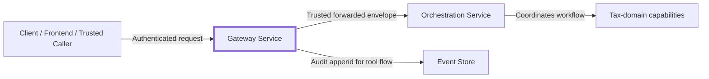

---

# 2. The 60-second mental model

If you remember only one diagram from this README, remember this one:

```mermaid
flowchart TB
    REQ[Incoming HTTP Request]

    subgraph GATEWAY[Gateway boundary]
        CORS[CORS policy]
        CORR[Correlation / trace context]
        AUTH[Auth-context parsing + RBAC]
        IDEMP[Idempotency validation where required]
        ROUTE{Which route?}
        AUDIT[Build audit event]
        FWD[Forward trusted request]
        STREAM[Relay SSE bytes]
        GUARD[Tax-domain guard]
        ERR[Structured gateway error]
    end

    EVENT[(Event Store)]
    ORCH[(Orchestration)]

    REQ --> CORS --> CORR --> ROUTE
    ROUTE -->|POST /tools/ping| AUTH --> IDEMP --> AUDIT --> EVENT
    ROUTE -->|/v1/orchestration/...| AUTH --> FWD --> ORCH
    ROUTE -->|.../execute/stream| AUTH --> STREAM --> ORCH
    ROUTE -->|/v1/gateway/{scope}/...| GUARD
    GUARD -->|Unsupported / invalid| ERR
```

The gateway is intentionally thin. It does not attempt to become the orchestration engine, tax engine, event store, identity provider, or domain service.

---

# 3. Role in the complete platform

## 3.1 System context

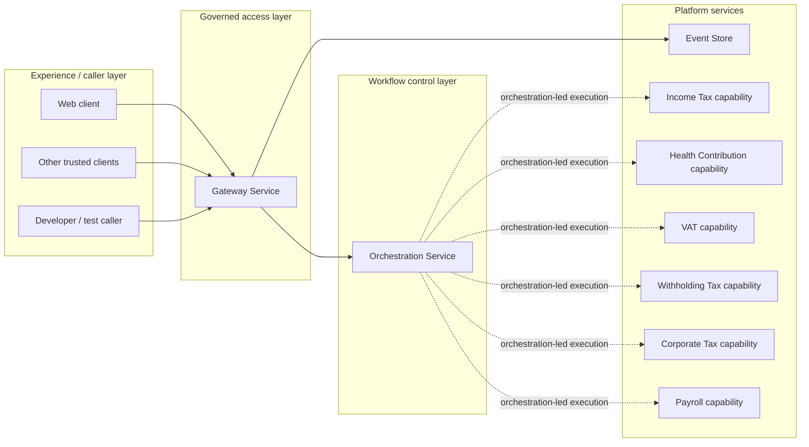

> The tax-domain boxes above represent domain names recognized by this gateway boundary. The supplied gateway source does **not** define those downstream services or their internal implementation. The diagram shows the architectural boundary implied by the gateway's recognized scopes and orchestration-led routing behavior, not an assertion that all domain services are implemented in this repository.

## 3.2 Why orchestration sits behind the gateway

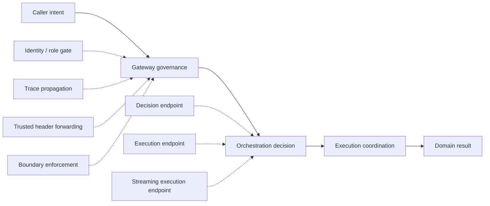

## 3.3 Architectural position

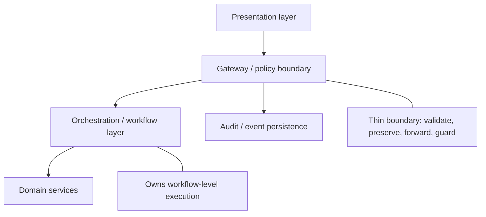

---

# 4. Responsibilities and non-responsibilities

## 4.1 Responsibility map

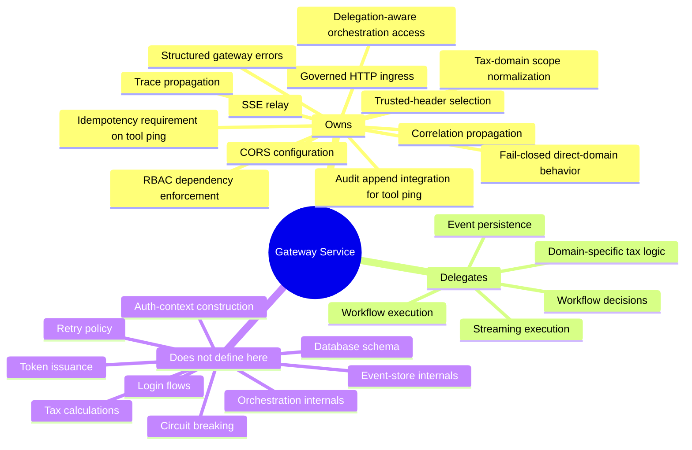

## 4.2 Boundary of ownership

```mermaid
flowchart LR
    subgraph OWNED[Implemented in this gateway source]
        R1[Routes]
        R2[RBAC dependency wiring]
        R3[Header forwarding allow-list]
        R4[HTTP proxying]
        R5[SSE relay]
        R6[Audit client]
        R7[Tax scope guard]
        R8[Gateway error construction]
        R9[CORS + correlation middleware registration]
    end

    subgraph IMPORTED[Imported shared capabilities]
        S1[Principal]
        S2[Auth-context parser / authorization dependency]
        S3[Correlation middleware]
        S4[Trace / correlation accessors]
        S5[Idempotency-key validator]
    end

    subgraph DOWNSTREAM[External runtime responsibilities]
        D1[Orchestration]
        D2[Event Store]
    end

    IMPORTED --> OWNED --> DOWNSTREAM
```

---

# 5. Architecture

## 5.1 Internal component model

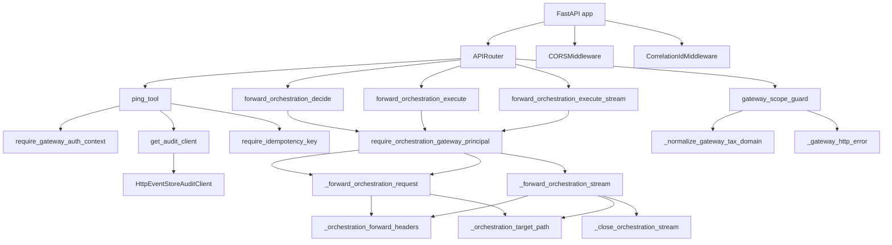

## 5.2 Dependency direction

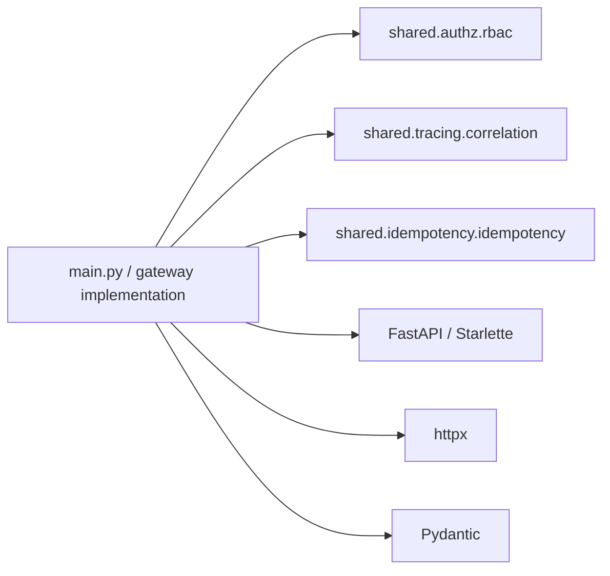

## 5.3 Application construction

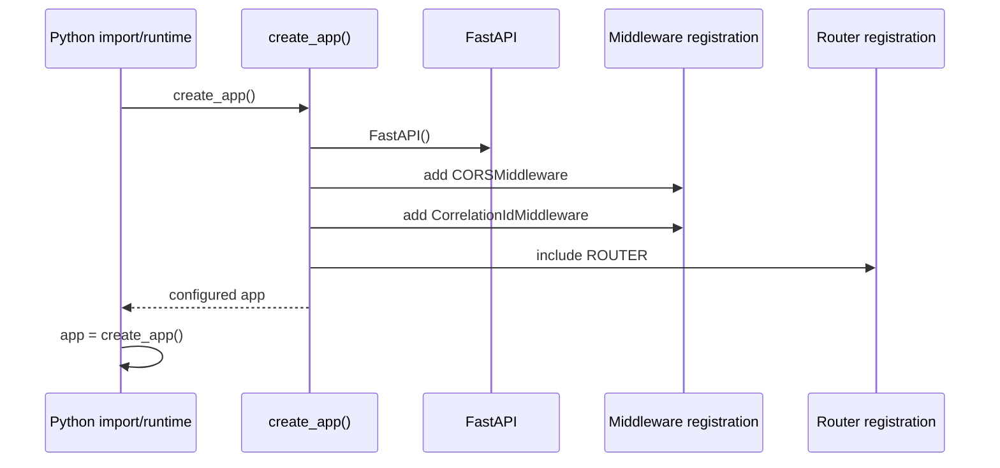

## 5.4 Service topology from the gateway's perspective

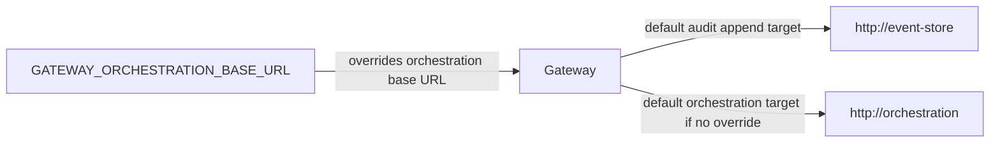

---

# 6. Trust and security model

## 6.1 Trust boundary

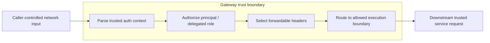

## 6.2 Two authorization modes

The gateway wires two authorization dependencies:

- **General gateway auth-context requirement** for `/tools/ping`.
- **Restricted orchestration principal requirement** for orchestration routes.

The orchestration dependency allows these roles:

- `IndividualTaxpayer`
- `TaxAgent`
- `Accountant`

Delegation is enabled, but delegated roles are restricted to:

- `TaxAgent`
- `Accountant`

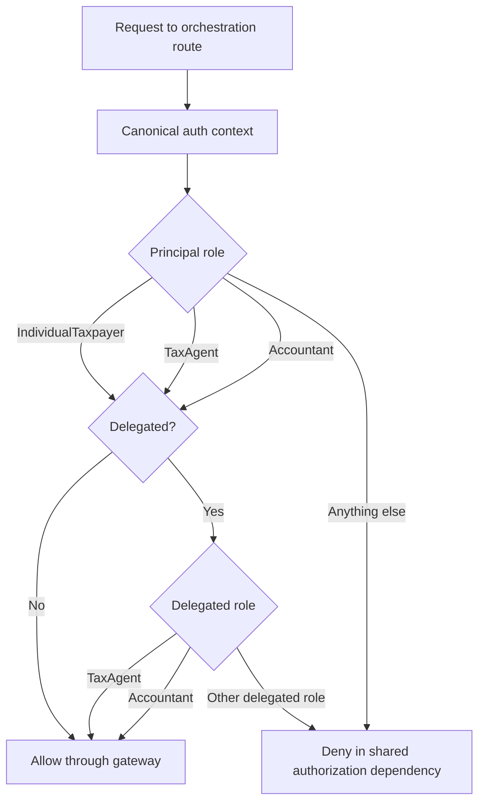

> Exact parsing, validation, and denial response semantics live in the imported `shared.authz.rbac` implementation and are not present in the supplied gateway source.

## 6.3 Authorization intent by route family

```mermaid
flowchart LR
    PING[/POST /tools/ping/]
    ORCH[/POST /v1/orchestration/.../]
    DIRECT[/Any /v1/gateway/{scope}/.../]

    A1[Authenticated principal required]
    A2[Role-restricted + delegation-aware principal required]
    A3[Gateway scope guard]

    PING --> A1
    ORCH --> A2
    DIRECT --> A3
```

## 6.4 Forwarded-header allow-list

The gateway does **not** forward every caller header to orchestration. It selects only the following names when present:

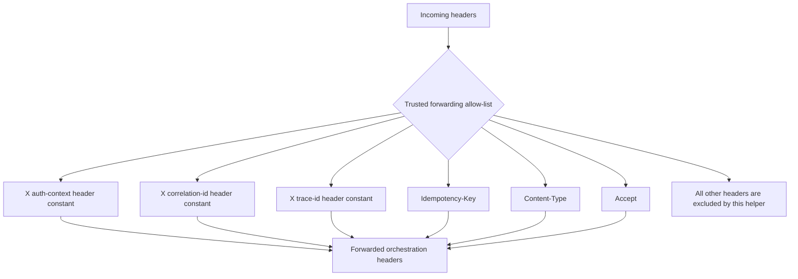

## 6.5 Why header filtering matters

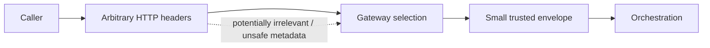

The helper preserves the canonical auth context **verbatim** if present; the gateway does not reconstruct a new auth envelope for orchestration.

---

# 7. HTTP surface

## 7.1 Route map

```mermaid
flowchart TB
    ROOT[Gateway HTTP surface]

    ROOT --> T[/POST /tools/ping/]
    ROOT --> D[/POST /v1/orchestration/prompt/decide/]
    ROOT --> E[/POST /v1/orchestration/prompt/execute/]
    ROOT --> S[/POST /v1/orchestration/prompt/execute/stream/]
    ROOT --> G[/GET|POST|PUT|PATCH|DELETE /v1/gateway/{scope}/{remaining_path}/]

    T --> TA[Authenticated + Idempotency-Key + audit append]
    D --> DF[Authorized forward]
    E --> EF[Authorized forward]
    S --> SF[Authorized SSE relay]
    G --> GG[Fail-closed scope guard]
```

## 7.2 Endpoint reference

| Method | Path | Primary purpose | Auth behavior | Downstream |
|---|---|---|---|---|
| `POST` | `/tools/ping` | Dummy protected tool flow plus audit append | General authenticated principal | Event Store |
| `POST` | `/v1/orchestration/prompt/decide` | Forward orchestration decision request | Restricted role/delegation policy | Orchestration |
| `POST` | `/v1/orchestration/prompt/execute` | Forward orchestration execution request | Restricted role/delegation policy | Orchestration |
| `POST` | `/v1/orchestration/prompt/execute/stream` | Relay orchestration SSE response | Restricted role/delegation policy | Orchestration |
| `GET/POST/PUT/PATCH/DELETE` | `/v1/gateway/{scope}/{remaining_path}` | Guard direct tax-domain paths | Scope validation at this layer | None in current implementation |

## 7.3 Route classification

```mermaid
flowchart TD
    REQ[Incoming path]
    PATH{Path family}

    TOOL[Tool path]
    ORCH[Orchestration path]
    DOMAIN[Direct gateway tax-domain path]
    OTHER[Other FastAPI behavior / unmatched route]

    REQ --> PATH
    PATH -->|/tools/ping| TOOL
    PATH -->|/v1/orchestration/prompt/...| ORCH
    PATH -->|/v1/gateway/{scope}/...| DOMAIN
    PATH -->|anything else| OTHER
```

---

# 8. End-to-end request flows

## 8.1 Global request mental model

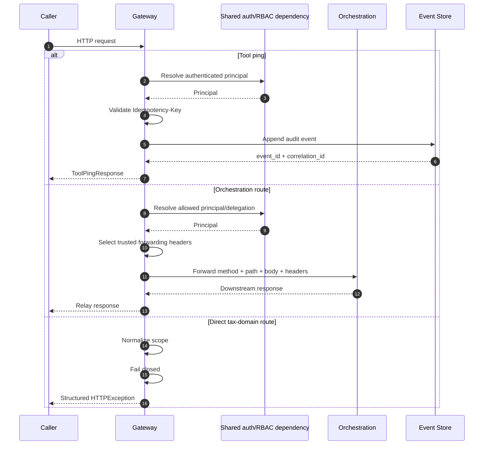

## 8.2 Request decision tree

```mermaid
flowchart TD
    A[Request reaches gateway]
    B{Endpoint family}

    C[/tools/ping]
    D[/v1/orchestration/...]
    E[/v1/gateway/{scope}/...]

    A --> B
    B --> C
    B --> D
    B --> E

    C --> C1[Require principal]
    C1 --> C2[Require idempotency key]
    C2 --> C3[Build audit payload]
    C3 --> C4[POST /audit/append]
    C4 --> C5[Return ok + event_id + correlation_id]

    D --> D1[Require allowed orchestration principal]
    D1 --> D2[Preserve body]
    D2 --> D3[Select trusted headers]
    D3 --> D4{Streaming endpoint?}
    D4 -->|No| D5[Normal proxy request]
    D4 -->|Yes| D6[Streaming upstream + StreamingResponse]

    E --> E1[Normalize scope]
    E1 --> E2{Known?}
    E2 -->|No| E3[400 invalid_tax_domain]
    E2 -->|Yes| E4[501 unsupported_tax_domain_path]
```

---

# 9. Orchestration forwarding

## 9.1 Non-streaming forwarding sequence

```mermaid
sequenceDiagram
    autonumber
    participant C as Caller
    participant G as Gateway route
    participant R as RBAC dependency
    participant H as Header selector
    participant T as Target-path builder
    participant X as httpx.AsyncClient
    participant O as Orchestration

    C->>G: POST /v1/orchestration/prompt/decide or /execute
    G->>R: Resolve authorized principal
    R-->>G: Principal
    G->>H: Select trusted headers
    H-->>G: auth/correlation/trace/idempotency/content headers
    G->>T: Build target URL using request.path
    T-->>G: {base_url}{request.url.path}
    G->>G: Read request body
    G->>X: client.request(method, url, body, headers)
    X->>O: Forward request
    O-->>X: Upstream HTTP response
    X-->>G: status + bytes + content-type
    G-->>C: Response(bytes, same upstream status, upstream content-type)
```

## 9.2 Forwarding invariants

```mermaid
flowchart LR
    subgraph PRESERVED[Preserved]
        M[HTTP method]
        P[Request path]
        B[Request body bytes]
        H[Selected trusted headers]
    end

    subgraph NOT_REWRITTEN[Not transformed by gateway helper]
        CTX[Auth context envelope]
        BODY[Application payload]
    end

    subgraph DOWNSTREAM[Downstream response fields relayed]
        STATUS[Status code]
        CONTENT[Response bytes]
        TYPE[Content-Type]
    end

    PRESERVED --> NOT_REWRITTEN --> DOWNSTREAM
```

## 9.3 Target URL construction

```mermaid
flowchart TD
    ENV{GATEWAY_ORCHESTRATION_BASE_URL set?}
    DEF[Use http://orchestration]
    CUSTOM[Use configured base URL]
    TRIM[Remove trailing slash]
    PATH[Append incoming request.url.path]
    TARGET[Final orchestration target URL]

    ENV -->|No| DEF --> TRIM
    ENV -->|Yes| CUSTOM --> TRIM
    TRIM --> PATH --> TARGET
```

## 9.4 Decision and execution share one forwarding mechanism

```mermaid
flowchart LR
    D[POST .../prompt/decide]
    E[POST .../prompt/execute]
    F[_forward_orchestration_request]
    O[Orchestration]

    D --> F
    E --> F
    F --> O
```

This intentionally avoids duplicating proxy logic across the decision and execution endpoints.

---

# 10. Server-Sent Events streaming

## 10.1 Streaming flow

```mermaid
sequenceDiagram
    autonumber
    participant C as Caller
    participant G as Gateway
    participant X as httpx.AsyncClient(timeout=None)
    participant O as Orchestration
    participant B as BackgroundTask

    C->>G: POST /v1/orchestration/prompt/execute/stream
    G->>G: Authorize principal
    G->>X: build_request(...)
    G->>X: send(..., stream=True)
    X->>O: Open upstream streaming request
    O-->>X: Streaming response headers
    X-->>G: Upstream response handle
    G-->>C: StreamingResponse(upstream.aiter_raw())

    loop While upstream produces chunks
        O-->>X: raw bytes
        X-->>G: raw bytes
        G-->>C: raw bytes
    end

    C-->>G: Response finishes / connection closes
    G->>B: Run stream cleanup
    B->>X: upstream.aclose()
    B->>X: client.aclose()
```

## 10.2 Streaming lifecycle

```mermaid
stateDiagram-v2
    [*] --> Authorized
    Authorized --> ClientCreated
    ClientCreated --> RequestBuilt
    RequestBuilt --> UpstreamOpened
    UpstreamOpened --> Relaying
    Relaying --> Relaying: Forward raw chunks
    Relaying --> Closing: Stream completes
    Closing --> UpstreamClosed
    UpstreamClosed --> ClientClosed
    ClientClosed --> [*]
```

## 10.3 Why no buffering matters

```mermaid
flowchart LR
    ORCH[Orchestration emits event/chunk]
    HTTPX[httpx upstream stream]
    GW[Gateway StreamingResponse]
    CLIENT[Client receives event/chunk]

    ORCH --> HTTPX --> GW --> CLIENT

    BUFFER[(Whole-response buffering)]
    BUFFER -. not used by streaming path .- GW
```

The streaming route uses `upstream.aiter_raw()` and a `StreamingResponse`, so the gateway relays raw upstream bytes rather than waiting for the complete response body.

## 10.4 Streaming cleanup ownership

```mermaid
flowchart TD
    SR[StreamingResponse created]
    BG[BackgroundTask attached]
    DONE[Streaming response ends]
    CLOSE1[Close upstream response]
    CLOSE2[Close httpx client]

    SR --> BG
    DONE --> BG
    BG --> CLOSE1 --> CLOSE2
```

---

# 11. Tool audit flow

`POST /tools/ping` is explicitly described in the source as a **dummy tool call**. Its architectural value is that it demonstrates how an authenticated tool action can become an auditable event.

## 11.1 Tool ping sequence

```mermaid
sequenceDiagram
    autonumber
    participant C as Caller
    participant G as Gateway /tools/ping
    participant A as Auth dependency
    participant I as Idempotency dependency
    participant E as Event Store

    C->>G: POST /tools/ping
    G->>A: Resolve Principal
    A-->>G: principal.user_id
    G->>I: Validate/resolve Idempotency-Key
    I-->>G: idempotency_key
    G->>G: get correlation_id
    G->>G: get trace_id
    G->>G: read canonical auth-context header
    G->>G: Build AuditEventAppendRequest
    G->>E: POST /audit/append
    E-->>G: AuditEventAppendResponse
    G-->>C: {ok: true, event_id, correlation_id}
```

## 11.2 Audit payload model

```mermaid
classDiagram
    class AuditEventAppendRequest {
        +str event_type
        +UUID user_id
        +str trace_id
        +str correlation_id
        +str idempotency_key
    }

    class AuditEventAppendResponse {
        +UUID event_id
        +str correlation_id
    }

    class ToolPingResponse {
        +bool ok
        +UUID event_id
        +str correlation_id
    }

    AuditEventAppendRequest --> AuditEventAppendResponse : POST /audit/append
    AuditEventAppendResponse --> ToolPingResponse : event_id reused
```

## 11.3 Audit event construction

```mermaid
flowchart TD
    EVENTTYPE["event_type = tool.ping"]
    USER[principal.user_id]
    TRACE[get_trace_id(request)]
    CORR[get_correlation_id(request)]
    IDEMP[idempotency_key]

    PAYLOAD[AuditEventAppendRequest]

    EVENTTYPE --> PAYLOAD
    USER --> PAYLOAD
    TRACE --> PAYLOAD
    CORR --> PAYLOAD
    IDEMP --> PAYLOAD
```

## 11.4 Event Store request envelope

```mermaid
flowchart LR
    PAYLOAD[AuditEventAppendRequest JSON]

    subgraph HEADERS[Headers sent to Event Store]
        AUTH[Canonical auth-context header]
        CORR[Correlation-ID header]
        TRACE[Trace-ID header]
    end

    POST[POST /audit/append]
    EVENT[(Event Store)]

    PAYLOAD --> POST
    HEADERS --> POST
    POST --> EVENT
```

## 11.5 Dependency injection for the audit client

```mermaid
flowchart TD
    REQ[Request]
    RES[get_audit_client(request)]
    STATE{request.app.state.audit_client exists?}
    INJECT[Use configured client]
    DEFAULT[Create HttpEventStoreAuditClient]
    PING[ping_tool receives AuditClientProtocol]

    REQ --> RES --> STATE
    STATE -->|Yes| INJECT --> PING
    STATE -->|No| DEFAULT --> PING
```

This injection point is especially useful for testing or substituting the transport implementation without changing the route contract.

---

# 12. Correlation, tracing, and idempotency

## 12.1 End-to-end correlation model

```mermaid
flowchart LR
    C[Caller]
    G[Gateway]
    O[Orchestration]
    E[Event Store]

    CID[Correlation ID]
    TID[Trace ID]

    C --> G
    G --> O
    G --> E

    CID -. request lineage .-> G
    CID -. forwarded .-> O
    CID -. audit metadata .-> E

    TID -. trace lineage .-> G
    TID -. forwarded .-> O
    TID -. audit metadata .-> E
```

## 12.2 Metadata propagation by flow

```mermaid
flowchart TB
    subgraph TOOL[Tool ping]
        T1[Correlation ID] --> T4[Audit payload]
        T2[Trace ID] --> T4
        T3[Idempotency key] --> T4
    end

    subgraph ORCH[Orchestration forwarding]
        O1[Correlation header] --> O4[Forward header set]
        O2[Trace header] --> O4
        O3[Idempotency-Key if present] --> O4
    end
```

## 12.3 Idempotency in the current gateway

```mermaid
flowchart TD
    PING[/POST /tools/ping/]
    REQUIRED[require_idempotency_key dependency]
    AUDIT[Audit payload includes idempotency_key]

    ORCH[/Orchestration routes/]
    OPTIONAL[Idempotency-Key forwarded if present]

    PING --> REQUIRED --> AUDIT
    ORCH --> OPTIONAL
```

Important distinction:

- `/tools/ping` **requires** the shared idempotency-key dependency.
- orchestration forwarding **preserves** an `Idempotency-Key` when present, but this gateway source does not attach the idempotency dependency to those routes.

## 12.4 Traceability chain for a tool call

```mermaid
sequenceDiagram
    participant U as User/Caller
    participant G as Gateway
    participant E as Event Store

    U->>G: Tool call + auth + idempotency key
    Note over G: correlation_id + trace_id available from request context
    G->>E: audit event(user_id, trace_id, correlation_id, idempotency_key)
    E-->>G: event_id
    G-->>U: event_id + correlation_id

    Note over U,E: The returned event_id anchors the completed tool action to an audit record.
```

---

# 13. Tax-domain boundary and fail-closed behavior

The gateway recognizes multiple aliases for tax domains, but it does **not** currently execute those direct domain paths.

## 13.1 Recognized scope aliases

| Incoming scope | Normalized scope |
|---|---|
| `income-tax` | `income-tax` |
| `income_tax` | `income-tax` |
| `health-contribution` | `health-contribution` |
| `health_contribution` | `health-contribution` |
| `vat` | `vat` |
| `withholding-tax` | `withholding-tax` |
| `withholding_tax` | `withholding-tax` |
| `corporate-tax` | `corporate-tax` |
| `corporate_tax` | `corporate-tax` |
| `payroll` | `payroll` |
| `paye` | `payroll` |

## 13.2 Scope normalization

```mermaid
flowchart LR
    RAW[Raw {scope}]
    CLEAN[strip + lowercase]
    MAP[RECOGNIZED_GATEWAY_TAX_DOMAINS lookup]
    NORM[Normalized tax domain]
    NONE[None / unknown]

    RAW --> CLEAN --> MAP
    MAP -->|match| NORM
    MAP -->|no match| NONE
```

## 13.3 Direct-domain decision flow

```mermaid
flowchart TD
    REQ[/v1/gateway/{scope}/{remaining_path}/]
    NORMALIZE[_normalize_gateway_tax_domain]
    KNOWN{Recognized?}
    HEALTH{health-contribution?}
    BAD400[400 invalid_tax_domain]
    HEALTH501[501 unsupported_tax_domain_path<br/>reason: active_orchestration_led_boundary]
    OTHER501[501 unsupported_tax_domain_path<br/>reason: unsupported_tax_domain_path]

    REQ --> NORMALIZE --> KNOWN
    KNOWN -->|No| BAD400
    KNOWN -->|Yes| HEALTH
    HEALTH -->|Yes| HEALTH501
    HEALTH -->|No| OTHER501
```

## 13.4 Why `health-contribution` gets a special reason

```mermaid
flowchart LR
    DIRECT[Direct health-contribution gateway path]
    BLOCK[Gateway refuses direct execution]
    REASON[active_orchestration_led_boundary]
    SUPPORTED[details.supported_execution_boundary = orchestration]

    DIRECT --> BLOCK --> REASON --> SUPPORTED
```

This is an explicit architectural signal: for health-contribution traffic, the supported governed execution boundary is orchestration, not direct gateway execution.

## 13.5 Fail-closed state machine

```mermaid
stateDiagram-v2
    [*] --> ScopeReceived
    ScopeReceived --> InvalidScope: not recognized
    ScopeReceived --> KnownScope: recognized

    InvalidScope --> HTTP400
    KnownScope --> HealthContribution: normalized health-contribution
    KnownScope --> OtherKnownDomain: any other recognized domain

    HealthContribution --> HTTP501_OrchestrationLed
    OtherKnownDomain --> HTTP501_NotImplemented

    HTTP400 --> [*]
    HTTP501_OrchestrationLed --> [*]
    HTTP501_NotImplemented --> [*]
```

## 13.6 Boundary principle

```mermaid
flowchart LR
    KNOW[Recognizing a domain name]
    NOTSAME[does not imply]
    EXEC[Executing that domain directly]

    KNOW --> NOTSAME --> EXEC

    GW[Gateway policy]
    GW -. recognizes aliases .-> KNOW
    GW -. currently blocks direct execution .-> EXEC
```

---

# 14. Error model

## 14.1 Gateway-generated error shape

For errors created by `_gateway_http_error`, the gateway constructs this logical payload inside the FastAPI `HTTPException.detail` field:

```mermaid
classDiagram
    class GatewayErrorDetail {
        +str error_code
        +str message
        +str reason
        +str trace_id
        +str correlation_id
        +dict details optional
    }
```

## 14.2 Error construction flow

```mermaid
flowchart TD
    INPUTS[status_code + error_code + message + reason]
    TRACE[get_trace_id(request)]
    CORR[get_correlation_id(request)]
    DETAILS[optional details]
    PAYLOAD[detail payload]
    EXC[HTTPException]

    INPUTS --> PAYLOAD
    TRACE --> PAYLOAD
    CORR --> PAYLOAD
    DETAILS --> PAYLOAD
    PAYLOAD --> EXC
```

## 14.3 Current gateway guard errors

```mermaid
flowchart LR
    INVALID[Unknown scope]
    E400[HTTP 400]
    EC1[error_code: invalid_tax_domain]
    R1[reason: invalid_tax_domain]

    KNOWN[Known but direct path unsupported]
    E501[HTTP 501]
    EC2[error_code: unsupported_tax_domain_path]

    INVALID --> E400 --> EC1 --> R1
    KNOWN --> E501 --> EC2
```

For health contribution, the `error_code` remains `unsupported_tax_domain_path`, while the `reason` becomes `active_orchestration_led_boundary` and details declare `supported_execution_boundary: orchestration`.

## 14.4 Downstream error relay behavior

```mermaid
flowchart LR
    O[Orchestration response]
    S[status_code]
    B[content bytes]
    CT[content-type]
    G[Gateway Response]
    C[Caller]

    O --> S --> G
    O --> B --> G
    O --> CT --> G
    G --> C
```

For non-streaming orchestration forwarding, this gateway code does not remap the downstream response body into the gateway error schema; it relays the upstream status, bytes, and content type.

---

# 15. Runtime configuration

## 15.1 Environment loading

The module loads environment variables from a repository-relative `.env` path computed from the `main.py` location.

```mermaid
flowchart TD
    MAIN[main.py location]
    UP[parent.parent.parent.parent]
    DOTENV[.env]
    LOAD[load_dotenv(...)]

    MAIN --> UP --> DOTENV --> LOAD
```

## 15.2 Configuration currently visible in source

| Setting | Source | Default | Purpose |
|---|---|---|---|
| `GATEWAY_ORCHESTRATION_BASE_URL` | Environment | `http://orchestration` | Base URL for forwarded orchestration traffic |
| Event Store base URL | Constructor default | `http://event-store` | Target used by the default `HttpEventStoreAuditClient` |

```mermaid
flowchart LR
    ENV[Environment]
    OURL[GATEWAY_ORCHESTRATION_BASE_URL]
    GW[Gateway]
    ORCH[Orchestration]

    DEF1[Default http://orchestration]
    DEF2[Default http://event-store]
    EVENT[Event Store]

    ENV --> OURL --> GW --> ORCH
    DEF1 -. fallback .-> GW
    DEF2 --> GW --> EVENT
```

> The supplied source does not expose an environment-variable override for the Event Store URL. The default audit client constructor accepts a `base_url`, and tests/runtime code can inject another audit client through `app.state.audit_client`.

## 15.3 Timeout model

```mermaid
flowchart TB
    AUDIT[Event Store audit append]
    T5[httpx timeout = 5.0 seconds]

    NORMAL[Non-streaming orchestration]
    T30[httpx timeout = 30.0 seconds]

    STREAM[Streaming orchestration]
    TNONE[httpx timeout = None]

    AUDIT --> T5
    NORMAL --> T30
    STREAM --> TNONE
```

---

# 16. CORS behavior

## 16.1 Configured browser origins

The gateway currently allows credentials for four local development origins:

- `http://127.0.0.1:5174`
- `http://localhost:5174`
- `http://127.0.0.1:5173`
- `http://localhost:5173`

Allowed methods:

- `GET`
- `POST`
- `PUT`
- `PATCH`
- `DELETE`
- `OPTIONS`

Allowed headers: `*`

```mermaid
flowchart LR
    BROWSER[Browser client]
    ORIGIN{Origin matches configured local origins?}
    CORS[CORSMiddleware]
    GW[Gateway routes]

    BROWSER --> ORIGIN
    ORIGIN -->|Allowed| CORS --> GW
    ORIGIN -->|Not in configured set| CORS
```

## 16.2 CORS policy summary

```mermaid
flowchart TB
    C[CORS configuration]
    O[4 localhost / 127.0.0.1 origins on ports 5173/5174]
    CR[allow_credentials = true]
    M[GET POST PUT PATCH DELETE OPTIONS]
    H[allow_headers = *]

    C --> O
    C --> CR
    C --> M
    C --> H
```

> These origins clearly represent a development-oriented configuration. Production origin policy is not defined in the supplied source.

---

# 17. External dependencies

## 17.1 Runtime service dependencies

```mermaid
flowchart LR
    G[Gateway]
    O[Orchestration Service]
    E[Event Store]

    G -->|decision / execution / stream| O
    G -->|audit append for tool ping| E
```

## 17.2 Python-level dependencies visible from imports

```mermaid
mindmap
  root((Gateway Python dependencies))
    FastAPI
      FastAPI
      APIRouter
      Depends
      Request
      HTTPException
      CORSMiddleware
    Starlette
      BackgroundTask
    httpx
      AsyncClient
      streaming upstream response
    Pydantic
      BaseModel
    dotenv
      load_dotenv
    shared
      authz.rbac
      tracing.correlation
      idempotency.idempotency
```

## 17.3 Internal vs external contract boundary

```mermaid
flowchart TB
    subgraph INPROC[In-process imported contracts]
        P[Principal]
        A[Authorization dependencies]
        C[Correlation helpers]
        I[Idempotency dependency]
    end

    subgraph HTTP[HTTP downstream contracts]
        O[Orchestration endpoints]
        E[Event Store /audit/append]
    end

    G[Gateway implementation]
    INPROC --> G --> HTTP
```

---

# 18. Failure modes

## 18.1 Failure map

```mermaid
flowchart TD
    REQ[Request]

    AUTHF[Auth/RBAC rejection]
    IDEMPF[Missing/invalid idempotency key]
    BADDOMAIN[Invalid tax domain]
    UNSUP[Known direct domain unsupported]
    EVENTF[Event Store HTTP failure]
    ORCHF[Orchestration connectivity/timeout]
    STREAMF[Streaming upstream interruption]

    REQ --> AUTHF
    REQ --> IDEMPF
    REQ --> BADDOMAIN
    REQ --> UNSUP
    REQ --> EVENTF
    REQ --> ORCHF
    REQ --> STREAMF
```

## 18.2 Observed behavior from this source

| Failure | Current behavior visible in gateway source |
|---|---|
| Invalid direct tax scope | Gateway generates HTTP `400` with structured detail |
| Recognized direct tax scope | Gateway generates HTTP `501` |
| Direct `health-contribution` path | HTTP `501`, explicitly directs architecture toward orchestration |
| Event Store non-2xx | `response.raise_for_status()` raises from `httpx` |
| Event Store timeout | Default audit client timeout is 5 seconds |
| Non-streaming orchestration timeout | Client timeout is 30 seconds |
| Orchestration returns non-2xx | Gateway relays upstream status/body/content-type rather than calling `raise_for_status()` |
| Streaming connection duration | No client timeout configured for the streaming `httpx.AsyncClient` |
| Stream end | Background cleanup closes upstream response and HTTP client |

## 18.3 Failure containment view

```mermaid
flowchart LR
    CALLER[Caller]
    GW[Gateway]
    ORCH[Orchestration]
    EVENT[Event Store]

    CALLER --> GW
    GW --> ORCH
    GW --> EVENT

    ORCH -. response status is relayed .-> GW
    EVENT -. raise_for_status on audit append .-> GW
    GW -. direct-domain failures generated locally .-> CALLER
```

## 18.4 What is not visible in this source

```mermaid
mindmap
  root((Not implemented or not shown here))
    Retry policy
    Circuit breaker
    Bulkhead isolation
    Global httpx exception mapping
    Health/readiness endpoints
    Metrics exporter
    Distributed trace exporter
    Rate limiting
    Request size policy
    Production CORS configuration
```

Absence from this file does not prove these capabilities do not exist elsewhere in the repository; it means they are not supported by the supplied gateway source.

---

# 19. Developer guide

## 19.1 Source-level orientation

A developer joining this service should read the code in this order:

```mermaid
flowchart TD
    A[1. create_app + middleware registration]
    B[2. Route declarations]
    C[3. Authorization dependency configuration]
    D[4. Orchestration forwarding helpers]
    E[5. Streaming helper + cleanup]
    F[6. Audit models/client]
    G[7. Tax-domain normalization + error helper]

    A --> B --> C --> D --> E --> F --> G
```

## 19.2 Run mental model

The supplied source defines `app = create_app()`, so an ASGI server can target the exported FastAPI app when the Python module path resolves to this `main.py`.

A typical local invocation **may** therefore look like:

```bash
uvicorn main:app --reload
```

However, the repository layout, dependency manifest, container command, and canonical start script were not included in the supplied source. If this file lives inside a package, use its real dotted module path instead of bare `main:app`.

## 19.3 Local browser clients expected by current CORS config

```mermaid
flowchart LR
    F1[localhost:5173]
    F2[127.0.0.1:5173]
    F3[localhost:5174]
    F4[127.0.0.1:5174]
    G[Gateway]

    F1 --> G
    F2 --> G
    F3 --> G
    F4 --> G
```

## 19.4 Downstream service expectations

```mermaid
flowchart TB
    DEV[Developer]
    GW[Gateway]
    O[Orchestration reachable at configured/default URL]
    E[Event Store reachable at configured client/default URL]

    DEV --> GW
    GW --> O
    GW --> E
```

A developer testing `/tools/ping` needs a working Event Store or an injected audit client. A developer testing orchestration routes needs the orchestration service reachable at `GATEWAY_ORCHESTRATION_BASE_URL` or the default `http://orchestration` network name.

## 19.5 Request construction checklist

```mermaid
flowchart TD
    START[Prepare request]
    PATH{Route family}

    AUTH[Provide canonical auth context expected by shared RBAC]
    IDEMP[Provide Idempotency-Key]
    BODY[Provide endpoint request body]
    ACCEPT[Choose Accept / Content-Type as needed]

    START --> PATH
    PATH -->|tools/ping| AUTH --> IDEMP
    PATH -->|orchestration| AUTH --> BODY --> ACCEPT
    PATH -->|direct domain guard| BODY
```

> The exact serialized auth-context format is not defined in this file. Use the contract from `shared.authz.rbac` rather than inventing a header format from this README.

---

# 20. Testing strategy

The supplied source exposes clear seams for focused tests. The following is a **recommended test strategy derived from the implementation**, not a claim about tests already present in the repository.

## 20.1 Test pyramid

```mermaid
flowchart TB
    E2E[Small number of end-to-end gateway + downstream tests]
    INT[Integration tests: FastAPI routes + fake/injected HTTP boundaries]
    UNIT[Unit tests: normalization, header selection, target paths, error payloads]

    E2E --> INT --> UNIT
```

## 20.2 Core behavioral matrix

```mermaid
mindmap
  root((Gateway tests))
    Tool ping
      authenticated success
      missing auth
      missing idempotency key
      audit payload fields
      auth header propagation
      trace header propagation
      correlation header propagation
      Event Store failure
      injected audit client
    Orchestration
      allowed roles
      disallowed role
      delegated TaxAgent
      delegated Accountant
      disallowed delegated role
      body preservation
      trusted-header filtering
      status relay
      content-type relay
      timeout behavior
    Streaming
      raw chunk relay
      upstream status relay
      stream cleanup
      client cleanup
    Domain guard
      aliases normalize
      unknown domain gives 400
      health contribution gives special 501 reason
      other known domains give generic 501 reason
      requested_path is included
```

## 20.3 Unit-test seams

```mermaid
flowchart LR
    N[_normalize_gateway_tax_domain]
    H[_orchestration_forward_headers]
    T[_orchestration_target_path]
    E[_gateway_http_error]
    A[get_audit_client]

    N --> U[Pure/near-pure unit tests]
    H --> U
    T --> U
    E --> U
    A --> DI[Dependency-injection tests]
```

## 20.4 Integration-test seam for audit

```mermaid
sequenceDiagram
    participant Test as Test case
    participant App as FastAPI app.state
    participant Fake as Fake AuditClientProtocol
    participant Route as /tools/ping

    Test->>App: app.state.audit_client = Fake
    Test->>Route: authenticated request
    Route->>Fake: append_audit_event(payload, auth_context_header)
    Fake-->>Route: deterministic event_id
    Route-->>Test: deterministic ToolPingResponse
```

## 20.5 Streaming test lifecycle

```mermaid
stateDiagram-v2
    [*] --> OpenFakeUpstream
    OpenFakeUpstream --> EmitChunk1
    EmitChunk1 --> EmitChunk2
    EmitChunk2 --> Complete
    Complete --> AssertClientReceivedRawChunks
    AssertClientReceivedRawChunks --> AssertUpstreamClosed
    AssertUpstreamClosed --> AssertHttpClientClosed
    AssertHttpClientClosed --> [*]
```

---

# 21. Extension points

## 21.1 Audit transport substitution

```mermaid
classDiagram
    class AuditClientProtocol {
        <<Protocol>>
        +append_audit_event(payload, auth_context_header) AuditEventAppendResponse
    }

    class HttpEventStoreAuditClient {
        +append_audit_event(payload, auth_context_header) AuditEventAppendResponse
    }

    class AlternativeAuditClient {
        <<future>>
        +append_audit_event(payload, auth_context_header) AuditEventAppendResponse
    }

    AuditClientProtocol <|.. HttpEventStoreAuditClient
    AuditClientProtocol <|.. AlternativeAuditClient
```

## 21.2 Future direct-domain implementation boundary

Today, direct domain paths fail closed. If the architecture later intentionally supports a direct path, the safest change is to make that transition explicit rather than silently proxying every recognized scope.

```mermaid
flowchart TD
    IN[Recognized normalized scope]
    POLICY{Explicitly supported direct execution?}
    NO[Return governed 501]
    YES[Route to explicitly implemented handler]
    HANDLER[Domain-specific gateway adapter]

    IN --> POLICY
    POLICY -->|No| NO
    POLICY -->|Yes| YES --> HANDLER
```

## 21.3 Safe growth pattern

```mermaid
flowchart LR
    NEW[New gateway capability]
    AUTH[Define authorization policy]
    META[Define correlation/idempotency behavior]
    CONTRACT[Define downstream contract]
    ERR[Define failure/error semantics]
    TEST[Add contract + boundary tests]
    DOC[Update README diagrams]

    NEW --> AUTH --> META --> CONTRACT --> ERR --> TEST --> DOC
```

## 21.4 Avoid turning the gateway into a monolith

```mermaid
flowchart LR
    GW[Gateway]
    VALIDATE[Validate]
    GOVERN[Govern]
    FORWARD[Forward]

    BUSINESS[Large domain business logic]
    WORKFLOW[Workflow engine]
    STORAGE[Persistence ownership]

    GW --> VALIDATE
    GW --> GOVERN
    GW --> FORWARD

    BUSINESS -. keep downstream .-> GW
    WORKFLOW -. keep in orchestration .-> GW
    STORAGE -. keep in owning service .-> GW
```

---

# 22. Current implementation status and limitations

## 22.1 What is concretely implemented

```mermaid
flowchart TB
    DONE[Implemented in supplied source]
    DONE --> A[FastAPI app factory]
    DONE --> B[CORS middleware registration]
    DONE --> C[Correlation middleware registration]
    DONE --> D[Protected /tools/ping]
    DONE --> E[Event Store audit append client]
    DONE --> F[Orchestration decide proxy]
    DONE --> G[Orchestration execute proxy]
    DONE --> H[Orchestration SSE relay]
    DONE --> I[Trusted forwarding-header selection]
    DONE --> J[Tax-domain alias normalization]
    DONE --> K[Fail-closed direct-domain route]
    DONE --> L[Structured gateway error helper]
```

## 22.2 Intentionally or currently not implemented in this file

```mermaid
flowchart TB
    NOT[Not implemented / not shown in supplied gateway source]
    NOT --> A[Direct tax-domain execution]
    NOT --> B[Tax calculations]
    NOT --> C[Orchestration internals]
    NOT --> D[Event Store internals]
    NOT --> E[Authentication issuance/login]
    NOT --> F[Database persistence]
    NOT --> G[Health/readiness endpoints]
    NOT --> H[Retry/circuit-breaker layer]
    NOT --> I[Metrics endpoint/exporter]
    NOT --> J[Production CORS policy]
```

## 22.3 Important prototype signal

```mermaid
flowchart LR
    P[/tools/ping/]
    D[Source docstring: dummy gateway endpoint / dummy tool call]
    ARCH[Demonstrates auth + idempotency + audit pattern]
    PROD[Not itself a domain business operation]

    P --> D --> ARCH --> PROD
```

Do not mistake `/tools/ping` for a finished business feature. Its primary value in the current code is as an executable demonstration of the protected tool-to-audit flow.

## 22.4 Boundary maturity view

```mermaid
flowchart LR
    READY[Clear gateway foundations]
    R1[Auth policy wiring]
    R2[Tracing/correlation]
    R3[Trusted forwarding]
    R4[Streaming relay]
    R5[Audit seam]
    R6[Fail-closed domain guard]

    NEXT[Likely hardening areas]
    N1[Operational health]
    N2[Exception mapping]
    N3[Resilience policy]
    N4[Production configuration]
    N5[Contract tests]

    READY --> R1
    READY --> R2
    READY --> R3
    READY --> R4
    READY --> R5
    READY --> R6

    READY -. evolves toward .-> NEXT
    NEXT --> N1
    NEXT --> N2
    NEXT --> N3
    NEXT --> N4
    NEXT --> N5
```

The “likely hardening areas” above are recommendations based on typical production gateway concerns. They are clearly separated from functionality proven by the supplied source.

---

# 23. Hackathon judge walkthrough

This section gives a fast, coherent demo narrative for judges or reviewers who have only a few minutes.

## 23.1 The story in one picture

```mermaid
flowchart LR
    J[Judge]
    Q1["Why a gateway?"]
    Q2["How do you secure access?"]
    Q3["How does AI/workflow execution happen?"]
    Q4["How do you audit actions?"]
    Q5["What happens if someone bypasses orchestration?"]

    A1[Governed ingress boundary]
    A2[RBAC + delegation policy]
    A3[Trusted forwarding to orchestration]
    A4[Traceable audit event append]
    A5[Fail closed with explicit orchestration-led boundary]

    J --> Q1 --> A1
    J --> Q2 --> A2
    J --> Q3 --> A3
    J --> Q4 --> A4
    J --> Q5 --> A5
```

## 23.2 Suggested 5-minute demonstration flow

```mermaid
sequenceDiagram
    participant Presenter
    participant Judge
    participant Gateway
    participant Orchestration
    participant EventStore

    Presenter->>Judge: 1. Show system-context diagram
    Presenter->>Gateway: 2. Demonstrate protected /tools/ping
    Gateway->>EventStore: append auditable event
    EventStore-->>Gateway: event_id
    Gateway-->>Presenter: event_id + correlation_id

    Presenter->>Judge: 3. Explain traceability/idempotency

    Presenter->>Gateway: 4. Call orchestration decision/execute route
    Gateway->>Orchestration: trusted request envelope
    Orchestration-->>Gateway: response
    Gateway-->>Presenter: relayed response

    Presenter->>Gateway: 5. Attempt direct health-contribution path
    Gateway-->>Presenter: 501 + orchestration-led reason
    Presenter->>Judge: 6. Explain deliberate fail-closed architecture
```

## 23.3 What judges should notice

```mermaid
mindmap
  root((Judging signals))
    Security
      explicit RBAC boundary
      delegation restrictions
      header allow-list
      fail-closed domain routes
    Reliability thinking
      timeouts are explicit
      stream cleanup is explicit
      downstream status is preserved
    Auditability
      user_id
      trace_id
      correlation_id
      idempotency_key
      event_id returned
    Architecture
      thin gateway
      orchestration-led execution
      isolated event persistence
      dependency injection seam
    Developer experience
      small route surface
      reusable forwarding helper
      typed payload models
      diagrams explain the service quickly
```

## 23.4 “Why this design?” map

```mermaid
flowchart TD
    PROBLEM[Distributed platform needs controlled ingress]
    GATEWAY[Gateway policy boundary]
    ORCH[Orchestration-led execution]
    AUDIT[Auditable tool actions]
    TRACE[Cross-service traceability]
    SAFE[Fail-closed unsupported paths]

    PROBLEM --> GATEWAY
    GATEWAY --> ORCH
    GATEWAY --> AUDIT
    GATEWAY --> TRACE
    GATEWAY --> SAFE
```

---

# 24. Glossary

| Term | Meaning in this service |
|---|---|
| **Gateway** | The FastAPI service described by this README; a governed ingress boundary. |
| **Principal** | The authenticated identity object supplied by the shared authorization layer. |
| **Auth context** | Canonical trusted authentication/authorization envelope carried in a shared header constant. |
| **RBAC** | Role-based access control. Orchestration access is restricted to specific roles. |
| **Delegation** | A principal acting in an allowed delegated role; enabled for orchestration routes with explicit delegated-role restrictions. |
| **Correlation ID** | Identifier used to relate operations belonging to the same logical request/workflow lineage. |
| **Trace ID** | Identifier used for traceability across service boundaries. |
| **Idempotency key** | Client/request key used to identify repeatable operations; required on `/tools/ping` and forwardable to orchestration when present. |
| **Orchestration** | Downstream service that receives governed decision/execution traffic from this gateway. |
| **SSE** | Server-Sent Events; the streaming route relays upstream raw bytes through FastAPI `StreamingResponse`. |
| **Event Store** | Downstream service receiving audit append requests from the tool flow. |
| **Fail closed** | Rejecting an unsupported path instead of guessing, silently proxying, or executing it. |
| **Tax-domain scope** | Path segment identifying a recognized tax area such as `vat`, `income-tax`, or `payroll`. |

## 24.1 Glossary relationship diagram

```mermaid
flowchart LR
    PRINCIPAL[Principal]
    AUTH[Auth context]
    RBAC[RBAC / delegation]
    GW[Gateway]
    CORR[Correlation ID]
    TRACE[Trace ID]
    IDEMP[Idempotency key]
    ORCH[Orchestration]
    EVT[Event Store]

    AUTH --> PRINCIPAL --> RBAC --> GW
    CORR --> GW
    TRACE --> GW
    IDEMP --> GW
    GW --> ORCH
    GW --> EVT
```

---

# 25. Contributor checklist

Before changing this service, use the following checklist.

- [ ] I understand whether my change belongs in the gateway or in orchestration/domain logic.
- [ ] I have defined the authorization requirement for every new route.
- [ ] I am not forwarding arbitrary caller headers downstream.
- [ ] I preserve correlation and trace metadata across service calls where applicable.
- [ ] I have decided whether the operation requires an `Idempotency-Key` or merely forwards it.
- [ ] I have defined downstream timeout behavior.
- [ ] If the endpoint streams, I close both the upstream response and HTTP client.
- [ ] If I add a tax-domain path, the direct-vs-orchestrated execution boundary is explicit.
- [ ] New gateway-generated errors contain traceability fields consistent with the existing error helper.
- [ ] I have tests for success, authorization failure, downstream failure, and boundary cases.
- [ ] I update this README whenever the architecture or trust boundary changes.

## 25.1 Change-review flow

```mermaid
flowchart TD
    CHANGE[Proposed gateway change]
    OWN{Does it belong at ingress/policy boundary?}
    MOVE[Move logic to orchestration/domain owner]
    AUTH[Define auth policy]
    META[Define trace/correlation/idempotency behavior]
    DOWN[Define downstream contract]
    FAIL[Define failures/timeouts]
    TEST[Test boundary]
    DOC[Update diagrams]
    MERGE[Ready for review]

    CHANGE --> OWN
    OWN -->|No| MOVE
    OWN -->|Yes| AUTH --> META --> DOWN --> FAIL --> TEST --> DOC --> MERGE
```

---

# Final architectural summary

```mermaid
flowchart TB
    CALLER[Trusted / authenticated caller]

    subgraph GW[Gateway Service]
        POLICY[Authorization + delegation policy]
        CONTEXT[Correlation / trace context]
        IDEMP[Idempotency boundary]
        FORWARD[Trusted request forwarding]
        SSE[SSE relay]
        AUDIT[Audit-event construction]
        GUARD[Tax-domain guard]
        ERROR[Traceable structured errors]
    end

    ORCH[Orchestration Service]
    EVENT[Event Store]

    CALLER --> GW

    POLICY --> FORWARD
    CONTEXT --> FORWARD
    IDEMP --> AUDIT
    CONTEXT --> AUDIT

    FORWARD --> ORCH
    SSE --> ORCH
    AUDIT --> EVENT
    GUARD --> ERROR

    NOTE["Core principle: govern at the gateway, orchestrate downstream, preserve traceability, fail closed."]
    GW --- NOTE
```

**The gateway should remain easy to reason about.** Its value is not the amount of business logic it contains; its value is the clarity and consistency of the boundary it enforces.
