# Orchestration Service

> **The control plane that turns a user conversation into a governed, traceable, evidence-backed action across the wider Kodi tax platform.**

The Orchestration Service sits between the conversational experience and the specialist backend services. It does **not** attempt to become the tax engine, knowledge store, document processor, form generator, or reporting engine. Its job is to understand the current conversational turn, preserve relevant context, decide what capability is needed, build a deterministic execution plan, dispatch that plan to the correct service, validate the result, and assemble a grounded response that can be traced back through the entire request lifecycle.

This README is intentionally diagram-heavy. It is designed so that a hackathon judge, product stakeholder, or engineer can understand the architecture before reading implementation details.

---

## 1. The Service in One Picture


### The architectural idea

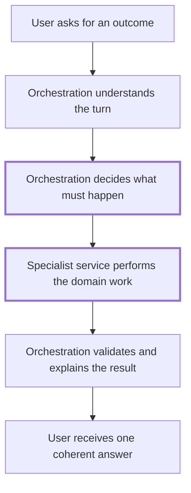

**Orchestration owns coordination. Specialist services own domain execution.**

---

## 2. Why This Service Exists

Without orchestration, a conversational tax system quickly becomes a collection of disconnected APIs. The frontend would need to know whether a question requires legal knowledge, tax computation, document evidence, form generation, report generation, conversation-only handling, or a multi-step combination of those capabilities.

The Orchestration Service centralizes that decision-making.

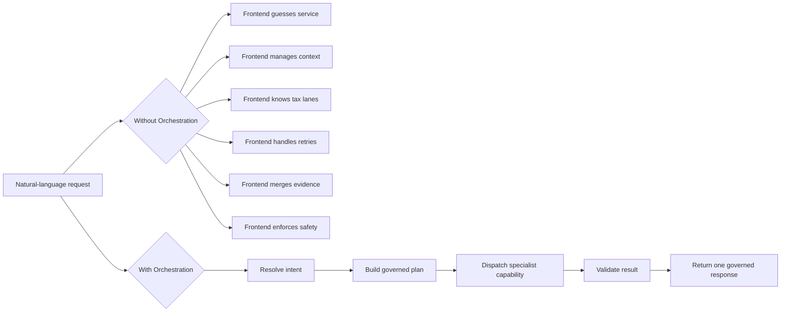

The result is a clean system boundary:

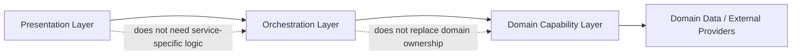

---

## 3. System Context

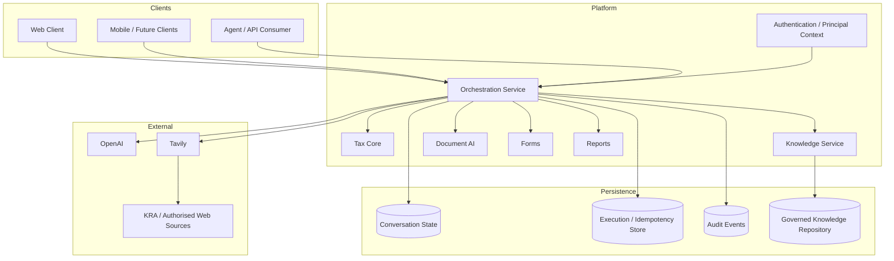

### What the Orchestration Service owns

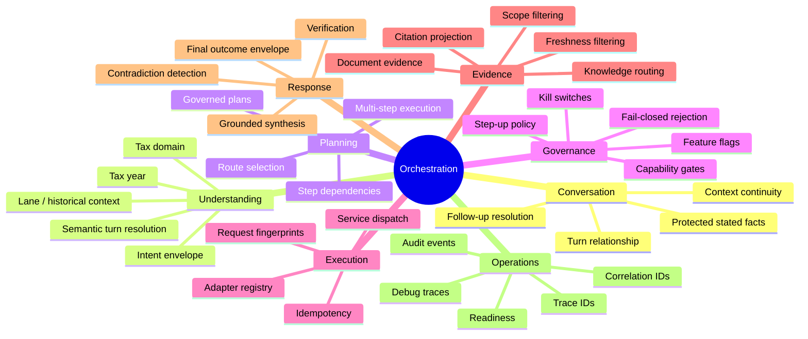

---

## 4. What This Service Does — and Does Not Do


A useful mental model is:

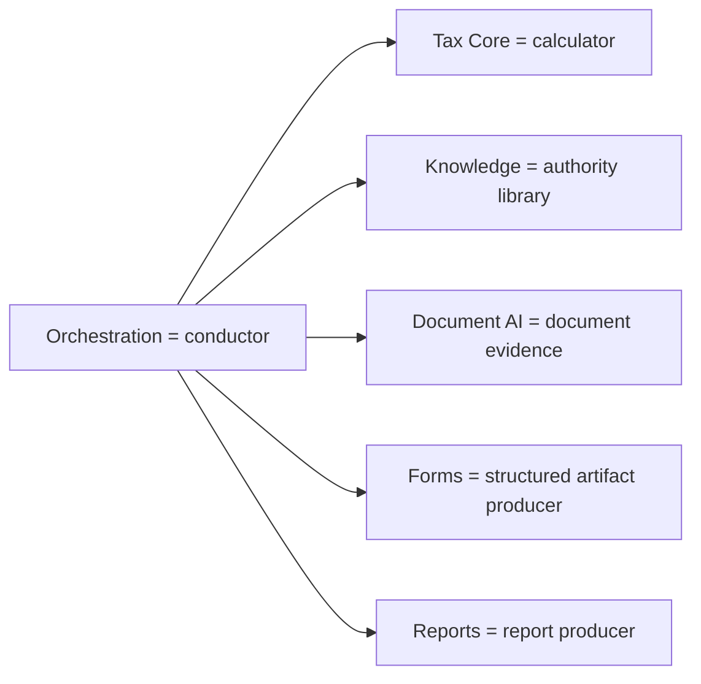

---

## 5. End-to-End Request Lifecycle

The primary conversational flow is split into **decision** and **execution**. A short-lived decision cache allows `/decide` and `/execute` to share the resolved semantic result without repeating the expensive resolution step.

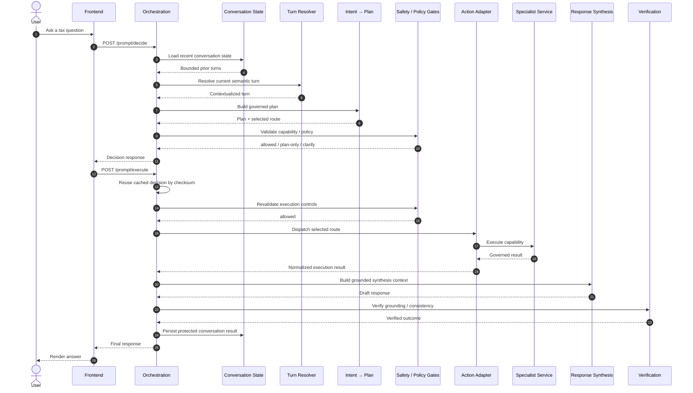

### Runtime state machine

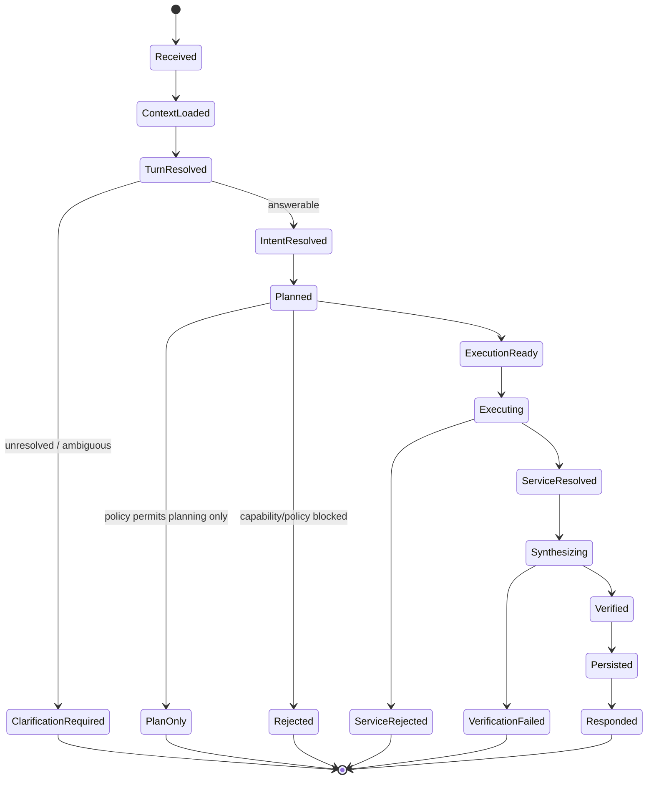

---

## 6. Conversation Understanding

The service does not treat every prompt as an isolated string. It first reconstructs the meaningful conversational state for the current taxpayer and conversation.

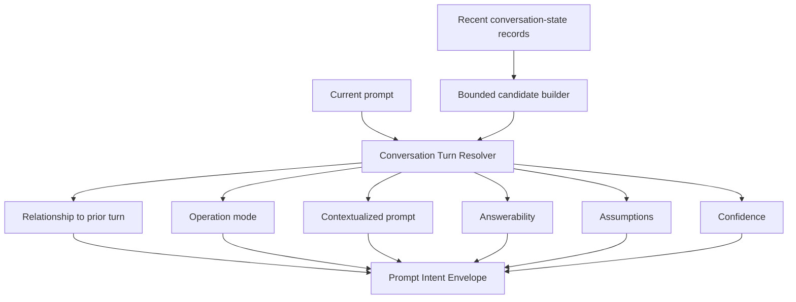

### Supported high-level intent families

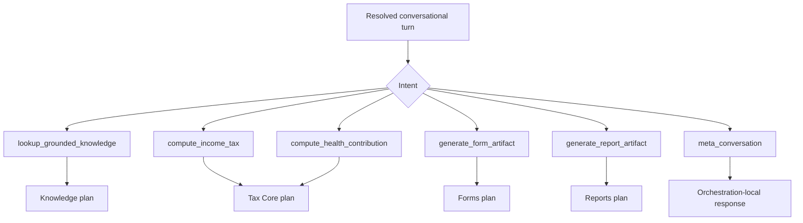

The turn resolver is given the trusted jurisdiction, tenant/product context, recent candidates, supported intents, supported knowledge domains, supported computations, and supported artifact operations. It must resolve the user turn rather than answer it directly.

---

## 7. Intent → Governed Plan

Intent is not dispatched directly. It is first converted into a canonical plan with explicit steps and service boundaries.

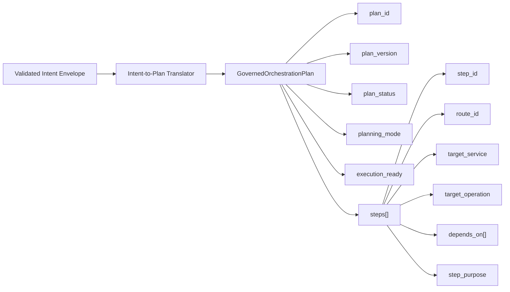

### Typical route mapping

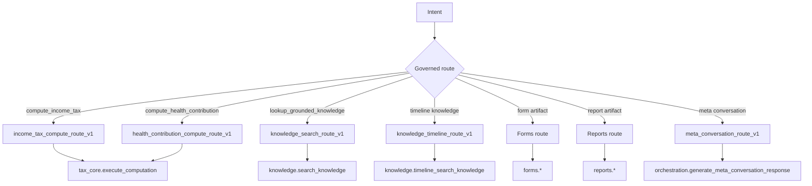

### Single-step vs multi-step planning

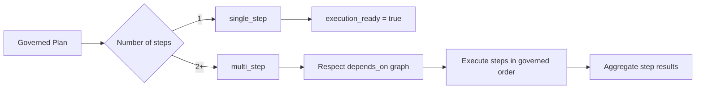

---

## 8. Execution Governance

The service is designed to fail closed rather than silently execute an unknown or disabled capability.

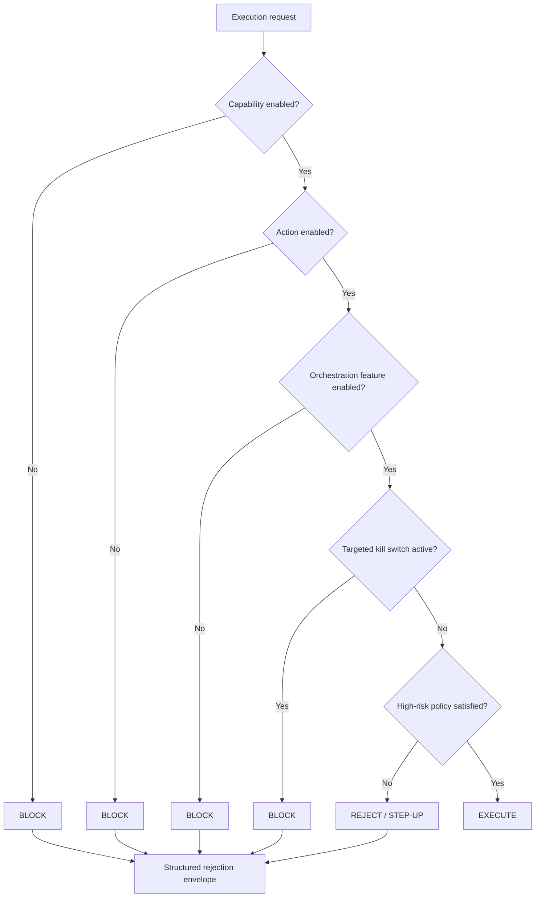

### Safety-control layers

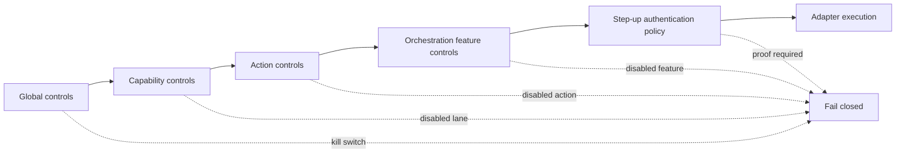

---

## 9. Action Adapter Architecture

The adapter layer prevents orchestration logic from being tightly coupled to each downstream implementation.

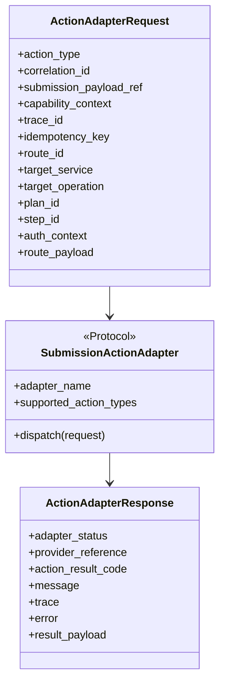

### Adapter registry

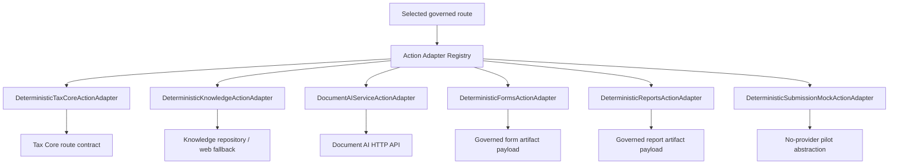

---

## 10. Specialist Service Routing

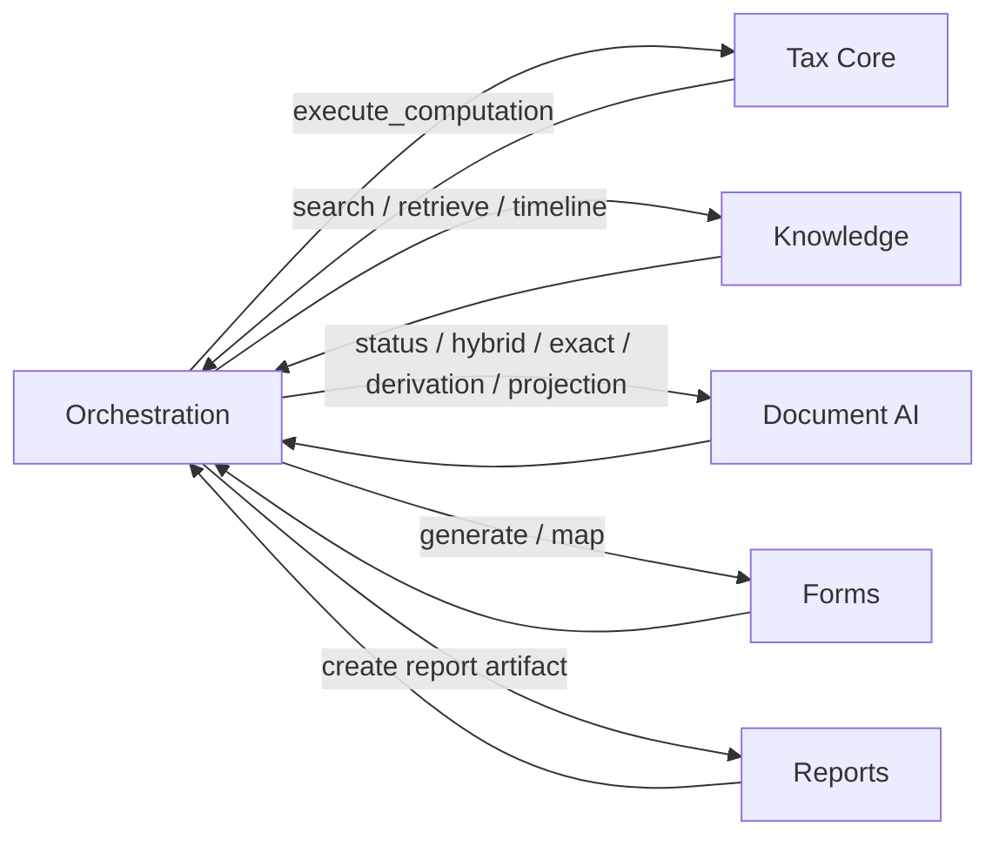

### Service responsibility boundary

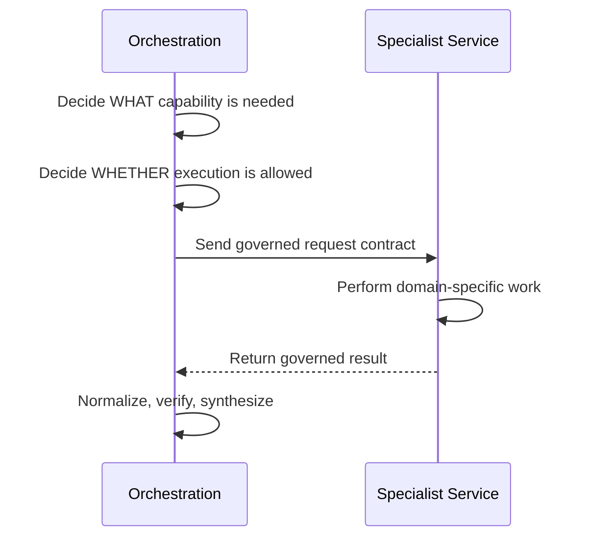

---

## 11. Knowledge and Evidence Flow

Knowledge lookup is not treated as arbitrary text retrieval. The service carries grounding metadata, source identity, authority, temporal context, scope relevance, and citation information through the response path.

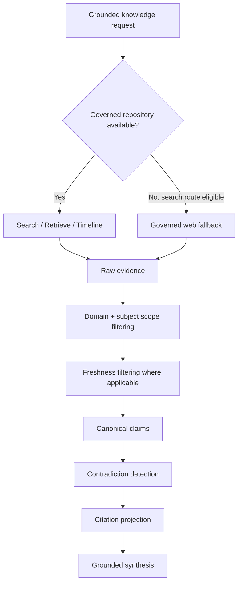

### Knowledge route capabilities

```mermaid
flowchart LR
    K["Knowledge capability"] --> S["search_knowledge"]
    K --> R["retrieve_knowledge"]
    K --> T["timeline_search_knowledge"]

    S --> S1["Find governed evidence by query"]
    R --> R1["Resolve known source / anchor identifiers"]
    T --> T1["Preserve chronological evidence ordering"]

    S1 --> G["Grounded evidence"]
    R1 --> G
    T1 --> G
```

### Evidence quality pipeline

```mermaid
flowchart TB
    RAW["Candidate evidence"] --> P1["Publication / admissibility checks"]
    P1 --> P2["Tax-domain scope analysis"]
    P2 --> P3["Entity / subject relevance"]
    P3 --> P4["Freshness policy"]
    P4 --> P5["Canonical claim extraction"]
    P5 --> P6["Contradiction detection"]
    P6 --> P7["Citation map"]
    P7 --> READY["Synthesis-ready evidence"]
```

---

## 12. Governed Web Fallback

When governed repository search is unavailable or exhausted for an eligible search path, the service can fall back to authorised web research rather than returning ungrounded model knowledge.

```mermaid
flowchart TB
    START["Knowledge search requires fallback"] --> Q["Normalize query + domain + tax year"]
    Q --> LIVE{"Time-sensitive domain?"}

    LIVE -->|Yes| KRA["Attempt live KRA source extract"]
    LIVE -->|No| TAV["Tavily search"]
    KRA --> TAV

    TAV --> TRUST["Restrict / classify trusted sources"]
    TRUST --> RAW["Web evidence"]
    KRA --> RAW

    RAW --> FRESH["Apply freshness policy"]
    FRESH --> SCOPE["Apply domain/subject scope filter"]

    SCOPE -->|Evidence remains| ACCEPT["web_grounded result"]
    SCOPE -->|No valid evidence| REJECT["domain_evidence_mismatch / unsupported scope"]
```

The fallback is still governed: lack of suitable evidence is represented as a rejection instead of permission to hallucinate an answer.

---

## 13. Document AI Integration

Orchestration requests **document evidence**, not legacy extraction jobs.

```mermaid
flowchart LR
    O["Orchestration"] --> A["DocumentAIServiceActionAdapter"]
    A --> ID{"Valid document_id?"}
    ID -->|No| R["Reject: document_id required"]
    ID -->|Yes| CFG{"Document AI URL configured?"}
    CFG -->|No| R2["Reject: integration unconfigured"]
    CFG -->|Yes| API["Document AI API"]
```

### Supported Document AI operations

```mermaid
flowchart TB
    DOC["Document AI route"] --> S["get_document_processing_status"]
    DOC --> H["search_document_evidence"]
    DOC --> E["retrieve_document_evidence"]
    DOC --> D["derive_document_evidence"]
    DOC --> W["create_workflow_evidence_projection"]

    S --> P1["GET /v1/documents/{document_id}"]
    H --> P2["POST /v1/document-evidence/hybrid-retrievals"]
    E --> P3["POST /v1/document-evidence/exact-retrievals"]
    D --> P4["POST /v1/document-evidence/derivations"]
    W --> P5["POST /v1/document-evidence/workflow-projections"]
```

### Semantic handoff

```mermaid
flowchart TB
    NEED["Information needed from authorised document"] --> R1["Entity scope"]
    NEED --> R2["Time scope"]
    NEED --> R3["Multiplicity"]
    NEED --> R4["Completeness"]
    NEED --> R5["Materiality"]
    NEED --> R6["Permitted derivations"]
    NEED --> R7["Uncertainty tolerance"]
    NEED --> R8["Confirmation policy"]

    R6 --> DIRECT["Direct observation only"]
    R7 --> NOEST["Estimated values prohibited"]
    R7 --> CONFLICT["Conflicts require confirmation"]
```

### Processing-aware response

```mermaid
stateDiagram-v2
    [*] --> Uploaded
    Uploaded --> Processing
    Processing --> Ready
    Uploaded --> Pending
    Pending --> Processing

    Ready --> EvidenceResolved
    Processing --> EvidencePending
    Pending --> EvidencePending
```

The orchestration result preserves lifecycle status and evidence limitations instead of pretending a still-processing document is ready.

---

## 14. Multi-Step Execution

Some user requests require more than one capability. Multi-step plans make that dependency explicit.

```mermaid
flowchart LR
    P["User request"] --> PLAN["Multi-step governed plan"]

    PLAN --> S1["Step 1<br/>Tax Core computation"]
    S1 --> S2["Step 2<br/>Knowledge grounding"]
    S2 --> AGG["Aggregate results"]
    AGG --> SYN["Compute + grounding synthesis"]

    S1 -. "depends_on" .-> S2
```

### Multi-step executor

```mermaid
flowchart TB
    PLAN["Plan steps"] --> ORDER["Resolve dependency order"]
    ORDER --> NEXT{"Next executable step?"}
    NEXT -->|Yes| DISPATCH["Dispatch step adapter"]
    DISPATCH --> RESULT{"Accepted?"}
    RESULT -->|Yes| STORE["Store step result"]
    STORE --> NEXT
    RESULT -->|No| STOP["Stop / report governed step error"]
    NEXT -->|No steps remain| AGG["Build aggregate"]
    AGG --> DONE["Return multi-step execution result"]
```

---

## 15. Idempotency and Determinism

The service builds deterministic fingerprints from execution inputs and stores execution envelopes so a repeated request can be recognized and replay-safe.

```mermaid
flowchart TB
    REQ["ActionExecutionRequest"] --> CANON["Canonical JSON"]
    CANON --> HASH["SHA-256 request fingerprint"]
    REQ --> KEY["Idempotency key"]

    HASH --> LOOKUP["Execution store lookup"]
    KEY --> LOOKUP

    LOOKUP --> CASE{Existing record?}
    CASE -->|No| EXEC["Execute action"]
    EXEC --> SAVE["Persist execution envelope"]
    SAVE --> OUT["Return result"]

    CASE -->|Yes + same fingerprint| REPLAY["Return stored result"]
    CASE -->|Yes + different fingerprint| CONFLICT["Reject idempotency conflict"]
```

### Trace identity

```mermaid
flowchart LR
    CID["correlation_id"] --> TRACE["trace_id"]
    REQ["canonical request"] --> FP["request_fingerprint"]
    KEY["idempotency_key"] --> EXECID["execution_envelope_id"]
    PLAN["plan_id"] --> LINEAGE["Execution lineage"]
    STEP["step_id"] --> LINEAGE
    TRACE --> LINEAGE
    FP --> LINEAGE
    EXECID --> LINEAGE
```

This design allows the same logical operation to be traced from incoming request to plan, step, adapter, persisted execution envelope, audit event, and final response.

---

## 16. Conversation State

Conversation continuity is tenant-, conversation-, and effective-taxpayer-scoped.

```mermaid
flowchart TB
    TURN["Completed turn"] --> PROJECT["Project persistable conversation context"]
    PROJECT --> SENSITIVE{"Contains protected stated facts?"}
    SENSITIVE -->|Yes| ENC["AES-256-GCM protection"]
    SENSITIVE -->|No| RECORD["Conversation-state record"]
    ENC --> RECORD
    RECORD --> STORE[(Conversation State Store)]

    NEXT["Next user turn"] --> LOAD["Load recent scoped records"]
    STORE --> LOAD
    LOAD --> BOUND["Build bounded candidates"]
    BOUND --> RESOLVE["Resolve next semantic turn"]
```

### Persistence modes

```mermaid
flowchart LR
    CONFIG["Conversation-state configuration"] --> MODE{Persistence mode}
    MODE --> MEM["In-memory store"]
    MODE --> DB["Persistent DB-backed store"]

    DB --> RET["Retention expiry"]
    RET --> PURGE["Scheduled purge"]
    PURGE --> LOCK["Single-replica transaction advisory lock"]
```

Sensitive taxpayer facts are protected before persistence using an AES-256-GCM conversation-state protector.

---

## 17. Decision Cache

`/decide` performs the expensive resolution work and temporarily caches the result. `/execute` can then reuse that decision.

```mermaid
sequenceDiagram
    participant UI
    participant Decide as /prompt/decide
    participant Cache as Resolution Cache
    participant Execute as /prompt/execute

    UI->>Decide: prompt
    Decide->>Decide: Resolve turn + intent + plan
    Decide->>Cache: Store by owner-scoped checksum
    Decide-->>UI: decision_id + prompt_checksum

    UI->>Execute: same prompt + decision
    Execute->>Cache: Lookup checksum
    alt cache hit
        Cache-->>Execute: resolved decision
    else cache miss / expired
        Execute->>Execute: Resolve again safely
    end
    Execute-->>UI: execution response
```

Implementation constraints include a bounded in-process cache, a short decision-to-execution TTL, maximum entry count, thread-safe access, and owner-scoped keys to prevent reuse across taxpayers.

---

## 18. Grounded Response Synthesis

Service execution is only part of the job. The user should receive an understandable answer rather than a raw backend payload.

```mermaid
flowchart TB
    EXEC["Execution result"] --> CTX["Governed synthesis context"]

    EVID["Grounded evidence"] --> CTX
    PLAN["Plan summary"] --> CTX
    COMP["Computation summary"] --> CTX
    SERV["Service result summary"] --> CTX
    CONV["Conversation context"] --> CTX

    CTX --> CONTRA["Grounding contradiction checks"]
    CTX --> FACT["Taxpayer fact consistency"]
    CONTRA --> LLM["Grounded response generator"]
    FACT --> LLM

    LLM --> DRAFT["Answer draft"]
    DRAFT --> VERIFY["Answer verification engine"]
    VERIFY --> FINAL["Final outcome envelope"]
```

### Synthesis context

```mermaid
mindmap
  root((Governed Synthesis Context))
    User request
      Prompt text
      Intent class
      Tax domain
      Answer mode
    Plan
      Plan summary
      Service result
      Computation summary
    Evidence
      Grounded evidence
      Explanations
      Citations
      Source references
      Authority summary
      Temporal applicability
    Conversation
      Context summary
      Taxpayer fact instructions
      Assumptions
    Integrity
      Warnings
      Contradictions
      Fact mismatches
      Tool runtime
```

### Bounded synthesis tooling

```mermaid
flowchart TB
    START["Initial synthesis request"] --> CALL{"Model requests governed tool?"}
    CALL -->|No| DRAFT["Parse answer draft"]
    CALL -->|Yes| TOOL["Dispatch allowed synthesis tool"]
    TOOL --> EXTEND["Extend evidence + citation context"]
    EXTEND --> LIMIT{"Iteration limit reached?"}
    LIMIT -->|No| CALL
    LIMIT -->|Yes| FINALPROMPT["Require best answer from evidence already gathered"]
    FINALPROMPT --> DRAFT
```

The model is not granted unlimited retrieval loops. Governed synthesis tooling is bounded and the final answer must use the evidence already obtained once the retrieval limit is reached.

---

## 19. Verification and Integrity

```mermaid
flowchart TB
    DRAFT["Synthesized answer"] --> V1["Grounding verification"]
    V1 --> V2["Citation integrity"]
    V2 --> V3["Canonical claim consistency"]
    V3 --> V4["Taxpayer fact consistency"]
    V4 --> V5["Contradiction signals"]
    V5 --> DECIDE{"Valid?"}

    DECIDE -->|"Yes"| FINAL["Verified final response"]
    DECIDE -->|"No"| FAIL["Fail closed / expose verification failure"]
```

### Why the verification layer matters

```mermaid
flowchart LR
    MODEL["Language model"] -->|can generate fluent text| RISK["Risk of unsupported claim"]
    EVID["Governed evidence"] --> VERIFY["Verification layer"]
    MODEL --> VERIFY
    VERIFY -->|supported| ANSWER["User-facing answer"]
    VERIFY -->|unsupported| BLOCK["Rejected / corrected outcome"]
```

The architecture treats fluency and correctness as separate concerns.

---

## 20. Authentication and Trusted Ownership

A request is associated with a trusted principal and an effective taxpayer owner before conversational state or execution context is reused.

```mermaid
flowchart TB
    REQ["Incoming request"] --> AUTH["Resolve orchestration principal"]
    AUTH --> OWNER["Resolve trusted conversation owner"]

    OWNER --> TENANT["tenant_id"]
    OWNER --> USER["effective_taxpayer_user_id"]
    OWNER --> ROLE["role"]
    OWNER --> DELEG["delegation_id, when applicable"]

    TENANT --> SCOPE["Scope state + cache + audit"]
    USER --> SCOPE
    ROLE --> POLICY["Authorization / policy checks"]
    DELEG --> POLICY
```

### Downstream auth propagation

```mermaid
sequenceDiagram
    participant Client
    participant Orch as Orchestration
    participant Doc as Document AI

    Client->>Orch: Authorization / trusted context
    Orch->>Orch: Resolve principal + owner
    Orch->>Doc: Authorization + X-Auth-Context
    Note over Orch,Doc: Auth context is propagated only through the governed adapter request
    Doc-->>Orch: Evidence result
```

---

## 21. Error and Rejection Philosophy

Errors are structured outcomes, not accidental control flow.

```mermaid
flowchart TB
    REQUEST["Request"] --> CHECK{"Can the system safely proceed?"}

    CHECK -->|Invalid input| E1["invalid_orchestration_request"]
    CHECK -->|Unsupported scope| E2["unsupported_orchestration_scope"]
    CHECK -->|Ambiguous conversation| E3["clarification_required"]
    CHECK -->|Policy disabled| E4["feature / kill-switch rejection"]
    CHECK -->|Missing evidence| E5["unsupported_knowledge_scope"]
    CHECK -->|Domain mismatch| E6["domain_evidence_mismatch"]
    CHECK -->|Document unavailable| E7["document_ai_* rejection"]
    CHECK -->|Idempotency conflict| E8["execution rejection"]
    CHECK -->|Verification failure| E9["synthesis / verification failure"]
    CHECK -->|Safe| OK["Continue"]
```

### Canonical rejection envelope

```mermaid
classDiagram
    class Rejection {
      +error_code
      +message
      +reason_code
      +reason
      +required_controls[]
      +next_allowed_actions[]
      +trace_id
      +rejected_context
    }

    class RejectedContext {
      +action_type
      +supported_lane_id
      +historical_version_id
      +tax_year
      +correlation_id
    }

    Rejection --> RejectedContext
```

The service prefers an explicit `unsupported`, `clarification_required`, `blocked`, or other governed status to silently taking an unsafe path.

---

## 22. Observability

Every major boundary is designed to carry traceable identity.

```mermaid
flowchart LR
    REQUEST["Request"] --> CID["Correlation ID middleware"]
    CID --> TRACE["Trace ID"]
    TRACE --> DEC["Decision"]
    DEC --> PLAN["Plan"]
    PLAN --> STEP["Step"]
    STEP --> ADAPTER["Adapter"]
    ADAPTER --> RESULT["Result"]
    RESULT --> AUDIT["Audit event"]
    RESULT --> RESPONSE["Response"]

    TRACE -.-> AUDIT
    PLAN -.-> AUDIT
    STEP -.-> AUDIT
```

### Operational signals

```mermaid
mindmap
  root((Observability))
    Request identity
      correlation_id
      trace_id
      prompt_checksum
    Planning
      decision_id
      plan_id
      route_id
      step_id
    Execution
      adapter_request_id
      idempotency_key
      request_fingerprint
      execution_envelope_id
    Evidence
      source_id
      source_version_id
      anchor_id
      grounding_status
    Runtime
      timed stages
      debug events
      audit events
      readiness
      rejection reason codes
```

---

## 23. Public API Surface

```mermaid
flowchart TB
    API["Orchestration API"] --> H["Health & Readiness"]
    API --> P["Prompt Lifecycle"]
    API --> C["Conversation Lifecycle"]
    API --> L["Legacy / direct governed execution"]
    API --> G["Unsupported-scope guard"]

    H --> H1["GET /healthz"]
    H --> H2["GET /readyz"]

    P --> P1["POST /v1/orchestration/prompt/ingest"]
    P --> P2["POST /v1/orchestration/prompt/decide"]
    P --> P3["POST /v1/orchestration/prompt/execute"]
    P --> P4["POST /v1/orchestration/prompt/execute/stream"]

    C --> C1["GET /v1/orchestration/conversations"]
    C --> C2["PATCH /v1/orchestration/conversations/{conversation_id}"]
    C --> C3["DELETE /v1/orchestration/conversations/{conversation_id}"]
    C --> C4["POST /v1/orchestration/conversations/bulk-delete"]

    L --> L1["POST /v1/orchestration/income-tax/execute"]

    G --> G1["/v1/orchestration/{scope}/{remaining_path} → fail closed"]
```

### Recommended frontend flow

```mermaid
sequenceDiagram
    actor User
    participant UI
    participant D as /prompt/decide
    participant E as /prompt/execute or /stream

    User->>UI: Submit prompt
    UI->>D: Resolve intent and plan
    D-->>UI: resolved / clarification_required

    alt clarification required
        UI-->>User: Ask targeted clarification
    else execution allowed
        UI->>E: Execute decision
        E-->>UI: Governed response
        UI-->>User: Render answer
    end
```

---

## 24. Streaming

The streaming endpoint wraps the same governed execution path rather than introducing a second orchestration implementation.

```mermaid
sequenceDiagram
    participant UI
    participant Stream as /prompt/execute/stream
    participant Worker as Execution Worker
    participant LLM as Streaming Generator

    UI->>Stream: Start execution
    Stream-->>UI: SSE event: start
    Stream->>Worker: Run normal execute path

    Worker->>LLM: Generate response
    LLM-->>Stream: incremental output
    Stream-->>UI: streamed events

    alt success
        Worker-->>Stream: final execution response
        Stream-->>UI: SSE event: final
    else governed / runtime error
        Worker-->>Stream: error
        Stream-->>UI: SSE event: error
    end
```

Streaming responses use Server-Sent Events and disable intermediary buffering so output can reach the client progressively.

---

## 25. Readiness and Runtime Controls

```mermaid
flowchart LR
    HEALTH["/healthz"] --> H["Process is alive"]
    READY["/readyz"] --> R["Runtime readiness"]
    R --> S["response_synthesis_enabled"]
    R --> C["conversation_continuity_enabled"]
    R --> G["release gate surface"]
```

### Release-safety model

```mermaid
flowchart TB
    CODE["Deployed code"] --> FLAGS["Runtime feature flags"]
    FLAGS --> KILL["Kill switches"]
    KILL --> TENANT["Pilot tenant guardrails"]
    TENANT --> CAP["Capability gate"]
    CAP --> ACTION["Action policy"]
    ACTION --> READY["Execution permitted"]
```

This allows the service to be deployed while keeping specific capabilities disabled or limited until they are ready.

---

## 26. Core Module Map


---

## 27. Data Lineage

```mermaid
flowchart LR
    PROMPT["Prompt"] --> CHECKSUM["prompt_checksum"]
    PROMPT --> TURN["turn_resolution"]
    TURN --> INTENT["intent_envelope"]
    INTENT --> PLAN["plan_id"]
    PLAN --> ROUTE["route_id"]
    ROUTE --> STEP["step_id"]
    STEP --> ADAPTER["adapter_request_id"]
    ADAPTER --> EXEC["execution_envelope_id"]
    EXEC --> RESULT["result_payload"]
    RESULT --> SYN["synthesis context"]
    SYN --> FINAL["final outcome"]

    CHECKSUM -.-> FINAL
    PLAN -.-> FINAL
    EXEC -.-> FINAL
```

### Evidence lineage

```mermaid
flowchart LR
    SOURCE["source_id"] --> VERSION["source_version_id"]
    VERSION --> ANCHOR["anchor_id"]
    ANCHOR --> CLAIM["canonical claim"]
    CLAIM --> EXPL["explanation item"]
    EXPL --> CIT["citation index"]
    CIT --> ANSWER["user-facing claim"]
```

---

## 28. Hackathon Walkthrough

A judge should be able to follow the complete value proposition in under two minutes.

```mermaid
flowchart TB
    J1["1. User asks a natural-language Kenyan tax question"] --> J2
    J2["2. Orchestration restores only relevant conversation context"] --> J3
    J3["3. Semantic turn resolver determines what the user actually wants"] --> J4
    J4["4. Intent is converted into a deterministic governed plan"] --> J5
    J5["5. Safety controls confirm the capability is permitted"] --> J6
    J6["6. Adapter sends the work to the specialist service"] --> J7
    J7["7. Evidence / computation / artifact result comes back"] --> J8
    J8["8. Grounding, temporal scope and contradictions are checked"] --> J9
    J9["9. OpenAI synthesizes a user-friendly answer from governed context"] --> J10
    J10["10. Verification checks the answer before release"] --> J11
    J11["11. Conversation state, trace identity and audit lineage are persisted"]
```

### Why this architecture matters in a competition

```mermaid
quadrantChart
    title Orchestration architecture value
    x-axis Low governance --> High governance
    y-axis Low user utility --> High user utility

    quadrant-1 Strong production architecture
    quadrant-2 Useful but weakly governed
    quadrant-3 Weak architecture
    quadrant-4 Governed but hard to use

    "Raw service APIs": [0.25, 0.35]
    "Ungrounded chatbot": [0.15, 0.70]
    "Rules-only router": [0.55, 0.45]
    "Kodi Orchestration": [0.88, 0.90]
```

The service demonstrates that an AI-enabled system can combine natural-language interaction with deterministic routing, explicit policy controls, domain-service isolation, evidence grounding, protected conversation state, reproducible execution, and end-to-end traceability.

---

## 29. Key Design Principles

```mermaid
mindmap
  root((Design Principles))
    Governed
      Explicit capability boundaries
      Policy gates
      Fail closed
    Deterministic
      Canonical plans
      Stable hashes
      Replay-safe execution
    Grounded
      Evidence before claims
      Authority metadata
      Temporal applicability
    Conversational
      Follow-up resolution
      Bounded prior context
      Protected state
    Modular
      Adapter contracts
      Specialist services
      No frontend coupling
    Observable
      Correlation
      Trace
      Audit
      Debug stages
    Safe
      Feature flags
      Kill switches
      Step-up policy
      Verification
```

---

## 30. Failure Scenarios at a Glance

```mermaid
flowchart LR
    A["Ambiguous follow-up"] --> A1["Clarification"]
    B["Unsupported tax scope"] --> B1["Reject"]
    C["Disabled capability"] --> C1["Policy block"]
    D["Duplicate execution"] --> D1["Replay stored envelope"]
    E["Changed request under same key"] --> E1["Idempotency conflict"]
    F["Knowledge repository unavailable"] --> F1["Eligible governed web fallback"]
    G["No trustworthy evidence"] --> G1["Reject rather than invent"]
    H["Document still processing"] --> H1["Return pending + limitations"]
    I["Downstream failure"] --> I1["Structured adapter rejection"]
    J["Contradictory evidence"] --> J1["Integrity signal / guarded synthesis"]
    K["Unsupported API scope"] --> K1["404 fail closed"]
```

---

## 31. Security and Privacy Posture

```mermaid
flowchart TB
    AUTH["Trusted principal"] --> OWNER["Effective taxpayer owner"]
    OWNER --> SCOPE["Tenant + user scoped state"]

    FACTS["Sensitive stated facts"] --> AES["AES-256-GCM"]
    AES --> STORE[(Conversation store)]

    REQUEST["Execution request"] --> FP["Deterministic fingerprint"]
    FP --> IDEM[(Idempotency store)]

    OWNER --> AUDIT["Auditable authorization context"]
    REQUEST --> TRACE["Correlation + trace identity"]

    TRACE --> DOWN["Controlled downstream propagation"]
```

The codebase separates:
- trusted ownership resolution from free-form request data,
- protected taxpayer facts from normal conversation metadata,
- orchestration decisions from specialist service execution,
- and model synthesis from post-generation verification.

---

## 32. Testing and Evaluation Philosophy

```mermaid
flowchart TB
    CASE["Evaluation case"] --> RESET["Reset safety + idempotency + audit state"]
    RESET --> APP["Create isolated orchestration app"]
    APP --> FLOW["Run decide / execute flow"]
    FLOW --> ACTUAL["Capture normalized outcome"]
    ACTUAL --> REPLAY["Replay deterministic case"]
    REPLAY --> MATCH{"Replay matches?"}
    MATCH -->|No| FAIL["Fail evaluation"]
    MATCH -->|Yes| EXPECT{"Matches expected outcome?"}
    EXPECT -->|No| FAIL
    EXPECT -->|Yes| PASS["Pass"]
```

The evaluation harness validates deterministic behavior and replay consistency for governed flows, while live model synthesis can be treated separately where deterministic byte-for-byte replay is not appropriate.

---

## 33. Operational Mental Model


---

## 34. In One Sentence

```mermaid
flowchart LR
    ASK["Understand"] --> PLAN["Plan"]
    PLAN --> GOVERN["Govern"]
    GOVERN --> DELEGATE["Delegate"]
    DELEGATE --> GROUND["Ground"]
    GROUND --> VERIFY["Verify"]
    VERIFY --> EXPLAIN["Explain"]
    EXPLAIN --> REMEMBER["Remember safely"]
```

**The Orchestration Service is the governed intelligence layer that converts a conversational request into the right deterministic platform action and returns a verified, evidence-backed answer without collapsing specialist service boundaries.**

---

## 35. Quick Reference

```mermaid
flowchart TB
    Q["What should I remember?"] --> Q1["Frontend talks to Orchestration"]
    Q1 --> Q2["Orchestration resolves the conversation"]
    Q2 --> Q3["Intent becomes a governed plan"]
    Q3 --> Q4["Policy gates can stop execution"]
    Q4 --> Q5["Adapters isolate downstream services"]
    Q5 --> Q6["Evidence is scoped and grounded"]
    Q6 --> Q7["Execution is traceable + idempotent"]
    Q7 --> Q8["Response synthesis is verified"]
    Q8 --> Q9["Conversation state is protected"]
    Q9 --> Q10["Unsupported behavior fails closed"]
```

---

## License / Repository Policy

This README documents the Orchestration Service architecture represented by the repository source. Repository-specific licensing, deployment commands, environment-variable inventories, and contribution policy should be maintained at the repository root or in their dedicated operational documentation rather than invented here.

