# Storage Service

> **Deterministic storage governance, capability issuance, object metadata, retention policy, and cleanup orchestration for the backend.**

[](#)
[](#)
[](#)
[](#)

## Navigation

- **Start here:** [Why this service exists](#1-why-this-service-exists) → [System position](#2-where-storage-sits-in-the-system) → [Hackathon architecture story](#4-architecture-story-for-a-hackathon-judge)
- **Core behavior:** [Capabilities](#6-capability-model) → [Upload](#7-upload-capability-lifecycle) → [Download](#8-download-capability-lifecycle) → [Metadata](#9-object-metadata-lifecycle)
- **Governance:** [Retention policy](#10-retention-policy) → [Cleanup](#11-retention-cleanup) → [Determinism](#12-determinism-model) → [Errors](#13-error-contract)
- **Operations:** [API surface](#15-api-surface) → [Configuration](#18-configuration) → [Security](#22-security-model-visible-in-this-source) → [Operational lifecycle](#24-operational-lifecycle)
- **Collaboration:** [Constraints/hardening](#29-current-constraints-and-production-hardening-map) → [Integration contract](#30-integration-contract-for-other-services) → [Maintenance](#34-maintenance-guide) → [Review checklist](#35-review-checklist-for-collaborators)

---

## 1. Why this service exists

The Storage Service is the **governed control plane around stored artifacts**. Its job is not to understand tax summaries, worksheets, audit packages, reports, or exports as business documents. Its job is to enforce the storage contract that all of those artifacts depend on:

- issue deterministic **upload capabilities**;
- issue deterministic **download capabilities** only for known objects;
- expose object **metadata**;
- assign and track **retention classes**;
- orchestrate **retention cleanup eligibility**;
- return one canonical, traceable **error contract**;
- provide health/readiness endpoints;
- fail closed for unsupported storage scopes.

The implementation in this directory is a **deterministic storage-governance runtime**. It keeps capability and retention metadata in process memory and emits capability URLs such as `https://storage.local/capabilities/{capability_id}`. There is no object-byte upload/download handler in the supplied source, so this service should be understood as the **capability/metadata/retention layer**, not the binary object store itself.

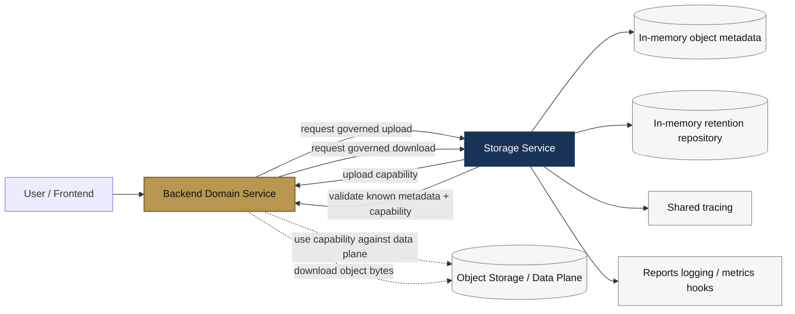

### One-sentence mental model

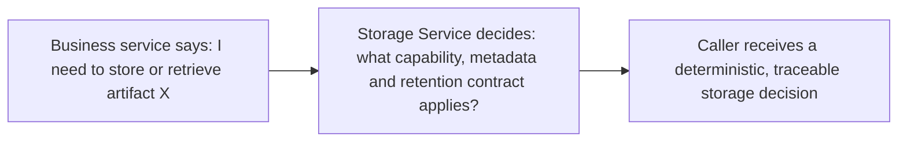

---

## 2. Where Storage sits in the system

Only integrations visible in the supplied source are shown as concrete dependencies. Everything else is represented as a generic caller rather than invented architecture.

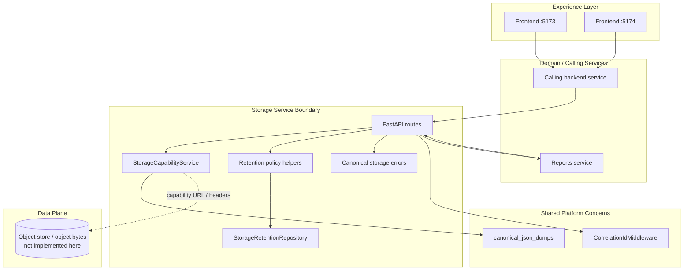

### Boundary: what it owns vs. what it does not own

```mermaid
flowchart LR
    subgraph Owns[Storage Service OWNS]
        O1[Capability issuance]
        O2[Capability replay/idempotency semantics]
        O3[Object metadata registry]
        O4[Retention classification]
        O5[Retention expiry calculation]
        O6[Cleanup eligibility state]
        O7[Canonical storage errors]
        O8[Storage trace/correlation context]
    end

    subgraph DoesNotOwn[Storage Service DOES NOT IMPLEMENT in supplied source]
        N1[Binary object upload]
        N2[Binary object download]
        N3[Cloud bucket SDK integration]
        N4[Durable DB persistence]
        N5[Authentication/authorization policy]
        N6[Physical deletion of object bytes]
    end

    Owns --- DoesNotOwn
```

---

## 3. The service at a glance

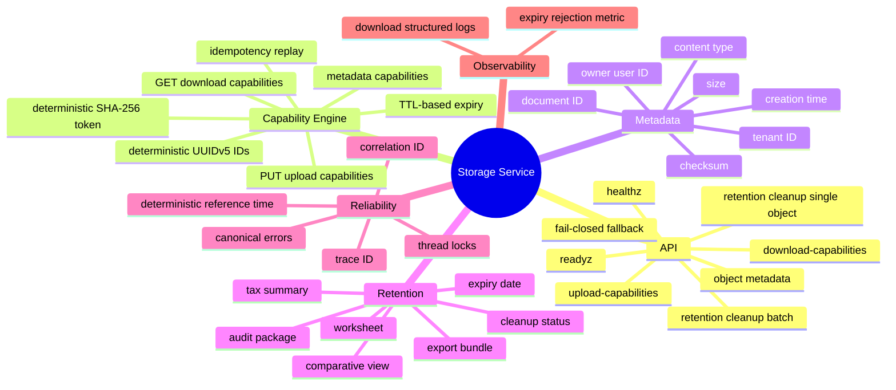

### Core runtime components

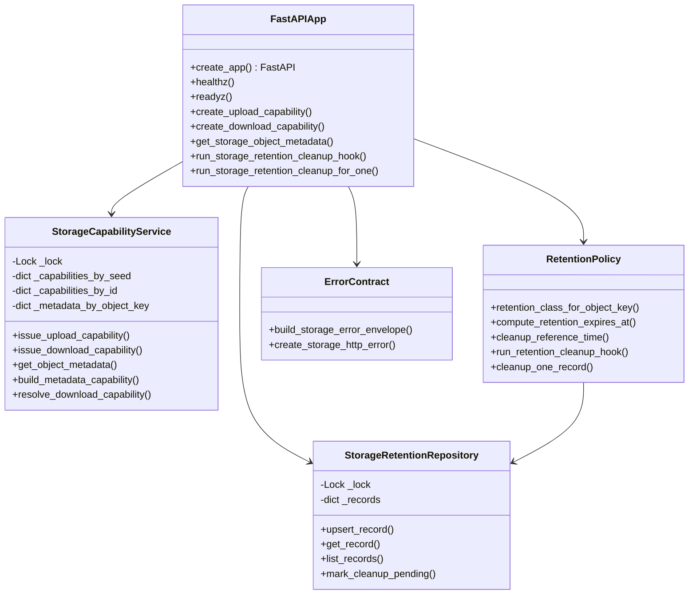

---

## 4. Architecture story for a hackathon judge

A judge should be able to understand the service in four pictures.

### 4.1 Request enters through a governed API boundary

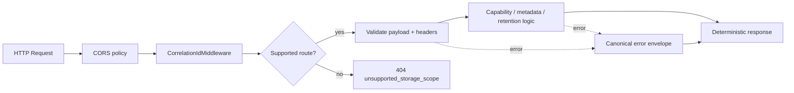

### 4.2 Capabilities are deterministic and replayable

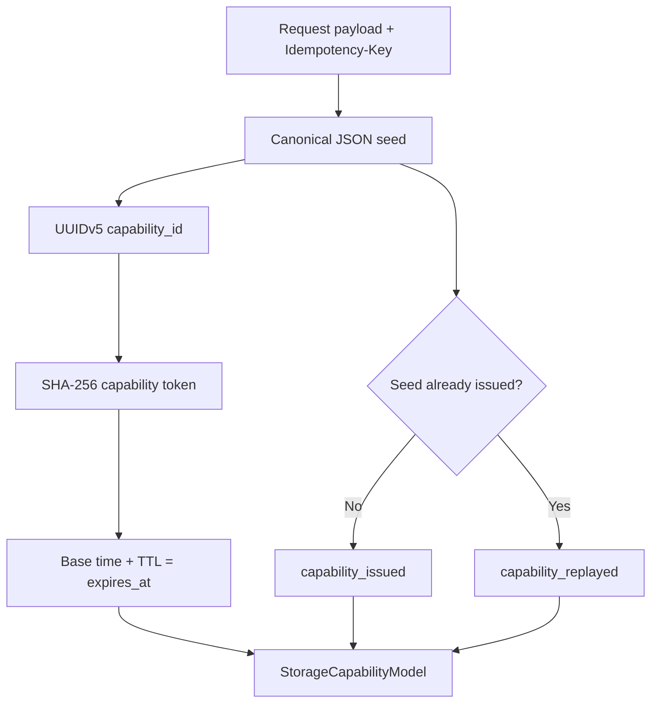

### 4.3 Object metadata and retention are coupled at upload-capability issuance

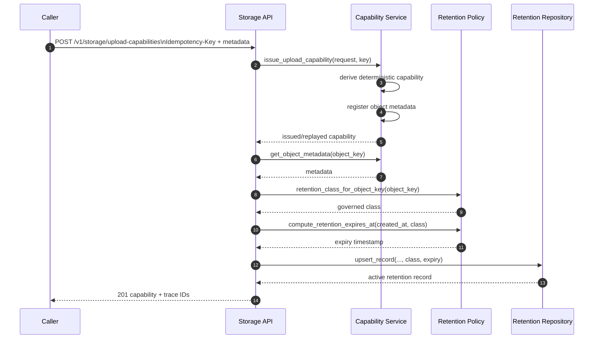

### 4.4 Cleanup does not delete bytes; it marks eligible records for cleanup

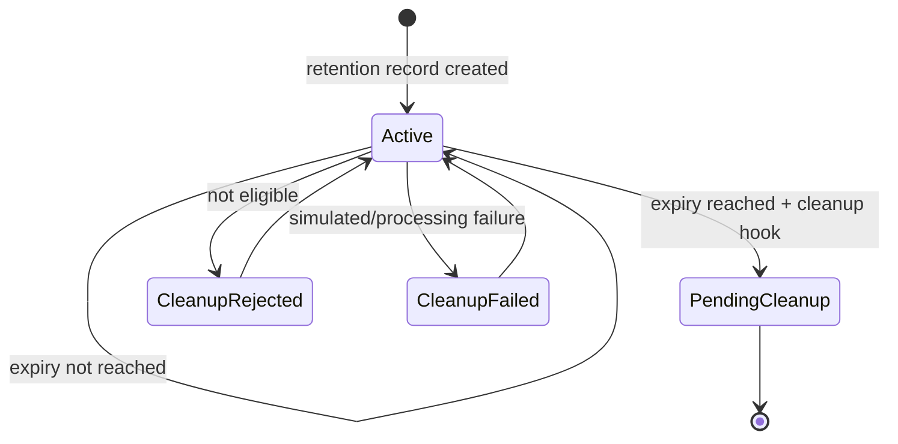

---

## 5. Detailed component map

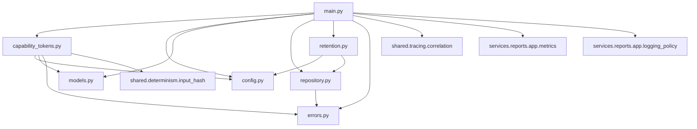

### Source-file responsibility map

| File | Responsibility |
|---|---|
| `capability_tokens.py` | Deterministic capability IDs, tokens, TTLs, replay semantics, object metadata registry, download capability resolution |
| `config.py` | Service version, capability TTLs, deterministic capability base time |
| `errors.py` | Canonical reason codes, normalized error envelope, hashed trace/correlation identifiers |
| `main.py` | FastAPI app, CORS, middleware, routes, request parsing, status mapping, logging/metrics integration |
| `models.py` | Immutable dataclass request/capability/object-metadata models |
| `repository.py` | In-memory retention metadata and cleanup-state repository |
| `retention.py` | Retention classification, expiry calculation, cleanup reference time, batch/single cleanup hooks |

---

## 6. Capability model

A **capability** is the storage service's deterministic permission artifact for a specific governed object key.

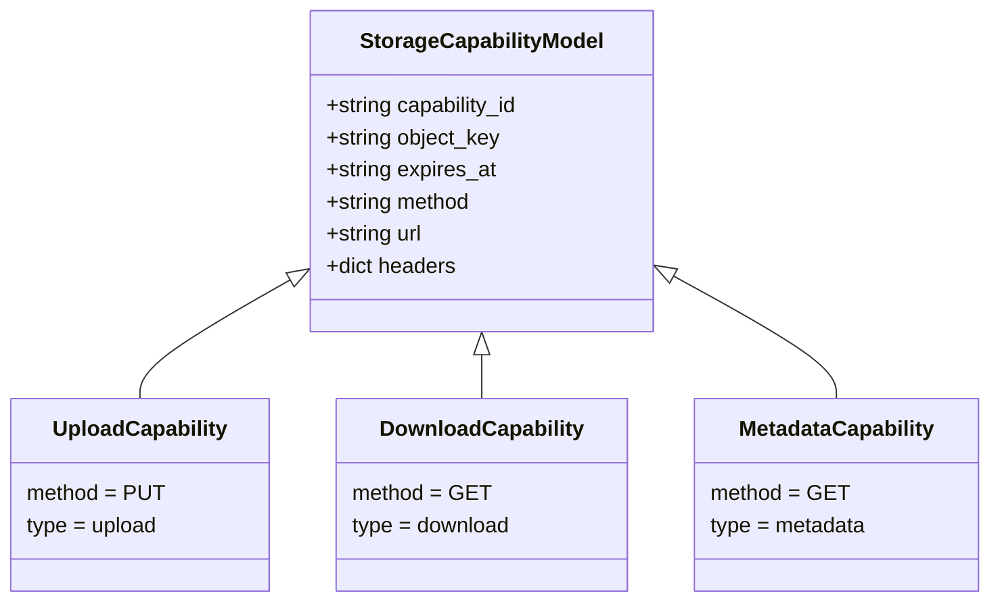

### Capability derivation

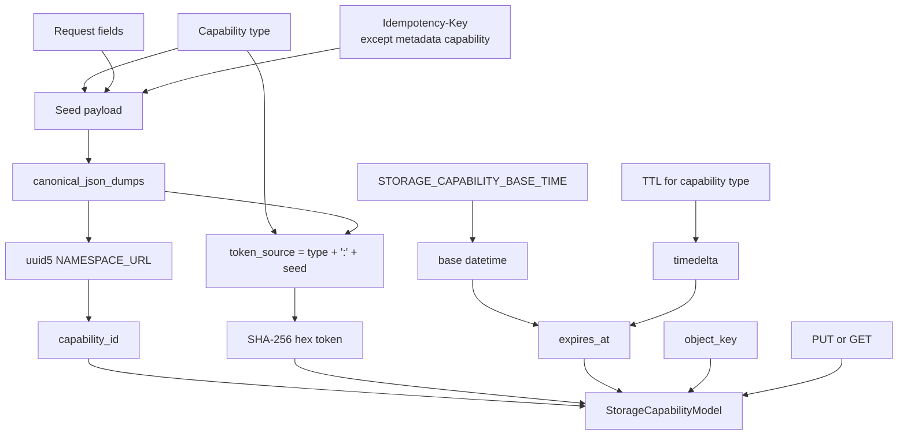

### Capability response anatomy

```mermaid
flowchart LR
    CAP[Capability]
    --> ID[capability_id\nUUIDv5]
    CAP --> KEY[object_key]
    CAP --> EXP[expires_at]
    CAP --> METHOD[method\nPUT / GET]
    CAP --> URL[url\nhttps://storage.local/capabilities/{id}]
    CAP --> HDR[headers]
    HDR --> TOK[x-storage-capability-token]
    HDR --> TEN[x-storage-tenant-id]
```

### Idempotency contract

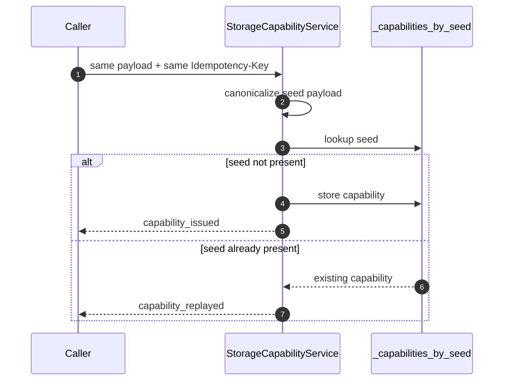

> **Important:** replay identity is based on the canonical seed, which includes capability type, request fields, and the `Idempotency-Key` for upload/download issuance.

---

## 7. Upload capability lifecycle

### 7.1 End-to-end upload-capability flow

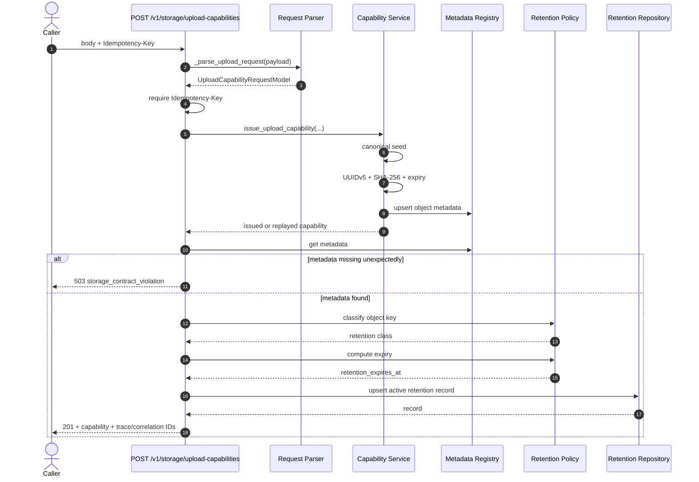

### 7.2 Upload request fields

```mermaid
flowchart TB
    REQ[UploadCapabilityRequestModel]
    --> T[tenant_id : string]
    REQ --> O[owner_user_id : string]
    REQ --> K[object_key : string]
    REQ --> C[content_type : string]
    REQ --> S[expected_size_bytes : int >= 1]
    REQ --> H[checksum_sha256 : string]
    REQ --> D[document_id : string | null]

    HEAD[Required HTTP header]
    --> I[Idempotency-Key : non-empty]
```

### 7.3 Upload capability example

```bash
curl -X POST http://localhost:8000/v1/storage/upload-capabilities \
  -H 'Content-Type: application/json' \
  -H 'Idempotency-Key: upload-tax-summary-001' \
  -d '{
    "tenant_id": "tenant-123",
    "owner_user_id": "user-456",
    "object_key": "tax_summary-tenant-123-report-001.pdf",
    "content_type": "application/pdf",
    "expected_size_bytes": 582144,
    "checksum_sha256": "<sha256>",
    "document_id": "document-001"
  }'
```

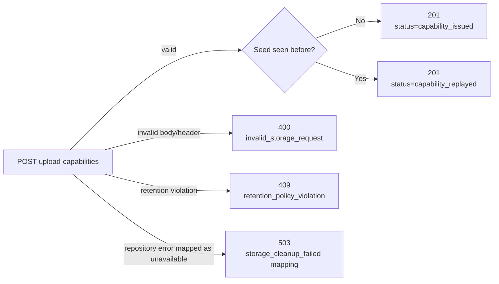

> In the current in-memory `upsert_record()` implementation, the explicit repository validation failure is `retention_policy_violation` for an empty object key; upload parsing already rejects an empty object key. The broader status mapping exists in `main.py` for repository error codes.

---

## 8. Download capability lifecycle

A download capability is only issued when metadata for the requested `object_key` is already known to the in-process capability service.

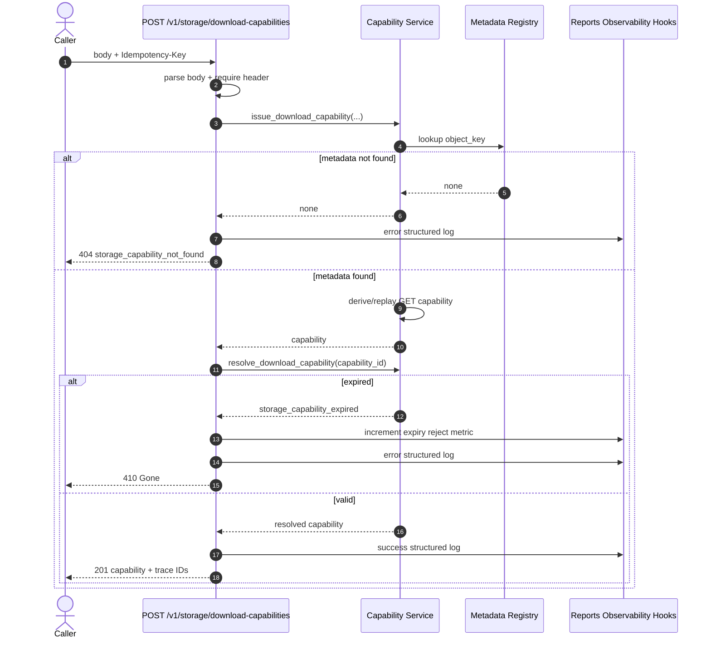

### Download capability state logic

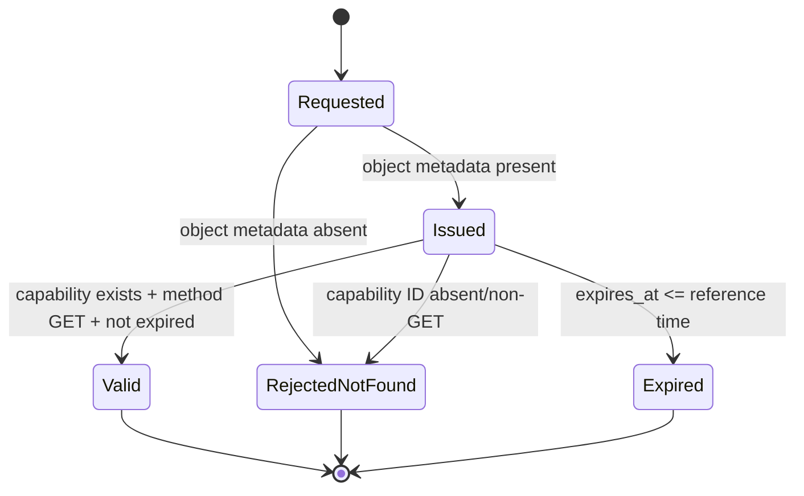

### Download request fields

```mermaid
flowchart TB
    REQ[DownloadCapabilityRequestModel]
    --> T[tenant_id : string]
    REQ --> O[owner_user_id : string]
    REQ --> K[object_key : string]
    REQ --> D[document_id : string | null]

    HEAD[Required HTTP header]
    --> I[Idempotency-Key : non-empty]
```

### Download capability example

```bash
curl -X POST http://localhost:8000/v1/storage/download-capabilities \
  -H 'Content-Type: application/json' \
  -H 'Idempotency-Key: download-report-001' \
  -d '{
    "tenant_id": "tenant-123",
    "owner_user_id": "user-456",
    "object_key": "tax_summary-tenant-123-report-001.pdf",
    "document_id": "document-001"
  }'
```

---

## 9. Object metadata lifecycle

Object metadata is created during **upload-capability issuance** and can later be read through the metadata endpoint.

```mermaid
erDiagram
    STORAGE_OBJECT_METADATA {
      string object_key PK
      string tenant_id
      string owner_user_id
      string content_type
      int size_bytes
      string checksum_sha256
      string created_at
      string document_id "nullable"
    }

    STORAGE_RETENTION_RECORD {
      string object_key PK
      string tenant_id
      string owner_user_id
      string content_type
      int size_bytes
      string checksum_sha256
      string created_at
      string retention_class
      string retention_expires_at
      string cleanup_status
    }

    STORAGE_OBJECT_METADATA ||--|| STORAGE_RETENTION_RECORD : "object_key drives retention registration"
```

### Metadata request

```mermaid
sequenceDiagram
    autonumber
    participant C as Caller
    participant A as GET /v1/storage/objects/{object_key}/metadata
    participant S as Capability Service

    C->>A: object_key
    A->>A: trim + reject empty key
    A->>S: get_object_metadata(object_key)
    alt absent
        S-->>A: none
        A-->>C: 404 storage_capability_not_found
    else present
        S-->>A: StorageObjectMetadataModel
        A->>S: build_metadata_capability(object_key, tenant_id)
        S-->>A: metadata GET capability registered internally
        A-->>C: 200 status=ok + metadata + trace IDs
    end
```

> The endpoint returns the metadata payload, not the newly created metadata capability.

### Metadata example

```bash
curl http://localhost:8000/v1/storage/objects/tax_summary-tenant-123-report-001.pdf/metadata
```

---

## 10. Retention policy

Retention is derived from the **object key naming convention**.

```mermaid
flowchart TD
    K[Normalize object_key\ntrim + lowercase]
    --> TAX{"contains 'tax_summary'?"}
    TAX -->|yes| TC[tax_summary\n2555 days]
    TAX -->|no| WS{"contains 'worksheet'?"}
    WS -->|yes| WC[worksheet\n2555 days]
    WS -->|no| CV{"contains 'comparative'?"}
    CV -->|yes| CC[comparative_view\n2555 days]
    CV -->|no| AP{"contains 'audit_package'?"}
    AP -->|yes| AC[audit_package\n3650 days]
    AP -->|no| EC[export_bundle\n365 days]
```

### Retention classes

| Retention class | Days | Key matching rule |
|---|---:|---|
| `tax_summary` | 2555 | object key contains `tax_summary` |
| `worksheet` | 2555 | object key contains `worksheet` |
| `comparative_view` | 2555 | object key contains `comparative` |
| `audit_package` | 3650 | object key contains `audit_package` |
| `export_bundle` | 365 | default |

### Retention timeline

```mermaid
timeline
    title Retention lifecycle of one artifact
    Capability issuance : created_at assigned from deterministic capability base time
                        : retention class derived from object key
                        : retention_expires_at calculated
    Active retention    : cleanup_status = active
                        : cleanup attempts before expiry are rejected
    Expiry reached      : record becomes cleanup-eligible
    Cleanup hook        : cleanup_status changes to pending_cleanup
```

### Retention expiry calculation

```mermaid
flowchart LR
    CREATED[created_at]
    --> PARSE[normalize to UTC]
    CLASS[retention_class]
    --> DAYS[RETENTION_DAYS_BY_CLASS]
    PARSE --> ADD[created_at + days]
    DAYS --> ADD
    ADD --> EXPIRY[retention_expires_at ISO timestamp]
```

---

## 11. Retention cleanup

There are two cleanup entry points:

1. batch cleanup over all in-memory retention records;
2. single-object cleanup by `object_key`.

### 11.1 Batch cleanup

```mermaid
sequenceDiagram
    autonumber
    actor Operator
    participant API as POST /v1/storage/internal/retention/cleanup-hooks/run
    participant R as Retention Repository
    participant H as run_retention_cleanup_hook

    Operator->>API: {"limit": 100}
    API->>API: validate limit is int
    API->>H: repository, limit, reference_time
    H->>R: list_records()
    R-->>H: records
    H->>H: sort by object_key

    loop each record
        alt processed_count >= limit
            H->>H: add skipped / cleanup_not_eligible
        else within processing limit
            H->>R: mark_cleanup_pending(object_key, reference_time)
            alt eligible
                R-->>H: pending_cleanup record
                H->>H: add processed item
            else not eligible
                R-->>H: cleanup_not_eligible
                H->>H: add skipped item
            else repository failure
                R-->>H: storage_cleanup_failed
                H->>H: add failed item
            end
        end
    end

    H-->>API: summary
    API-->>Operator: 200 status=ok + summary + trace IDs
```

### Batch result shape

```mermaid
flowchart TB
    S[Cleanup summary]
    --> PC[processed : count]
    S --> SC[skipped : count]
    S --> FC[failed : count]
    S --> PI[processed_items[]]
    S --> SI[skipped_items[]]
    S --> FI[failed_items[]]

    PI --> P1[object_key + cleanup_status]
    SI --> S1[object_key + reason_code]
    FI --> F1[object_key + reason_code]
```

### 11.2 Single-object cleanup

```mermaid
flowchart LR
    R[POST /cleanup-hooks/{object_key}]
    --> C[cleanup_one_record]
    --> M[repository.mark_cleanup_pending]
    --> E{Outcome}

    E -->|eligible| OK[200\nrecord cleanup_status=pending_cleanup]
    E -->|not eligible| C409[409\ncleanup_not_eligible]
    E -->|simulated processing failure| S503[503\nstorage_cleanup_failed]
```

### Cleanup eligibility decision

```mermaid
flowchart TD
    START[mark_cleanup_pending]
    --> EXISTS{record exists?}
    EXISTS -->|no| NO1[cleanup_not_eligible]
    EXISTS -->|yes| FAILKEY{"object_key starts with\n'fail-cleanup-'?"}
    FAILKEY -->|yes| FAIL[storage_cleanup_failed]
    FAILKEY -->|no| ACTIVE{"cleanup_status == 'active'?"}
    ACTIVE -->|no| NO2[cleanup_not_eligible]
    ACTIVE -->|yes| EXPIRED{"retention_expires_at <= reference_time?"}
    EXPIRED -->|no| NO3[cleanup_not_eligible]
    EXPIRED -->|yes| UPDATE[replace immutable record\ncleanup_status=pending_cleanup]
    UPDATE --> OK[return cleaned record]
```

> The source marks an artifact as `pending_cleanup`; it does not physically delete object bytes.

---

## 12. Determinism model

Determinism is a first-class design characteristic of this implementation.

```mermaid
mindmap
  root((Determinism))
    Stable inputs
      canonical JSON
      idempotency key
      normalized timestamps
    Stable identifiers
      UUIDv5
      SHA-256 token
    Stable time
      STORAGE_CAPABILITY_BASE_TIME
      STORAGE_REFERENCE_TIME
    Stable ordering
      retention records sorted by object_key
    Stable failures
      canonical reason codes
      normalized error envelopes
```

### What makes the same request replayable?

```mermaid
flowchart LR
    SAME[Same capability type\n+ same request fields\n+ same Idempotency-Key]
    --> CANON[Same canonical JSON seed]
    --> UUID[Same UUIDv5 capability_id]
    --> TOK[Same SHA-256 token]
    --> REPLAY[Existing seed entry returned]
```

### Deterministic time

```mermaid
flowchart TB
    BASEENV[STORAGE_CAPABILITY_BASE_TIME]
    -->|set| BASE[Configured base time]
    DEFAULT[2026-01-01T00:00:00+00:00]
    -->|fallback| BASE

    BASE --> CAPEXP[Capability expires_at = base + capability TTL]
    BASE --> CREATED[Object metadata created_at]

    REFENV[STORAGE_REFERENCE_TIME]
    -->|set| REF[Reference time]
    BASE -->|fallback| REF

    REF --> CAPCHECK[Download expiry check]
    REF --> CLEANCHECK[Retention cleanup eligibility]
```

---

## 13. Error contract

Every storage-domain error is normalized to a small, stable vocabulary.

```mermaid
flowchart LR
    RAW[Internal failure / validation condition]
    --> REASON[_normalize_reason]
    --> KNOWN{Known reason?}
    KNOWN -->|yes| KEEP[keep reason]
    KNOWN -->|no| CONTRACT[storage_contract_violation]
    KEEP --> ENV[StorageErrorEnvelope]
    CONTRACT --> ENV

    ENV --> EC[error_code]
    ENV --> MSG[message]
    ENV --> R[reason]
    ENV --> RC[reason_code]
    ENV --> T[trace_id hash]
    ENV --> C[correlation_id hash]
```

### Canonical reason codes

```mermaid
mindmap
  root((Storage errors))
    Request
      invalid_storage_request
      unsupported_storage_scope
    Capability
      storage_capability_expired
      storage_capability_not_found
    Retention
      retention_policy_violation
      cleanup_not_eligible
      storage_cleanup_failed
    Contract
      storage_contract_violation
```

### HTTP status mapping

```mermaid
flowchart TD
    CAP[Capability resolution error]
    --> C1{reason code}
    C1 -->|invalid_storage_request| H400[400]
    C1 -->|storage_capability_not_found| H404[404]
    C1 -->|storage_capability_expired| H410[410]
    C1 -->|anything else| H500[500]

    RET[Retention repository error]
    --> R1{reason code}
    R1 -->|retention_policy_violation| H409A[409]
    R1 -->|cleanup_not_eligible| H409B[409]
    R1 -->|storage_cleanup_failed| H503[503]
    R1 -->|anything else| H500B[500]
```

### Example error envelope

```json
{
  "detail": {
    "error_code": "storage_capability_not_found",
    "message": "Storage object metadata was not found.",
    "reason": "storage_capability_not_found",
    "reason_code": "storage_capability_not_found",
    "trace_id": "<64-char SHA-256 hex>",
    "correlation_id": "<64-char SHA-256 hex>"
  }
}
```

### Exception handling flow

```mermaid
flowchart TB
    ERR[Exception]
    --> TYPE{Type}
    TYPE -->|RequestValidationError| V[400 invalid_storage_request]
    TYPE -->|FastAPI HTTPException| H[rebuild canonical envelope\npreserve status]
    TYPE -->|Starlette HTTPException| S[storage_contract_violation\npreserve status]
    V --> JSON[JSONResponse {detail: envelope}]
    H --> JSON
    S --> JSON
```

---

## 14. Tracing and observability

The service installs `CorrelationIdMiddleware` and includes trace/correlation context in successful responses and error handling.

```mermaid
sequenceDiagram
    participant C as Caller
    participant M as CorrelationIdMiddleware
    participant A as Storage API
    participant E as Error/Response Builder

    C->>M: HTTP request
    M->>A: request with correlation context
    A->>E: build response/error
    E->>E: get_trace_id(request)
    E->>E: get_correlation_id(request)
    E-->>A: payload
    A-->>M: HTTP response
    M-->>C: response with traceability context
```

### Download-specific observability

```mermaid
flowchart TD
    DL[Download capability request]
    --> OUTCOME{Outcome}
    OUTCOME -->|metadata absent| LOG404[structured error log\nstorage_download_capability_failed]
    OUTCOME -->|expired capability| METRIC[REPORTS_DOWNLOAD_EXPIRY_REJECT_TOTAL ++]
    METRIC --> LOGEXP[structured error log\nstorage_download_capability_failed]
    OUTCOME -->|success| LOGOK[structured info log\nstorage_download_capability_issued]
```

> The supplied code imports download logging and expiry metrics from the **Reports service**, which is a direct cross-service coupling worth making explicit during architecture review.

### Trace identifiers: success vs error payloads

Successful route responses include the values returned by `get_trace_id()` / `get_correlation_id()` directly. Canonical error envelopes hash those values to 64-character SHA-256 hex strings. Consumers should not assume the success and error representations are identical.

```mermaid
flowchart TB
    REQ[Request trace context]
    --> SUCCESS[Successful response]
    --> RAW[raw trace_id + correlation_id]
    REQ --> ERROR[Error envelope]
    ERROR --> HASH[SHA-256(trace/correlation)]
    HASH --> HEX[64-char hex identifiers]
```

---

## 15. API surface

```mermaid
flowchart TB
    ROOT[Storage Service API]
    --> H[GET /healthz]
    --> R[GET /readyz]
    --> U[POST /v1/storage/upload-capabilities]
    --> D[POST /v1/storage/download-capabilities]
    --> M[GET /v1/storage/objects/{object_key}/metadata]
    --> CB[POST /v1/storage/internal/retention/cleanup-hooks/run]
    --> CO[POST /v1/storage/internal/retention/cleanup-hooks/{object_key}]
    --> F[GET|POST|PUT|PATCH|DELETE /v1/storage/{scope}/{remaining_path}]

    F --> FAIL[always 404 unsupported_storage_scope]
```

| Method | Path | Purpose | Success |
|---|---|---|---|
| `GET` | `/healthz` | Liveness-style health response | `200` |
| `GET` | `/readyz` | Readiness-style response | `200` |
| `POST` | `/v1/storage/upload-capabilities` | Issue/replay upload capability and register retention | `201` |
| `POST` | `/v1/storage/download-capabilities` | Issue/replay and resolve download capability | `201` |
| `GET` | `/v1/storage/objects/{object_key}/metadata` | Read known object metadata | `200` |
| `POST` | `/v1/storage/internal/retention/cleanup-hooks/run` | Batch cleanup eligibility processing | `200` |
| `POST` | `/v1/storage/internal/retention/cleanup-hooks/{object_key}` | Single-object cleanup transition | `200` |
| multiple | `/v1/storage/{scope}/{remaining_path}` | Fail closed for unsupported storage scope | `404` |

---

## 16. Health and readiness

```mermaid
flowchart LR
    H[GET /healthz]
    --> HR[status=ok\nservice=storage\nversion\ncorrelation_id]

    R[GET /readyz]
    --> RR[status=ready\nservice=storage\nversion\ncorrelation_id]
```

Example:

```bash
curl http://localhost:8000/healthz
curl http://localhost:8000/readyz
```

> In the supplied implementation, these endpoints return deterministic status payloads and do not probe an external bucket, database, or downstream service.

---

## 17. Data model

### Immutable request/response models

```mermaid
classDiagram
    class UploadCapabilityRequestModel {
      +tenant_id: str
      +owner_user_id: str
      +object_key: str
      +content_type: str
      +expected_size_bytes: int
      +checksum_sha256: str
      +document_id: str?
    }

    class DownloadCapabilityRequestModel {
      +tenant_id: str
      +owner_user_id: str
      +object_key: str
      +document_id: str?
    }

    class StorageCapabilityModel {
      +capability_id: str
      +object_key: str
      +expires_at: str
      +method: str
      +url: str
      +headers: dict
    }

    class StorageObjectMetadataModel {
      +object_key: str
      +tenant_id: str
      +owner_user_id: str
      +content_type: str
      +size_bytes: int
      +checksum_sha256: str
      +created_at: str
      +document_id: str?
    }

    class StorageRetentionRecord {
      +object_key: str
      +tenant_id: str
      +owner_user_id: str
      +content_type: str
      +size_bytes: int
      +checksum_sha256: str
      +created_at: str
      +retention_class: str
      +retention_expires_at: str
      +cleanup_status: str
    }
```

### In-process indexes

```mermaid
flowchart TB
    S[StorageCapabilityService]
    --> BS[_capabilities_by_seed]
    --> BI[_capabilities_by_id]
    --> MO[_metadata_by_object_key]

    R[StorageRetentionRepository]
    --> RR[_records keyed by object_key]

    LOCK1[threading.Lock]
    --> S
    LOCK2[threading.Lock]
    --> R
```

### Current persistence semantics

```mermaid
flowchart LR
    START[Process starts]
    --> EMPTY[All in-memory dictionaries empty]
    --> RUNTIME[Requests populate capabilities, metadata, retention records]
    --> RESTART{Process restarts?}
    RESTART -->|yes| LOST[In-memory state is lost]
    RESTART -->|no| KEEP[State remains for process lifetime]
```

This is a central implementation constraint: the supplied repositories are **process-local**, not durable persistence layers.

---

## 18. Configuration

```mermaid
flowchart TB
    ENV[Environment]
    --> VER[STORAGE_SERVICE_VERSION]
    --> UTTL[STORAGE_UPLOAD_CAPABILITY_TTL_SECONDS]
    --> DTTL[STORAGE_DOWNLOAD_CAPABILITY_TTL_SECONDS]
    --> MTTL[STORAGE_METADATA_CAPABILITY_TTL_SECONDS]
    --> BASE[STORAGE_CAPABILITY_BASE_TIME]
    --> REF[STORAGE_REFERENCE_TIME]

    VER --> VDEF[default: 1.0.0]
    UTTL --> UDEF[default: 900 sec]
    DTTL --> DDEF[default: 900 sec]
    MTTL --> MDEF[default: 900 sec]
    BASE --> BDEF[default: 2026-01-01T00:00:00+00:00]
    REF --> RDEF[fallback: capability base time]
```

| Variable | Default | Meaning |
|---|---|---|
| `STORAGE_SERVICE_VERSION` | `1.0.0` | Version returned by FastAPI metadata and health endpoints |
| `STORAGE_UPLOAD_CAPABILITY_TTL_SECONDS` | `900` | Upload capability lifetime |
| `STORAGE_DOWNLOAD_CAPABILITY_TTL_SECONDS` | `900` | Download capability lifetime |
| `STORAGE_METADATA_CAPABILITY_TTL_SECONDS` | `900` | Metadata capability lifetime |
| `STORAGE_CAPABILITY_BASE_TIME` | `2026-01-01T00:00:00+00:00` | Deterministic base time used for capability expiry and metadata creation |
| `STORAGE_REFERENCE_TIME` | base time | Deterministic “now” used for download expiry resolution and retention cleanup |

### Integer environment parsing

```mermaid
flowchart TD
    E[Read TTL env var]
    --> EMPTY{empty?}
    EMPTY -->|yes| DEF[use default]
    EMPTY -->|no| INT{parse int?}
    INT -->|no| DEF
    INT -->|yes| POS{> 0?}
    POS -->|no| DEF
    POS -->|yes| VALUE[use parsed value]
```

`STORAGE_CAPABILITY_BASE_TIME` and `STORAGE_REFERENCE_TIME` are parsed with `datetime.fromisoformat()`. Unlike TTL integers, malformed timestamp strings do not have a fallback branch in these helpers; configure them as valid ISO-8601 timestamps.

---

## 19. CORS policy

```mermaid
flowchart TB
    CORS[CORS middleware]
    --> O1[http://127.0.0.1:5174]
    --> O2[http://localhost:5174]
    --> O3[http://127.0.0.1:5173]
    --> O4[http://localhost:5173]
    CORS --> CREDS[allow_credentials = true]
    CORS --> METHODS[GET POST PUT PATCH DELETE OPTIONS]
    CORS --> HEADERS[allow_headers = *]
```

These are the only browser origins explicitly allowed by the supplied app factory.

---

## 20. Request validation contract

### Upload validation

```mermaid
flowchart TD
    P[payload]
    --> OBJ{Mapping/object?}
    OBJ -->|no| ERRP[400 invalid payload]
    OBJ -->|yes| STR[Required non-empty strings]
    STR --> TEN[tenant_id]
    STR --> OWN[owner_user_id]
    STR --> KEY[object_key]
    STR --> CT[content_type]
    STR --> SHA[checksum_sha256]

    STR --> SIZE{expected_size_bytes\nis int >= 1?}
    SIZE -->|no| ERRS[400 invalid expected_size_bytes]
    SIZE -->|yes| DOC{document_id null or string?}
    DOC -->|no| ERRD[400 invalid document_id]
    DOC -->|yes| MODEL[UploadCapabilityRequestModel]
```

### Download validation

```mermaid
flowchart TD
    P[payload]
    --> OBJ{Mapping/object?}
    OBJ -->|no| ERRP[400 invalid payload]
    OBJ -->|yes| STR[Required non-empty strings]
    STR --> TEN[tenant_id]
    STR --> OWN[owner_user_id]
    STR --> KEY[object_key]
    STR --> DOC{document_id null or string?}
    DOC -->|no| ERRD[400 invalid document_id]
    DOC -->|yes| MODEL[DownloadCapabilityRequestModel]
```

### Required idempotency header

```mermaid
flowchart LR
    H[request.headers['Idempotency-Key']]
    --> TRIM[trim]
    --> EMPTY{empty?}
    EMPTY -->|yes| E[400 invalid_storage_request]
    EMPTY -->|no| OK[use key in deterministic seed]
```

### Validation edge cases worth knowing

The manual checks use Python `isinstance(value, int)`. Because `bool` is a subclass of `int`, `true` can satisfy the current integer checks (for example, `expected_size_bytes=true` behaves numerically like `1`, and `limit=true` behaves like a limit of `1`). Also, cleanup `limit <= 0` is normalized to `100` inside the cleanup helper rather than rejected at the API boundary. These are implementation details collaborators should preserve intentionally or tighten deliberately.

```mermaid
flowchart LR
    B[JSON boolean true]
    --> PY[Python bool]
    --> INTCHK[isinstance(value, int) == true]
    --> EDGE[passes current integer-type guard]

    ZERO[cleanup limit <= 0]
    --> NORMALIZE[normalized_limit = 100]
```

---

## 21. Fail-closed routing

Any unmatched `/v1/storage/{scope}/{remaining_path}` request using `GET`, `POST`, `PUT`, `PATCH`, or `DELETE` deliberately fails with `unsupported_storage_scope`.

```mermaid
flowchart LR
    UNKNOWN[Unknown storage route]
    --> SCOPE[/v1/storage/{scope}/{remaining_path}]
    --> CLOSED[404 unsupported_storage_scope]
    --> SAFE[No accidental generic storage behavior]
```

This is a valuable boundary property: unsupported storage operations are **explicitly denied**, not guessed or silently accepted.

---

## 22. Security model visible in this source

```mermaid
flowchart TB
    subgraph Present[Present in supplied source]
      P1[Tenant ID embedded in capability headers]
      P2[Capability TTL / expiry]
      P3[Per-request Idempotency-Key]
      P4[Checksum metadata field]
      P5[Fail-closed unsupported scopes]
      P6[Canonical errors]
      P7[Trace/correlation handling]
    end

    subgraph NotVisible[Not implemented/visible in supplied source]
      N1[Secret-key signing of capability token]
      N2[Authentication middleware]
      N3[Authorization check binding caller to tenant/owner]
      N4[Actual object-store policy enforcement]
      N5[At-rest encryption configuration]
      N6[Malware/content scanning]
      N7[Durable audit ledger]
    end

    Present --- NotVisible
```

### Capability token caveat

```mermaid
flowchart LR
    INPUT[capability_type + deterministic seed]
    --> SHA[plain SHA-256]
    --> TOKEN[capability token]

    SECRET[Server secret / HMAC key]
    -. not used in supplied implementation .-> SHA
```

The current token is deterministic SHA-256 over non-secret input. That is useful for deterministic testing, but it should not be described as a production-grade signed credential unless a secret-backed enforcement layer exists elsewhere.

### Tenant/owner enforcement caveat

The supplied download-capability implementation checks that metadata exists for the `object_key`, but it does not compare the request's `tenant_id` or `owner_user_id` to the stored metadata before issuing the capability. The metadata GET route is also not tenant-gated in this source. If authentication/authorization is not enforced by another trusted layer, this must be hardened before production use.

```mermaid
sequenceDiagram
    participant C as Caller
    participant S as StorageCapabilityService
    participant M as Stored Metadata

    C->>S: download request(object_key, tenant_id, owner_user_id)
    S->>M: lookup by object_key only
    M-->>S: metadata exists
    Note over S: Current code does not compare request tenant/owner with stored tenant/owner
    S-->>C: capability can be issued
```

### Object-key overwrite semantics

Both object metadata and retention records are keyed by `object_key` and are upserted/replaced. A later upload-capability request for the same object key can therefore replace the process-local metadata/retention record. A production design should make the intended uniqueness/ownership rule explicit and enforce it atomically.

```mermaid
flowchart LR
    U1[Upload request A<br/>object_key = X]
    --> M1[metadata[X] = A]
    --> R1[retention[X] = A]
    U2[Later upload request B<br/>object_key = X]
    --> M2[metadata[X] = B]
    --> R2[retention[X] = B]
    M1 -. replaced .-> M2
    R1 -. replaced .-> R2
```

---

## 23. Concurrency behavior

Both in-memory stores use `threading.Lock` around mutation/read sections.

```mermaid
sequenceDiagram
    participant R1 as Request A
    participant R2 as Request B
    participant L as Lock
    participant D as In-memory dict

    R1->>L: acquire
    L-->>R1: granted
    R2->>L: acquire
    Note over R2,L: waits while lock is held
    R1->>D: read/write
    R1->>L: release
    L-->>R2: granted
    R2->>D: read/write
    R2->>L: release
```

This protects process-local structures from concurrent thread races, but does not coordinate multiple worker processes or multiple service replicas.

---

## 24. Operational lifecycle

```mermaid
flowchart TB
    BOOT[Import services.storage.app.main]
    --> ENV[load .env from repository root-relative path]
    --> APP[create_app()]
    --> MW[install CORS + CorrelationIdMiddleware]
    --> STATE[initialize StorageCapabilityService + StorageRetentionRepository]
    --> EH[register exception handlers]
    --> ROUTES[include router]
    --> SERVE[FastAPI app ready]
```

### Suggested local start command

From the repository root, using the repository's existing Python environment/dependencies:

```bash
uvicorn services.storage.app.main:app --reload --host 0.0.0.0 --port 8000
```

Then verify:

```bash
curl http://localhost:8000/healthz
curl http://localhost:8000/readyz
```

---

## 25. Full happy-path story

```mermaid
sequenceDiagram
    autonumber
    actor User
    participant UI as Frontend
    participant D as Domain Service
    participant S as Storage Service
    participant P as Object Data Plane

    User->>UI: trigger artifact generation/export
    UI->>D: request business operation
    D->>S: request upload capability
    S-->>D: PUT capability + storage metadata governance
    D-.->P: upload bytes using capability contract
    P-->>D: object persisted
    D-->>UI: artifact available

    User->>UI: download artifact
    UI->>D: request download
    D->>S: request download capability for object key
    S->>S: require previously known metadata
    S->>S: resolve expiry
    S-->>D: GET capability
    D-.->P: retrieve bytes
    P-->>D: artifact bytes
    D-->>UI: download response
```

> Dashed data-plane calls illustrate the conceptual role of an object store; those byte-transfer handlers are not implemented in the supplied Storage Service source.

---

## 26. Full failure-path story

```mermaid
flowchart TB
    REQ[Storage request]
    --> V{Payload valid?}
    V -->|no| E400[400 invalid_storage_request]
    V -->|yes| ROUTE{Supported scope?}
    ROUTE -->|no| E404S[404 unsupported_storage_scope]
    ROUTE -->|yes| KIND{Operation}

    KIND -->|download| META{metadata exists?}
    META -->|no| E404M[404 storage_capability_not_found]
    META -->|yes| EXP{capability expired?}
    EXP -->|yes| E410[410 storage_capability_expired]
    EXP -->|no| OKD[201 download capability]

    KIND -->|upload| RET{retention record valid?}
    RET -->|policy violation| E409R[409 retention_policy_violation]
    RET -->|repository failure| E503[503 storage cleanup/contract failure]
    RET -->|valid| OKU[201 upload capability]

    KIND -->|cleanup| ELIG{eligible?}
    ELIG -->|no| E409C[409 cleanup_not_eligible]
    ELIG -->|failure| E503C[503 storage_cleanup_failed]
    ELIG -->|yes| OKC[200 pending_cleanup]
```

---

## 27. Architectural invariants

```mermaid
mindmap
  root((Invariants))
    Capability issuance
      upload uses PUT
      download uses GET
      idempotency key required
      same seed replays
    Metadata
      upload issuance registers metadata
      download requires known metadata
      object key is lookup identity
    Retention
      classification comes from object key
      new record starts active
      cleanup only after expiry
      cleanup transition is pending_cleanup
    Errors
      reason code normalized
      unknown reason becomes contract violation
    Routing
      unknown storage scope fails closed
```

These invariants are more important for collaborators than individual function names because they define what must remain true during refactors.

---

## 28. Design strengths

```mermaid
flowchart LR
    A[Deterministic identifiers]
    B[Replayable idempotency]
    C[Explicit retention model]
    D[Canonical error vocabulary]
    E[Trace/correlation propagation]
    F[Fail-closed unknown routes]
    G[Immutable dataclasses]
    H[Locked in-memory state]

    A --> QUALITY[Predictable behavior]
    B --> QUALITY
    C --> GOVERN[Governance]
    D --> INTEGRATE[Easy client integration]
    E --> OPERATE[Operational traceability]
    F --> SAFE[Safer service boundary]
    G --> QUALITY
    H --> QUALITY
```

---

## 29. Current constraints and production-hardening map

For a hackathon, it is better to be precise about what is implemented than to imply infrastructure that is not present.

```mermaid
flowchart LR
    subgraph Current[Current supplied implementation]
        C1[In-memory capability registry]
        C2[In-memory metadata registry]
        C3[In-memory retention repository]
        C4[storage.local capability URL]
        C5[SHA-256 deterministic token]
        C6[cleanup => pending_cleanup only]
        C7[health/readiness are static status checks]
    end

    subgraph Production[Typical production hardening]
        P1[Durable transactional metadata store]
        P2[Real object-store presigned capability adapter]
        P3[Secret-backed signing / provider-native credentials]
        P4[AuthN + tenant/owner AuthZ]
        P5[Physical delete worker + retry/dead-letter strategy]
        P6[Replica-safe idempotency and distributed concurrency]
        P7[Dependency-aware readiness]
        P8[Audit/event persistence]
    end

    C1 --> P1
    C2 --> P1
    C3 --> P1
    C4 --> P2
    C5 --> P3
    C6 --> P5
    C7 --> P7
```

### Persistence gap

```mermaid
flowchart TB
    REPLICA1[Storage process A]
    --> MEM1[(local in-memory state)]
    REPLICA2[Storage process B]
    --> MEM2[(different local in-memory state)]

    DURABLE[(Shared durable store)]
    MEM1 -. not present in supplied implementation .-> DURABLE
    MEM2 -. not present in supplied implementation .-> DURABLE
```

### Cleanup gap

```mermaid
flowchart LR
    ELIGIBLE[Retention expired]
    --> HOOK[cleanup hook]
    --> PENDING[pending_cleanup]
    -.-> DELETE[Physical object deletion]
    -.-> CONFIRM[Deletion confirmation / tombstone]

    note1["Solid arrows are implemented.\nDashed arrows are not present in supplied source."]
    PENDING --- note1
```

---

## 30. Integration contract for other services

A caller should treat the Storage Service as a **governed decision service**, not as an arbitrary bucket proxy.

```mermaid
flowchart TB
    CALLER[Calling service]
    --> BEFORE[Before upload]
    BEFORE --> HASH[Compute/check artifact SHA-256]
    BEFORE --> SIZE[Know expected size + content type]
    BEFORE --> KEY[Choose governed object_key]
    BEFORE --> IDEMP[Generate stable Idempotency-Key]
    BEFORE --> UP[Request upload capability]

    CALLER --> LATER[Before download]
    LATER --> SAMEKEY[Use same known object_key]
    LATER --> DIDEMP[Use download Idempotency-Key]
    LATER --> DOWN[Request download capability]

    CALLER --> OPS[Lifecycle]
    OPS --> META[Read metadata when needed]
    OPS --> RET[Allow retention policy to govern lifecycle]
```

### Caller responsibilities vs Storage responsibilities

```mermaid
flowchart LR
    subgraph Caller[Caller]
      C1[Business authorization decision]
      C2[Choose meaningful object key]
      C3[Supply tenant/owner metadata]
      C4[Supply checksum + expected size]
      C5[Provide idempotency key]
      C6[Use returned capability correctly]
    end

    subgraph Storage[Storage Service]
      S1[Validate storage request shape]
      S2[Issue/replay deterministic capability]
      S3[Track object metadata]
      S4[Apply retention classification]
      S5[Enforce capability expiry resolution]
      S6[Return canonical failure semantics]
    end

    Caller --> Storage
```

---

## 31. Recommended object-key discipline

The current retention engine infers policy from substrings in `object_key`, so naming is part of the contract.

```mermaid
flowchart TB
    KEY[object_key]
    --> TYPE[Artifact type segment]
    --> TENANT[Tenant segment]
    --> ID[Artifact/report/document identifier]
    --> EXT[Optional filename/extension]

    TYPE --> T1[tax_summary]
    TYPE --> T2[worksheet]
    TYPE --> T3[comparative]
    TYPE --> T4[audit_package]
    TYPE --> T5[anything else => export_bundle]
```

Illustrative shapes consistent with the implemented substring rules:

```text
tax_summary__<tenant>__<artifact>.pdf
worksheet__<tenant>__<artifact>.json
comparative__<tenant>__<artifact>.pdf
audit_package__<tenant>__<artifact>.zip
exports__<tenant>__<artifact>.zip     # falls back to export_bundle
```

The exact object-key naming convention is not otherwise defined in the supplied files, so collaborators should avoid introducing new retention-sensitive names without updating `retention_class_for_object_key()`.

### Path-addressability constraint

The metadata and single-object cleanup routes use `{object_key}` rather than FastAPI's `{object_key:path}` converter. Therefore an object key containing `/` is not reliably addressable through those two route shapes as currently written. Prefer a single path-segment key for the current implementation, or deliberately redesign the routing contract before standardizing slash-delimited object keys.

```mermaid
flowchart LR
    K1[object_key = tax_summary__tenant__file.pdf]
    --> OK[one URL path segment<br/>works with current object_key route]

    K2[object_key = tax_summary/tenant/file.pdf]
    --> SPLIT[decoded slash creates extra path segments]
    --> GAP[current metadata / single-cleanup route may not match]
    --> FIX[production option: {object_key:path} or opaque encoded identifier]
```

---

## 32. Hackathon demo flow

A concise live demo can prove the service's architecture without pretending it is a full object store.

```mermaid
journey
    title Storage Service demo story
    section Prove service health
      Call /healthz: 5: Presenter
      Call /readyz: 5: Presenter
    section Prove deterministic upload governance
      Request upload capability: 5: Presenter
      Repeat same request/key and show replay: 5: Presenter
      Show metadata endpoint: 5: Presenter
    section Prove guarded download
      Request known-object download capability: 5: Presenter
      Request unknown object and show 404 contract: 5: Presenter
    section Prove retention
      Explain key-based retention class: 5: Presenter
      Advance reference time in environment/test setup: 4: Presenter
      Run cleanup and show pending_cleanup: 5: Presenter
    section Prove boundary safety
      Call unsupported storage scope: 5: Presenter
      Show canonical reason code: 5: Presenter
```

### What the judge should remember

```mermaid
flowchart LR
    J1[Deterministic]
    --> J2[Idempotent]
    --> J3[Retention-aware]
    --> J4[Traceable]
    --> J5[Fail-closed]
    --> J6[Storage governance boundary]
```

---

## 33. API examples: complete walkthrough

### Step 1 — check service

```bash
curl http://localhost:8000/healthz
```

### Step 2 — issue upload capability

```bash
curl -X POST http://localhost:8000/v1/storage/upload-capabilities \
  -H 'Content-Type: application/json' \
  -H 'Idempotency-Key: upload-001' \
  -d '{
    "tenant_id": "tenant-1",
    "owner_user_id": "user-1",
    "object_key": "audit_package-tenant-1-package-001.zip",
    "content_type": "application/zip",
    "expected_size_bytes": 102400,
    "checksum_sha256": "abc123",
    "document_id": "doc-1"
  }'
```

### Step 3 — replay the exact same upload request

```mermaid
flowchart LR
    FIRST[First request]
    --> I[capability_issued]
    SECOND[Same request + same Idempotency-Key]
    --> R[capability_replayed]
    I --> SAME[Same deterministic capability identity]
    R --> SAME
```

### Step 4 — read metadata

```bash
curl http://localhost:8000/v1/storage/objects/audit_package-tenant-1-package-001.zip/metadata
```

### Step 5 — issue download capability

```bash
curl -X POST http://localhost:8000/v1/storage/download-capabilities \
  -H 'Content-Type: application/json' \
  -H 'Idempotency-Key: download-001' \
  -d '{
    "tenant_id": "tenant-1",
    "owner_user_id": "user-1",
    "object_key": "audit_package-tenant-1-package-001.zip",
    "document_id": "doc-1"
  }'
```

### Step 6 — run retention cleanup batch

```bash
curl -X POST http://localhost:8000/v1/storage/internal/retention/cleanup-hooks/run \
  -H 'Content-Type: application/json' \
  -d '{"limit": 100}'
```

### Step 7 — prove fail-closed behavior

```bash
curl -X POST http://localhost:8000/v1/storage/arbitrary/operation
```

```mermaid
flowchart LR
    A[arbitrary unsupported storage path]
    --> B[catch-all storage scaffold]
    --> C[404]
    --> D[unsupported_storage_scope]
```

---

## 34. Maintenance guide

### If you add a new capability type

```mermaid
flowchart TB
    NEW[New capability type]
    --> M[Define/extend model if needed]
    --> C[Add TTL configuration]
    --> S[Define deterministic seed fields]
    --> METHOD[Define HTTP method semantics]
    --> ROUTE[Expose explicit route]
    --> ERROR[Map failure modes to canonical reasons]
    --> TEST[Verify replay + expiry + invalid cases]
    --> DOC[Update this README diagrams]
```

### If you add a new retention class

```mermaid
flowchart TB
    NEW[New retention class]
    --> DAYS[Add RETENTION_DAYS_BY_CLASS entry]
    --> MATCH[Update retention_class_for_object_key]
    --> ORDER[Consider substring matching order]
    --> CLEAN[Verify cleanup eligibility behavior]
    --> MIGRATE[Plan durable metadata migration if production]
    --> DOC[Update retention diagrams/table]
```

### If you replace in-memory persistence

```mermaid
flowchart LR
    API[Keep API contract stable]
    --> PORT[Introduce repository interface/adapter boundary]
    --> DURABLE[(Durable store)]
    --> UNIQUE[Enforce idempotency/uniqueness atomically]
    --> TX[Transaction: capability + metadata + retention]
    --> MULTI[Safe across workers/replicas]
```

---

## 35. Review checklist for collaborators

Before merging a Storage Service change, verify that the architectural contracts remain intact:

- [ ] Upload/download capability issuance still requires a non-empty `Idempotency-Key`.
- [ ] Equivalent deterministic seeds still replay rather than creating divergent capabilities.
- [ ] Download issuance still refuses unknown object metadata.
- [ ] Capability expiry still maps to `410 storage_capability_expired`.
- [ ] Upload issuance still registers object metadata and retention state together at the API workflow level.
- [ ] Retention classification changes are reflected in both code and documentation.
- [ ] Cleanup does not mark unexpired or non-active records as pending.
- [ ] Unsupported storage scopes still fail closed.
- [ ] New failures use the canonical error vocabulary or intentionally extend it.
- [ ] Correlation/trace context is preserved.
- [ ] Any new persistence design is safe across workers and replicas.
- [ ] Any real object-store adapter explicitly defines how returned capabilities are enforced.

---

## 36. Final architecture summary

```mermaid
flowchart TB
    CALLER[Calling service]
    --> API[FastAPI storage boundary]

    API --> VALID[Validation + Idempotency-Key]
    VALID --> CAP[Deterministic capability engine]
    CAP --> META[Object metadata]
    META --> RET[Retention classification + expiry]
    RET --> REPO[Cleanup-state repository]

    API --> ERR[Canonical error contract]
    API --> TRACE[Correlation + trace context]
    API --> OBS[Download logs / expiry metric]

    CAP -. capability contract .-> DATA[(Object data plane\nexternal/not implemented here)]

    subgraph Guarantees[Primary guarantees of this implementation]
      G1[Deterministic]
      G2[Replayable]
      G3[Retention-aware]
      G4[Traceable]
      G5[Fail-closed]
    end

    CAP --> G1
    CAP --> G2
    RET --> G3
    TRACE --> G4
    ERR --> G5
```

```mermaid
flowchart LR
    STORAGE[Storage Service]
    --> CONTROL["Controls *how* artifacts may be addressed, described and aged"]
    CONTROL --> NOTDATA["It is not, in this source, the component that stores the artifact bytes"]
```

That distinction is the key to understanding the service's role in the larger backend.

---

## 37. Source of truth

This README is grounded in the supplied Storage Service source files:

```text
services/storage/app/
├── capability_tokens.py
├── config.py
├── errors.py
├── main.py
├── models.py
├── repository.py
└── retention.py
```

When behavior and documentation disagree, treat the executable code as the current source of truth and update this README in the same change.

---

## 38. Quick reference

```mermaid
mindmap
  root((Quick Reference))
    Service
      name: storage
      default version: 1.0.0
    Capabilities
      upload: PUT
      download: GET
      metadata: GET
      default TTL: 900s
    Required header
      Idempotency-Key
    Main endpoints
      /healthz
      /readyz
      /v1/storage/upload-capabilities
      /v1/storage/download-capabilities
      /v1/storage/objects/{object_key}/metadata
      /v1/storage/internal/retention/cleanup-hooks/run
      /v1/storage/internal/retention/cleanup-hooks/{object_key}
    Retention
      tax_summary: 2555d
      worksheet: 2555d
      comparative_view: 2555d
      audit_package: 3650d
      export_bundle: 365d
    Important implementation constraint
      in-memory state
      no object-byte transfer implementation
      cleanup marks pending only
```

---

**Storage Service = deterministic capability governance + metadata + retention lifecycle + canonical storage failure semantics.**
